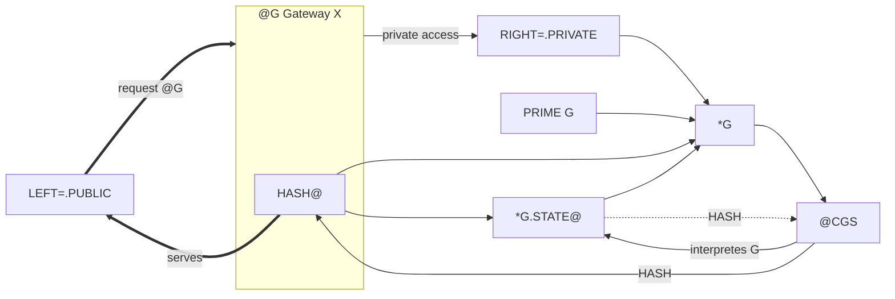

# @G: PUBLIC-PRIVATE Gateway of a Living Graph-*G

This document is the safe public view of a living Graph and its Gateway. It is
distinct from the static four-field State Ontology. Private anchor data,
credentials, runtime variables, private RIGHT content, raw execution memory,
and Gateway internals are excluded.

Complete authoritative State Memory and temporal occurrence data remain
behind the Gateway and are not fields of this projection.
