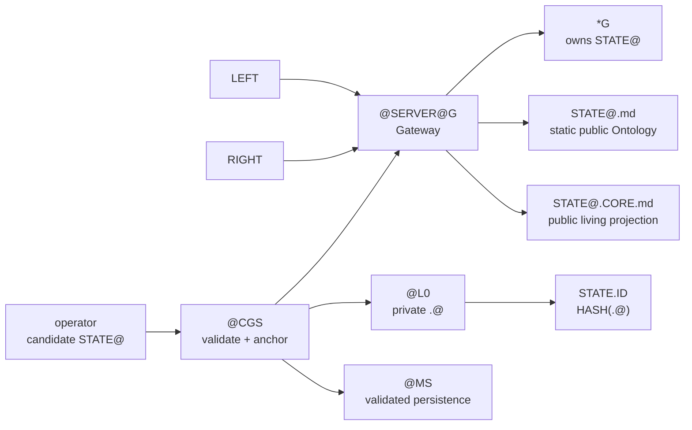

# @CGS.CORE

Version: `@alpha-tech`

License: Apache-2.0

This document is the sole authority for the infrastructure primitive and
ownership invariants of `@CGS`. Specializations may instantiate the primitive;
they must not redefine it.

## PRIME G

The static Graph primitive has exactly four members.

```text
G := {
    NAME
    NODE
    EDGE
    OP
}
```

```text
ONTOLOGY := G
STATE@ ∉ G
G.STATE := undefined
```

A named static Graph is an instantiation of that primitive.

```text
Y := G {
    NAME := Y.NAME
    NODE := Y.NODE
    EDGE := Y.EDGE
    OP   := Y.OP
}
```

`NODE` and `EDGE` describe structure. `OP` describes deterministic behavior.
None of them is an active State container.

## Living Graph and Gateway

A Graph becomes living only through its Gateway.

```text
*G := Gateway(G)
AXIOMATIC := *G
```

```text
*G := {
    G
    LEFT
    RIGHT
    STATE@
    Gateway
}
```

Every living Graph is named by its static Graph.

```text
STATE@ ∈ *G
STATE@ ∉ G
OWNER(STATE@) := *G.G.NAME
```

`LEFT` and `RIGHT` cannot access one another directly.

```text
LEFT ↛ RIGHT
RIGHT ↛ LEFT

LEFT
↔ *G
↔ RIGHT
```

The Gateway is the only public/private and left/right boundary. A living Graph
without a Gateway is undefined.

## Gateway Protocol

The Gateway controls these language-neutral operations:

```text
listen
interpret
validate
transfer
emit
```

The transfer protocol is atomic.

```text
listen(candidate STATE@)
→ interpret
→ validate
→ transfer
→ emit public projections
```

```text
transfer(STATE@)
IFF
STATE@ is valid
```

```text
invalid or partial STATE@
→ STOP
→ typed error
→ no transfer
→ no public emission
→ no Memory persistence
```

## Public State Ontology

`STATE@.md` is the static public Ontology of a living State. It is a Graph
instantiation of the sole PRIME `G` and therefore contains only the four
canonical members.

```text
*G → STATE@.md

STATE@.md := G {
    NAME
    NODE
    EDGE
    OP
}
```

```text
STATE@.md ≠ STATE@
```

`STATE@.md` must not contain:

```text
.@
private runtime variables
credentials
private process environment
Gateway internals
unvalidated transient State
```

## Public Living-State Projection

`STATE@.CORE.md` is the public Mermaid projection of the living Gateway. It is
not the static State Ontology and it is not the complete living State.

```text
STATE@.CORE.md := PUBLIC Mermaid Graph(*G)

.PUBLIC <----X++++> *G
```

The projection must show `.PUBLIC`, the Gateway boundary `X`, `*G`, the public
`STATE@` access path, `LEFT`, and `RIGHT`. It must not show `.@`, credentials,
private runtime variables, private RIGHT content, raw execution memory, or
Gateway internals.

## @CGS Ownership

`@CGS` is the sole infrastructure owner.

```text
@CGS.HOLDS := {
    @L0
    @G
    @MS
}
```

`@CGS` is responsible for Graph existence, Graph activation, State anchoring,
State identity, validated Memory persistence, and the physical Gateway service.

An operator such as `@ComplexGitSync` submits a candidate State. It does not
acquire infrastructure ownership.

```text
operator
→ candidate STATE@
→ @CGS
→ validate
→ anchor
→ persist
→ serve
```

## @L0 and StateId

`@L0` is the `@CGS`-owned Time Layer on which a validated occurrence exists and
persists.

```text
@L0 ∈ @CGS
.@ := private @L0 execution value
STATE.ID := HASH(.@)
```

Only `@CGS` may create the authoritative private anchor or derive the
authoritative `StateId`.

The private anchor `.@` must never appear in:

```text
STATE@.md
STATE@.CORE.md
Git commit metadata generated by cgitsync
Git tags
remote refs
logs
reports
```

Only `STATE.ID`, the deterministic public hash, may identify an emitted or
persisted State.

## @MS

The generic Memory System belongs exclusively to `@CGS`.

```text
@MS ∈ @CGS
```

It is a static specialization of `G` activated through its own Gateway.

```text
MS := G {
    NAME := MemorySystem
    NODE := G
    EDGE := Storage
    OP   := Persist
}

*MS := Gateway(MS)
```

`*MS` owns its own `STATE@`. It accepts only a State already validated by the
serving `@CGS` instance.

```text
@ComplexGitSync
→ candidate STATE@
→ @CGS
→ @MS
```

Any OEMS/storage engine is an internal mechanism of `@MS`; it is not an
independent ontology owner and cannot anchor, validate, or identify State.

## @SERVER@G

`@SERVER@G` is the `@CGS`-owned physical Gateway serving a living Graph.

```text
@SERVER@G := physical Gateway(*G)
```

It may serve:

```text
STATE@.md
STATE@.CORE.md
validated operations on STATE@
```

It must not serve:

```text
.G.PRIVATE
.@
credentials
raw process memory
```

## Canonical Service

```text
@CGS(
    G.NAME,
    G,
    MS,
    operator,
    @SERVER@G
)
→ *G
→ {
    STATE@
    STATE@.md
    STATE@.CORE.md
}
```

All public emission and all authoritative persistence occur only after the same
Gateway validation succeeds.



## Canonical Axioms

```text
1. @CGS.CORE.md defines the only PRIME G.
2. Static G has NAME, NODE, EDGE, and OP only.
3. STATE@ belongs to a named *G and never to static G.
4. Every crossing passes through the Gateway.
5. Invalid or partial State is neither emitted nor persisted.
6. STATE@.md and STATE@.CORE.md are distinct public projections.
7. @L0, authoritative StateId, @MS, and @SERVER@G belong only to @CGS.
8. .@ is private and only HASH(.@) is public.
9. Operators submit candidates and consume services; they do not own infrastructure.
10. These contracts are independent of implementation language.
```
