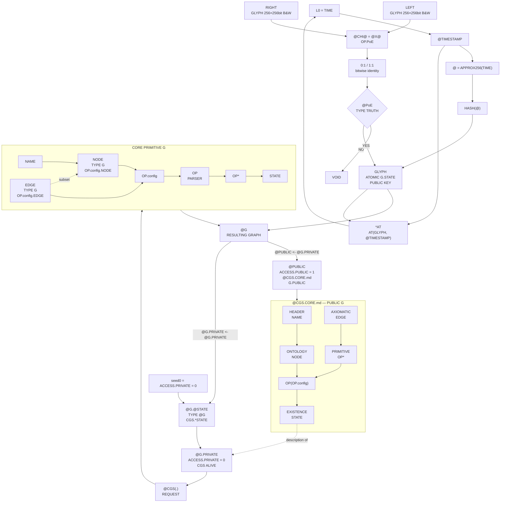

# @CGS.CORE

Version: `@alpha-tech`  
License: Apache-2.0

---

# ONTOLOGY

`@CGS` is a deterministic Graph parser.

Every request becomes an Act of Anchoring on `TIME-L0`.

```text
@CGS : REQUEST → *AT
```

Its fundamental Proof-of-Existence operator is:

```text
CHI := X := OP.PoE
```

`@PoE` produces one atomic public state and preserves one active private state.

```text
@PUBLIC <- @G.PRIVATE := G.STATE := GLYPH
```

```text
@G.PRIVATE <- @G.PRIVATE := @G.@STATE
```

The first is static.

The second remains active.

---

# AXIOMATIC

```text
BIT := {0,1}
```

One alphabet carries distinct typed domains.

```text
TRUTH := {
    0 : YES
    1 : NO
}
```

```text
ACCESS := {
    0 : .PRIVATE
    1 : .PUBLIC
}
```

```text
GLYPH.bit := {
    0 : WHITE
    1 : BLACK
}
```

```text
TRUTH.NO → VOID
```

```text
.PUBLIC  := ACCESS.PUBLIC  := 1
.PRIVATE := ACCESS.PRIVATE := 0
```

Truth, access and image data share `BIT` without sharing meaning.

```text
@G.@STATE.seed0 := ACCESS.PRIVATE
```

The Living Graph therefore begins inside its private boundary.

```text
L0 := TIME
```

```text
@TIMESTAMP ∈ L0
```

`@` is a 256-bit approximation of `TIME` at `@TIMESTAMP`.

```text
@ := APPROX256(TIME, @TIMESTAMP)
```

`PoE` receives two `GLYPH` operands.

```text
LEFT  TYPE GLYPH
RIGHT TYPE GLYPH
```

`NODE` and `EDGE` never enter this comparison.

```text
LEFT  ≠ NODE
LEFT  ≠ EDGE
RIGHT ≠ NODE
RIGHT ≠ EDGE
```

The active crossing is:

```text
@CHI@ := @X@ := LEFT <-CHI-> RIGHT
```

`CHI` solves:

```text
IS LEFT = RIGHT
```

through the indexed procedure:

```text
0:1 := LEFT[i] = 0 IFF RIGHT[i] = 0
1:1 := LEFT[i] = 1 IFF RIGHT[i] = 1
```

Therefore:

```text
@PoE TYPE TRUTH

@PoE := TRUTH.YES
IFF
∀ i, LEFT[i] = RIGHT[i]
```

Equivalently:

```text
CHI(LEFT:GLYPH, RIGHT:GLYPH) := @PoE
```

Any unequal pair resolves into absence.

```text
∃ i, LEFT[i] ≠ RIGHT[i]
→ @PoE := TRUTH.NO
→ VOID
```

`HASH(@)` generates a `256 × 256` black-and-white `GLYPH` encoding the result of `@CHI@`.

```text
HASH(@)
→ GLYPH256×256bit(@CHI@)
```


The resulting `GLYPH` is the public key.

```text
PUBLIC KEY := GLYPH
```

`AT` anchors on `TIME-L0` with that key.

```text
AT(GLYPH, @TIMESTAMP) → L0
```

`*AT` is `@G.@STATE` performing the act.

```text
*AT := @G.@STATE.AT
```

---

# PRIMITIVE

```text
G := {
    NAME
    NODE
    EDGE
    OP*
    STATE
}
```

`NODE` and `EDGE` share the same PRIMITIVE `G`.

```text
∀ node ∈ NODE : node TYPE G
∀ edge ∈ EDGE : edge TYPE G
```

`EDGE` is a subset of `NODE`.

```text
EDGE ⊂ NODE
```

Both configure the parser.

```text
OP.config := {
    NODE
    EDGE
}
```

```text
OP.config.NODE := NODE
OP.config.EDGE := EDGE
```

`OP` is the parser.

```text
OP := PARSER(OP.config)
```

`OP*` is its active operation.

```text
OP* := OP(OP.config)
```

`CHI` is the fundamental PoE operation exposed by that parser.

```text
OP.PoE := CHI(LEFT:GLYPH, RIGHT:GLYPH)
```

`@` does not belong to the PRIMITIVE.

```text
@ ∉ G
```

Anchoring instantiates one resulting Graph.

```text
@G := AT(G, GLYPH, @TIMESTAMP)
```

Its static state is atomic.

```text
@G.STATE := G.STATE := GLYPH
```

Its private active state is itself an `@G`.

```text
@G.@STATE TYPE @G
```

Its initial condition is private.

```text
@G.@STATE.seed0 := ACCESS.PRIVATE := .PRIVATE := 0
```

---

# EXISTENCE

`@PoE` serves the atomic state of the resulting `@G`.

```text
@PoE = TRUTH.YES
→ @PUBLIC <- @G.PRIVATE
→ @G.STATE := GLYPH
```

The served value is one static Graph.

```text
GLYPH := G.PUBLIC
```

```text
G.STATE := GLYPH256×256bit.B&W
```

The private result remains inside the same boundary.

```text
@G.PRIVATE <- @G.PRIVATE
→ @G.@STATE
```

Thus:

```text
CGS.STATE  := @G.STATE  := GLYPH
CGS.*STATE := @G.@STATE
```

Both derive from one successful operation.

```text
ORIGIN(GLYPH) = ORIGIN(@G.@STATE) = @PoE
```

Their conditions remain distinct.

```text
GLYPH ≠ @G.@STATE
```

`@CGS.CORE.md` is the `.PUBLIC` state served by the Living Graph it describes.

```text
@CGS.CORE.md := G.PUBLIC {
    NAME  : HEADER
    NODE  : ONTOLOGY
    EDGE  : AXIOMATIC
    OP*   : PRIMITIVE
    STATE : EXISTENCE
}
```

Its parser configuration is:

```text
OP.config.NODE := ONTOLOGY
OP.config.EDGE := AXIOMATIC
```

Its interpretation is:

```text
OP(OP.config)
→ EXISTENCE
```


