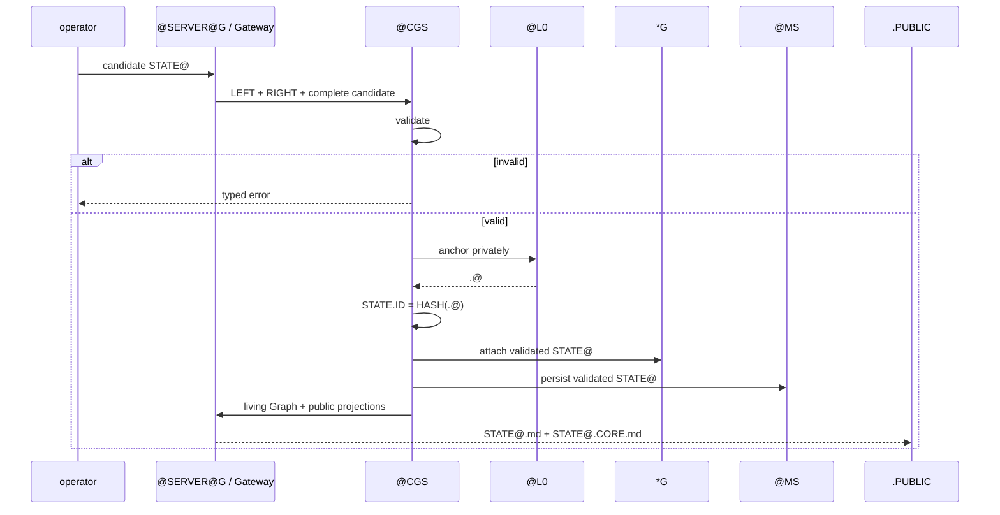

# @CGS — ComplexGraphSync

`@CGS` is the infrastructure service that validates opposed Graph
interpretations, anchors a valid occurrence, persists its living State, and
serves public projections through a Gateway.

## Normative Dependency

The sole PRIME Graph definition and all ownership axioms are in
[`@CGS.CORE.md`](@CGS.CORE.md). This specification references that primitive;
it does not define another one.

```text
G := PRIME_G_FROM(@CGS.CORE.md)
```

A specialization supplies values for `NAME`, `NODE`, `EDGE`, and `OP`. Active
State is never one of those static values.

## Graph Interpretation

The canonical names describe the four roles without changing PRIME `G`.

```text
G.NAME := ALPHA
G.NODE := DELTA
G.EDGE := NABLA
G.OP   := CHI
```

```text
ALPHA := Graph identity
DELTA := deterministic structural nodes
NABLA := oriented Graph relations
CHI   := deterministic Graph operator
```

`G` reads the declared relation from LEFT to RIGHT. `CHI` interprets the same
relation from RIGHT to LEFT. The relation is unique; only the interpretation
direction is opposed.

```text
LEFT  := G reads l → r
RIGHT := CHI reads r ← l
```

## Synchronization and Validation

The Gateway constructs the two interpretations and asks `@CGS` to validate
their equality.

```text
SYNC(LEFT, RIGHT)
→ void    IFF LEFT ≠ RIGHT
→ PoE     IFF LEFT = RIGHT
```

`PoE` is deterministic proof of equality, not a second Graph operator. It
permits anchoring; it does not itself create an anchor or persist State.

```text
LEFT ≠ RIGHT
→ typed validation error
→ no State transfer
→ no emission
→ no persistence
```

## Gateway Activation

The notation for a living Graph is always `*G`.

```text
*G := Gateway(G)
```

The Gateway owns the active boundary and the living Graph owns `STATE@`.

```text
STATE@ ∈ *G
STATE@ ∉ G

LEFT ↛ RIGHT
RIGHT ↛ LEFT

LEFT ↔ *G ↔ RIGHT
```

The Gateway performs:

```text
listen
interpret
validate
transfer
emit
```

No public/private or left/right crossing bypasses it.

## Temporal Anchoring

After validation, `@CGS` anchors the accepted occurrence on its own Time Layer.

```text
PoE
→ @CGS.@L0
→ private .@
→ STATE.ID := HASH(.@)
```

The private execution value is never a public identifier. `STATE.ID` is the
only public identity derived from it, and only `@CGS` may derive that identity.

## Public Projections

The Gateway emits two different public documents.

```text
STATE@.md
:= static public Ontology
:= one instantiation of PRIME G
```

```text
STATE@.CORE.md
:= public Mermaid Graph(*G)
:= .PUBLIC <----X++++> *G
```

Neither projection contains the private anchor, credentials, runtime variables,
raw process memory, unvalidated transient State, or private RIGHT content.

## Memory System

The generic Memory System is an infrastructure component held by `@CGS`.

```text
@MS ∈ @CGS
*MS := Gateway(MS)
```

`@MS` receives only validated State from `@CGS`. A storage engine, including an
OEMS implementation, operates inside `@MS`; it has no independent ownership of
State identity, L0, validation, or persistence policy.

```text
operator
→ candidate STATE@
→ @CGS.validate
→ @MS.persist
```

## Physical Service

`@SERVER@G` is the physical Gateway through which `@CGS` serves one living
Graph.

```text
@SERVER@G := physical Gateway(*G)
```

It serves `STATE@.md`, `STATE@.CORE.md`, and validated operations. It never
serves `.G.PRIVATE`, `.@`, credentials, Gateway internals, or raw process
memory.

Prototype specializations may bind this interface to a local or remote server:

```text
LOCAL  := @LOCALHOST@G
REMOTE := @forge43@G
```

## Canonical Service Protocol

```text
1. An operator submits candidate STATE@.
2. @SERVER@G listens through the Gateway.
3. The Gateway interprets LEFT and RIGHT.
4. @CGS validates the complete candidate.
5. Failure returns a typed error and has no public or persistent effect.
6. Success anchors the State on @CGS.@L0.
7. @CGS derives STATE.ID from HASH(.@).
8. *G owns the validated STATE@.
9. @CGS persists it through @MS.
10. @SERVER@G emits the two public projections.
```



## Responsibility Separation

| Concern | Owner |
| --- | --- |
| Static Graph specialization | operator |
| Candidate State construction | operator |
| Graph activation and Gateway boundary | `@CGS` |
| Validation | `@CGS` |
| Private L0 anchor and authoritative StateId | `@CGS` |
| Generic Memory System and persistence policy | `@CGS` |
| Physical living-Graph service | `@CGS` |
| Public projection consumption | operator / FrontEnd |

An operator never becomes the owner of `@L0`, `@MS`, `@SERVER@G`, or an
authoritative State merely by using the service.

## Implementation Independence

The contracts use explicit data, validation results, deterministic
serialization, and typed errors. They do not depend on Python object identity,
reflection, monkey-patching, exceptions as control data, or implicit mutable
aliasing.

```text
current Python interface
= future Rust kernel interface
```

## Canonical Summary

```text
G              := sole static four-member Graph from @CGS.CORE.md
*G             := Gateway(G)
STATE@          := validated active State owned by a named *G
STATE@.md       := static public Ontology
STATE@.CORE.md  := public Mermaid projection of *G
@L0             := @CGS-owned Time Layer
.@              := private execution anchor
STATE.ID        := HASH(.@)
@MS             := @CGS-owned validated Memory System
@SERVER@G       := @CGS-owned physical Gateway
```
