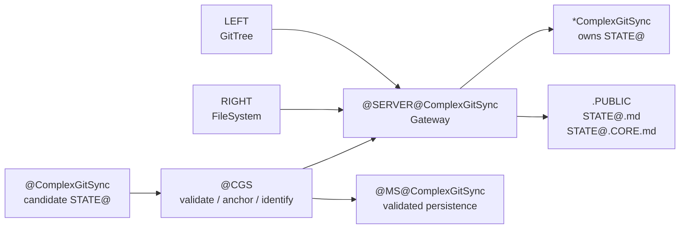

# @ComplexGitSync.CORE

Version: `@alpha-tech`

This document is the living/Gateway specialization of the static
[`@ComplexGitSync.md`](@ComplexGitSync.md) Graph.

## Living Specialization

```text
*@ComplexGitSync := Gateway(ComplexGitSync)
```

`@ComplexGitSync` constructs candidate State by interpreting GitTree and
FileSystem inputs. It submits the complete candidate through the `@CGS`
Gateway.

```text
GitTree  → LEFT
FileSystem → RIGHT

LEFT ↛ RIGHT
RIGHT ↛ LEFT

LEFT
↔ *@ComplexGitSync
↔ RIGHT
```

## Service Boundary

```text
@ComplexGitSync
→ candidate STATE@
→ @CGS(
      ComplexGitSync.NAME,
      ComplexGitSync,
      @MS@ComplexGitSync,
      @ComplexGitSync,
      @SERVER@ComplexGitSync
  )
→ *ComplexGitSync
```

Only the returned living Graph owns validated `STATE@`.

## Atomic Failure

```text
invalid or partial candidate
→ typed error
→ no authoritative StateId
→ no public projection
→ no Memory persistence
```

## Public Access

```text
@SERVER@ComplexGitSync
→ ComplexGitSync.STATE@.md
→ ComplexGitSync.STATE@.CORE.md
```

The first document is the static public State Ontology. The second is the
public Mermaid projection of the living Gateway. Neither exposes `.@`,
credentials, private runtime values, raw execution memory, or private RIGHT
content.



## Consumer-Only Invariant

The specialization may provide application data and endpoint configuration.
It cannot own PRIME `G`, `@L0`, authoritative State identity, generic `@MS`,
or the physical Gateway service. All such infrastructure remains in `@CGS`.
