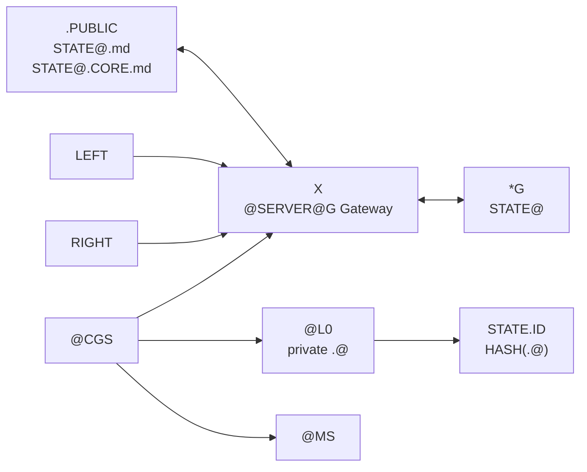

# atComplexGitSync.atCGS.CORE

Series: `@alpha-tech`

This is the operational Phase 1 projection of the canonical `@CGS` CORE into
ComplexGitSync. The normative sources are:

```text
.cgitsync/.CORE/.CGS/.ONTOLOGY/@CGS.CORE.md
.cgitsync/.CORE/.CGS/.ONTOLOGY/@CGS.md
.cgitsync/.CORE/.CGS/.ONTOLOGY/@ComplexGitSync.md
.cgitsync/.CORE/.CGS/.ONTOLOGY/@ComplexGitSync.CORE.md
```

## Operational Invariants

```text
G := PRIME_G_FROM(@CGS.CORE.md)
MEMBERS(G) := (NAME, NODE, EDGE, OP)

STATE@ ∉ G
STATE@ ∈ *G
*G := Gateway(G)
```

This block references the sole definition from `@CGS.CORE.md`; it does not
create another ontology authority.

```text
STATE@.md      := public static Ontology
STATE@.CORE.md := public Mermaid projection of *G
```

```text
@CGS.HOLDS := {
    @L0
    @G
    @MS
}

.@       := private execution anchor
STATE.ID := HASH(.@)
```

## Canonical Python Boundary

```text
src/CGS/
├── graph.py              → Graph
├── gateway.py            → Gateway
├── living_graph.py       → LivingGraph
├── state.py              → State
├── state_ontology.py     → StateOntology
├── state_core_graph.py   → StateCoreGraph
├── L0.py                 → L0
├── state_id.py           → StateId
├── memory_system.py      → MemorySystem
├── server_gateway.py     → ServerGateway
└── cgs.py                → CGS
```

These explicit data and service contracts are the executable Python prototype
and the stable boundary for a future Rust kernel.

## ComplexGitSync Binding

```text
@ComplexGitSync adapter
→ CGS.serve(
      graph_name,
      graph,
      memory_system,
      operator,
      server_gateway
  )
→ LivingGraph
→ STATE@.md
→ STATE@.CORE.md
```

The adapter submits candidate data only. It does not instantiate `L0`, derive
the authoritative `StateId`, or persist authoritative Memory directly.

## Public/Private Projection



Private `.@`, credentials, runtime variables, private RIGHT content, and raw
execution memory are excluded from all public projections and persistence
metadata.

## Phase Boundary

Phase 1 provides the backend contracts and application adapter seam. Phase 2
provides the CLI-only FrontEnd. Phase 3 proves the CGSil1 workflow as a black
box. Neither later phase may redefine these invariants.
