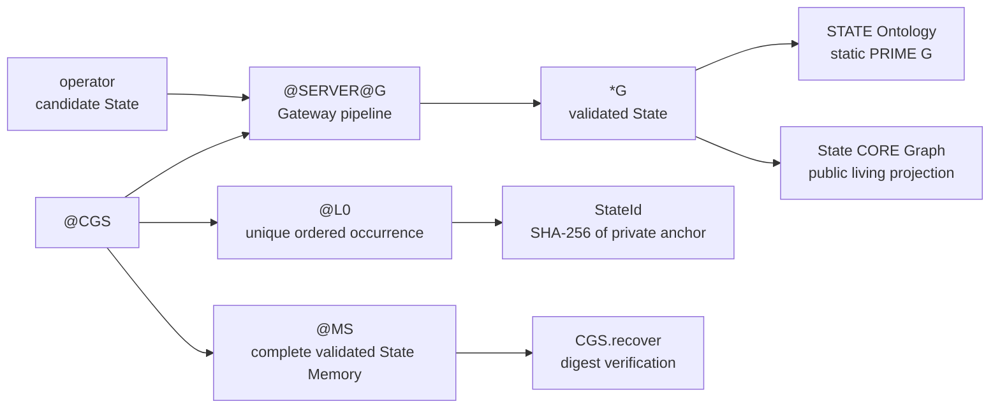

# @CGS Phase 1 Graph

This public graph summarizes the canonical Phase 1 infrastructure boundary.
The static Graph contains only `NAME`, `NODE`, `EDGE`, and `OP`. Active State,
identity, persistence, and physical service remain owned by `@CGS`.

Invalid or partial candidates stop before State attachment, persistence, or
public publication. Each accepted service call receives a distinct strictly
ordered Time-L0 occurrence, including repeated identical candidates. Memory
and publication commits are restored together on failure.
