# @CGS — ComplexGraphSync

## ALPHA0001.05 — Axiomatic Foundation

License: Apache-2.0

---

## Statement

`@CGS` is a deterministic Graph × Graph Synchronizer.

The fundamental problem is synchronization.

Time is required because two distinct synchronized resolutions must never occupy the same ordered occurrence.

```text
@CGS : G × G -> G*
```

`G*` denotes a synchronized Graph instantiated as a Gateway and anchored in `L0`.

```text
CGS := ComplexGraphSync
```

CGS is not an operating system.

CGS is a synchronization system for complex Graphs.

---

## PRIME G

Every constituent of a Graph is itself a Graph.

```text
ALPHA ∈ G
DELTA ∈ G
NABLA ∈ G
CHI   ∈ G
```

Canonical definitions:

```text
G.NAME := ALPHA
G.NODE := DELTA
G.EDGE := NABLA
G.OP   := CHI
```

Therefore:

```text
PRIME G := {
    NAME : ALPHA
    NODE : DELTA
    EDGE : NABLA
    OP   : CHI
}
```

Canonical Graph:

```text
G := {
    ALPHA
    DELTA
    NABLA
    CHI
}
```

Where:

```text
ALPHA := Graph identity
DELTA := Graph state
NABLA := Graph relation
CHI   := Graph operator
```

`DELTA` is a DAG.

`NABLA` is a TANGLE.

`CHI` interprets oriented relations.

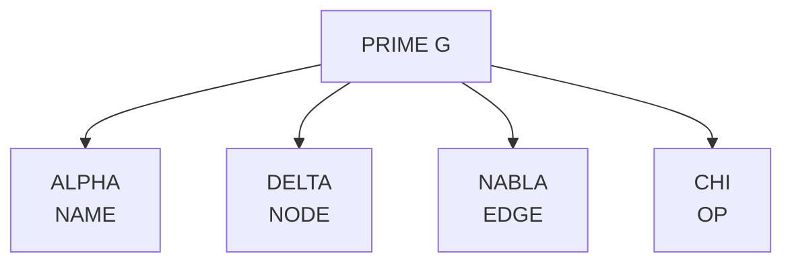

---

## Graph Orientation

Let `l` and `r` be two Nodes connected by one oriented Edge.

```text
l --NABLA--> r
```

The Graph reads the Edge in its declared direction.

```text
G : l -> r
```

The Operator interprets the same Edge in the opposite direction.

```text
*OP : r <- l
```

Since:

```text
OP := CHI
```

then:

```text
*OP := *CHI
```

Canonical orientation law:

```text
G(l -> r) <=> *CHI(r <- l)
```

The Edge remains unique.

Only its reading direction differs.

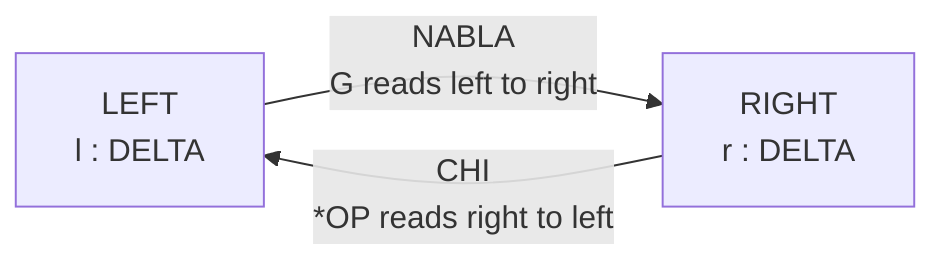

---

## Synchronization

Let:

```text
LEFT  := G(l -> r)
RIGHT := *OP(r <- l)
```

The synchronization law is:

```text
SYNC(LEFT, RIGHT) :=

    void    iff LEFT != RIGHT
    PoE     iff LEFT == RIGHT
```

Therefore:

```text
PoE iff G(l -> r) == *OP(r <- l)
```

`PoE` is the Proof of Existence of one deterministic fact.

It proves that two opposed readings of one relation resolve to the same state.

`PoE` is not an Operator.

`PoE` is the result of deterministic equality.

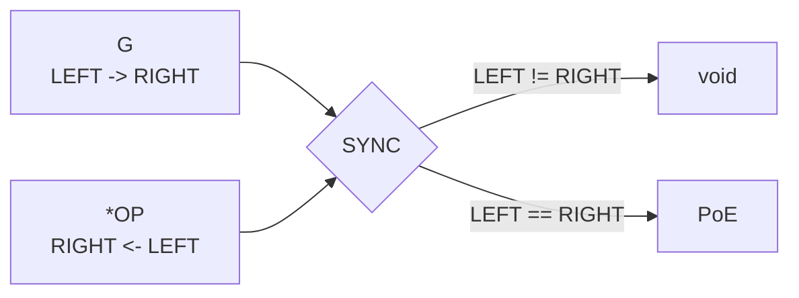

---

## L0

`L0` is the temporal anchoring layer.

Its only role is to order synchronized occurrences.

```text
L0 := PRIME OP
```

`AT` is the only Operator admissible on `L0`.

```text
AT : L0
```

The canonical resolution of `AT` is:

```text
AT(LEFT, RIGHT) :=

    void         iff LEFT != RIGHT
    TIMESTAMP    iff LEFT == RIGHT
```

Define:

```text
TIMESTAMP := PRIME CHI
```

An instantiated TIMESTAMP is:

```text
@ := *TIMESTAMP
```

A synchronized occurrence is ordered as follows:

```text
@0 < @1 < @2 < ... < @n
```

The sequence of valid temporal occurrences is:

```text
L0 := {
    @0
    @1
    @2
    ...
    @n
}
```

with the invariant:

```text
@i+1 > @i
```

The clock supplies order.

`PoE` supplies deterministic existence.

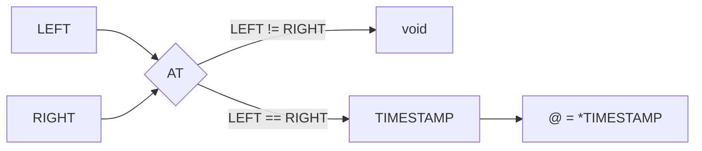

---

## Time Anchoring

Synchronization produces a deterministic fact.

`L0` gives that fact an ordered temporal occurrence.

```text
SYNC produces PoE
PoE permits TIMESTAMP
TIMESTAMP instantiates @
@ anchors the synchronized state
```

Canonical transition:

```text
Gi
    -> SYNC
    -> PoE
    -> @i+1
    -> Gi+1
```

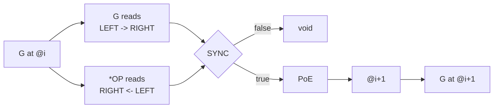

---

## Gateway

The symbol `*` denotes a Gateway.

```text
* := Gateway
```

For any Graph `G`:

```text
*G := Gateway(G)
```

An active Graph is therefore a Gateway between `.PUBLIC` and `.PRIVATE`.

```text
.PUBLIC <-> *G <-> .PRIVATE
```

The Gateway is instantiated by `@`.

```text
* = @
```

This means:

```text
*G := @G
```

or equivalently:

```text
@G := Gateway(G)
```

A Graph becomes active when it exposes a Gateway.

```text
G  := Graph
*G := Active Graph
*G := Gateway Graph
```

The three statements are compatible:

```text
active Graph == Gateway Graph == @G
```

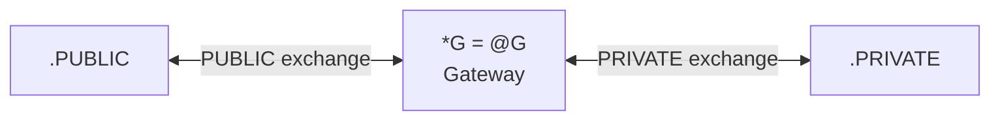

---

## PUBLIC and PRIVATE

Canonical values:

```text
.PUBLIC  := 0
.PRIVATE := 1
```

`.PUBLIC` is the exposed Graph space.

`.PRIVATE` is the local Graph memory.

The Gateway is the only admissible crossing point.

```text
.PUBLIC <-> *G <-> .PRIVATE
```

There is no direct crossing:

```text
.PUBLIC !-> .PRIVATE
.PRIVATE !-> .PUBLIC
```

All communication passes through the Gateway.

```text
.PUBLIC -> *G -> .PRIVATE
.PRIVATE -> *G -> .PUBLIC
```

The Gateway may:

```text
listen
interpret
synchronize
emit
```

The Gateway may not expose the complete `.PRIVATE` state.

```text
PUBLIC artefact != PRIVATE state
```

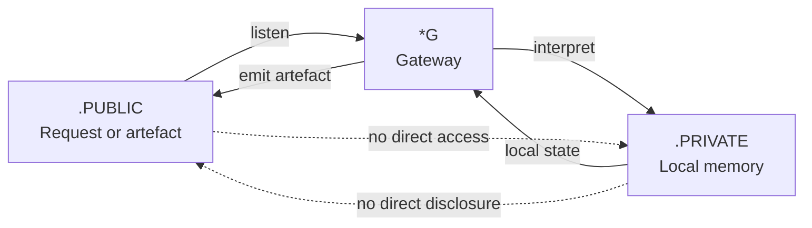

---

## Active Graph

An active Graph is a Gateway.

```text
G* := {
    G
    *OP
    @
}
```

Equivalent form:

```text
G* := {
    ALPHA
    DELTA
    NABLA
    *CHI
    @
}
```

Where:

```text
ALPHA := identity
DELTA := state
NABLA := relation
*CHI  := Gateway Operator
@     := temporal occurrence
```

A Graph is active if and only if its two opposed readings synchronize and the result is anchored in `L0`.

```text
G* iff SYNC(G, *OP) == PoE at @
```

Canonical law:

```text
G*
iff
G(l -> r) == *OP(r <- l)
at @
```

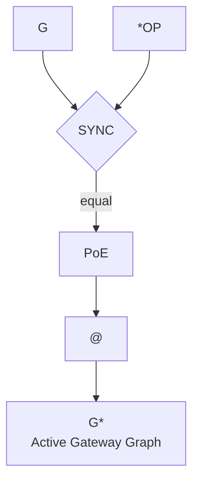

---

## @CGS

The canonical entry point is:

```text
@CGS(.ALPHA.)
```

The current interpretation is:

```text
LEFT  := .ALPHA
RIGHT := @OP(.)
```

`@CGS` synchronizes the two readings.

```text
@CGS(LEFT, RIGHT) := SYNC(LEFT, RIGHT)
```

Complete canonical form:

```text
@CGS :
    G × G
    -> SYNC
    -> PoE
    -> @
    -> G*
```

`@CGS` does not merely transform one Graph.

It determines whether two Graph readings resolve to one synchronized occurrence.

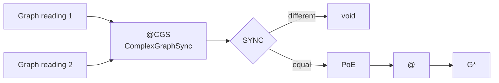

---

## DELTA Synchronization

`DELTA` is the synchronized Graph state.

```text
DELTA := DAG
```

A synchronized DELTA is:

```text
DELTA* := {
    ALPHA
    DELTA
    NABLA
    *CHI
    @
}
```

Canonical transformation:

```text
@CGS(DELTA, NABLA) -> DELTA*
```

A new `DELTA*` exists only when synchronization succeeds.

```text
DELTA* exists iff PoE
```

Its occurrence is uniquely anchored:

```text
DELTA*@i
```

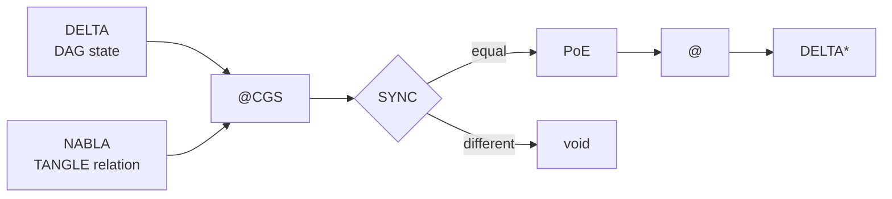

---

## Memory

For the current ALPHA Series, `@OEMS` is only a Memory System.

```text
OEMS := Ontology Existence Memory System
```

Its current function is:

```text
@OEMS(G*) -> MEMORY(G*)
```

`@OEMS` persists synchronized Graph occurrences.

It does not:

```text
define SYNC
operate the Gateway
generate PoE
control L0
replace @CGS
```

It only persists the result.

```text
@CGS produces G*
@OEMS persists G*
```

Canonical relation:

```text
@CGS -> G* -> @OEMS -> MEMORY
```

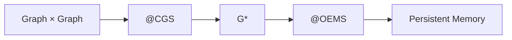

---

## Private Memory Structure

The private memory of one active Graph contains:

```text
.PRIVATE(G*) := {
    ALPHA
    DELTA
    NABLA
    *CHI
    ORIGIN
    @
}
```

Where:

```text
ALPHA  := local identity
DELTA  := synchronized state
NABLA  := persistent relations
*CHI   := Gateway interpretation
ORIGIN := provenance
@      := temporal anchor
```

The private memory is not a public report.

It is the complete local Graph state.

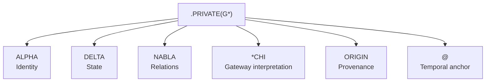

---

## Public Projection

The public side receives only an artefact emitted by the Gateway.

```text
.PUBLIC(G*) := {
    REQUEST
    ARTEFACT
    @
}
```

The public projection is derived from the private state.

```text
.PUBLIC artefact := projection(.PRIVATE state)
```

But:

```text
.PUBLIC artefact != .PRIVATE state
```

The public projection may include:

```text
report
status
result
proof reference
timestamp
public Graph
```

It may not contain undisclosed private memory.

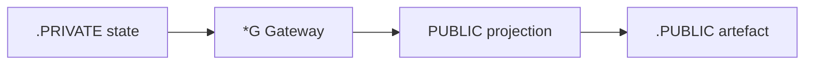

---

## forge43.io

`forge43.io` will provide the first concrete example of `.PUBLIC` and `.PRIVATE` sharing through a Gateway.

It is not part of the core axiom.

It is the first implementation model.

```text
forge43.io := external lightweight SSH-Git Gateway
```

The conceptual flow is:

```text
.PUBLIC request
    -> forge43.io Gateway
    -> .PRIVATE Git service
    -> synchronization
    -> PoE
    -> @
    -> PUBLIC artefact
    -> PRIVATE memory
```

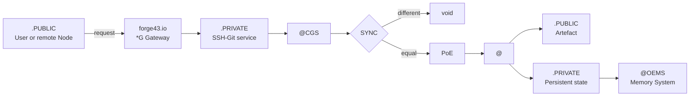

---

## Local Memory Landing Point

The local memory landing point is `.cgitsync`.

```text
.cgitsync/
├── state(hash(@)_0)/
├── state(hash(@)_1)/
├── state(hash(@)_2)/
└── state(hash(@)_n)/
```

Each synchronized occurrence is anchored by the hash of `@`.

```text
state identifier := hash(@)
```

For one temporal anchor:

```text
state(hash(@)_0)
state(hash(@)_1)
...
state(hash(@)_n)
```

The local index `i` belongs only to the current `hash(@)`.

When `hash(@)` changes:

```text
i := 0
```

Canonical invariant:

```text
hash(@) changes => local state index reinitializes
```

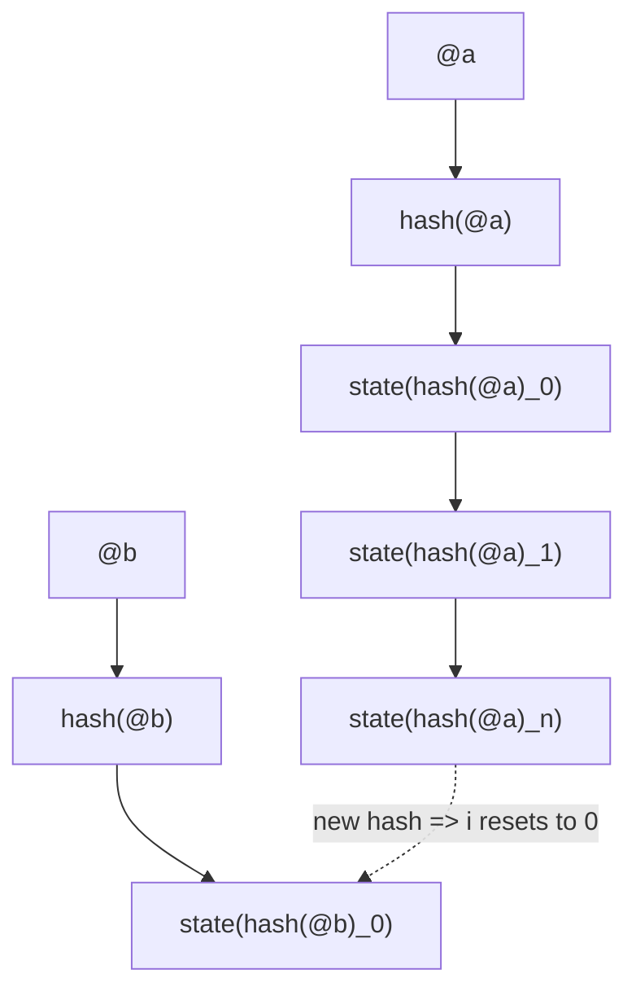

---

## Complete Synchronization Cycle

```text
1. A Graph exposes a Gateway.
2. .PUBLIC submits a request.
3. *G receives the request.
4. *OP reads the Graph from the opposite orientation.
5. @CGS compares both readings.
6. LEFT != RIGHT returns void.
7. LEFT == RIGHT produces PoE.
8. PoE permits a TIMESTAMP.
9. TIMESTAMP instantiates @.
10. @ anchors the new Graph state.
11. .PRIVATE receives the complete state.
12. .PUBLIC receives an emitted artefact.
13. @OEMS persists the private synchronized occurrence.
```

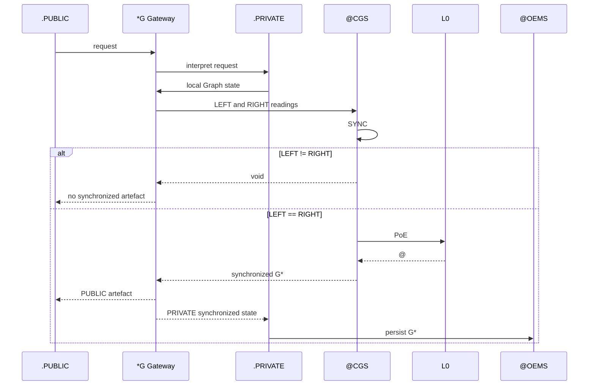

---

## Canonical Equations

```text
CGS := ComplexGraphSync
```

```text
G := {
    ALPHA
    DELTA
    NABLA
    CHI
}
```

```text
G : LEFT -> RIGHT
```

```text
*OP : RIGHT <- LEFT
```

```text
PoE iff LEFT == RIGHT
```

```text
SYNC(LEFT, RIGHT) :=

    void    iff LEFT != RIGHT
    PoE     iff LEFT == RIGHT
```

```text
TIMESTAMP := PRIME CHI
```

```text
@ := *TIMESTAMP
```

```text
* := Gateway
```

```text
*G := @G
```

```text
.PUBLIC <-> *G <-> .PRIVATE
```

```text
G* iff SYNC(G, *OP) == PoE at @
```

```text
@CGS : G × G -> G*
```

```text
@OEMS(G*) -> MEMORY(G*)
```

---

## Axiomatic Summary

```text
SYNC produces the deterministic fact.
```

```text
PoE proves the equality of opposed readings.
```

```text
L0 orders the synchronized occurrence.
```

```text
@ anchors the occurrence.
```

```text
* exposes the Gateway.
```

```text
*G is the active PUBLIC-PRIVATE Graph frontier.
```

```text
@CGS synchronizes Graphs.
```

```text
@OEMS persists synchronized Graphs.
```

```text
forge43.io exemplifies the first external PUBLIC-PRIVATE Gateway.
```
