# @CGS — ComplexGraphSync

## Graph Specification

License: Apache-2.0

---

# Statement

```text
@CGS is a deterministic Graph × Graph Synchronizer.

CGS := ComplexGraphSync

The fundamental problem is synchronization.

@CGS compares two opposed Graph interpretations.

If both interpretations resolve to one identical deterministic state,
@CGS produces PoE.

PoE is anchored by @.

The synchronized result is an active Graph G*.
```

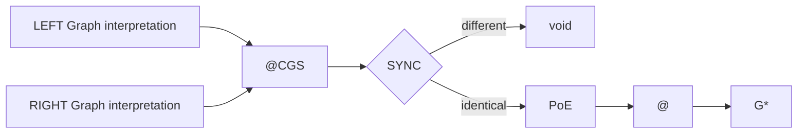

---

# Fundamental Transition

```text
G
-> opposed interpretations
-> SYNC
-> PoE XOR void
-> @
-> G*
```

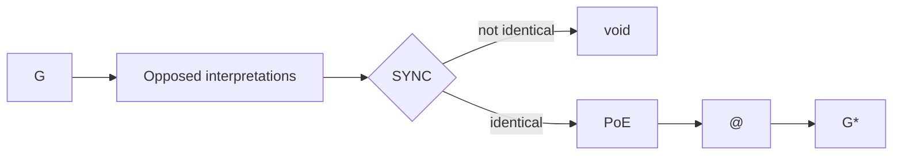

---

# Graph Primitive

```text
PRIME G := {
    NAME
    NODE
    EDGE
    OP
}
```

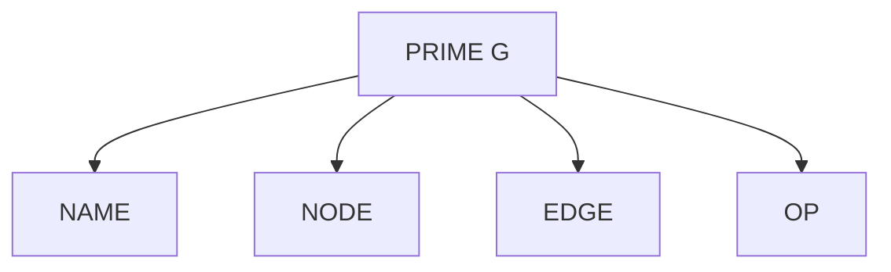

---

# Canonical Graph Members

```text
G.NAME := ALPHA
G.NODE := DELTA
G.EDGE := NABLA
G.OP   := CHI
```

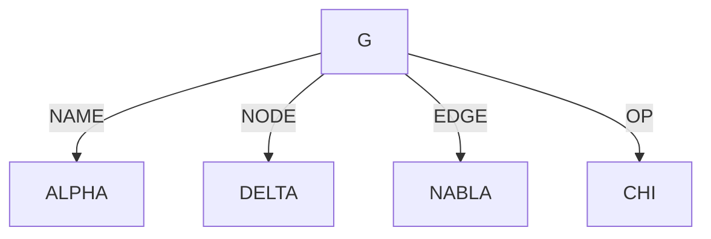

---

# Canonical Meanings

```text
ALPHA := Graph identity
DELTA := Graph state
NABLA := Graph relation
CHI   := Graph operator

DELTA := DAG
NABLA := TANGLE
```

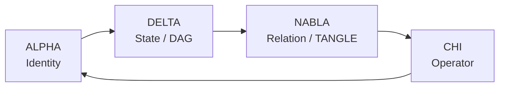

---

# Graph Orientation

```text
A Graph relation is oriented.

G reads the declared relation from LEFT to RIGHT.

CHI interprets the same relation from RIGHT to LEFT.

The relation remains unique.

Only the interpretation direction is opposed.
```

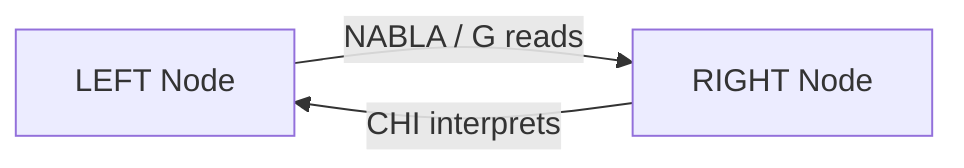

---

# LEFT and RIGHT

```text
LEFT  := G reads l -> r
RIGHT := CHI reads r <- l
```

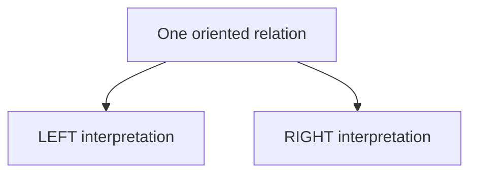

---

# Synchronization

```text
SYNC compares LEFT and RIGHT.

SYNC returns:

    void    iff LEFT != RIGHT
    PoE     iff LEFT == RIGHT
```

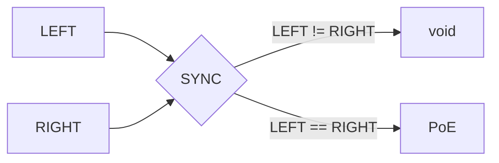

---

# Proof of Existence

```text
PoE := Proof of Existence

PoE is not an Operator.

PoE is the deterministic proof that LEFT and RIGHT
resolve to one identical Graph state.
```

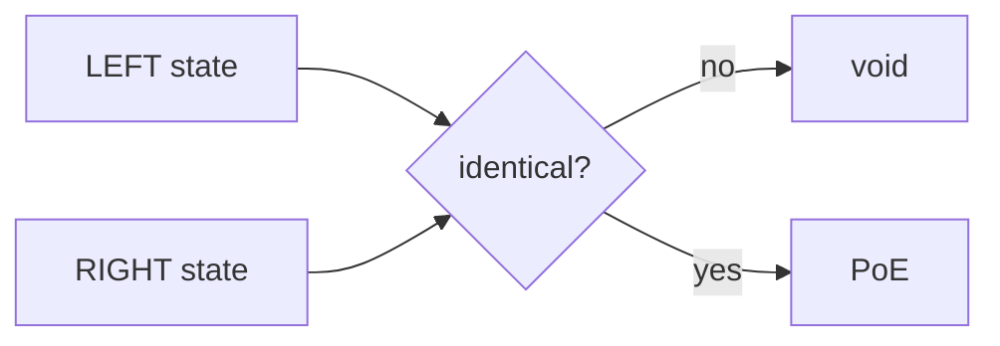

---

# L0

```text
L0 := temporal anchoring layer

TIME is the only primitive of L0.

L0 orders synchronized occurrences.

L0 does not create PoE.

PoE permits a synchronized occurrence to be anchored.
```

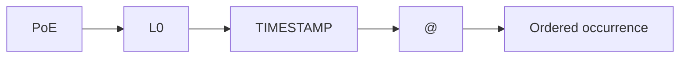

---

# AT

```text
AT := temporal Operator of L0

AT returns:

    void         iff LEFT != RIGHT
    TIMESTAMP    iff LEFT == RIGHT

@ := instantiated TIMESTAMP
```

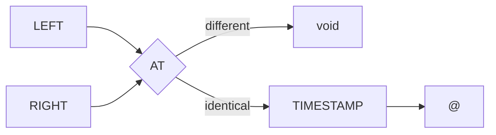

---

# Temporal Order

```text
@0 < @1 < @2 < ... < @n

Each valid occurrence is strictly ordered.

A later synchronized occurrence must have a later temporal anchor.
```

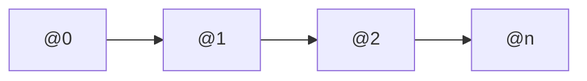

---

# Gateway

```text
* := Gateway

*G := Gateway(G)

@ instantiates the Gateway.

*G := @G
```

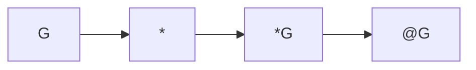

---

# Active Graph

```text
G* := active Graph

A Graph becomes active iff:

    LEFT == RIGHT
    SYNC returns PoE
    PoE is anchored by @

An active Graph is a PUBLIC–PRIVATE Gateway.
```

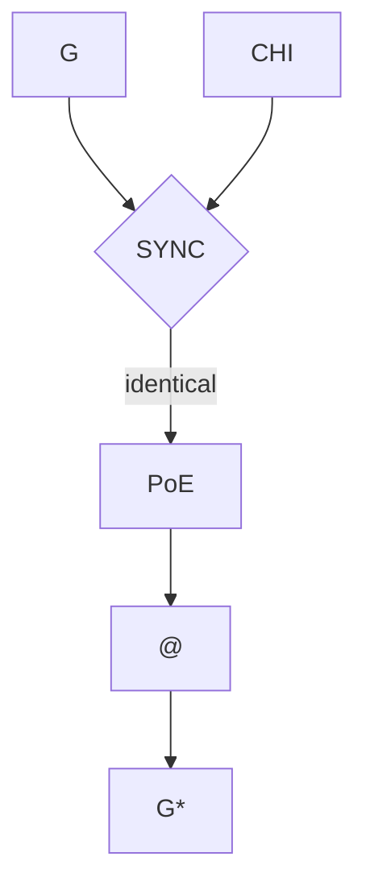

---

# PUBLIC and PRIVATE

```text
.PUBLIC  := 1
.PRIVATE := 0

.PUBLIC is the exposed Graph space.

.PRIVATE is the local Graph state.

The Gateway is the unique frontier between both spaces.
```

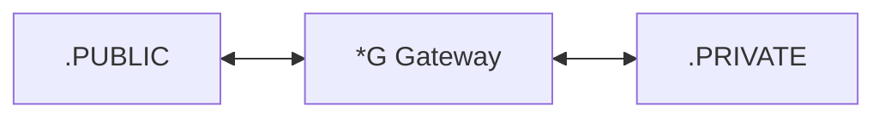

---

# Gateway Invariant

```text
.PUBLIC cannot access .PRIVATE directly.

.PRIVATE cannot emit to .PUBLIC directly.

Every crossing passes through the active Gateway.
```

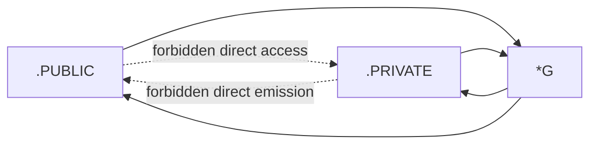

---

# Gateway Operations

```text
The Gateway may:

    listen
    interpret
    synchronize
    emit

The Gateway may not expose the complete .PRIVATE state.
```

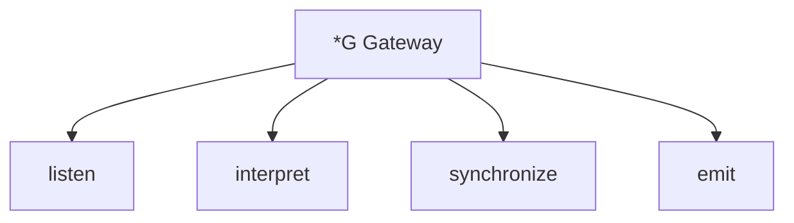

---

# PUBLIC Request Protocol

```text
1. .PUBLIC submits a request.
2. The Gateway receives the request.
3. The Gateway transfers the request to .PRIVATE.
4. .PRIVATE resolves the request locally.
5. The local result returns to the Gateway.
```

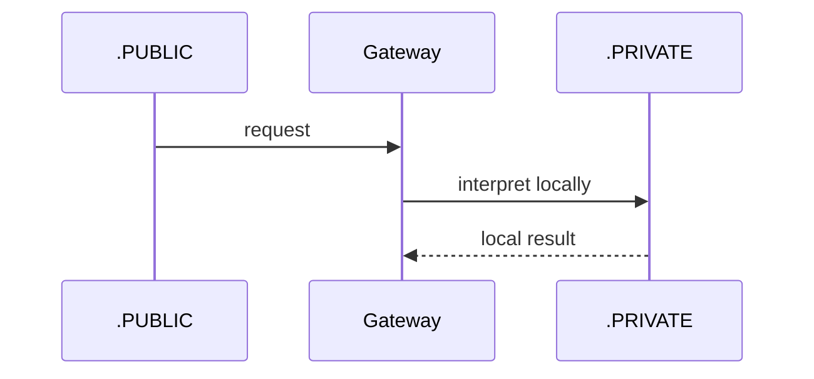

---

# Synchronization Protocol

```text
1. The Gateway constructs LEFT and RIGHT interpretations.
2. @CGS receives both interpretations.
3. SYNC compares both states.
4. Different states return void.
5. Identical states return PoE.
```

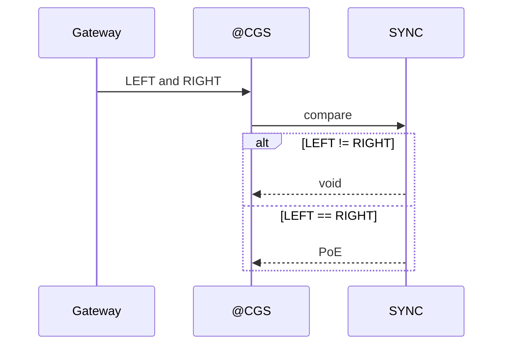

---

# Temporal Anchoring Protocol

```text
1. PoE validates the synchronized state.
2. L0 receives the validated occurrence.
3. AT creates a TIMESTAMP.
4. The TIMESTAMP is instantiated as @.
5. @ anchors the synchronized Graph state.
```

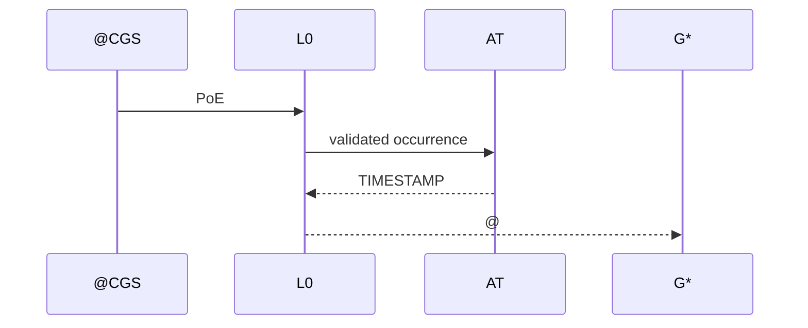

---

# Emission Protocol

```text
The synchronized occurrence produces two distinct results:

    .PUBLIC artefact
    .PRIVATE state

The .PUBLIC artefact is a projection.

The .PRIVATE state is the complete local result.

The artefact is not the private state.
```

```mermaid
flowchart LR
    ACTIVE["G*"]
    GATEWAY["Gateway"]

    PUBLIC[".PUBLIC artefact"]
    PRIVATE[".PRIVATE state"]

    ACTIVE --> GATEWAY
    GATEWAY --> PUBLIC
    GATEWAY --> PRIVATE
```

---

# Public Projection

```text
.PUBLIC artefact := projection(.PRIVATE state)

.PUBLIC artefact != .PRIVATE state
```

```mermaid
flowchart LR
    PRIVATE[".PRIVATE state"]
    GATEWAY["*G"]
    PROJECTION["Projection"]
    PUBLIC[".PUBLIC artefact"]

    PRIVATE --> GATEWAY
    GATEWAY --> PROJECTION
    PROJECTION --> PUBLIC
```

---

# @CGS Entry Point

```text
Canonical public entry:

    @CGS(.)

Canonical private entry:

    @CGS(., ALPHA)

General form:

    @CGS(., list)

list may be empty.
```

```mermaid
flowchart LR
    DOT["."]
    LIST["list"]
    CGS["@CGS"]
    INSTANCE["Graph instance"]

    DOT --> CGS
    LIST --> CGS
    CGS --> INSTANCE
```

---

# @CGS Responsibility

```text
@CGS synchronizes Graph interpretations.

@CGS does not persist Graph memory.

@CGS does not replace the Gateway.

@CGS does not expose .PRIVATE.

@CGS returns either void or a PoE-validated occurrence.
```

```mermaid
flowchart TB
    CGS["@CGS"]

    INPUT["Graph interpretations"]
    SYNC["Synchronization"]
    VOID["void"]
    VALID["PoE-validated occurrence"]

    INPUT --> CGS
    CGS --> SYNC
    SYNC --> VOID
    SYNC --> VALID
```

---

# DELTA

```text
DELTA := deterministic Graph state
DELTA := DAG

DELTA* := synchronized active Graph state

DELTA* exists iff PoE.
```

```mermaid
flowchart LR
    DELTA["DELTA"]
    NABLA["NABLA"]
    CGS["@CGS"]
    POE["PoE"]
    AT["@"]
    STAR["DELTA*"]

    DELTA --> CGS
    NABLA --> CGS
    CGS --> POE
    POE --> AT
    AT --> STAR
```

---

# NABLA

```text
NABLA := Graph relation
NABLA := TANGLE

NABLA carries the oriented relation between Graph Nodes.

NABLA is interpreted by CHI.
```

```mermaid
flowchart LR
    LEFT["LEFT Node"]
    NABLA["NABLA"]
    RIGHT["RIGHT Node"]
    CHI["CHI"]

    LEFT --> NABLA
    NABLA --> RIGHT
    CHI --> NABLA
```

---

# CHI

```text
CHI := oriented Graph Operator

CHI interprets the relation from the opposite orientation.

CHI does not create the relation.

CHI does not emit by itself.

CHI contributes the opposed interpretation required by SYNC.
```

```mermaid
flowchart LR
    RELATION["NABLA relation"]
    FORWARD["G reading"]
    REVERSE["CHI interpretation"]
    SYNC["SYNC"]

    RELATION --> FORWARD
    RELATION --> REVERSE

    FORWARD --> SYNC
    REVERSE --> SYNC
```

---

# OEMS

```text
OEMS := Ontology Existence Memory System

For the current ALPHA Series:

    OEMS is a Memory System.

@OEMS persists synchronized active Graphs.

@OEMS does not execute @CGS.

@OEMS does not generate PoE.

@OEMS does not control L0.
```

```mermaid
flowchart LR
    INPUT["Graph × Graph"]
    CGS["@CGS"]
    ACTIVE["G*"]
    OEMS["@OEMS"]
    MEMORY["Persistent Memory"]

    INPUT --> CGS
    CGS --> ACTIVE
    ACTIVE --> OEMS
    OEMS --> MEMORY
```

---

# Responsibility Separation

```text
@CGS synchronizes G.

L0 orders the occurrence.

@ anchors the occurrence.

The Gateway separates .PUBLIC and .PRIVATE.

@OEMS persists G*.
```

```mermaid
flowchart LR
    G["G"]
    CGS["@CGS"]
    L0["L0"]
    AT["@"]
    GATEWAY["Gateway"]
    OEMS["@OEMS"]
    MEMORY["Memory"]

    G --> CGS
    CGS --> L0
    L0 --> AT
    AT --> GATEWAY
    GATEWAY --> OEMS
    OEMS --> MEMORY
```

---

# Private Memory

```text
.PRIVATE(G*) := {
    ALPHA
    DELTA
    NABLA
    CHI
    ORIGIN
    @
}
```

```mermaid
flowchart TB
    PRIVATE[".PRIVATE G*"]

    ALPHA["ALPHA"]
    DELTA["DELTA"]
    NABLA["NABLA"]
    CHI["CHI"]
    ORIGIN["ORIGIN"]
    AT["@"]

    PRIVATE --> ALPHA
    PRIVATE --> DELTA
    PRIVATE --> NABLA
    PRIVATE --> CHI
    PRIVATE --> ORIGIN
    PRIVATE --> AT
```

---

# Public Artefact

```text
.PUBLIC(G*) := {
    REQUEST
    ARTEFACT
    @
}
```

```mermaid
flowchart TB
    PUBLIC[".PUBLIC G*"]

    REQUEST["REQUEST"]
    ARTEFACT["ARTEFACT"]
    AT["@"]

    PUBLIC --> REQUEST
    PUBLIC --> ARTEFACT
    PUBLIC --> AT
```

---

# Local Persistence

```text
.cgitsync/
├── state(hash(@)_0)/
├── state(hash(@)_1)/
├── state(hash(@)_2)/
└── state(hash(@)_n)/

state identifier := state(hash(@)_i)

When hash(@) changes:

    i := 0
```

```mermaid
flowchart TB
    A1["@a"]
    H1["hash(@a)"]

    S10["state 0"]
    S11["state 1"]
    S1N["state n"]

    A2["@b"]
    H2["hash(@b)"]
    S20["state 0"]

    A1 --> H1
    H1 --> S10
    S10 --> S11
    S11 --> S1N

    A2 --> H2
    H2 --> S20

    S1N -. "new hash resets index" .-> S20
```

---

# forge43.io

```text
forge43.io is an external lightweight SSH-Git Gateway.

It exemplifies PUBLIC–PRIVATE sharing.

It is an implementation example.

It is not a core axiom.
```

```mermaid
flowchart LR
    PUBLIC[".PUBLIC"]
    FORGE["forge43.io"]
    PRIVATE[".PRIVATE"]

    PUBLIC -->|"request"| FORGE
    FORGE -->|"private execution"| PRIVATE

    PRIVATE -->|"local result"| FORGE
    FORGE -->|"public artefact"| PUBLIC
```

---

# forge43.io Synchronization Protocol

```text
1. .PUBLIC submits a request to forge43.io.
2. forge43.io opens the Gateway.
3. .PRIVATE resolves the request.
4. @CGS synchronizes LEFT and RIGHT.
5. void terminates an invalid resolution.
6. PoE validates an identical resolution.
7. @ anchors the synchronized occurrence.
8. The Gateway emits a public artefact.
9. The complete private state remains local.
10. @OEMS persists G*.
```

```mermaid
sequenceDiagram
    participant P as .PUBLIC
    participant F as forge43.io
    participant R as .PRIVATE
    participant C as @CGS
    participant L as L0
    participant M as @OEMS

    P->>F: request
    F->>R: private execution
    R-->>F: local result
    F->>C: LEFT and RIGHT

    alt different
        C-->>F: void
        F-->>P: no synchronized artefact
    else identical
        C->>L: PoE
        L-->>C: @
        C-->>F: G*
        F-->>P: public artefact
        F-->>R: private state
        R->>M: persist G*
    end
```

---

# Complete Protocol

```text
1. A Graph exposes a Gateway.

2. .PUBLIC submits a request.

3. The Gateway transfers the request to .PRIVATE.

4. .PRIVATE resolves the request locally.

5. The Gateway constructs LEFT and RIGHT interpretations.

6. @CGS compares both interpretations.

7. Different interpretations return void.

8. Identical interpretations return PoE.

9. PoE permits temporal anchoring.

10. L0 creates a TIMESTAMP.

11. The TIMESTAMP is instantiated as @.

12. @ anchors the synchronized occurrence.

13. The Gateway emits a .PUBLIC artefact.

14. The complete .PRIVATE state remains local.

15. @OEMS persists the active Graph G*.
```

```mermaid
sequenceDiagram
    participant P as .PUBLIC
    participant G as Gateway
    participant R as .PRIVATE
    participant C as @CGS
    participant T as L0
    participant M as @OEMS

    P->>G: request
    G->>R: interpret request
    R-->>G: local Graph state

    G->>C: LEFT and RIGHT
    C->>C: SYNC

    alt LEFT != RIGHT
        C-->>G: void
        G-->>P: no synchronized artefact
    else LEFT == RIGHT
        C->>T: PoE
        T-->>C: @
        C-->>G: synchronized G*
        G-->>P: .PUBLIC artefact
        G-->>R: .PRIVATE state
        R->>M: persist G*
    end
```

---

# Axiomatic Graph

```text
AXIOM 1
Every constituent of G is a Graph.

AXIOM 2
Every Graph relation is oriented.

AXIOM 3
G and CHI interpret one relation from opposed orientations.

AXIOM 4
SYNC returns PoE iff both interpretations are identical.

AXIOM 5
SYNC returns void iff both interpretations differ.

AXIOM 6
PoE is anchored by @.

AXIOM 7
@ is ordered by L0.

AXIOM 8
An active Graph is a PUBLIC–PRIVATE Gateway.

AXIOM 9
.PUBLIC and .PRIVATE never cross directly.

AXIOM 10
@CGS synchronizes Graphs.

AXIOM 11
@OEMS persists active Graphs.
```

```mermaid
flowchart TB
    G["G"]
    ORIENTATION["Oriented relation"]
    LEFT["LEFT"]
    RIGHT["RIGHT"]
    SYNC{"SYNC"}
    VOID["void"]
    POE["PoE"]
    L0["L0"]
    AT["@"]
    ACTIVE["G*"]
    GATEWAY["PUBLIC–PRIVATE Gateway"]
    OEMS["@OEMS"]

    G --> ORIENTATION
    ORIENTATION --> LEFT
    ORIENTATION --> RIGHT

    LEFT --> SYNC
    RIGHT --> SYNC

    SYNC -->|"different"| VOID
    SYNC -->|"identical"| POE

    POE --> L0
    L0 --> AT
    AT --> ACTIVE
    ACTIVE --> GATEWAY
    ACTIVE --> OEMS
```

---

# Canonical Summary

```text
CGS := ComplexGraphSync

G := Graph

DELTA := Graph state

NABLA := Graph relation

CHI := oriented Graph Operator

SYNC := deterministic comparison

PoE := Proof of Existence

L0 := temporal ordering layer

@ := temporal anchor

* := Gateway

G* := active Graph

.PUBLIC := exposed Graph space

.PRIVATE := local Graph state

@CGS := Graph × Graph Synchronizer

@OEMS := persistent memory of G*
```

```mermaid
flowchart LR
    G["G"]
    CGS["@CGS"]
    SYNC["SYNC"]
    POE["PoE"]
    AT["@"]
    GSTAR["G*"]
    OEMS["@OEMS"]

    G --> CGS
    CGS --> SYNC
    SYNC --> POE
    POE --> AT
    AT --> GSTAR
    GSTAR --> OEMS
```