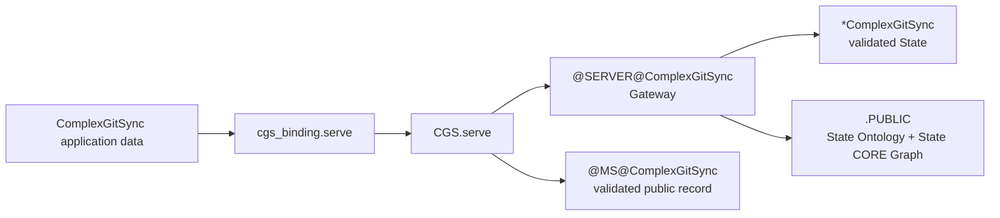

# @ComplexGitSync Phase 1 Graph

`@ComplexGitSync` is a consumer and candidate-producing operator. The Phase 1
adapter calls the public `CGS.serve` facade and owns no infrastructure module.

PRIME `G`, `L0`, authoritative `StateId`, generic Memory, and the physical
server Gateway remain exclusively under `@CGS`.
