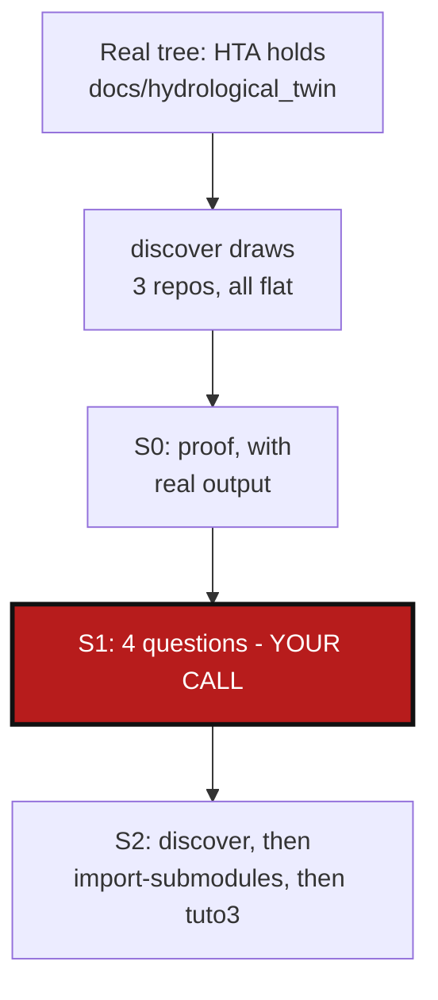

# NestedParentDiscovery — `discover` does not see that one repo sits inside another

*Created: 2026-09-03*

## Abstract — read this first

**The one-line version.** In `cawaqsviz`, the repo
`HydrologicalTwinAlphaSeries` (called **HTA** below) holds another repo
inside it, at `docs/hydrological_twin`. `discover` does not notice. It
lists every repo it finds as a direct child of the project root. So it
draws a flat tree of three repos. The real tree has two levels. Tutorial 3
is built on that flat answer, so it is wrong too.

**What this document is.** A plan. No code and no tutorial has been
changed yet.

**Why it exists.** Two words used below, so the rest is clear:

- A **leaf** is a repo with no other repo inside it.
- A **parent** is a repo that does have one inside it.

HTA is a parent. ComplexGitSync thinks it is a leaf. That single mistake
causes everything in §0.

**What you will find.** §0 shows the problem, with real commands and real
output. §1 asks four questions that only you can answer. §2 lists the work,
in the order you asked for: `discover` first, then `import-submodules`,
then Tutorial 3. §3 says how to know the work is done.

**Who it is for.** Whoever does this work next. Start with §1.1. It decides
everything else.

**What you need to do with it.** Answer the four questions in §1. Then the
work can start.



---

## 0. What is wrong (checked on 2026-09-03, no file changed)

Everything below was tested for real. A test tree was built with the same
shape as `cawaqsviz`: a root repo, a submodule at `external/HTA`, and
inside that submodule, another submodule at `docs/hydrological_twin`. The
remotes were set to the real cawaqsviz addresses. Nothing was downloaded.

### 0.1 Our own example files already disagree

The two-level shape is not a new idea. `examples/cawaqsviz_snapshot.gts`
already describes it:

```toml
name = "HydrologicalTwinAlphaSeries"
node_type = "ParentRepo"

name = "hydrological_twin"
node_type = "LeafRepo"
relative_path = "docs/hydrological_twin"
parent_absolute_path = ".../external/HydrologicalTwinAlphaSeries"
```

`examples/htas.cgs` also exists. It is HTA's own `.cgs`. But two other
things say the opposite:

- `examples/cawaqsviz.cgs` does not list `hydrological_twin` at all. Its
  comment says HTA has no `.cgs` of its own.
- `examples/htas.cgs` puts its child at `hydrological_twin`, not at
  `docs/hydrological_twin`.

So three example files give three different answers for one project. They
must end up saying the same thing.

The proof that the real repo has this shape is already written down, in
`AgentSpec/archive/20260903_RecursiveImportSubmodules_DevPlanTicket.md` §0.1.

### 0.2 `discover` puts everything at the same level

```
$ pixi run cgitsync discover <test tree> --max-depth 4
Found 3 git repository(ies) ...
  - .
  - external/HTA
  - external/HTA/docs/hydrological_twin      <-- listed as a child of the root
```

The `.cgs` it writes says the same:

```toml
project = "cawaqsviz"
repos = [
    "gitlab:cawaqs/gviz/cawaqsviz",
    { repository = "github:flipoyo/HydrologicalTwinAlphaSeries", relative_path = "external/HTA" },
    { repository = "github:flipoyo/hydrological_twin", relative_path = "external/HTA/docs/hydrological_twin" },
]
```

This is how the code is written, not a rare bug. `discover_repos`
(`orchestre.py:1367`) measures every path from the top of the scan. It then
adds one line per repo, all at the same level. `DiscoverReport` has no field
that could say "this repo is inside that one".

### 0.3 Reading that `.cgs` gives a flat tree

`build_registry_from_cgs_document` (`registry.py:270-276`) sets every repo's
parent to the root, and marks every one of them a leaf. Loading the file
above gives this:

```
root                                      node=root  parent=None
root:external/HTA                         node=leaf  parent=root
root:external/HTA/docs/hydrological_twin  node=leaf  parent=root
```

HTA holds a repo, but it is marked `leaf`.

### 0.4 What this costs: the wrong `.gitignore`, then a lost conversion

`sync_gitignore` (`git_tree.py:1222`) writes each repo's children into
*that repo's* `.gitignore`. On the test tree it gives this:

```
=== root/.gitignore ===          === external/HTA/.gitignore ===
external/HTA                     <<< NO FILE WRITTEN >>>
.cgitsync/
cawaqsviz.lgr
external/HTA/docs/hydrological_twin   <-- useless line
```

That last line does nothing. It points inside another repo, and git never
looks there from the root. Meanwhile HTA, the repo that really holds the
nested clone, gets no line at all.

Here is what that costs. On the same test tree:

```
$ git -C external/HTA add --all          # this is what 'cgitsync add' runs
$ git -C external/HTA ls-files --stage docs/hydrological_twin
160000 8fae0801... 0	docs/hydrological_twin
```

Mode `160000` means git registered it as a submodule again.
`import-submodules` had just removed that. `cgitsync add` brought it back.
HTA is now staged with a submodule entry and no `.gitmodules` file. The
conversion is half undone, and nothing warns you.

One line in `external/HTA/.gitignore` stops all of this. The same test with
`docs/hydrological_twin` in that file gives `no gitlink — conversion
survives`.

`import-submodules --recursive` does write that line. But it writes it only
on your disk. `initialise` deletes a declared child and clones it again
(`orchestre.py:3371`, `shutil.rmtree`). A fresh clone of HTA does not have
the line. After that, nothing puts it back, because ComplexGitSync thinks
HTA has no children.

Getting the parent right fixes this on its own. Setting HTA as the parent by
hand, then running `sync_gitignore` again on the same test tree:

```
root:external/HTA  node=parent
changed: ('root', 'root:external/HTA')
=== root/.gitignore ===          === external/HTA/.gitignore ===
.cgitsync/                       docs/hydrological_twin
cawaqsviz.lgr
external/HTA
```

### 0.5 Tutorial 3 also hides the repo, in another way

Step 3 of the tutorial says to run `discover ... --max-depth 3`. The nested
repo is 4 levels down: `external`, `HTA`, `docs`, `hydrological_twin`. On
the test tree:

| command | repos found |
|---|---|
| `discover --max-depth 3` | 2 |
| `discover --max-depth 4` | 3 |

The default is 5 (`DEFAULT_DISCOVER_MAX_DEPTH`, `orchestre.py:789`). The
default would have found it. The tutorial asks for a smaller number, so the
repo is never seen, and `discover` does not say that it stopped early.

This is a separate problem from §0.2. Even a perfect `discover` would still
miss this repo at depth 3.

### 0.6 `import-submodules` converts well, but reports badly

On disk, `--recursive` does the right thing. Each level gets its own line in
its own `.gitignore`:

```
=== root/.gitignore ===   external/HTA
=== HTA/.gitignore ===    docs/hydrological_twin
```

The printed report is the problem. `SubmoduleEntry` (`discovery.py:212`)
holds `name`, `path`, `url` and `branch`. It does not hold the repo it came
from. `import_submodules` then merges all levels into one list
(`orchestre.py:1143`), and the CLI prints (`cli/expert.py:864`):

```
Dry run — 2 submodule(s) in <root>/.gitmodules      <-- wrong: only 1 is there
  submodule: external/HTA
    path:   external/HTA                            <-- counted from the root
  submodule: docs/hydrological_twin
    path:   docs/hydrological_twin                  <-- counted from HTA, unsaid
```

Two problems here. The first line says all the submodules come from the
root's `.gitmodules`. Only one does. And each `path` is counted from a
different starting point, which is never printed. In the real `cawaqsviz`
this is confusing: the root's other child is at `docs/CWV_user_guide`, so
you see two paths starting with `docs/` and you cannot tell them apart.

### 0.7 Two things that look dangerous but are fine

Both were tested. Neither needs work.

- **`pull-force` deleting the nested repo.** `force_pull` runs `git clean
  -fd` (`git_runner.py:345`). Without the `.gitignore` line,
  `docs/hydrological_twin` is untracked. But `git clean -fd` refuses to
  delete a git repo. It would need `-ff`. Tested: the nested repo is still
  there afterwards.
- **`initialise` cloning the child before HTA**, and then deleting it when
  it clones HTA. `children_of` (`git_tree.py:376`) sorts repos by path.
  `external/HTA` is the start of `external/HTA/docs/hydrological_twin`, and
  a shorter string sorts first. So HTA is always cloned first. This is safe,
  but only by luck of alphabetical order. No test checks it. Add a check
  when §1.1 is done.

## 1. Four questions to answer first

### 1.1 How should a `.cgs` say that one repo is inside another?

This decides all the rest. Three ways:

| | How | What it costs |
|---|---|---|
| **A** *(suggested)* | Keep one flat file. When reading it, compare the paths: if one repo's path starts with another's, it is inside it. Make it that repo's child. | Changes what a long `relative_path` means today. Also needs an answer to §1.2. |
| **B** | `discover` writes a second `.cgs` inside each parent repo, and points at it with `nested_config`. | `--write` would write several files, inside repos you may not own. Worse: that file only exists on your disk, so `initialise` deletes it when it clones the parent again. Same problem as the `.gitignore` line in §0.4. |
| **C** | Add a new key to the file, such as `parent = "external/HTA"`. | More to learn, and two ways to say the same thing, since the path already says it. |

**Suggested: A.** It also repairs `.cgs` files that already exist with long
paths. It keeps `discover --write` writing one file. And it keeps working
after a repo is cloned again, because nothing extra has to live inside the
child repo. B fails on that last point, which is why it is not the choice.

### 1.2 With A, does the repo id change? What about old `.gts` files?

Today the nested repo's id is `root:external/HTA/docs/hydrological_twin`.
With A it would become `root:external/HTA:docs/hydrological_twin`. That id
is written in `.gts` snapshots and in the `.lgr` ledger.

**Suggested: accept the change.** A snapshot is rewritten by the next
`initialise` or `pull`, so the old ids matter for one command only. If you
do not want that, the other option is to keep the old id and change only the
parent and the leaf/parent mark. That is uglier, but it breaks nothing.

### 1.3 Should `discover` say when `--max-depth` stopped it early?

Today it says nothing (§0.5). **Suggested: yes, one warning line** when the
scan hits the limit. It reuses the `warnings` list that already reports
unreadable remotes. Separately, Tutorial 3 should stop passing
`--max-depth 3` (WP-4).

### 1.4 How much should the `import-submodules` report change?

**Suggested: just enough to remove the confusion.** Store which repo each
submodule came from. Print every path from the top of the scan. Fix the
first line so it names the right `.gitmodules` file. Grouping the output per
repo is optional.

## 2. The work, in order

| WP | Needs | Files | What is delivered |
|---|---|---|---|
| **WP-1 discover** | §1.1, §1.2 | `orchestre.py`, `registry.py`, `cli/configuration.py` | A repo found inside another repo becomes that repo's child, not the root's. The report shows the tree instead of a flat list. With A, the path comparison happens when the `.cgs` is read, and the holding repo is marked `parent`. |
| **WP-2 depth** | §1.3 | `orchestre.py` | `discover` warns when it stopped at `--max-depth` instead of reaching the end. |
| **WP-3 import-submodules** | WP-1, §1.4 | `discovery.py`, `orchestre.py`, `cli/expert.py` | Each submodule in the report says which repo it came from. Paths are printed from the top of the scan. The first line names the right `.gitmodules`. Same words as WP-1, so both commands describe the tree the same way. |
| **WP-4 tuto3** | WP-1..3 | `tutorials/03_adopting_a_real_project.md` | Steps 2 to 5 rewritten for the real two-level tree. The drawing gains `docs/hydrological_twin` under HTA. `--max-depth 3` is dropped. The `--recursive` note in step 2 becomes the normal path, because the nested repo is part of this project. Outputs in steps 3 and 4 are captured again from a real run. Step 8 says only the root has something to commit; check it again, since HTA now has changes too. |
| **WP-5 examples** | WP-1 | `examples/cawaqsviz.cgs`, `examples/htas.cgs`, `examples/cawaqsviz_snapshot.gts` | The three files describe one tree (§0.1), with the same path for `hydrological_twin`. |
| **WP-6 tests** | WP-1..3 | `tests/integration/test_cgsi_topology.py`, `tests/unit/test_discovery.py`, `tests/unit/test_import_submodules.py` | A two-level test tree replaces the flat one in `test_discover_reproduces_phase1_cawaqsviz_topology`, which today assumes the wrong shape. New tests: the path comparison; `sync_gitignore` writes into the holding repo; `git add --all` does not bring the submodule back; the depth warning; the new report. |
| **WP-7 docs** | WP-1..3 | `README.md`, `docs/Text/user_guide.tex`, `docs/Text/worked_examples.tex` | `discover` and `import-submodules` docs updated. PDFs rebuilt, as `CLAUDE.md` requires. |

`AgentSpec/AdditionalSpecs.md` only needs an update if WP-1 moves work from
one module to another. With A it stays in `registry.py`, so probably not.
Check when the code is written.

## 3. How to know it is done

- `discover` on a two-level checkout puts the nested repo under the repo
  that holds it, not under the root. The `.cgs` it writes loads with that
  repo marked `parent`.
- On the same tree, `sync_gitignore` writes the nested path into the holding
  repo's `.gitignore`, and no longer writes a long path into the root's.
- After `import-submodules --recursive --apply` and then `cgitsync add`, no
  `160000` entry comes back. This is the §0.4 test.
- `discover` warns when `--max-depth` stopped it early.
- `import-submodules --recursive` prints every path from the top of the
  scan, and never says a nested submodule came from the root's
  `.gitmodules`.
- Tutorial 3 shows the real two-level tree, no longer passes
  `--max-depth 3`, and its printed output comes from a real run.
- The three example files describe the same tree.
- `pixi run lint` and `pixi run test` pass. PDFs rebuilt if a `.tex` changed.
- Nothing committed, nothing pushed, until you say so.
