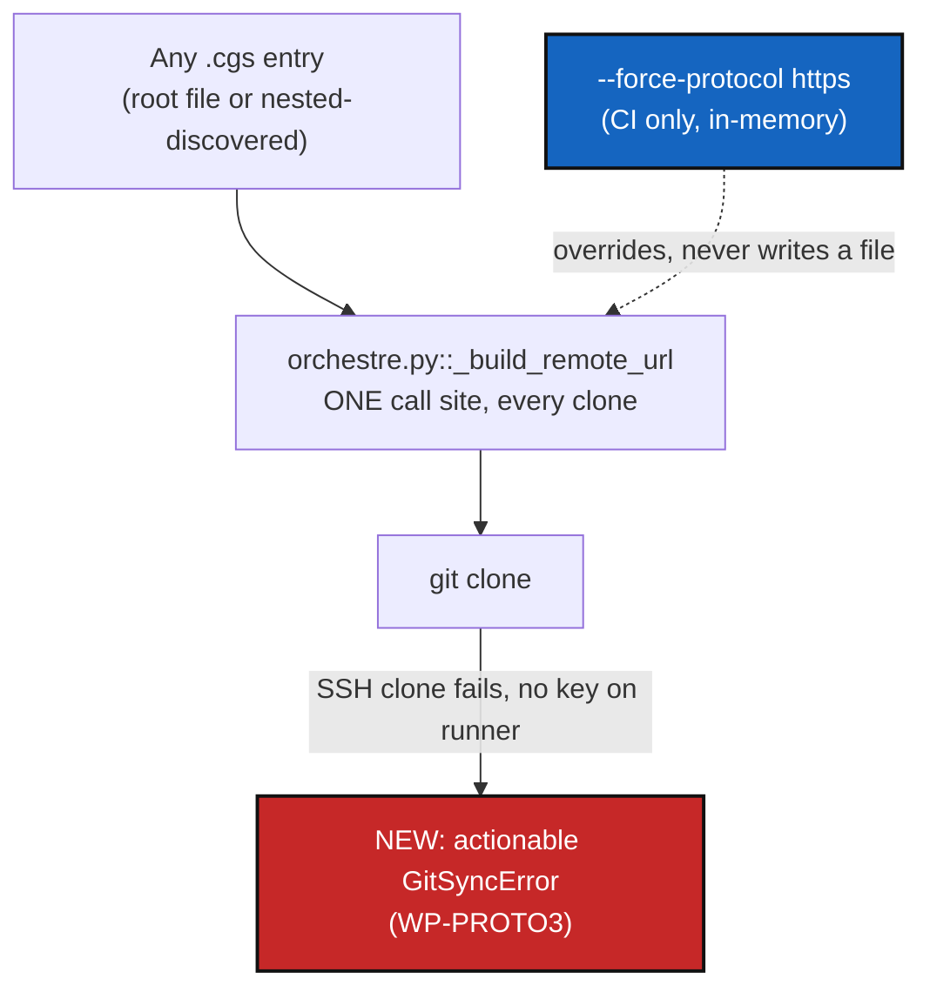

# AccessProtocolCommand — force a clone-time protocol for CI, without rewriting any `.cgs`

*Created: 2026-09-01*

## Abstract — read this first

**The one-line version.** CI needs every repo `cgitsync initialise`/
`bootstrap`/`clean-init` touch — including ones discovered mid-run from a
`nested_config` inside a different, separately-cloned repo — to clone over
HTTPS, while a human's own `.cgs` files keep saying whatever they actually
say (SSH, by this project's default). Rewriting files can't reach a nested
`.cgs` that doesn't exist on disk yet when CI starts; a clone-time override
can, because it sits at the one place every clone's URL is already built
regardless of where the repo entry came from — and the same override
reaches all three commands for free, since `bootstrap`/`clean-init` both
delegate into the same clone loop `initialise` uses.

**What this document is.** A planning-only ticket, three work packages. No
code touched.

**Why it exists.** Follows directly from this session's CI-unblock work: the
top-level entries in `examples/complexgitsync.cgs` are now hardcoded to
`access_protocol = "https"`, but the `DocSpec` entry inside `DocCGS.cgs` —
committed in the separate `DocComplexGitSync` repo, only discovered at
runtime via `nested_config = "auto"` — still defaults to SSH
(`DEFAULT_ACCESS_PROTOCOL = "ssh"`, `cgs_format.py:51`) and would fail to
clone on a GitHub Actions runner with no SSH key configured. Hardcoding
`access_protocol` inside every repo this project might ever discover
doesn't scale and pushes an SSH-vs-HTTPS decision into files the author
doesn't want to touch (their own dev convenience is SSH everywhere).

**What was ruled out, and why.** Two earlier directions considered in this
same conversation, both rejected on inspection:
- *A `MasterConfig`-style persisted default consulted during `.cgs`
  parsing* — `master.py` was checked directly; it only ever held Git commit
  identity (`user_name`/`user_email`), never `access_protocol`. Building
  this fresh would also require `cgs_format.py` (deliberately pure/offline,
  `CLAUDE.md`'s Ring-0) to read a CGSHOME-side config file it currently
  never touches, and would require preserving "explicitly set" vs.
  "defaulted" through three separate call sites that today all eagerly
  bake in `DEFAULT_ACCESS_PROTOCOL` — real scope, not justified once §2's
  simpler option was found.
- *Running a `set-protocol`-style file rewrite ahead of CI, over every
  `.cgs` file* — defeated by timing: `docs/DocCGS.cgs` is written to disk
  by the clone of `docs/` itself, *inside* the same `initialise_cgs_document`
  call that goes on to discover and clone `DocSpec` from it
  (`orchestre.py:1629-1653`, one `while True` loop, no external hook point
  between "file appears" and "file is acted on"). A wrapper script cannot
  interpose on a file that does not exist yet when it runs.

**What you will find.** Verified evidence for the ruled-out directions above
(§0 already folds this in), the one clone-time mechanism that sidesteps
both problems (§1), three work packages (§2), acceptance criteria (§3).

**Who it is for.** Whoever picks this up once §1 is confirmed.

**What you need to do with it.** Nothing yet — no commit, no push.

---

## 0. Verification (2026-09-01)

- `src/ComplexGitSync/master.py` (full file read) — `MasterConfig` exposes
  exactly `configure`/`load`/`persist`/`resolve_identity`, all operating on
  `user_name`/`user_email`. No `access_protocol` field, no protocol logic,
  anywhere.
- `DEFAULT_ACCESS_PROTOCOL = "ssh"` is applied at three independent sites,
  each eagerly baking in the default the moment a repo entry is missing the
  field — confirming there is no single choke point today that could later
  tell "explicit" from "defaulted" apart: `cgs_format.py:205` (top-level
  parse), `git_tree.py::_apply_repo_identity` (nested self-identity),
  `discovery.py`'s new-child `WorkingRepo` construction (nested siblings,
  e.g. `DocSpec`).
- `gts_document.py::_build_canonical_payload` (read in full) — the hashed
  `.gts` payload carries `name`, `node_type`, paths, ref/commit state,
  lifecycle/sync state, discovery state, `source_cgs_path`; `access_protocol`
  is not one of the fields, at any level. Two runs of the same tree that
  differ only in clone protocol already produce an identical
  `snapshot_hash` today, with no new code — confirmed by reading the
  payload builder, not just inferred.
- `orchestre.py::_build_remote_url` (`:3190`) is the single call site
  every clone (`_clone_registry_entry`, `:3104`) and every remote-URL
  consumer goes through: `address.to_url(entry.access_protocol)`. This is
  the one place a clone-time override can live without touching
  `cgs_format.py`'s parsing or `discovery.py`'s nested-entry construction
  at all.
- `git_runner.py::_run` (`:424-437`) already raises `GitSyncError` with the
  raw `git` stderr embedded on any non-zero exit, so an SSH auth failure
  today surfaces as e.g. `GitSyncError: Git command failed (git clone ...
  git@github.com:...): Permission denied (publickey). fatal: Could not
  read from remote repository.` — informative for someone who already
  knows what that means, not actionable for someone who doesn't.

## 1. Decisions needed before work starts

### 1.1 Where does the override live: a CLI flag, a client parameter, or an env var?

**Recommendation:** a client parameter first (`force_access_protocol:
AccessProtocol | None = None` on `ComplexGitSyncClient.initialise_cgs` /
`initialise_cgs_document`), with a `--force-protocol {ssh,https}` CLI flag
on `initialise` as the thin mirror (`CLAUDE.md`'s CLI-mirrors-API rule).
No env var — an explicit flag in the CI workflow is visible in the YAML
diff a reviewer sees; an env var CI sets silently is not.

### 1.2 Scope: `initialise` only, or every command that clones?

**Decided: `initialise`, `bootstrap`, and `clean-init` all get the flag.**
An expert-level option the author intends to pass systematically in CI, not
a one-off. Confirmed cheap to extend: `clean_init`/`clean_initialise_cgs`
(`orchestre.py:1674-1713`) already delegate entirely to `initialise_cgs`,
and `bootstrap` (`:2059-2093`) delegates to `clone_cgs` (`:1977-2028`),
which runs the *exact same* `_pending_clone_entries` /
`_clone_registry_entry` / `discover_nested_configs` loop as
`initialise_cgs_document`, down to calling the same `_build_remote_url`.
One override at that single choke point, read by whichever public
entry-point method is active, covers all three commands — this is
parameter threading through a handful of thin wrappers, not new clone
logic duplicated three times.

(This is an advanced *flag* on existing Minimalist-group commands, not a
move into the CLI's separate formal "Expert" command group — `initialise`/
`bootstrap`/`clean-init` stay exactly where `CLAUDE.md`'s README grouping
already puts them.)

### 1.3 What exactly triggers the "did you mean `--force-protocol https`?" hint?

Pattern-matching `git`'s stderr for SSH-auth failure phrasing (`"Permission
denied (publickey)"`, `"Could not read from remote repository"`, `"Host
key verification failed"`) is inherently a little fragile — `git`'s wording
isn't a stable API. But the alternative (say nothing extra) is exactly the
unhelpful status quo this was asked for.

**Recommendation:** match on `entry.access_protocol == AccessProtocol.SSH`
*and* one of those known substrings in the caught `GitSyncError`'s message,
append a suffix line to the re-raised error (something like: `hint: this
clone used SSH and failed authentication — pass --force-protocol https to
'initialise' if the repo is public, or configure an SSH key/agent for this
runner otherwise`), and keep the original message intact above the hint
rather than replacing it. A missed pattern degrades to today's plain
`GitSyncError`, never a worse error than now.

## 2. Work packages

| WP | Depends on | Touches | Deliverable |
|---|---|---|---|
| **WP-PROTO1** | §1.1, §1.2 | `orchestre.py` (`_build_remote_url` consults a new `self._forced_access_protocol` before `entry.access_protocol`; `initialise_cgs`, `initialise_cgs_document`, `clean_initialise_cgs`, `clean_init`, `bootstrap`, `clone_cgs` all gain a `force_access_protocol` parameter, threaded down to the one shared choke point), `cli/minimalist.py` (`--force-protocol {ssh,https}` flag on all three of `initialise`, `bootstrap`, `clean-init`'s subparsers, threaded through each `_handle_*`/`_execute_*` pair), README command table, `docs/Text/user_guide.tex`, `docs/Text/api_python.tex` | `cgitsync initialise examples/complexgitsync.cgs --output-path .. --force-protocol https` (and the same flag on `bootstrap`/`clean-init`) clones every repo — root siblings and every nested-discovered child, regardless of what its own `.cgs` says — over HTTPS. No `.cgs` file is read differently, none is written. CI workflow (`.github/workflows/ci.yml`) updated to pass the flag instead of relying on every `.cgs` in the tree being hand-set to `https`. |
| **WP-PROTO2** | none (independent) | `tests/unit/test_gts_document.py` (or wherever the canonical-payload test already lives) | Regression test asserting two `WorkingGitTree`s that differ only in `access_protocol` per entry produce an identical `compute_snapshot_hash()` — makes the already-true "`.gts` is protocol-agnostic" property (§0) something that fails loudly if it ever regresses, rather than an implicit assumption this ticket rests on. |
| **WP-PROTO3** | §1.3 | `orchestre.py` (`_clone_registry_entry`'s call to `git.clone`, wrapped to catch `GitSyncError`, check the SSH-failure heuristic, and re-raise with the hint appended) | An SSH clone failure on a repo entry says, in the same error, both what `git` reported and the actionable next step (`--force-protocol https`, or fix the runner's SSH setup) — instead of leaving the reader to know that on their own. |

`set-protocol` (bulk in-place rewrite of one `.cgs` file's
`access_protocol`, from the previous draft of this ticket) is **not**
included here — it doesn't solve the nested-discovery case (see "What was
ruled out" above) and isn't needed for CI once WP-PROTO1 lands. It remains
a reasonable, small, separate utility if the author later wants a
scripted way to derive a personal SSH `.cgs` from a committed HTTPS one
(or the reverse) for local convenience — worth its own, much shorter
ticket if that need comes up, not bundled here.

## 3. Acceptance criteria

- `cgitsync initialise examples/complexgitsync.cgs --output-path .. --force-protocol https`, run against a fully unpopulated target, clones `DevSpec`, `docs` (=`DocComplexGitSync`), and `docs/DocSpec` all over HTTPS — verified by asserting every cloned entry's remote URL starts with `https://`, including the nested one whose own `.cgs` never mentions `https`.
- `cgitsync bootstrap examples/complexgitsync.cgs ComplexGitSync --force-protocol https` and `cgitsync clean-init examples/complexgitsync.cgs --output-path .. --force-protocol https` show the same behaviour — same override, same single choke point, verified independently for each command rather than assumed from `initialise`'s test alone.
- Each of the three commands with no `--force-protocol` behaves exactly as today (regression guard) — every entry's protocol follows its own `.cgs`.
- `examples/complexgitsync.cgs`'s own `access_protocol = "https"` fields (added this session) can be reverted to unset/`ssh` once `--force-protocol` lands in CI, if the author wants that — not required by this ticket, just newly possible.
- WP-PROTO2's test fails if `access_protocol` (or any other clone-mechanics-only field) is ever added to `gts_document.py::_build_canonical_payload`.
- An SSH clone failure on a public repo (no key configured) surfaces `--force-protocol https` as a suggested next step in the same `GitSyncError`, without swallowing `git`'s own message.
- Documented in the README command table, `docs/Text/user_guide.tex`, and `docs/Text/api_python.tex` (client-method mirror), per `CLAUDE.md`'s "document any new CLI command" rule.
- `pixi run lint && pixi run test` pass.
- No commit, no push — executed only after explicit go-ahead.
