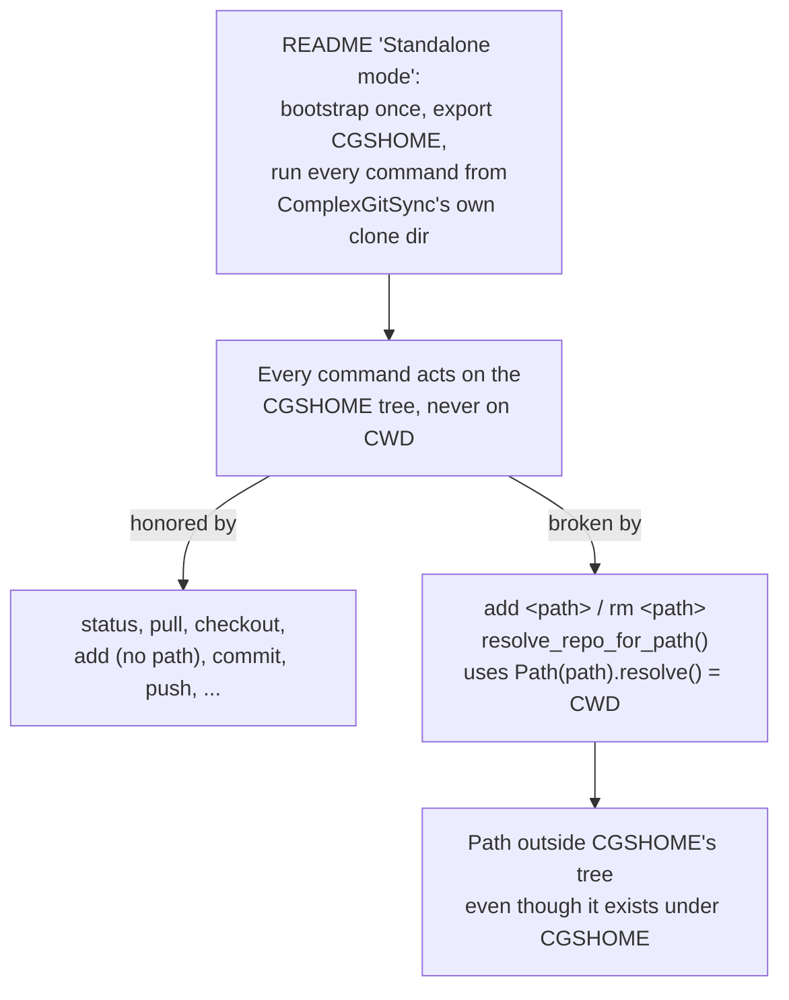

# AddRmCgshomeResolution — `add`/`rm` must resolve paths against CGSHOME, not CWD

*Created: 2026-09-02*

## Abstract — read this first

**The one-line version.** `add <path>`/`rm <path>` (shipped in `658e586`,
cgitsync2.22) resolve a relative path against the shell's current working
directory, the one and only place in the whole CLI where behaviour depends
on where the command happens to be launched from — breaking the
"standalone mode" invariant every other command honors: cgitsync always
acts on the tree discovered via CGSHOME, never on CWD.

**What this document is.** A planning-only corrective ticket. No code
touched.

**Why it exists.** Reported directly: `export CGSHOME=<elsewhere>` then
`cgitsync rm <path-that-genuinely-exists-under-CGSHOME>`, run from an
unrelated CWD, fails with "is not inside any repository in this tree" —
because the path was resolved against CWD, not CGSHOME.

**What you will find.** Verified evidence that this is a real regression
against the CLI's own documented addressing model, not a misunderstanding
(§0); the decision needed (§1); one work package (§2); acceptance criteria
(§3).

**Who it is for.** Whoever implements the fix — the direction is already
decided by the report, this mostly needs a go-ahead.

**What you need to do with it.** Nothing yet — no commit, no push.

---

## 0. Verification (2026-09-02)

- **The documented standalone workflow never depends on CWD.**
  `README.md`'s "Standalone mode" section (~L81-114): `bootstrap` clones the
  managed tree into an isolated `CGSHOME` under `$HOME/.cgs/`, the user
  exports `CGSHOME` to that path, and every subsequent command — `status`,
  `view-tree`, and by extension every Expert command — is run from
  `pixi run cgitsync ...` **inside the ComplexGitSync clone's own
  directory**, which is nowhere near the managed tree. Nothing about that
  workflow ever asks the user to `cd` into `CGSHOME` first. Every command
  besides `add <path>`/`rm <path>` reaches the tree purely through
  discovery (`snapshot_resolver.discover_cgshome`: `--search-dir` →
  `$CGSHOME` → walk up from CWD) and never re-touches CWD for anything
  else.
- **`add <path>`/`rm <path>` are the one exception.**
  `git_tree.py:1132-1150` (`resolve_repo_for_path`):
  `resolved = Path(path).resolve()` — for a relative `path`, `pathlib`
  resolves against `Path.cwd()`, not against the tree's own root. Both
  callers pass the raw CLI argument straight through:
  `operations.py::add_tree` (paths branch, ~L293-296) and
  `operations.py::remove_paths` (~L326), reached from
  `ComplexGitSyncClient.add`/`.remove` (`orchestre.py`) and
  `cli/expert.py`'s `add`/`rm` subcommands.
- **Reproduced exactly as reported.** `export CGSHOME=/home/flipoyo/.cgs/CGS20260902002720/cgitsync`
  while standing in an unrelated directory (`~/Programmes/ComplexGitSync`,
  a different clone entirely), then
  `pixi run cgitsync rm examples/cgitsync-ssh.cgs` — the file genuinely
  exists under `CGSHOME/examples/cgitsync-ssh.cgs`, but the tool resolved
  the argument against CWD instead
  (`/home/flipoyo/Programmes/ComplexGitSync/examples/cgitsync-ssh.cgs`) and
  raised `GitSyncError: ... is not inside any repository in this tree`.
  (The raw traceback seen alongside it in the original report is *not*
  specific to `add`/`rm` — `cli/_shared.py::_run_with_logging` logs then
  `raise`s on every command's exception identically; reproduced the same
  way with a bad `pull` target. Out of scope here.)
- **Root cause.** `AgentSpec/archive/20260902_ExpertAddRemovePaths_DevPlanTicket.md`
  §1.1 picked "relative to CWD, most git-like" by analogy to bare `git
  add`/`git rm`, without checking it against the CGSHOME-standalone
  addressing model the rest of this CLI already commits to. The analogy
  holds for *nested* mode (CGSHOME is a subdirectory a user might `cd`
  into) but silently breaks *standalone* mode, where CWD and CGSHOME are
  unrelated directories by design.

## 1. Decision needed

### 1.1 What should a relative path resolve against?

**Recommendation:** the tree root (CGSHOME), not CWD — i.e. normalize as
`(tree_root.absolute_path / path)` rather than `Path(path).resolve()`.
Absolute paths are unaffected either way (`Path.resolve()` on an absolute
path ignores CWD already). This matches the addressing model every other
command already uses and keeps `add`/`rm` usable from the standalone
workflow's documented CWD (the ComplexGitSync clone's own directory, e.g.
the exact repro above).

Trade-off to flag explicitly: this gives up the one CWD-relative
convenience the original ticket wanted — typing a bare filename while
`cd`'d inside a child repo's subdirectory, the way `git add <file>` would
resolve it from there. Given the standalone-mode invariant is load-bearing
across the whole CLI and this convenience only ever applied to two
commands, dropping it is the right trade — but it's a real behaviour
change for anyone who already used `add <path>`/`rm <path>` CWD-relative
since `658e586` landed, so call it out rather than resolve it silently.

### 1.2 Keep CWD-relative resolution as a fallback if the CGSHOME-relative interpretation misses?

**Recommendation:** no. Trying two interpretations risks a path matching
by accident against the wrong repo. Fail with the existing clear
`GitSyncError` exactly as today, just anchored at CGSHOME instead of CWD.

## 2. Work package

| WP | Depends on | Touches | Deliverable |
|---|---|---|---|
| **WP-CGSFIX1** | §1.1, §1.2 | `git_tree.py` (`resolve_repo_for_path` gains an anchor — the tree root — instead of implicit CWD; the tree already carries its own root's `absolute_path` via `ROOT_REPO_ID`, so no new parameter needed beyond what's already passed in), `README.md` (`add <path>`/`rm <path>` prose), `docs/Text/user_guide.tex`, `docs/Text/api_python.tex`, `cli/expert.py` (`PATH` argument help text), and a new regression test in `tests/unit/test_registry_client.py` proving a relative path resolves against the tree root from a CWD outside the tree entirely. |

## 3. Acceptance criteria

- `cgitsync add <path>` / `cgitsync rm <path>` resolve a relative path
  against CGSHOME regardless of the shell's CWD — verified by a test that
  runs from a CWD entirely outside the tree (mirroring the documented
  standalone workflow) and still succeeds.
- An absolute path continues to work exactly as today.
- A path outside the tree (measured from CGSHOME) still raises the
  existing clear `GitSyncError`.
- README / `docs/Text/user_guide.tex` / `docs/Text/api_python.tex` updated
  to say "relative to CGSHOME" rather than "relative to CWD".
- `pixi run lint && pixi run test` pass.

## 4. Implemented (2026-09-02)

- `resolve_repo_for_path` (`git_tree.py`) now anchors a relative `path` at
  `tree.repos[ROOT_REPO_ID].absolute_path` instead of `Path.cwd()`; an
  absolute path is unchanged.
- New regression test:
  `test_resolve_repo_for_path_relative_path_anchors_at_tree_root_not_cwd`
  (`tests/unit/test_registry_client.py`) — chdirs away from the tree root
  and confirms resolution still succeeds.
- Docs updated: `README.md`, `docs/Text/user_guide.tex`,
  `docs/Text/api_python.tex`, `cli/expert.py`'s `add`/`rm` `PATH` help text.
- `scripts/ceiling_baseline.json` re-baselined (`git_tree.py` grew by the
  new anchoring logic + docstring; `pixi run check-ceilings` ratchet).
- Version bumped `0002.22 -> 0002.23` via `pixi run bump-version`; docs
  PDF rebuilt (`docs/MASTER.pdf`).
- `pixi run lint && pixi run test` pass (966 passed, 2 skipped).
- Not committed, not pushed — awaiting explicit go-ahead.
