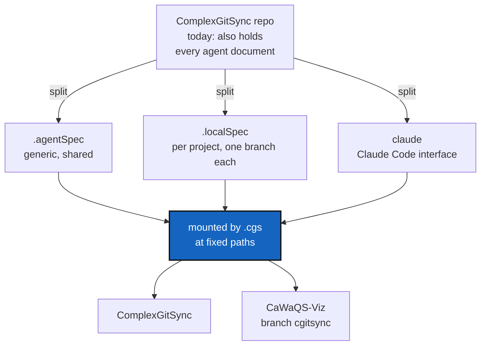

# AgenticMounts — one set of agent repos, mounted the same way in every project

*Created: 2026-09-04*

## Abstract — read this first

**The one-line version.** Move the agent-facing documents out of
ComplexGitSync into three repositories of their own — `.agentSpec`,
`.localSpec`, `claude` — mount them at fixed paths through `.cgs`, and any
project (CaWaQS-Viz on branch `cgitsync`, next project after that) gets the
same agent setup by adding three lines to its own `.cgs`.

**What this document is.** A plan. Nothing has changed yet. It says what
moves where, what the code already supports, the one thing it does not
support, and what has to be decided before the work starts.

**Why it exists.** Every agent-facing document in this repository is
written once and used once. `AGENT.md`, `AgentSpec/AGENT.md`,
`AgentSpec/DOCSTYLE.md`, `AgentSpec/TICKETLIFECYCLE.md` and most of
`CLAUDE.md`'s structure are not specific to ComplexGitSync — they are how
this author works. A second project cannot use them without copying them,
and a copy stops being the same document the day either side is edited.
ComplexGitSync exists to stop exactly that kind of copying, so it should
stop doing it to itself.

**What you will find.** §0 today's layout. §1 the target layout. §2 what
the code already allows and the one thing it does not — read this before
arguing about `CLAUDE.md`. §3 the decisions that are yours. §4 the work,
in the order it has to happen. §5 how a second project reuses the result.
§6 risks. §7 acceptance.

**Who it is for.** Whoever picks this up next, and the repository owner,
who has to create the three repositories on `github.com/flipoyo` and answer
§3 first.

**What you need to do with it.** Answer §3, create the repositories, then
do §4.



---

## 0. What is here today

| Path | Lines | Specific to ComplexGitSync? |
|---|---|---|
| `CLAUDE.md` | 216 | Yes — commands, module table, architecture boundary |
| `AGENT.md` | 23 | No — a reading order over standard file names |
| `AgentSpec/AGENT.md` | 47 | Yes — this project's instance of the role roster |
| `AgentSpec/AdditionalSpecs.md` | 860 | Yes — the ring model, module ceilings |
| `AgentSpec/audit.md` | 45 | Yes — findings against this codebase |
| `AgentSpec/DOCSTYLE.md` | 136 | No — house style for any DevSpecs project |
| `AgentSpec/TICKETLIFECYCLE.md` | 89 | No — ticket naming and filing |
| `AgentSpec/*_DevPlanTicket.md` | 3 active | Yes |
| `AgentSpec/archive/` | 35 files | Yes — historical record |
| `AgentSpec/DevSpec/` | nested clone of `flipoyo/DevSpec`, gitignored | No |
| `.claude/settings.json` | tracked | Partly — a permission allowlist, mostly reusable |

Two of these are already mounted repositories, not tracked files: `docs/`
(`flipoyo/DocComplexGitSync`) and `AgentSpec/DevSpec/` (`flipoyo/DevSpec`).
The pattern this ticket generalises is therefore already in use here — it
works, and `.gitignore` already carries both mount points.

## 1. The target layout

Every project that opts in gets the same five paths. That sameness is the
whole point: a document can only be shared between projects if it can
refer to a path that means the same thing in all of them.

| Path in the project | Repository | Branch | Holds |
|---|---|---|---|
| `.agentSpec/` | `github:flipoyo/.agentSpec` | `main`, shared | `DevSpecs.md` (today's `flipoyo/DevSpec`), `DOCSTYLE.md`, `TICKETLIFECYCLE.md`, the generic `AGENT.md` role template |
| `.localSpec/` | `github:flipoyo/.localSpec` | one per project | `AdditionalSpecs.md`, `AGENT.md` (the project's filled-in roster), `audit.md` |
| `.claude/` | `github:flipoyo/claude` | one per project | `CLAUDE.md`, `AGENT.md`, `settings.json`, and whatever else the Claude Code interface grows (skills, agents, commands) |
| `CLAUDE.md` | — | — | lands from `.claude/` — see §2.3 |
| `AGENT.md` | — | — | lands from `.claude/` — see §2.3 |

`install.cgs` and `examples/complexgitsync.cgs` (kept byte-identical by
`tests/unit/test_install_cgs.py`) then read:

```toml
project = { name = "ComplexGitSync", default_branch = "autoTest" }

repos = [
    { repository = "github:flipoyo/ComplexGitSync", fallback_branch = "main" },
    { repository = "github:flipoyo/DocComplexGitSync", fallback_branch = "main", relative_path = "docs", nested_config = "auto" },
    { repository = "github:flipoyo/.agentSpec", default_branch = "main", fallback_branch = "main" },
    { repository = "github:flipoyo/.localSpec", default_branch = "ComplexGitSync", fallback_branch = "main" },
    { repository = "github:flipoyo/claude", default_branch = "ComplexGitSync", fallback_branch = "main", relative_path = ".claude" },
]
```

`flipoyo/DevSpec` disappears from the list: its content moves inside
`.agentSpec` (§3, D3).

Note what carries the per-project difference: the **branch**, not the path.
`.localSpec` and `claude` are one repository each, with a branch named
after the project. `main` on both holds the shared baseline, and each
project branch merges `main` forward when the baseline changes. Per-repo
`default_branch` already exists in the `.cgs` grammar, so this needs no
code (§2.2).

## 2. What the code already allows

These were checked against the current source, not assumed.

### 2.1 Dot-named repositories and hidden mount points both work

`parse_repo_id` (`cgs_format.py:66`) accepts any segment without
whitespace, `/`, `:` or `\`, rejecting only `.` and `..`. So
`github:flipoyo/.agentSpec` parses, and its default `relative_path` is the
repository name — `.agentSpec`, a hidden directory at the project root.

`_walk_git_repositories` (`orchestre.py`) filters out only `.git` and
symbolic links. It does not skip hidden directories, so `discover` and
`init-from-submodules` still see all three mounts.

`sync_gitignore` (`git_tree.py:1225`) adds every child's path to its
parent's `.gitignore` automatically. The three mount points get ignored by
ComplexGitSync — and by any other project — without anyone editing
`.gitignore` by hand.

### 2.2 Branch-per-project needs no new grammar

A repository entry may override `default_branch` and `fallback_branch`
independently of the project's (`cgs_format.py:203`, and the authoring
round-trip at `cgs_format.py:705`). `default_branch = "ComplexGitSync"`
with `fallback_branch = "main"` is enough to pin one project's branch of a
shared repository, and to degrade to `main` before that branch exists.

### 2.3 `CLAUDE.md` cannot be a mount — this is the one real obstacle

A repository mounts as a **directory**. Two entries cannot share a mount
point: `relative_path` is checked for duplicates and a second `"."` is a
validation error (`cgs_format.py:624`). The project root is already taken
by the project's own repository. So `github:flipoyo/claude` cannot place a
file at `project-root/CLAUDE.md` by being mounted there — the file has to
get to the root some other way. Three ways exist; pick one in §3, D1.

### 2.4 Nothing in the code reads `AgentSpec/` at run time

51 mentions of `AgentSpec` live in `src/` (38) and `tests/` (13), plus 32
more across `README.md`, `AGENT.md`, `CLAUDE.md`, `ComplexGitSync.cgs`,
`.gitignore` and the pull-request template. Every one of them is a citation
in a docstring, a comment or prose. No test opens a file under
`AgentSpec/`; `scripts/check_module_ceilings.py` mentions it only in a
comment. So the move breaks no behaviour — it breaks 83 references, which
is tedious but mechanical, and a grep proves when it is finished.

### 2.5 Continuous integration clones whatever the file lists

`.github/workflows/ci.yml:22` runs `cgitsync initialise
examples/complexgitsync.cgs --force-protocol https` on every push. The
moment the three repositories appear in that file, CI clones them over
HTTPS. They must exist, be public, and carry the declared branches before
the change to `install.cgs` merges, or CI fails on `main`. `scripts/
bump_version.py` does the same thing locally when `docs/` is missing.

## 3. Decisions — your call

### D1. How do `CLAUDE.md` and `AGENT.md` land at the project root?

| Option | Mechanism | Cost | Trade-off |
|---|---|---|---|
| **A (recommended)** | The project tracks `CLAUDE.md` and `AGENT.md` as **symbolic links** into `.claude/` | none — Git stores symbolic links natively | Exactly the file at the exact path asked for. Before the first `initialise`, or in a plain clone with no mounts, the link dangles. Windows needs `core.symlinks`. |
| B | The project tracks a three-line real `CLAUDE.md` whose whole body is `@.claude/CLAUDE.md`, using Claude Code's memory-import syntax | none, if the import syntax behaves as documented — **verify before choosing** | Never dangles; a plain clone still reads something. But there are now two files, and the stub is per project. |
| C | A new `.cgs` feature: a repository entry declares files to project into the parent, and `initialise`/`sync` create them | a client method plus its CLI mirror, tests, docs — a week of work, not an afternoon | The general answer, and reusable by anyone. Too much to build before knowing the layout is right. |

A is recommended: zero code, reproducible because the link is tracked, and
it puts the file exactly where the user asked. C stays on the table as a
follow-up ticket once the layout has been lived with.

### D2. Where do tickets, `audit.md`, `DOCSTYLE.md` and `TICKETLIFECYCLE.md` go?

| File | Proposal | Why |
|---|---|---|
| `DOCSTYLE.md`, `TICKETLIFECYCLE.md` | `.agentSpec/` | Neither mentions ComplexGitSync. They are how this author writes documents in any project. |
| `audit.md` | `.localSpec/` | Findings against this codebase — same audience as `AdditionalSpecs.md`. |
| Active tickets and `archive/` | **stay in the ComplexGitSync repository**, at `AgentSpec/` | A ticket is a record of work done on this code, and belongs beside the commit that implemented it. Moving 35 archived tickets into a shared repository buries this project's history in someone else's. |

If tickets stay, `AgentSpec/` survives as a tickets-only directory and this
ticket archives into `AgentSpec/archive/` as usual. Say so if you would
rather tickets moved too — it changes §4.2 and the lifecycle document.

### D3. How does `flipoyo/DevSpec` get inside `.agentSpec`?

| Option | Result |
|---|---|
| **A (recommended)** | `git subtree add` / a merge of `DevSpec`'s history into `.agentSpec`, so authorship survives. `flipoyo/DevSpec` is archived on GitHub, read-only, with a note pointing at the new home. |
| B | Copy the files, start fresh. Faster, loses the history. |

Either way the path changes from `AgentSpec/DevSpec/DevSpecs.md` to
`.agentSpec/DevSpecs.md`, and every reference to the old path is rewritten
in the same commit.

### D4. Does `.claude/settings.json` move into `flipoyo/claude`?

It has to, if `.claude/` becomes a mount point — a clone cannot be placed
into a directory that already holds a tracked file. The proposal is to move
it, keeping the permission allowlist on `main` where every project inherits
it, and letting project branches add their own entries. The alternative is
mounting the repository at some other path such as `.claudeSpec/`, which
keeps `.claude/` local but gives up sharing the interface configuration —
the thing the request actually asked for.

### D5. Branch names inside the shared repositories

Proposal: name the branch after the **project**, not after the host
repository's branch — `ComplexGitSync`, `CaWaQS-Viz`. The host project may
be on any branch (`cgitsync` for CaWaQS-Viz, `autoTest` here) and that name
says nothing about which specification applies.

## 4. The work

Order matters: nothing may reference a repository that does not exist yet
(§2.5).

### 4.1 Create the three repositories — owner, before anything else

`flipoyo/.agentSpec`, `flipoyo/.localSpec`, `flipoyo/claude`, all public,
each with a `main` branch carrying at minimum a `README.md`, so that a
`fallback_branch = "main"` always resolves. Then create the
`ComplexGitSync` branch on `.localSpec` and on `claude`.

### 4.2 Move the content

| From | To |
|---|---|
| `AgentSpec/DevSpec/DevSpecs.md` (repo `flipoyo/DevSpec`) | `.agentSpec/DevSpecs.md` (per D3) |
| `AgentSpec/DOCSTYLE.md` | `.agentSpec/DOCSTYLE.md` |
| `AgentSpec/TICKETLIFECYCLE.md` | `.agentSpec/TICKETLIFECYCLE.md` |
| the generic role template in `flipoyo/DevSpec` | `.agentSpec/AGENT.md` |
| `AgentSpec/AdditionalSpecs.md` | `.localSpec/AdditionalSpecs.md`, branch `ComplexGitSync` |
| `AgentSpec/AGENT.md` | `.localSpec/AGENT.md`, branch `ComplexGitSync` |
| `AgentSpec/audit.md` | `.localSpec/audit.md`, branch `ComplexGitSync` |
| `CLAUDE.md` | `.claude/CLAUDE.md`, branch `ComplexGitSync` |
| `AGENT.md` | `.claude/AGENT.md`, branch `ComplexGitSync` |
| `.claude/settings.json` | `claude` repository, branch `main` (per D4) |

In the ComplexGitSync repository, the same commit deletes those files and
adds the two symbolic links (per D1):

```bash
git rm CLAUDE.md AGENT.md .claude/settings.json
git rm -r AgentSpec/AdditionalSpecs.md AgentSpec/AGENT.md AgentSpec/audit.md \
          AgentSpec/DOCSTYLE.md AgentSpec/TICKETLIFECYCLE.md
ln -s .claude/CLAUDE.md CLAUDE.md
ln -s .claude/AGENT.md AGENT.md
git add CLAUDE.md AGENT.md
```

### 4.3 Rewrite the two `.cgs` files

`install.cgs` and `examples/complexgitsync.cgs` get the three entries from
§1 and lose the `DevSpec` entry. They must stay byte-identical
(`tests/unit/test_install_cgs.py`). `ComplexGitSync.cgs`, the nested-mode
root, gets the same three entries with its own paths and loses
`AgentSpec/DevSpec`.

### 4.4 Fix `.gitignore`

`sync_gitignore` adds `/.agentSpec/`, `/.localSpec/` and `/.claude/` on the
next `initialise`, but the tracked `.gitignore` should carry them, and its
comment block explaining the nested clones, from the start. Remove
`/AgentSpec/DevSpec/` and the `DevSpec` lines that no longer describe
anything.

### 4.5 Rewrite the 83 references

```bash
grep -rn "AgentSpec/DevSpec\|AgentSpec/AdditionalSpecs\|AgentSpec/AGENT\|AgentSpec/audit\|AgentSpec/DOCSTYLE\|AgentSpec/TICKETLIFECYCLE" \
     --exclude-dir=.git --exclude-dir=.pixi .
```

Every hit is prose or a comment (§2.4). New paths: `.localSpec/…`,
`.agentSpec/…`. The files that matter most, because a reader lands on them
first: `README.md`, the new `.claude/CLAUDE.md`, the new `.claude/AGENT.md`,
`.github/PULL_REQUEST_TEMPLATE.md`, and `docs/Text/*.tex` (one hit).

### 4.6 Continuous integration and the version bump

Nothing changes in `.github/workflows/ci.yml` — it already clones whatever
`examples/complexgitsync.cgs` lists. Confirm the run is still green: it now
clones five repositories instead of three, over HTTPS, unauthenticated.
`scripts/bump_version.py` needs no change either, but re-read its docstring:
it explains `docs/` as the only mounted repository, and that sentence is now
wrong.

### 4.7 Tests and documentation

| Level | What |
|---|---|
| unit | A `.cgs` with a dot-named repository parses, normalises and round-trips: mount point `.agentSpec`, no `relative_path` written back. |
| unit | Per-repository `default_branch` overriding the project's survives the authoring round-trip — the mechanism §1 depends on. |
| unit | `test_install_cgs.py` still passes (the two files stay byte-identical). |
| integration | `initialise` on the new `install.cgs` produces the five mounts, and the root `.gitignore` lists the three new ones. |
| integration | `discover` finds a repository mounted at a hidden path (`.agentSpec`) — guards §2.1 against a future "skip hidden directories" change. |
| docs | `README.md`'s developer guide: the new tree layout, and what each mount is for. `docs/Text/getting_started.tex` shows the bootstrap output — update the tree it prints, rebuild the PDFs. |
| tutorials | Tutorial 3 adopts a real project; add the three-line recipe from §5 as its closing step. |

## 5. Reusing this in another project

For CaWaQS-Viz on branch `cgitsync`, with `examples/cawaqsviz.cgs` as the
starting point:

1. Create the branches `CaWaQS-Viz` on `flipoyo/.localSpec` and on
   `flipoyo/claude`. Start each from `main` so the shared baseline is there.
2. Add three entries to `cawaqsviz.cgs`:

```toml
    { repository = "github:flipoyo/.agentSpec", default_branch = "main", fallback_branch = "main" },
    { repository = "github:flipoyo/.localSpec", default_branch = "CaWaQS-Viz", fallback_branch = "main" },
    { repository = "github:flipoyo/claude", default_branch = "CaWaQS-Viz", fallback_branch = "main", relative_path = ".claude" },
```

3. `cgitsync initialise examples/cawaqsviz.cgs` — the three clones land,
   `.gitignore` is updated for you, and the symbolic links from D1 are
   added to the CaWaQS-Viz repository once.
4. Write `.localSpec`'s `CaWaQS-Viz` branch: `AdditionalSpecs.md`,
   `AGENT.md`, `audit.md` for that project. `.agentSpec` needs nothing —
   it is the same document.

Step 4 is the honest part of the cost. The generic half is shared for free;
the project-specific half still has to be written once per project. What
this restructure buys is that the two halves stop being one file.

## 6. Risks

| Risk | Handling |
|---|---|
| A dangling `CLAUDE.md` symbolic link in a plain clone, before `initialise` runs | Documented in `README.md`'s first paragraph on the developer guide. Option B in D1 avoids it, at the cost of a second file. |
| A private or missing repository breaks CI for everyone | §4.1 comes first, and all three are public. |
| The `main` → project-branch merge in `.localSpec` and `claude` is forgotten, and branches drift | State the rule in `.agentSpec/TICKETLIFECYCLE.md` or its neighbour. Long term, `cgitsync status` across a tree of these repositories is the tool that surfaces drift — dogfooding again. |
| This project's own history gets harder to read, because `CLAUDE.md`'s past lives in another repository | Accepted, and the same trade already made for `docs/`. D2 keeps the tickets here, which is the part of the history that is actually consulted. |
| Windows checkouts without `core.symlinks` get a text file containing a path instead of a link | Noted in `README.md`. No Windows user today. |

## 7. Acceptance

1. `pixi run lint` and `pixi run test` pass, and CI is green on `main`
   after the merge — meaning it cloned all five repositories.
2. A fresh `git clone` plus `cgitsync bootstrap install.cgs ComplexGitSync`
   produces a tree with `ComplexGitSync`, `docs/`, `.agentSpec/`,
   `.localSpec/` and `.claude/`, and a readable `CLAUDE.md` at the root.
3. `grep -rn "AgentSpec/DevSpec\|AgentSpec/AdditionalSpecs\|AgentSpec/AGENT\|AgentSpec/audit\|AgentSpec/DOCSTYLE\|AgentSpec/TICKETLIFECYCLE"`
   returns nothing outside `AgentSpec/archive/`, which is never edited.
4. `AgentSpec/` holds tickets and `archive/`, nothing else (per D2).
5. CaWaQS-Viz on branch `cgitsync` mounts the same three repositories from
   its own `.cgs`, and `cgitsync status` reports a clean tree.
6. No file exists in two repositories at once.
