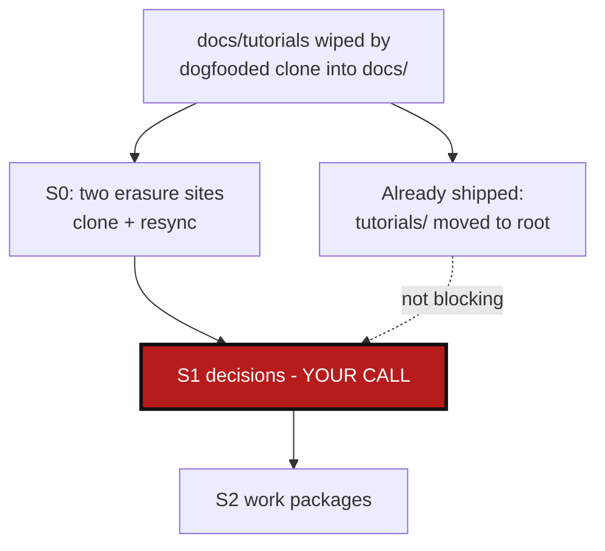

# AppendCloneMode — stop wiping a mount point that isn't empty

*Created: 2026-09-01*

## Abstract — read this first

**The one-line version.** A nested-repo mount point (e.g. `DocComplexGitSync`
mounted at `relative_path = "docs"`) is treated as owned 100% by that repo:
`_clone_registry_entry` (`orchestre.py:3101-3128`) deletes the whole
destination directory with `shutil.rmtree` before cloning into it whenever
the directory is non-empty, and `force_pull` (`git_runner.py:305-316`) runs
`git clean -fd` on every resync — both erase any file colocated in that
directory that isn't part of the nested repo. This ticket evaluates an
"append" mode that stops treating the mount point as exclusively owned, and
lays out the decisions needed before writing it.

**What this document is.** A planning-only ticket: no code has been
touched. It was triggered by a real incident — `docs/tutorials/*.md` was
tracked directly by `ComplexGitSync.git` while `docs/` is also the mount
point for `DocComplexGitSync` (`ComplexGitSync.cgs:9`); running the
dogfooded clone step (`scripts/bump_version.py`) wiped `docs/tutorials/`.
The immediate fix already shipped — `tutorials/` moved to the workspace
root (commit `9ef1f23`, "No append mode. Therefore tutorials have to move
directly under ~/") — so this ticket is not blocking; it is about whether
the underlying limitation is worth removing.

**What you will find.** The full mechanism audit (§0): both erasure sites,
why each exists, and why the destination directory currently cannot be
dual-purpose. Decisions this plan can't make for you (§1): whether append
should be opt-in or default, what conflict policy to use, and whether
`force_pull` needs the same treatment as initial clone. A work-package
catalog (§2) and acceptance criteria (§3).

**Who it is for.** Whoever picks this up next, once §1's decisions are
made. Nothing here should be executed before that — this changes a
data-loss-prone default other `.cgs` files already implicitly depend on
(some users may actually *want* the wipe, as a guaranteed-clean mount).

**What you need to do with it.** Read §1, answer its three questions, then
work packages become actionable.

---

## 0. Audit (research pass, 2026-09-01 — no files edited)

### 0.1 Initial clone: `_clone_registry_entry`

- `GitRunner.clone()` (`git_runner.py:182-196`) refuses to clone into a
  non-empty destination: `if not destination_path.is_dir() or
  any(destination_path.iterdir()): raise GitSyncError(...)`. This
  constraint is `git clone`'s own — a plain `git clone <url> <dir>`
  requires an empty or absent `<dir>`.
- `_is_populated_nested_destination()` (`orchestre.py:3162-3167`) tests
  exactly that condition ahead of time: `entry.parent_id is not None and
  entry.absolute_path.is_dir() and next(entry.absolute_path.iterdir(),
  None) is not None`.
- `_clone_registry_entry()` (`orchestre.py:3101-3128`), when that predicate
  is true, calls `shutil.rmtree(entry.absolute_path)`
  (`orchestre.py:3106-3112`) — unconditionally, on the entire directory —
  before proceeding to `git.clone(...)`. This is the exact rmtree that hit
  `docs/tutorials/`.
- Called from two sites, both first-time workspace construction, not
  day-to-day sync: `initialise_cgs` (`orchestre.py:1642`) and `bootstrap`
  (`orchestre.py:2010`), both via `_pending_clone_entries` — entries still
  in `RepoLifecycleState.DECLARED`.

### 0.2 Resync: `force_pull`

- `force_pull()` (`git_runner.py:305-316`) is fetch + `checkout -B
  <ref> FETCH_HEAD` + `clean_untracked()`.
- `clean_untracked()` (`git_runner.py:322-324`) runs `git clean -fd`,
  which removes **every untracked file and directory** in the working
  tree — not scoped to paths the nested repo ever tracked.
- Consequence: even after a successful first clone (§0.1's rmtree only
  fires once), adding a local-only file under the mount point later (e.g.
  a fresh `docs/tutorials/`, or any stray note under `docs/`) is erased on
  the next resync that calls `force_pull`, with no relation to the initial
  clone path at all. **Any fix must cover both sites** — fixing only
  `_clone_registry_entry` still leaves `force_pull` erasing colocated
  content on the next sync.

### 0.3 Why this hasn't mattered until now

Every other nested mount in this project's own `.cgs` files
(`ComplexGitSync.cgs`, `examples/*.cgs`) targets a directory whose entire
content is meant to come from the nested repo (`AgentSpec/DevSpec`, the
`DocSpec`/`DevSpec` examples). `docs/` mounting `DocComplexGitSync` is the
one case in this project where the mount point directory is *also* used to
hold content tracked by the parent repo itself (`docs/tutorials/`,
historically) — a genuine dual-purpose directory. The wipe-then-clone
model is correct and safe for every single-purpose mount; it only breaks
when a directory is deliberately shared between the parent repo's own
tracked content and a nested mount.

### 0.4 What "append" would actually require

Git itself already has the primitive for this: `git init` + `remote add`
+ `fetch` + `checkout -B <branch> FETCH_HEAD` in the *existing* directory,
instead of `git clone` into an empty one. `git checkout` already refuses
to overwrite an untracked file that collides with a path it needs to
write — so this gets real conflict detection for free (a listing of
colliding paths in the failure), rather than either silently overwriting
or silently discarding. This is the same sequence `force_pull` already
uses for resync (`git_runner.py:314-315`) minus the trailing
`clean_untracked()` call, which is exactly the piece that needs to become
conditional.

## 1. Decisions needed before work starts

### 1.1 Opt-in per entry, or new default for every mount?

**Recommendation: opt-in**, via a new `.cgs` per-entry field (name TBD,
e.g. `clone_mode = "replace" | "append"`, defaulting to today's
`"replace"` behaviour). Flipping the default silently changes what
existing `.cgs` files get when their mount directory happens to be
non-empty for an unrelated reason (leftover build artefacts, a stale
partial clone) — today that's cleaned up for free by the wipe; under a
silent default flip it would instead surface as a checkout conflict.
Opt-in keeps today's behaviour as the safe default and makes "this
directory is shared with locally-tracked content" an explicit,
self-documenting declaration in the `.cgs` file, consistent with how
`nested_config` and `access_protocol` are already explicit per-entry
enums in `cgs_format.py`.

### 1.2 Conflict policy when a path exists both locally and in the nested repo

If `docs/README.md` exists locally *and* `DocComplexGitSync` also ships a
`README.md`, what happens? Three options, needs a decision, not an
assumption:
- **Fail loud** (recommended): surface `git checkout`'s own refusal as a
  `GitSyncError` listing every colliding path, and let the user resolve
  it manually (move, rename, or delete the local file) before retrying.
  Consistent with this project's general preference for explicit failure
  over silent data loss.
- **Nested repo wins**: pre-delete only the colliding paths before
  checkout, keep everything else. Reintroduces a scoped version of
  today's silent-overwrite risk, just narrower.
- **Local wins**: skip checking out colliding paths, leaving the working
  tree not fully aligned with the nested repo's ref — a partially-synced
  mount, which is likely to confuse subsequent status/verify output and
  is not recommended.

### 1.3 Does `force_pull` need the same `clone_mode` awareness?

Per §0.2, yes — otherwise append-mode entries lose their colocated content
on the very next resync, which defeats the purpose. `clean_untracked()`
must become conditional on `clone_mode`: skip it entirely for `"append"`
entries (only local content curated with the append field will be
present, so leaving untracked files in place is the whole point).

## 2. Work packages

Ordered by dependency — `WP-APP1` fixes §1's decisions into a schema
change; nothing else is buildable before that lands.

| WP | Depends on | Touches | Deliverable |
|---|---|---|---|
| **WP-APP1** | §1.1–§1.3 answered | `cgs_format.py` (new `clone_mode` field: schema, normalization, default, validation) | Schema support for the new per-entry field, minimized/serialized like `nested_config`/`access_protocol` already are. |
| **WP-APP2** | `WP-APP1` | `git_runner.py` (new primitive: init+remote-add+fetch+checkout in an existing directory, distinct from `clone()`), `orchestre.py` (`_clone_registry_entry`: branch on `clone_mode` instead of unconditional `_is_populated_nested_destination` → `rmtree`) | Initial-clone path honours `clone_mode = "append"`: no rmtree, checkout-based population, conflicts surfaced per §1.2's chosen policy. |
| **WP-APP3** | `WP-APP1` | `git_runner.py` (`force_pull`: make `clean_untracked()` conditional), `orchestre.py` (thread `clone_mode` through to the resync call site) | Resync path stops erasing colocated content for `"append"` entries — closes the §0.2 gap. |
| **WP-APP4** | `WP-APP2`, `WP-APP3` | `tests/unit/test_registry_client.py` or equivalent, `tests/integration/` | New tests: append-mode clone into a populated-but-unrelated directory succeeds and preserves the unrelated files; a genuine path collision fails loud with every colliding path named; resync after append-mode clone still preserves colocated content added afterward. |
| **WP-APP5** | `WP-APP1`–`WP-APP4` | `docs/Text/user_guide.tex`, `docs/Text/c_cgs.tex`, `AgentSpec/AdditionalSpecs.md` | Document the new field and its semantics; rebuild the touched PDFs per `CLAUDE.md`'s before-committing rule; update the architecture table if `git_runner.py`'s responsibility line changes. |
| **WP-APP6 (optional)** | `WP-APP1`–`WP-APP5` | `ComplexGitSync.cgs` | Once available, evaluate whether `docs/`'s own `DocComplexGitSync` entry should switch to `clone_mode = "append"` — not required, since `tutorials/` already moved out of `docs/`, but would restore the option of colocating other local-only content there later. |

## 3. Acceptance criteria

- A nested mount declared `clone_mode = "append"` clones successfully into
  a non-empty destination directory, and every file present before the
  clone that doesn't collide with a path the nested repo tracks is still
  there afterward — verified by a new test, not manual inspection.
- A genuine path collision (a file present locally at the same path the
  nested repo would check out) fails with a `GitSyncError` naming every
  colliding path, per §1.2's chosen policy — not a silent overwrite, not a
  silent skip.
- Resync (`force_pull` or its call path) on an append-mode entry does not
  remove locally-added content that isn't tracked by the nested repo —
  closing the §0.2 gap specifically, with a test that adds a file after
  the initial clone and resyncs.
- Every `.cgs` file that doesn't declare `clone_mode` keeps exactly
  today's wipe-then-clone behaviour — no regression for the default case.
- `pixi run lint && pixi run test` pass.
- No commit, no push — this ticket is executed only after explicit
  go-ahead, per instruction.
