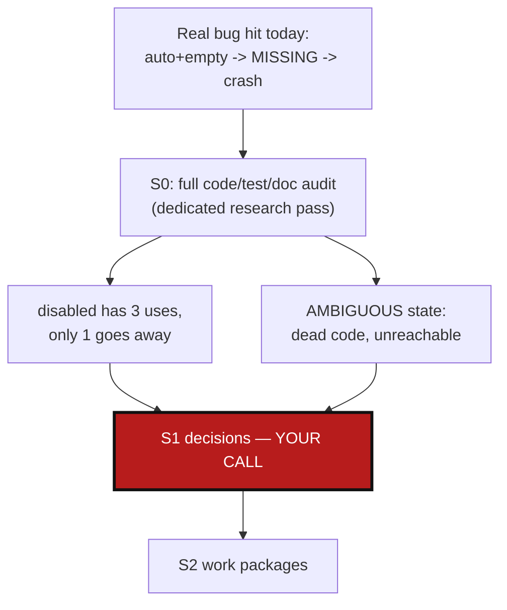

# AutoDiscoveryResolved — stop treating "auto found nothing" as an error

*Created: 2026-08-31*

## Abstract — read this first

**The one-line version.** `nested_config = "auto"` finding zero `*.cgs`
files and `nested_config` pointing at a file that genuinely doesn't exist
both set the same `DiscoveryState.MISSING`, which is a hard error — so
every leaf repo (no `.cgs` of its own) must carry an explicit
`nested_config = "disabled"` just to avoid a false-positive crash. This
ticket fixes the conflation, and evaluates — with evidence, not
assumption — how much of `"disabled"` actually becomes unnecessary once
it's fixed.

**What this document is.** A planning-only ticket: no code has been
touched. It was triggered by a real bootstrap failure
(`GitSyncError: Nested configuration for DevSpec is not resolved:
MISSING`, caused by a stray leaf reference in a *different* repo's own
`.cgs`), and by a direct challenge to the design: `nested_config =
"disabled"` should not need to exist at all if the tool is expected to
"discover files on the fly permanently" and resolve any tangles itself.

**Why it exists.** §0 below is a complete code/test/doc audit (via a
dedicated research pass, not skimmed) of every `nested_config` and
`DiscoveryState` reference in this codebase. It found the flaw is real,
but also found `"disabled"` is currently overloaded across **three**
distinct use-cases, only one of which this fix actually eliminates —
so "just remove it" isn't a clean one-line change, and §1 lays out
exactly why with evidence, not assertion.

**What you will find.** The full audit (§0): every read/write site,
every test, every doc passage, every real `.cgs` file affected. Three
decisions this plan can't make for you (§1): the new default semantics,
what happens to `"disabled"`'s other two use-cases, and whether to also
delete the already-dead `AMBIGUOUS` enum value found during the audit.
A work-package catalog (§2) and acceptance criteria (§3).

**Who it is for.** Whoever picks this up next, once the decisions in §1
are made. Nothing here should be executed before that — this changes a
core error-vs-success boundary other `.cgs` files (including this
project's own) already depend on.

**What you need to do with it.** Read §1, answer its three questions,
then work packages become actionable.

---

## 0. Audit (research pass, 2026-08-31 — no files edited)

### 0.1 The mechanism today

- `cgs_format.py:52` — `DEFAULT_NESTED_CONFIG = "auto"`; every repo entry
  gets `nested_config` filled to `"auto"` on normalization if unset
  (`cgs_format.py:206`).
- `discovery.py:161-175` (`_resolve_nested_config_path`) — three branches:
  `"disabled"` → `None` immediately; an explicit `"*.cgs"` path → resolved
  and bounds-checked against the repo root, `None` if not a file;
  `"auto"` → `repo_root.glob("*.cgs")`, zero matches → `None`, more than
  one → **raises `NestedConfigDiscoveryError` immediately**, exactly one
  → returns it.
- `discovery.py:63-71` — whenever that helper returns `None` (for *any*
  of the three reasons above except `"disabled"`, which is filtered out
  one line earlier), `entry.discovery_state = DiscoveryState.MISSING`.
- `orchestre.py:3217-3224` (`_assert_nested_discovery_complete`) — for
  every entry whose `nested_config` isn't `None`/`"disabled"`: if
  `discovery_state != RESOLVED`, raise `GitSyncError`. This is the
  exact crash from today's bootstrap run.
- The code already knows this is awkward — `orchestre.py:847-849`
  (`DiscoveredRepo.has_cgs` docstring): *"a child without one must be
  `disabled`, or nested discovery looks for a file that does not exist
  and the clone fails."* Two production call sites work around it
  defensively: `discover_repos()` (`orchestre.py:1301-1305`, comment:
  *"must not be left on the default auto"*) and `import_submodules()`
  (`orchestre.py:1088`) both **hard-code `nested_config = "disabled"`**
  on every repo they generate that has no `.cgs` of its own.

### 0.2 `"disabled"` is overloaded — three different real-world uses

| Use-case | Real example | Still needed after fixing 0.1? |
|---|---|---|
| **Leaf repo, genuinely no `.cgs`** | `ComplexGitSync.cgs` → `DevSpec` (`AgentSpec/DevSpec`); `examples/cawaqs.cgs` → `gutil/scripts`; `examples/cawaqsviz.cgs`'s two GitHub children; `examples/doccomplexgitsync.cgs` → `DocSpec`; `examples/template.cgs`, `examples/htas.cgs`, `examples/normalized_template.cgs` — **8 of 10** real occurrences | **No** — this is exactly what "auto found nothing → resolved" fixes. |
| **Duplicate/cycle-reference suppression** | `examples/CGSil2.cgs` → `CGSih1` at `../CGSih1` (a second path to a repo already canonically discovered elsewhere); `examples/CGSih2.cgs` → `CGSih1` at `..` (cycle back-reference) | **Unclear — needs a test, not an assumption** (§1.2). `CGSih1` *does* have its own `.cgs`; without `"disabled"` here, `"auto"` would actually find and try to re-process it. |
| **CI/test isolation** | `tests/integration/test_tuto_cgsi1.py` — `"disabled"` on both `CGSil2`/`CGSih1` "so that no network-facing discovery happens in CI" | Not a production semantic — a test-fixture convenience only. |

### 0.3 `AMBIGUOUS` is dead code

`DiscoveryState.AMBIGUOUS` (`git_repo.py:143`) is never assigned, never
compared, never serialized, anywhere in `src/` or `tests/`. The
ambiguous-match case (`discovery.py:173-174`) raises
`NestedConfigDiscoveryError` **directly**, unwinding before any
`discovery_state` could be set to `AMBIGUOUS` — confirmed by every test
that exercises it (`test_rejects_ambiguous_auto_discovery`,
`test_auto_with_multiple_cgs_raises`,
`test_public_nested_config_discovery_error_covers_ambiguous_nested_configs`)
asserting the raised exception, never an `AMBIGUOUS` state.

### 0.4 Test breakage if the default flips

**None, directly.** No unit or integration test asserts
`DiscoveryState.MISSING` is ever set, and no test exercises
`_assert_nested_discovery_complete`'s `GitSyncError` — that whole path is
currently untested. What *would* need attention (not because it breaks,
but because it becomes the thing this ticket is fixing):
- `tests/integration/test_cgsi_topology.py::test_discover_reproduces_phase1_cawaqsviz_topology`
  — asserts `discover_repos()` pins every `.cgs`-less repo to
  `nested_config = "disabled"`, with the comment *"the exact omission
  that made Phase 1's first corrected draft fail to clone"* — this test
  and the production code it locks in (`orchestre.py:1301-1305`,
  `:1088`) are precisely the defensive workaround this ticket should let
  us relax.
- `tests/unit/test_documents.py` — several tests (254, 301, 335, 381,
  561, 455/469/483, 726) cover `nested_config`'s schema/normalization/
  round-trip behavior; none assert discovery *behavior*, so the schema
  itself (three valid string values) does not need to change.

### 0.5 Documentation carrying the current (flawed) behavior as fact

All of these state today's semantics as the documented, correct
behavior — and would need rewording under any fix:
`docs/Text/c_cgs.tex:320-335,662-663`, `docs/Text/user_guide.tex:176-179,
620,660-727`, `docs/Text/architecture.tex:206-216`,
`docs/tutorials/03_configuration_discovery_modes.md` (most explicit —
lines 50-55 and 84-86 document the exact crash message as a "key
lesson" to memorize), `docs/tutorials/01_first_multi_repo_workspace.md:41-119`,
`docs/tutorials/02_onboarding_a_real_build_tree.md:40,72`.

### 0.6 The Cycle Breaking Engine is unrelated

`fix_circularities` (`AgentSpec/AdditionalSpecs.md`'s "Cycle Breaking
Engine" section) operates entirely downstream, on `absolute_path`/
`repo_id`/`is_external_reference` in the **already-populated** registry
— it never reads `nested_config` or `DiscoveryState`. It does not
"resolve" the MISSING-on-auto problem and was never meant to; it solves
a different, later problem (multiple *already-discovered* paths to the
same physical repo). Worth knowing before assuming it already covers
0.2's duplicate-reference case — it doesn't run early enough to prevent
`"auto"` from attempting (and, per 0.1, potentially crashing on) a
leaf repo in the first place.

## 1. Decisions needed before work starts

### 1.1 New default semantics for `"auto"` — proposed, not yet decided

**Recommendation:** `nested_config = "auto"` finding zero `*.cgs` files
→ `DiscoveryState.RESOLVED` (a normal leaf, not an error). An **explicit**
path (`nested_config = "some.cgs"`) that doesn't exist → **stays**
`MISSING` (the user asserted a specific file must be there; that's a real
mistake worth failing loudly on). Ambiguous `"auto"` (2+ matches) keeps
raising `NestedConfigDiscoveryError` immediately — a real config error,
not a resolvable default.

This directly satisfies "the code discovers files on the fly and it's
fine if there's nothing there" — while keeping a real failure mode for
the one case that's actually still a mistake (a named file that isn't
where it's claimed to be).

### 1.2 What happens to `"disabled"`'s duplicate/cycle-suppression use — needs an experiment, not a guess

Before deciding whether `"disabled"` can be removed for
`examples/CGSil2.cgs`/`CGSih2.cgs`'s cross-references to `CGSih1`, someone
has to actually test: does `discovery.py`'s existing in-line dedup guard
(`existing_child_paths`/`registered_paths`, `discovery.py:78-80,102-110`
— confirmed by `test_skips_child_with_existing_absolute_path`) already
prevent re-discovering `CGSih1` via the second path, *before* `"auto"`
ever gets a chance to re-open its `.cgs`? If yes, `"disabled"` is
removable there too — full removal is on the table. If no (the guard
runs at a different point than the `"auto"` glob, or checks a different
key), `"disabled"` stays necessary for this one case, and it should
probably be **kept**, not renamed — it would still mean exactly what it
says ("don't discover through this edge"), just for a narrower, correctly
understood reason than "this repo has no `.cgs`."

### 1.3 `AMBIGUOUS`: delete the dead enum value, or wire it up properly?

**Recommendation:** delete it. It has never been reachable, nothing
reads it, and the ambiguous case already has a working, tested failure
mode (`NestedConfigDiscoveryError`, raised directly). Catching that
exception just to set a state nothing consults before re-raising or
returning would add complexity with no behavior change. If there's a
reason to want `AMBIGUOUS` surfaced through `.gts`/`status`/`verify`
someday, that's new functionality, not a fix belonging to this ticket.

## 2. Work packages

Ordered by dependency — `WP-DISC1` must land before the others can be
verified against real behavior; `WP-DISC2` needs §1.2's experiment done
first (it *is* the experiment, run early, deliberately, before any
production code changes).

| WP | Depends on | Touches | Deliverable |
|---|---|---|---|
| **WP-DISC2 (run first, it's the experiment for §1.2)** | none | none (read-only test run) | Temporarily remove `nested_config = "disabled"` from a copy of `examples/CGSil2.cgs`'s `CGSih1` entry in a scratch test, run discovery against it, observe whether the existing path-dedup guard alone prevents re-registration. Answers §1.2 with evidence before `WP-DISC1` decides what to keep. |
| **WP-DISC1** | §1.1, §1.2 answered | `discovery.py` (`_resolve_nested_config_path`, `discover_nested_configs`), `git_repo.py` (drop `AMBIGUOUS` per §1.3) | The core fix: `"auto"` + zero matches → `RESOLVED`; explicit path + missing file → stays `MISSING`; ambiguous → unchanged (still raises). Remove the now-unreachable `AMBIGUOUS` member and its one doc-table row. |
| **WP-DISC3** | `WP-DISC1` | `orchestre.py` (`discover_repos()` line ~1301-1305, `import_submodules()` line ~1088) | Relax the defensive `if not repo.has_cgs: nested_config = "disabled"` — generated drafts can leave `.cgs`-less repos on the default `"auto"` now that it resolves cleanly. Decide (state the choice) whether to still write `"disabled"` explicitly for clarity/self-documentation in generated files, or omit it and rely on the new default — recommend omitting, since `cgs_format.py`'s own minimization already treats `"auto"` as elidable. |
| **WP-DISC4** | `WP-DISC1`, `WP-DISC3` | `tests/integration/test_cgsi_topology.py::test_discover_reproduces_phase1_cawaqsviz_topology`, `tests/unit/test_discovery.py`, `tests/unit/test_registry_client.py` | Update the one test that currently locks in the old defensive behavior; add the tests that don't exist today per §0.4 — assert `RESOLVED` on auto-empty, assert `MISSING` still fires on a missing *explicit* path, assert `_assert_nested_discovery_complete` actually raises for that remaining case (currently untested at all). |
| **WP-DISC5** | `WP-DISC1`–`WP-DISC4` | `ComplexGitSync.cgs`, `examples/*.cgs` (per §0.2's table — the 8 "no-`.cgs`" occurrences), `AgentSpec/AdditionalSpecs.md` (drop the `AMBIGUOUS` table row) | Simplify real `.cgs` files: drop `nested_config = "disabled"` from every leaf entry that no longer needs it. Leave `CGSil2.cgs`/`CGSih2.cgs`'s occurrences exactly as `WP-DISC2`'s experiment determined. |
| **WP-DISC6** | `WP-DISC1`–`WP-DISC5` | `docs/Text/c_cgs.tex`, `docs/Text/user_guide.tex`, `docs/Text/architecture.tex`, `docs/tutorials/01_first_multi_repo_workspace.md`, `docs/tutorials/02_onboarding_a_real_build_tree.md`, `docs/tutorials/03_configuration_discovery_modes.md` | Reword every passage from §0.5 — `03_configuration_discovery_modes.md`'s "key lesson" (lines 84-86) most of all, since it currently teaches the crash as something to memorize and work around rather than a fixed default. Rebuild `docs/*.pdf` for the `.tex` changes per `CLAUDE.md`'s own before-committing rule. |

## 3. Acceptance criteria

- `nested_config = "auto"` on a repo with zero `*.cgs` files resolves to
  `RESOLVED`, not `MISSING` — verified by a new test, not just manual
  bootstrap.
- `nested_config = "some_file.cgs"` pointing at a file that doesn't exist
  still raises via `_assert_nested_discovery_complete` — this failure
  mode is preserved and, per §0.4, finally actually tested.
- `DiscoveryState.AMBIGUOUS` no longer exists, or is genuinely wired up
  end-to-end (state set, read, surfaced) — not left half-defined.
- §1.2's experiment has a documented answer (yes or no, with the test
  that proves it) before `examples/CGSil2.cgs`/`CGSih2.cgs` are touched
  either way.
- `pixi run cgitsync bootstrap ComplexGitSync.cgs <name>` succeeds
  end-to-end against the real, simplified `ComplexGitSync.cgs` (the
  bootstrap that failed today, now with `AgentSpec/DevSpec`'s
  `nested_config = "disabled"` removed rather than kept).
- `pixi run lint && pixi run test` pass.
- No commit, no push — this ticket is executed only after explicit
  go-ahead, per instruction.
