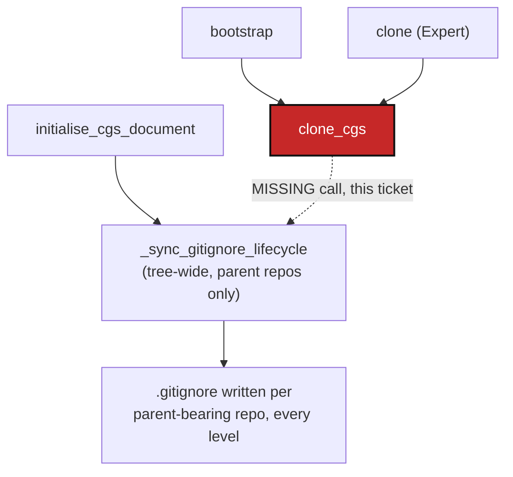

# BootstrapGitignoreSync — `bootstrap`/`clone` never sync `.gitignore`, leaving every child a phantom gitlink

*Created: 2026-09-02*

## Abstract — read this first

**The one-line version.** `clone_cgs` — the shared engine behind both
`bootstrap` and the Expert `clone` command — never calls
`_sync_gitignore_lifecycle`. Only `initialise_cgs_document` does. Every
tree built with `bootstrap` therefore ends up with every parent-bearing
repo's `.gitignore` missing its immediate children's paths, so plain `git
status` sees each child as an "embedded repository" (gitlink-shaped,
`160000`) rather than the plain independent clone it actually is — exactly
the phantom-submodule bug fixed earlier this session in `ComplexGitSync`
itself, except `bootstrap` reproduces it fresh, in every repo with
children, on every run.

**What this document is.** A planning-only ticket, two work packages
(the `.gitignore` lifecycle gap, and a separate, smaller `.cgitsync/`
gitignore gap found investigating the same question). No code touched.

**Why it exists.** Requested directly, after observing the bug twice in
one afternoon: once as `docs` showing "modified content" in `ComplexGitSync`
itself after `bootstrap`, and independently as a "link to DocSpec" inside
`DocComplexGitSync`'s own working tree — both produced by the same run,
both explained by the same missing call. `bootstrap` is very likely the
most-used entry point (`README.md`'s own "Standalone mode" is written
around it: clone `ComplexGitSync` once, reuse it across every project),
so this is not an edge case — it is close to the default experience.

**What you will find.** Verified evidence that `clone_cgs` is the one
gap, shared identically by `bootstrap` and `clone` (§0). A second,
independent finding from the same investigation: `.cgitsync/` (state
dirs, `.gts` snapshots, `.lgr` registers, logs) is not in `.gitignore`
anywhere, so `cgitsync add`/`commit` (`git add --all`, unfiltered) will
happily stage and commit it — the opposite of what a user might assume
(§0.2). Decisions needed (§1), work packages (§2), acceptance criteria
(§3).

**Who it is for.** Whoever picks this up once §1 is answered.

**What you need to do with it.** Nothing yet — no commit, no push.

---

## 0. Verification (2026-09-02)

### 0.1 The `.gitignore` lifecycle gap

- `orchestre.py:1688` — `initialise_cgs_document` calls
  `self._sync_gitignore_lifecycle(force_pull_fallback=..., commit=...)`
  right after the clone loop, before returning.
- `orchestre.py:1998-2049` (`clone_cgs`) — same clone loop shape
  (`_pending_clone_entries` / `_clone_registry_entry` /
  `discover_nested_configs`), same `fix_circularities` /
  `_assert_nested_discovery_complete` tail — but **no call to
  `_sync_gitignore_lifecycle` anywhere in the method**.
- `orchestre.py:2072-2080` (`clone`, the Expert command) — one line,
  delegates straight to `clone_cgs`. `orchestre.py:2117-2118`
  (`bootstrap`) — also delegates to `clone_cgs`. Both inherit the gap
  identically; fixing `clone_cgs` fixes both call sites at once.
- `_sync_gitignore_lifecycle` itself (`:1355-1453`) walks
  `iter_tree(registry)` for **every** repo with children, tree-wide —
  not just the root. This is exactly why the bug showed up twice: it hit
  `ComplexGitSync` (parent of `DevSpec`/`docs`) and `DocComplexGitSync`
  (parent of `DocSpec`) identically, in the same `bootstrap` run, because
  neither ever got the call regardless of position in the tree.
- Reproduced this session: a `bootstrap --force-protocol https` run
  left `docs` as `git ls-files -s docs` → `160000 ... docs` (gitlink
  mode) in `ComplexGitSync`'s own index, with `git status` reporting
  `modified: docs (modified content)` — not because anything is actually
  wrong with `docs`, but because `.gitignore` never got the `docs`/
  `DevSpec` lines a synced tree would have.

### 0.2 The `.cgitsync/` gitignore gap (same investigation, separate cause)

- `grep -n "\.cgitsync" .gitignore` — no match, in `ComplexGitSync`'s own
  `.gitignore` or `DocComplexGitSync`'s (`docs/.gitignore`). Both files
  are otherwise normal, hand-maintained Python-project `.gitignore`s
  (`.pytest_cache/`, `.ruff_cache/`, `.hypothesis/` are all present) —
  `.cgitsync/` was simply never added to that same list, in either repo.
- `operations.py::add_tree` (`:270-284`) — `git_runner.stage_all(repo.absolute_path)`
  per repo, i.e. `git add --all`, no path filtering of any kind.
  `commit_tree` (`:292-...`) stages the same way by default
  (`stage_all=True`). Neither excludes `.cgitsync/`.
- Net effect: `cgitsync add`/`commit`/`freeze-release` will stage and
  commit whatever is currently under `.cgitsync/` (generated `.gts`
  snapshots, `.lgr` hash-chained registers, run logs, and
  `master.toml` if present) the moment it exists on disk at commit time
  — not excluded, not asked about.

## 1. Decisions needed before work starts

### 1.1 Does `clone_cgs` get the full flag surface, or just the fix?

`initialise_cgs_document` exposes `commit_gitignore`/`force_gitignore_sync`
(gating whether the sync also stages+commits+pushes, and whether a
blocked pre-pull falls back to force-pull) as caller-controlled
parameters. `clone_cgs`/`bootstrap`/`clone` currently accept neither.

**Recommendation:** land the call with `commit=False` (write-only,
today's `initialise` default — matches "report first, write only when
asked" already used elsewhere in this CLI) and no new flags in this
ticket. Adding `--commit-gitignore`/`--force-gitignore-sync` to
`bootstrap`/`clone` too is a reasonable follow-up, not required to fix
the actual bug (a written-but-uncommitted `.gitignore` already stops the
gitlink-shaped `git status` noise; committing it is a separate, opt-in
step the caller can still do by hand or via a later ticket).

### 1.2 `pre_pull=True` (the default) or `False`?

`_sync_gitignore_lifecycle`'s `pre_pull` step safely pulls every
parent-bearing repo before writing — useful when the tree might have
drifted since it was last touched (`initialise`'s case), redundant
immediately after every repo in the tree was *just* freshly cloned
(`clone_cgs`'s case) — `restart()` already documents this exact
reasoning for its own `pre_pull=False` call.

**Recommendation:** `pre_pull=False` for the new `clone_cgs` call — every
repo is already at the tip of its just-cloned branch, so the safe-pull
step can only be a no-op fast-forward; skipping it avoids one redundant
`git pull` per parent-bearing repo on every `bootstrap`/`clone` run.

### 1.3 Fix `.cgitsync/` gitignore in this ticket, or split it out?

Different root cause (a missing static line vs. a missing dynamic sync
call) but found in the same investigation and blocking the same "commit
this tree" workflow the author is about to do.

**Recommendation:** include it here as a second, independent work
package (§2, WP-GI2) rather than a separate ticket — it is a one-line
fix with no design decisions attached, and shares this ticket's "make
`bootstrap`'s output actually safe to commit" theme closely enough that
splitting it would just be more process for no benefit. Scope: add
`.cgitsync/` to **both** `ComplexGitSync/.gitignore` and
`DocComplexGitSync/.gitignore` (two different repos — `docs/.gitignore`
from inside this workspace is the same file as `DocComplexGitSync`'s own
tracked `.gitignore`). Whether every other repo `bootstrap` might ever
clone (`DevSpec`, `DocSpec`, and any future one) also needs the same line
added to its own tracked `.gitignore` is out of this ticket's reach —
each is a separately-owned repo; note it, don't chase it here.

## 2. Work packages

| WP | Depends on | Touches | Deliverable |
|---|---|---|---|
| **WP-GI1** | §1.1, §1.2 | `orchestre.py` (`clone_cgs`: one new call to `self._sync_gitignore_lifecycle(pre_pull=False, commit=False)` after `_assert_nested_discovery_complete()`, before `recompute_tree_state()`/the readiness check — mirroring `initialise_cgs_document`'s placement) | `bootstrap` and `clone` both end with every parent-bearing repo's `.gitignore` correctly listing its immediate children, tree-wide, same as `initialise` already does — no more phantom gitlinks in `git status` anywhere in a freshly bootstrapped tree. |
| **WP-GI2** | §1.3 | `ComplexGitSync/.gitignore`, `DocComplexGitSync/.gitignore` (two different repos) | `.cgitsync/` added to both, so `cgitsync add`/`commit` no longer silently proposes generated state (`.gts` snapshots, `.lgr` registers, logs, `master.toml`) for commit. |

## 3. Acceptance criteria

- A `bootstrap <spec.cgs> <name>` run into a fully unpopulated target
  leaves `git status` clean (no "modified content" / embedded-repository
  noise) in every repo the tree contains that has children — verified for
  at least a two-level case (root with a child that itself has a further
  nested child, e.g. the `ComplexGitSync` → `docs` → `docs/DocSpec` shape
  found this session).
- Same check for the Expert `clone` command (shares `clone_cgs`, not
  separately re-implemented — a regression here would mean the fix only
  half-landed).
- `initialise`'s existing behaviour (`pre_pull=True`, `commit_gitignore`/
  `force_gitignore_sync` still caller-controlled) is unchanged — this
  ticket only adds the missing call to `clone_cgs`, it does not touch
  `initialise_cgs_document`.
- `git status` in a fresh `ComplexGitSync` or `DocComplexGitSync` checkout
  no longer flags `.cgitsync/` as untracked/stageable content after a
  `cgitsync` command has run and generated state under it.
- `pixi run lint && pixi run test` pass, in both repos this ticket
  touches.
- No commit, no push — executed only after explicit go-ahead.
