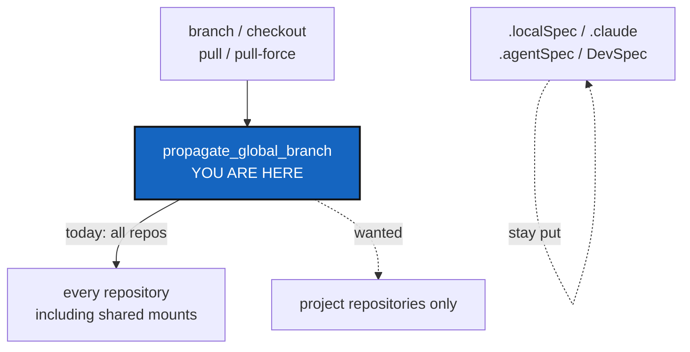

# Branch pinning — stop tree-wide commands from moving shared mounts

*Created: 2026-09-05*

## Abstract — read this first

**The one-line version.** Four tree-wide operations force one branch name
onto every repository in the tree. Give a `.cgs` entry a way to say "leave
me on my own branch", and make those four honour it.

**What this document is.** The priority ticket. **Implemented on 2026-09-06** — see §8 for what shipped and the one thing the plan missed. Everything else in flight — the `@project` token, the `.goc` Orchestrator, the tutorial, the protocol documentation — waits behind this one.

**Why it exists.** This is the only open item that stops you using your own
tool on your own repository. `cgitsync branch` and `cgitsync checkout`
cannot be run on the ComplexGitSync tree today without damaging
repositories that other projects share. Every other open question is a
question about convenience or documentation. This one is about whether the
layout that shipped in step 2 is usable at all.

**What you will find.** §1 exactly what breaks, with line numbers. §2 the
fix. §3 the constraint that makes it cost more than it looks. §4 two small
decisions. §5 the work. §6 acceptance. §7 what this ticket deliberately
leaves alone.

**Who it is for.** Whoever implements it next, and the owner, who has to
answer §4 first.

**What you need to do with it.** Answer §4, then do §5. Do not widen it.



---

## 1. What breaks today

`operations.propagate_global_branch` sets `target_ref_name` on **every**
repository in the tree. It is called from four places:

| Line | Function | Command | What it then does |
|---|---|---|---|
| 196 | `restart_tree` | `pull` | `git pull --ff-only` on every repository, at the root's branch |
| 248 | `restart_tree_force` | `pull-force` | fetch, `checkout -B`, `clean -fd` — destructive — on every repository |
| 302 | `checkout_tree` | `checkout` | checks out that ref everywhere |
| 331 | `branch_tree` | `branch` | `create_global_branch` **creates** the branch where missing |

Applied to the tree that step 2 shipped:

- `cgitsync branch feature-x` creates `feature-x` inside `.agentSpec`,
  `DevSpec` and `DocSpec`. Those repositories are shared with every other
  project that mounts them.
- `cgitsync checkout main` moves `.localSpec` and `.claude` off the
  `ComplexGitSync` branch that carries this project's identity.
- `cgitsync pull` propagates the root's branch, then fails on any mount
  that does not have it.
- `cgitsync pull-force` would do the same destructively.

`initialise` and `bootstrap` are not affected. They read each entry's own
`default_branch`, which is why a fresh tree comes out correct and only
degrades once a tree-wide command runs.

### 1b. It already happened, on 2026-09-05

Not hypothetical. The owner ran `cgitsync checkout goc-operation-spec` on
the real workspace to review a branch. It succeeded, and
`create_global_branch` created that branch locally in **all six mounts** —
`docs`, `docs/DocSpec`, `.agentSpec`, `.agentSpec/DevSpec` from `main`, and
`.localSpec`, `.claude` from `ComplexGitSync` — each from its own HEAD. Four
of those repositories are shared with every other project that mounts them.

The next `cgitsync pull` then propagated the same name and stopped with
`fatal: couldn't find remote ref goc-operation-spec`, because no mount has
that branch on its remote.

Two things kept this cheap, and neither is a design feature:

- nothing was pushed, so the stray branches stayed local;
- each branch was created from its own HEAD, so the commits matched and
  `git branch -d` removed them without complaint.

Repair, for reference, was one `git checkout <proper branch>` and one
`git branch -d goc-operation-spec` per mount.

**Until this ticket lands, `branch`, `checkout`, `pull` and `pull-force`
must not be run on a tree carrying pinned mounts.** Use plain `git` in the
repository you actually mean to change. This warning was previously buried
in a risk table and named only two of the four commands; that is why the
incident happened.

## 2. The fix

A `.cgs` entry declares that it keeps its own branch:

```toml
{ repository = "github:flipoyo/.localSpec", default_branch = "ComplexGitSync", fallback_branch = "main", pinned = true },
```

Default is `false`, so every existing `.cgs` behaves exactly as it does
today.

**What `pinned = true` means at each call site.** This is the whole
specification:

| Operation | Behaviour on a pinned entry |
|---|---|
| `propagate_global_branch` | Do not overwrite its target ref. It keeps its declared `default_branch` |
| `create_global_branch` | Never create the global branch in it |
| `checkout_tree` | Ensure it is on its declared branch. Never move it to the tree's ref |
| `restart_tree` / `restart_tree_force` | Pull it **on its own branch**, so mounts still update. Do not skip it |

The last row matters. Pinning means "not this tree's branch", not "do not
touch me". A pinned mount that never updates is worse than one that moves.

**Where the flag travels.** `cgs_format.py` parses, normalizes, validates
and serializes it. `registry.py` carries it into the tree. `git_repo.py`
holds it on the entry. `operations.py` reads it in the four places above.
No other module needs to know.

## 3. The constraint: there is no headroom

Every module this touches sits **exactly** at its ceiling. The ratchet only
tightens, so each added line has to be paid for by a removed line in the
same module.

| Module | LOC now | Baseline | Headroom |
|---|---|---|---|
| `cgs_format.py` | 642 | 642 | 0 |
| `registry.py` | 449 | 449 | 0 |
| `operations.py` | 942 | 942 | 0 |
| `git_repo.py` | 322 | 322 | 0 |

Budget for it. A realistic estimate is 30 to 55 new lines across the four,
so the same again has to come out. That is the ratchet working as designed —
it forces a simplification alongside each feature — but it roughly doubles
the work, and a plan that ignores it will stall at the last test.

This happened already today: a four-line bug fix in `git_runner.py` failed
`test_module_ceilings.py` and only landed after `_uses_file_transport` was
simplified to pay for it.

If no honest simplification can be found in a given module, that is itself
worth reporting rather than working around. Raising a baseline is the
owner's call, not the implementer's.

## 4. Decisions — settled 2026-09-06 by the owner

### D1. The field is `pinned = true`

A boolean, defaulting to false. Chosen over `branch_policy = "pinned"`:
`.cgs` grammar is expensive to change once other projects' specs use it, so
the smallest honest thing wins. A third policy, if one is ever needed, will
be a second field.

```toml
{ repository = "github:flipoyo/.localSpec", default_branch = "ComplexGitSync", fallback_branch = "main", pinned = true },
```

### D2. Restoring a frozen release ignores pinning

`launch-release` puts every repository back on the commit recorded in the
`.gts`, pinned or not. A release is a set of commits and has to stay
reproducible. **Pinning governs branch propagation, never snapshot
restoration.**

### D3. Five entries get pinned; `docs` and the root do not

| Entry | Declared in | `pinned` | Why |
|---|---|---|---|
| `.localSpec` | `install.cgs`, `examples/complexgitsync.cgs`, `ComplexGitSync.cgs` | **true** | On a branch named after the project |
| `.claude` | the same three | **true** | Same |
| `.agentSpec` | the same three | **true** | Shared with every other project |
| `DevSpec` | `.agentSpec/install.cgs` | **true** | Shared |
| `DocSpec` | `docs/DocCGS.cgs` | **true** | Shared |
| `DocComplexGitSync` (`docs/`) | the same three | false | Belongs to this project alone, so it follows the project branch and documentation can live on a feature branch beside the code it describes |
| root | — | false | It *is* the project branch |

## 5. The work, in order

| # | Step |
|---|---|
| 1 | Add the field to `cgs_format.py`: parse, normalize, validate, serialize, and round-trip through authoring |
| 2 | Carry it through `registry.py` onto the entry in `git_repo.py` |
| 3 | Honour it in the four `operations.py` call sites per §2's table |
| 4 | Pay for every added line in each module (§3) |
| 5 | Set `pinned = true` on `.localSpec` and `.claude` in `install.cgs`, `examples/complexgitsync.cgs` and `ComplexGitSync.cgs`, and on `DevSpec` in `.agentSpec/install.cgs`. `install.cgs` and `examples/complexgitsync.cgs` must stay byte-identical — `tests/unit/test_install_cgs.py` enforces it |
| 6 | Document the field in `docs/Text/c_cgs.tex`, and in the two tutorials that show `.cgs` entries (`02_`, `03_`). Rebuild the PDFs and push `DocComplexGitSync` |
| 7 | `pixi run lint`, `pixi run test`, `pixi run bump-version` |

## 6. Acceptance

1. `cgitsync branch <name>` on the ComplexGitSync tree creates the branch in
   the project's own repositories and in **none** of `.agentSpec`,
   `DevSpec`, `DocSpec`, `.localSpec`, `.claude`. Verified on a real tree,
   not only in unit tests.
2. `cgitsync checkout` leaves every pinned mount on its declared branch.
3. `cgitsync pull` updates every pinned mount **on its own branch**, and
   does not fail because a mount lacks the root's branch.
4. A `.cgs` with no `pinned` field behaves exactly as it does today.
5. `pinned` survives an authoring round trip: written, read back, written
   again, unchanged.
6. Restoring a frozen release still puts every repository on its recorded
   commit, pinned or not (D2).
7. `pixi run lint` and `pixi run test` pass, ceilings included, with no
   baseline raised unless the owner approved it.

## 7. What this ticket does not do

Deliberately excluded, so this stays small enough to finish:

- the `@project` token and the project-level policy default — step 3, D1b;
- the `.goc` file and the Orchestrator — `GitOrchestratorCommand_DevPlanTicket.md`;
- the three-hop protocol documentation and tutorial 4 — step 3, D5;
- replacing the dangling `autoTest` branch name — step 3, D2;
- the two workspace clean-ups — step 3, §1.7.

None of those are blocked by this ticket except in the sense that they are
less urgent. This one is what stops `branch` and `checkout` being usable.

## 8. What shipped, 2026-09-06

Implemented, with all three acceptance checks run against a real tree
bootstrapped from the live remotes, not only unit tests.

| Check | Result |
|---|---|
| `cgitsync branch feature-x` | Created in the root and `docs` only. Absent from all five pinned mounts |
| `cgitsync checkout feature-x` | Root and `docs` moved. `.localSpec` and `.claude` stayed on `ComplexGitSync`; `.agentSpec`, `DevSpec`, `DocSpec` stayed on `main` |
| `cgitsync pull` | Completed with no error. Every pinned mount updated **on its own branch**, and `status` reported seven repositories clean and synced |

**What the plan missed.** §2 said the flag travels through four modules.
It travels through five, and the fifth is where the first real-tree run
still leaked. Tree entries are built in three places, not one:
`registry.build_registry_from_cgs_document` (from a `.cgs`),
`registry.build_registry_from_gts_document` (from a `.gts` — **the path
every tree-wide command actually uses**), and `discovery.py` (for repos
declared in a nested `.cgs`). The flag also has to be written into the
`.gts` snapshot, or it is lost the moment the tree is saved.

A second surprise, worth remembering for any future `.cgs` field: a
repository declared in a nested `.cgs` is pinned by *that* file, which lives
in the repository owning it. Pinning `DevSpec` and `DocSpec` meant
committing to `flipoyo/.agentSpec` and `flipoyo/DocComplexGitSync`, not
here. Until those were pushed, the test tree kept cloning the unpinned
specs and the branch kept leaking.

**One defect found in review of my own change.** Normalization first read
`repo["pinned"] = bool(repo.get("pinned", False))`, which turns `"yes"` into
`True` and made the validation below it unreachable. It now defaults an
absent value without coercing a wrong one, so a typo is reported.

**The ceiling was paid, module by module**, ending below baseline
everywhere: `cgs_format.py` 642/642, `registry.py` 447/449,
`operations.py` 935/942, `git_repo.py` 320/322, `discovery.py` 229/230.
The largest saving was real duplication: `restart_tree` and
`restart_tree_force` were near-identical 50-line functions differing only in
which pull they called and one word of an error message. They now share
`_restart_tree`, which also means pinning is honoured in one place instead
of two that could drift.
