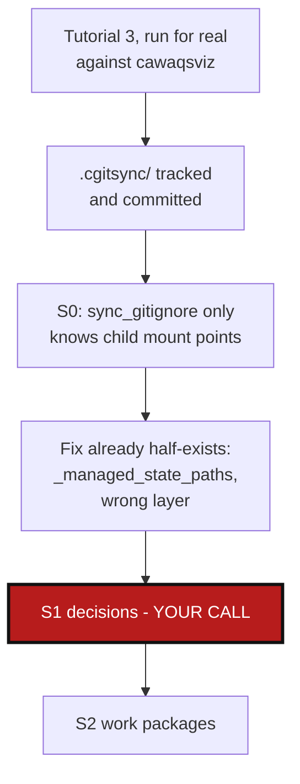

# CgitsyncGitignoreLeak — `.cgitsync/` gets tracked and committed

*Created: 2026-09-03*

## Abstract — read this first

**The one-line version.** `.gitignore` sync (`initialise`, `bootstrap`,
`pull`) never excludes `.cgitsync/` — cgitsync's own generated runtime
state gets tracked and committed as ordinary project content the moment
someone runs `add`. Reproduced for real against `cawaqsviz` (Tutorial 3),
not a synthetic fixture.

**What this document is.** A planning-only ticket: no code has been
touched. Split out from `Tuto3Blockers_DevPlanTicket.md`, which bundled
this with an unrelated `import-submodules` bug
(`RecursiveImportSubmodules_DevPlanTicket.md`) found in the same test
run — the two share no code path, so each now stands alone.

**What you will find.** The audit (§0): exact reproduction, why the
existing `.gitignore`-sync mechanism can't see `.cgitsync/` at all, why
"we already fixed this for ComplexGitSync" turns out not to be true, and
that the fix's building blocks already exist elsewhere in the codebase.
Decisions this plan can't make for you (§1), a work-package catalog
(§2), and acceptance criteria (§3).

**Who it is for.** Whoever picks this up next, once §1's decisions are
made.

**What you need to do with it.** Read §1, answer its questions, then the
work packages become actionable.



---

## 0. Audit (research pass, 2026-09-03 — no files edited)

### 0.1 Reproduced, with the actual tracked files

This session's own Tutorial 3 verification run (`$WORK/cawaqsviz`, still
on disk) really committed its own state directory:

```
$ git ls-files .cgitsync
.cgitsync/.cgs/cawaqsviz-main.cgs
.cgitsync/.cgs/cawaqsviz-retire-submodules.cgs
.cgitsync/state(366ca0a3...)_0/cawaqsviz-discovered.cgs
.cgitsync/state(366ca0a3...)_0/cawaqsviz-discovered.gts
.cgitsync/state(366ca0a3...)_0/cawaqsviz.lgr
.cgitsync/state(3d684908...)_0/cawaqsviz-discovered.cgs
... (every state snapshot from every initialise/discover run, all of it)
```

`cawaqsviz`'s own `.gitignore` (a pre-existing, project-authored file —
QGIS plugin boilerplate, nothing to do with `cgitsync`) has the two child
mount points correctly appended at the bottom
(`external/HydrologicalTwinAlphaSeries`, `docs/CWV_user_guide` — that
part of the sync worked exactly as designed) but no `.cgitsync/` line
anywhere. `git add --all` therefore picked up every generated snapshot as
ordinary project content, and it rode along into the `chore: retire git
submodules` commit right alongside the intended change.

### 0.2 Why: `sync_gitignore` only knows about child mount points

`sync_gitignore()` (`git_tree.py:1172-1196`) and its per-repo helper
`_update_gitignore_file()` (`git_tree.py:1199-1221`) — and the
orchestration wrapper around them, `_sync_gitignore_lifecycle()`
(`orchestre.py:1324` onward) — all iterate `tree.children_of(entry.
repo_id)` and write exactly those child relative paths. `.cgitsync/`
is not a child repo, so it is structurally invisible to this entire
mechanism — not a missed case, a category the mechanism was never built
to see. This is called from `initialise_cgs`, `clone_cgs` (hence
`bootstrap`), and `restart`/`pull` — every one of them.

### 0.3 "We fixed it for ComplexGitSync" — we didn't, we patched one file

This repository's own root `.gitignore` does have a `.cgitsync/` entry
(and a comment explaining why), which is what created the impression this
was already handled. It wasn't generated by any of the mechanism in
§0.2 — grepping the entire source tree for `.cgitsync` alongside
`gitignore`/`ignore` turns up nothing that writes it. It was added to
this one file by hand at some point, not produced by `bootstrap` or
`initialise` doing anything different for this project specifically.
Every other project `cgitsync` manages — including `cawaqsviz`, §0.1 —
gets no such protection.

### 0.4 The fix already half-exists, just in the wrong layer

`cgitsync` already has the concept "these paths are `cgitsync`-managed,
not real project content" — it's just scoped to preflight/status
filtering, never propagated to the actual `.gitignore` file:

- `operations.py:1012-1014`, `_managed_state_paths(repo)`: returns
  `{Path(".cgitsync"), Path(f"{repo.name}.lgr")}`, used at
  `operations.py:984` to filter worktree-dirty preflight checks so a
  pending `.cgitsync/` write never blocks `commit`/`push`.
- `orchestre.py:2861-2874`, `_cgitsync_managed_status_paths()`: the same
  concept, independently re-implemented for a different status-filtering
  call site — `{Path(".cgitsync")}`, plus `f"{entry.name}.lgr"` when
  `entry.parent_id is None` (root only).

Both already know exactly which paths this is about. Neither is wired
into `.gitignore` generation. The fix is to make `sync_gitignore`/
`_sync_gitignore_lifecycle` also write these paths into the **root's**
`.gitignore` (not every repo's — `.cgitsync/` only ever exists once, at
CGSHOME), reusing one of the two existing helpers rather than inventing a
third definition of the same path set.

## 1. Decisions needed before work starts

### 1.1 Which existing helper does the `.gitignore` write reuse?

Two independent definitions of the same concept already exist (§0.4).
Consolidating them into one (used by both preflight filtering and the new
`.gitignore` write) is more correct than picking one to duplicate a third
time — but that consolidation touches two call sites for a bug report
that only needs one. Do it as part of this ticket, or file it separately
and duplicate the constant here for now?

### 1.2 Does this run every time, or only detect-and-fix once?

`sync_gitignore` already re-checks and only appends missing entries
(`_update_gitignore_file` is idempotent — see the "Preserves all
pre-existing lines" docstring). The natural fix is exactly the same
shape: add `.cgitsync/` (and the root's `.lgr`, if `entry.parent_id is
None`) to the same missing-entries check already running for children,
every time `_sync_gitignore_lifecycle` runs (`initialise`, `bootstrap`,
`pull`) — no new call path needed, no new flag. Flagging as a decision
only because it changes what every `.gitignore` sync writes from now on,
even for projects that never asked for it — recommend accepting this
regardless, since the alternative (an opt-in flag for "please don't
commit my own tool's internal state") has no plausible use case.

### 1.3 What about projects whose root `.gitignore` doesn't exist yet at all?

`_update_gitignore_file` already handles a missing file (`FileNotFoundError` →
empty existing content, creates it). No open question here — noted only
so the acceptance criteria cover it explicitly.

### 1.4 Existing state already committed elsewhere?

This ticket only stops the bleeding going forward. Any project (this
session's `cawaqsviz` test tree included) that already committed
`.cgitsync/` before this fix needs a manual `git rm -r --cached
.cgitsync/` — out of scope for this ticket to automate; note it in the
fix's own documentation/changelog entry so nobody rediscovers it fresh
per project.

## 2. Work packages

Ordered by dependency — `WP-GI1` is the mechanism; nothing else is
buildable before it lands.

| WP | Depends on | Touches | Deliverable |
|---|---|---|---|
| **WP-GI1** | §1.1–§1.2 answered | `git_tree.py` (or wherever §1.1 lands the consolidated helper), `orchestre.py` (`_sync_gitignore_lifecycle`) | The root's `.gitignore` gains `.cgitsync/` (and its own `.lgr`, if applicable) the same way it already gains child mount points — same call, same idempotent write. |
| **WP-GI2** | `WP-GI1` | `tests/unit/test_git_tree.py` or equivalent, `tests/integration/` | New test: `initialise`/`bootstrap` on a fresh project leaves `.cgitsync/` gitignored from the very first sync — not just present in the file, but confirmed via `git status --porcelain` reporting it clean, matching §0.1's exact failure mode. |
| **WP-GI3** | `WP-GI1`, `WP-GI2` | `docs/Text/user_guide.tex` (`.gitignore` lifecycle sync subsection), `AgentSpec/AdditionalSpecs.md` if `git_tree.py`'s responsibility line needs a word added | Document that `.gitignore` sync now also covers `cgitsync`'s own state directory, not only child mount points; rebuild `docs/*.pdf`. |

## 3. Acceptance criteria

- A fresh `initialise`/`bootstrap` run, followed by `add`, leaves
  `.cgitsync/` and any root `.lgr` file entirely absent from `git status
  --porcelain` — not merely present in `.gitignore` text, actually
  excluded — verified by a test, not by reading the file.
- Every existing `.gitignore`-sync test (child mount points) still
  passes unmodified — this only adds a path to what's ignored, never
  removes or reorders the existing behavior.
- `docs/Text/user_guide.tex` documents the change; `docs/*.pdf` rebuilt.
- `pixi run lint && pixi run test` pass.
- No commit, no push — this ticket is executed only after explicit
  go-ahead, per instruction.
