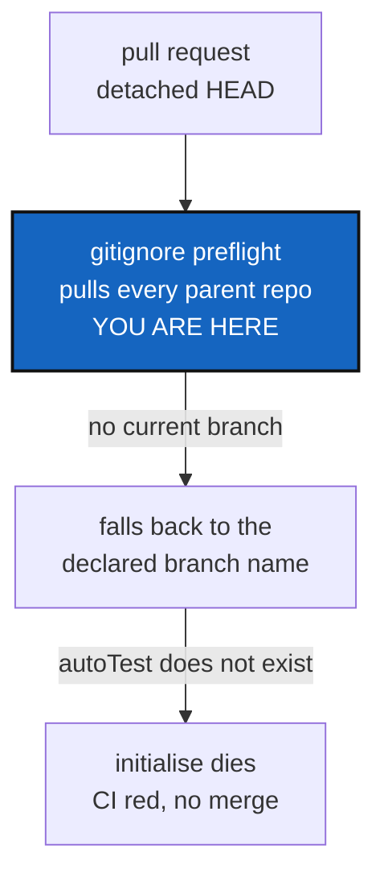

# Detached HEAD breaks the .gitignore preflight, and that blocks every pull request

*Created: 2026-09-06*

## Abstract — read this first

**The one-line version.** `initialise` guesses a branch to pull when a
repository's HEAD is detached, guesses one that does not exist, and dies.
A pull-request checkout is always detached, so no pull request can pass.

**What this document is.** The priority ticket, replacing
`BranchPinning_DevPlanTicket.md` at the front of the queue now that pinning
is implemented. Nothing here is built.

**Why it exists.** Pull request #182 has red CI. Every other ticket is
queued behind a merge to `main`, and the merge cannot happen while the
build fails. The objective is narrow: **make CI green on a pull request,
merge #182, and unblock the queue.**

**What you will find.** §1 the failure, in its own words. §2 the three
separate defects behind it, only one of which needs fixing to go green.
§3 how to reproduce it faithfully, from `$HOME/$CGSPATH/` — and why an
earlier attempt with `git worktree` failed to reproduce anything. §4 the
decisions. §5 the work. §6 acceptance. §7 what this ticket leaves alone.

**Who it is for.** Whoever implements it next, and the owner, who has to
answer §4 first.

**What you need to do with it.** Answer §4, then do §5. Do not widen it —
its whole value is being the shortest path back to a green `main`.



---

## 1. The failure

CI step *Reconstitute docs/ (dogfood cgitsync)*, which runs:

```bash
pixi run cgitsync initialise examples/complexgitsync.cgs --output-path .. --force-protocol https
```

Every mount clones correctly. Then:

```
gitignore sync preflight failed: could not safely pull 'ComplexGitSync'
(/home/runner/work/ComplexGitSync/ComplexGitSync) before writing its .gitignore:
Git command failed (git pull --ff-only origin autoTest):
fatal: couldn't find remote ref autoTest
```

Run 34053278984, on pull request #182.

## 2. Three defects, one of which blocks the merge

The code is `orchestre.py`'s `_sync_gitignore_lifecycle`, in its `pre_pull`
loop. It pulls every repository that has children, so that a `.gitignore`
is never written onto a stale checkout:

```python
current_branch = self.git_runner.current_branch(entry.absolute_path)
if current_branch is None:
    current_branch = entry.resolved_ref_name or entry.target_ref_name or "main"
self.git_runner.pull(entry.absolute_path, ref_name=current_branch)
```

**Defect A — a detached HEAD has no branch, and guessing one is wrong.**
`current_branch` returns `None` when `git rev-parse --abbrev-ref HEAD`
says `HEAD`, which is exactly what a pull-request checkout looks like:
GitHub checks out the merge commit, detached. There is nothing to
fast-forward. Pulling *any* guessed branch into a detached checkout is
wrong even when the branch exists — it would quietly change the commit CI
is meant to be testing. **This is the one that must be fixed.**

**Defect B — the fallback reaches a branch name nobody validated.**
`target_ref_name` is the branch the `.cgs` *declares*, not the branch that
was actually resolved. The same CI log shows the distinction plainly, for
`docs`:

```
"fallback_applied", "target_ref_name": "autoTest", "resolved_ref_name": "main",
"fallback_reason": "branch 'autoTest' not found on remote; cloned 'main' instead"
```

The chain prefers `resolved_ref_name`, which is right — but the tree root
is *attached* from the existing checkout rather than cloned, so nothing
ever records its resolved branch, and the chain falls through to the
declared name. Worth fixing, but on its own it only moves the guess.

**Defect C — the spec names a branch that does not exist.**
`project.default_branch = "autoTest"`, in `install.cgs` and
`examples/complexgitsync.cgs`. There is no `autoTest` on the remote, and
there has not been for as long as the file has said so. This is step 3's
D2, already settled in principle: *`autoTest` goes*.

**Fixing C alone would turn CI green for the wrong reason.** The guess
would land on a branch that exists, so `git pull --ff-only origin main`
would succeed — and would merge `main` into the detached pull-request
checkout before the tests run. Green, and testing something other than the
pull request. Fix A first; C is hygiene that should ride along.

## 3. Reproducing it, from `$HOME/$CGSPATH/`

An earlier attempt reproduced nothing: `git worktree add --detach` at both
`main` and the feature branch, then CI's exact command, and **both passed**.
That method is not faithful, for three reasons worth writing down:

- a worktree shares `$GIT_DIR/config` with the repository it came from, so
  `--force-protocol https` does not rewrite the remote the way it does on a
  fresh clone;
- it inherits the developer's remotes, credentials and any `.cgitsync/`
  state already lying around;
- its root was never cloned by `cgitsync`, so the entry state differs from
  a real run.

Use a real bootstrapped workspace instead:

```bash
export CGSPATH="$HOME/.cgs/CGS$(date +%Y%m%d%H%M%S)"
mkdir -p "$CGSPATH"

cd <a plain clone of ComplexGitSync>
pixi run cgitsync bootstrap install.cgs ComplexGitSync --cgs-path "$CGSPATH"

cd "$CGSPATH/ComplexGitSync"
pixi install
git checkout --detach                    # what a pull-request checkout is

pixi run cgitsync initialise examples/complexgitsync.cgs \
    --output-path .. --force-protocol https
```

The last command must fail with the §1 error before any fix, and succeed
after. If it does not fail there, the reproduction is still not faithful —
find out why before changing code, because a fix that cannot be seen to fix
anything is a guess.

## 4. Decisions — your call

### D1. What should the preflight do on a detached HEAD?

| Option | Behaviour | Trade-off |
|---|---|---|
| **A (recommended)** | Skip the pull for that repository, and say so in the log | Honest: there is no branch to fast-forward. `.gitignore` is still written. CI passes for the right reason |
| B | Fall back to `fallback_branch` before the declared branch | Still pulls a guessed branch into a detached checkout, which changes what CI tests |
| C | Fail with a clear message telling the caller to check out a branch | Correct in spirit, but it would keep every pull request red, which is the opposite of this ticket's objective |

### D2. Does `autoTest` go in this ticket, or its own?

It is one line in two files that must stay byte-identical
(`tests/unit/test_install_cgs.py` enforces it). Step 3's D2 already decided
it should go. Recommended: **include it here**, since leaving a spec that
names a non-existent branch invites the next instance of defect B.

What replaces it is the open half. `main` is the safe answer and matches
step 3 §2.0, which says `main` holds `install.cgs` as the tool's own spec.
Step 3's D2 rule — the project branch is the project's name — would give
`ComplexGitSync`, a branch that exists locally here but has never been
pushed, and which would fail identically until it is.

### D3. Should an attached root record its resolved branch? (defect B)

Recommended: yes, but **not in this ticket**. It is the deeper fix and it
touches how the tree root is attached. Log it in `.localSpec/audit.md` and
let it follow the merge.

## 5. The work, in order

| # | Step |
|---|---|
| 1 | Reproduce, per §3, from `$HOME/$CGSPATH/`. Do not skip this — the last attempt to reason without it reproduced nothing |
| 2 | Implement D1 in `orchestre.py`'s `_sync_gitignore_lifecycle` |
| 3 | Apply D2 to `install.cgs` and `examples/complexgitsync.cgs`, keeping them byte-identical, and to `ComplexGitSync.cgs` |
| 4 | Add a unit test for a detached HEAD in the preflight. `tests/unit/test_operations.py` already has detached-HEAD coverage to model on |
| 5 | Pay the ceiling. **`orchestre.py` is at 3384/3384 and `git_runner.py` at 397/397 — no headroom in either.** `registry.py` has 2 |
| 6 | `pixi run lint`, `pixi run test`, then push to #182 and watch the build |
| 7 | Merge #182. Then run step 3 §1.7's two clean-ups against the merged `main` |

## 6. Acceptance

1. §3's reproduction fails before the change and succeeds after.
2. CI is green on pull request #182, and the *Reconstitute docs/* step
   completes without pulling anything into the detached checkout.
3. #182 merges to `main`, and the build on `main` stays green.
4. No `.cgs` in the tree names a branch that does not exist on its remote.
5. `pixi run lint` and `pixi run test` pass, ceilings included, with no
   baseline raised unless the owner approved it.

## 7. What this ticket does not do

- defect B, the attached root's unrecorded resolved branch — D3 sends it to
  `audit.md`;
- the `@project` token and the project-level branch policy — step 3, D1b;
- `.goc` and the Orchestrator — `GitOrchestratorCommand_DevPlanTicket.md`;
- tutorial 4 and the protocol documentation — step 3, D5.

Everything above is queued behind a green `main`. That is the whole point
of keeping this ticket small.
