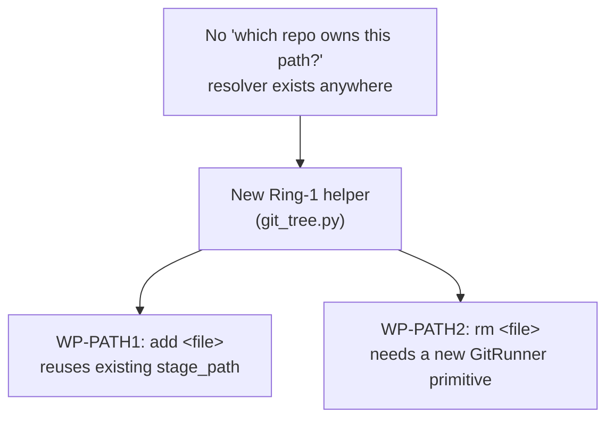

# ExpertAddRemovePaths — single-file `add`/`rm` for the expert CLI

*Created: 2026-08-31*

## Abstract — read this first

**The one-line version.** `add` only ever stages *everything* (`git add
--all`, tree-wide, leaf-first) — there is no way to stage or remove one
specific file. This ticket adds a path argument to `add` and a new `rm`
command, both requiring a genuinely new piece of infrastructure this
codebase doesn't have yet: resolving a filesystem path to the one repo in
the tree that owns it.

**What this document is.** A planning-only ticket, two work packages. No
code touched.

**Why it exists.** Requested directly: an expert `rm <file-name>` command
does not exist at all, and expert `add` exists only as tree-wide
`add .`/`--all` — a targeted `add <file-name>` was asked for alongside it.

**What you will find.** Verified evidence that no repo-owning-a-path
resolver exists anywhere in this codebase today (§0) — this is the real
scope of the ticket, not just two thin CLI wrappers. Decisions the design
needs (§1), work packages (§2), acceptance criteria (§3).

**Who it is for.** Whoever picks this up once §1 is answered.

**What you need to do with it.** Nothing yet — no commit, no push.

---

## 0. Verification (2026-08-31)

- `cli/expert.py:209-213` (`_register_add`) — the `add` subparser takes no
  path argument at all: `--gts`, `--search-dir`, `--dry-run` only.
  `_execute_add` (`:662-679`) always does `client.add()` → `add_tree()`
  (`operations.py:270-284`) → `git_runner.stage_all(repo.absolute_path)`
  for **every** repo, leaf-first. There is no code path for staging one
  file.
- `git_runner.py:254-256` (`stage_path`) — **already exists**:
  `git add -- <relative_path>` for a single path in a single repo. Only
  caller today is `import_submodules()`'s internal `.gitmodules`
  restaging (`orchestre.py:1132`-ish) — never exposed through the public
  API or CLI for general use.
- `git_runner.py:326-332` (`rm_cached`) — the only existing "remove"
  primitive, and it's `git rm --cached` (index-only, keeps the working
  tree) — built specifically for submodule-to-plain-clone conversion. It
  is **not** a general "delete this tracked file" operation (plain
  `git rm <path>`, which also removes the file from disk); no such
  primitive exists in `GitRunner` today.
- **No path-to-repo resolver exists anywhere.** Grepped every operation
  in `operations.py`'s own module docstring (`propagate_global_branch`,
  `checkout_tree`, `branch_tree`, `add_tree`, `commit_tree`, `push_tree`,
  `tag_tree`, `freeze_release_tree`) — every single one operates
  uniformly across the *whole* tree (leaf-first or parent-first), never
  targeting one specific repo by path. `registry.py`/`git_tree.py` have
  no "given an absolute or relative path, which `WorkingRepo` in this
  tree contains it" utility either. This is genuinely new ground, not a
  gap in an existing mechanism.

## 1. Decisions needed before work starts

### 1.1 How is `<file-name>` interpreted?

**Recommendation:** relative to the current working directory (most
git-like — a user standing inside a child repo's subdirectory expects
`cgitsync add somefile.txt` to resolve the same way `git add
somefile.txt` would). An absolute path should also be accepted. Reject
(clear `GitSyncError`) a path that resolves outside every repo in the
tree, rather than silently no-op'ing.

### 1.2 One file or several, across how many repos?

**Recommendation:** accept multiple paths in one invocation (`nargs="+"`
positional), each resolved to its own owning repo independently — a
single `cgitsync add a.txt sub/b.txt` touching two different child repos
in one call is a reasonable, common case, and resolving each path
separately is barely more work than resolving one.

### 1.3 `rm`'s scope: plain file only, or also directories / `--cached` / `-f`?

**Recommendation:** start minimal — a plain tracked file only (`git rm --
<path>`), erroring clearly if the target is a directory (message
suggesting the not-yet-built `-r` rather than failing silently) or
doesn't exist. Do not build `--cached`/`-f` variants in this ticket;
`rm_cached` already exists separately for the submodule-conversion case
and should stay conceptually distinct from this new general `rm`.

### 1.4 Where does the path-resolution helper live?

**Recommendation:** `git_tree.py` (Ring 1 — pure path arithmetic over an
already-populated `WorkingGitTree`, no I/O beyond what's already there),
next to `iter_tree`/`iter_tree_leaf_first`. Shape: given the tree and a
resolved absolute path, return the owning `WorkingRepo` plus the path
relative to that repo's own root — reused identically by both `add` and
`rm`, and by any future single-target command.

## 2. Work packages

| WP | Depends on | Touches | Deliverable |
|---|---|---|---|
| **WP-PATH0** | §1.4 | `git_tree.py` | The shared path-to-repo resolver: `resolve_repo_for_path(tree, path) -> tuple[WorkingRepo, str]` (naming TBD at implementation time), raising a clear error for a path outside the tree. Unit-tested on its own before either command uses it. |
| **WP-PATH1** | `WP-PATH0`, §1.1, §1.2 | `operations.py` (extend or wrap `add_tree`), `orchestre.py` (`ComplexGitSyncClient.add`), `cli/expert.py` (`_register_add`, `_handle_add`, `_execute_add`) | `add` gains an optional `paths` positional. With no paths: today's exact behaviour (`add --all`, unchanged, no regression). With paths given: resolve each via `WP-PATH0`, call `git_runner.stage_path` per (repo, relative-path) pair instead of staging everything. |
| **WP-PATH2** | `WP-PATH0`, §1.3 | `git_runner.py` (new `remove` primitive — plain `git rm -- <path>`), `operations.py` (new `remove_paths`, or equivalent), `orchestre.py` (new `ComplexGitSyncClient.remove`), `cli/expert.py` (new `rm` subcommand — registration, handler, executor, `COMMANDS` dict entry, README table row, `docs/Text/user_guide.tex` + `docs/Text/api_python.tex` per `CLAUDE.md`'s own "document any new CLI command" rule) | A new `rm <file-name> [<file-name> ...]` expert command, requiring a `READY` tree like every other mutation, resolving each path the same way `add` does. |

## 3. Acceptance criteria

- `cgitsync add` with no arguments behaves exactly as today (regression
  guard).
- `cgitsync add <file>` stages only that file, in only the repo that
  owns it — verified by a test asserting sibling repos' staged state is
  untouched.
- `cgitsync rm <file>` removes the file from disk and stages the removal,
  in only the owning repo.
- A path outside every repo in the tree produces a clear error for both
  commands, not a silent no-op or an unrelated stack trace.
- `rm` is documented in the README command table, `docs/Text/user_guide.tex`,
  and `docs/Text/api_python.tex` (the client-method mirror), per
  `CLAUDE.md`'s "CLI mirrors the Python API" rule and its own
  before-committing checklist.
- `pixi run lint && pixi run test` pass.
- No commit, no push — executed only after explicit go-ahead.
