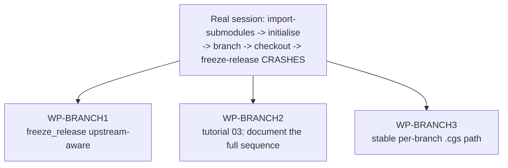

# FirstBranchTestWorkflow — freeze-release on a fresh branch, the tutorial gap, a stable per-branch .cgs

*Created: 2026-08-31*

## Abstract — read this first

**The one-line version.** Testing ComplexGitSync on a brand-new branch
right after `import-submodules` surfaced three related gaps: `freeze-release`
hard-fails on a branch that was never pushed, the tutorial that walks
through `import-submodules` never says what to do with its output, and
there is no stable, discoverable `.cgs` location per branch — only opaque
content-hash directories.

**What this document is.** A planning-only ticket covering three
work packages, all triggered by the same real session (§0 below cites the
actual commands and errors). No code touched.

**Why it exists.** A user ran `discover` → `import-submodules --apply
--output cwv.cgs` → `initialise` → `branch test-CGS` → `checkout test-CGS`
→ `freeze-release`, and the last step crashed with `fatal: couldn't find
remote ref test-CGS`. The immediate cause (a missing `cgitsync push`
before `freeze-release`) was diagnosed inline; this ticket is the
follow-up to fix the root cause and close the two related gaps the user
asked for directly.

**What you will find.** Verified evidence for all three problems (§0),
the decisions each fix needs (§1), a work-package catalog (§2), and
acceptance criteria (§3).

**Who it is for.** Whoever picks this up once §1 is answered.

**What you need to do with it.** Nothing yet — no commit, no push, per
instruction.

---

## 0. Verification (2026-08-31)

### 0.1 `freeze-release`'s hard-coded `pull` before `push`

- `orchestre.py:2484` (`freeze_release`) — workflow is exactly
  `add -> commit -> pull/pull_force -> push -> freeze`, unconditionally.
  `README.md:208` documents the same order.
- `git_runner.py:292-303` (`pull`) — always `git pull --ff-only <remote>
  [<ref_name>]`. For a branch with no remote counterpart, there is nothing
  to pull, and git fails with `couldn't find remote ref <name>` — exactly
  the observed error.
- `operations.py:360-362` (`push_tree`) — **already** handles this
  correctly for `push` alone: `set_upstream = not
  git_runner.has_upstream(repo.absolute_path)` — auto-detects a missing
  upstream and adds `-u`. `git_runner.py:415-424` (`has_upstream`) is the
  primitive this already calls.
- `launch_release` (`orchestre.py:2522-2537`) does not call `pull`/`push`
  at all (checks out a tag) — **not affected**, no work needed there.
- Confirmed fix location: `freeze_release` (and `freeze_release_force`)
  never consult `has_upstream` before their `pull` step, even though the
  exact primitive they'd need already exists and is already used one
  method away, for `push`.

### 0.2 The tutorial gap

`docs/tutorials/03_configuration_discovery_modes.md` documents `discover`
and `import-submodules` well, including the exact `nested_config =
"disabled"` lesson (its "Key lessons" section) — but it stops at showing
the generated `.cgs`/snippet output. It never walks through what a reader
actually does next if they want to try that output as a real, throwaway
test tree: `initialise` it, `branch` onto something disposable, `checkout`
it, and (per §0.1) `push` before any `freeze-release`. A reader following
the tutorial to the letter today hits exactly the crash from this
session's real transcript, with nothing in the doc pointing at why.

### 0.3 No stable, discoverable per-branch `.cgs`

- `orchestre.py:2858-2889` (`write_gts_snapshot`) — already copies the
  source `.cgs` file into that run's own `.cgitsync/state(<hash>)_<n>/`
  directory (`shutil.copy2(self.source_path, memory_state.temporary_path
  / self.source_path.name)`), alongside the `.gts`/`.lgr`. Confirmed on
  disk from this session's real test tree: a `cwv.cgs` copy sits inside
  *nine different* `state(<hash>)_0/` directories (one per lifecycle
  command run — `initialise`, `branch`, `checkout` x2, etc.), each with
  an opaque content-hash name.
- `snapshot_resolver.py` has **zero** branch-awareness anywhere —
  `discover_gts_path()` picks either the `.lgr` register's recorded
  `current_snapshot_path`, or (fallback) the single most-recently-modified
  `.gts` across *every* `state(<hash>)_<n>/` directory under
  `.cgitsync/`, regardless of which branch produced it.
- So: a `.cgs` snapshot per run already exists, it's just unnamed and
  unstable — there is no "the `.cgs` for branch X" you can point at
  without knowing which opaque hash directory happens to be newest.

## 1. Decisions needed before work starts

### 1.1 `freeze_release`'s new pull behaviour — proposed, not decided

**Recommendation:** before calling `self.pull(...)`/`self.pull_force(...)`,
check `git_runner.has_upstream()` on the root repo (mirroring
`push_tree`'s existing check exactly). If there's no upstream yet, skip
the pull step entirely (there is nothing to pull — this is the first
publish of this branch) and log that it was skipped, rather than failing.
If there *is* an upstream, behave exactly as today. Open question:
should each child repo be checked independently, or is checking the root
sufficient (repos in one workspace are overwhelmingly branched together)?

### 1.2 Where exactly the stable per-branch `.cgs` lives, and how it stays current

**Recommendation:** `.cgitsync/.cgs/<project_name>-<branch>.cgs` (exactly
as suggested), written or overwritten every time `write_gts_snapshot`
runs for that root entry's current branch — a copy, not a symlink (this
project's own convention already copies rather than links, per 0.3, and
a copy survives the source `.cgs` moving/deleting). Sits next to, not
inside, the `state(<hash>)_<n>/` directories, so it's never mistaken for
one of them. Needs a decision on **name collision**: if `branch` contains
characters unsafe for a filename (e.g. `feature/x`), sanitize how?
(`git_repo.py`'s existing identifier-sanitizing patterns, if any, should
be reused rather than inventing a new rule.)

### 1.3 Should `snapshot_resolver.py` become branch-aware too? (related, larger, not required by 0.1-0.3)

Not required to fix 0.1 or add 0.3's stable path, but worth deciding
explicitly rather than by omission: once a stable per-branch `.cgs`
exists (1.2), should `discover_gts_path()`/`resolve_workspace_source()`
*prefer* the snapshot matching the current checked-out branch over
"most recently modified, any branch"? Recommend treating this as a
follow-up ticket rather than folding it in here — it changes default CLI
behaviour for every command, not just adds a new discoverable file.

## 2. Work packages

| WP | Depends on | Touches | Deliverable |
|---|---|---|---|
| **WP-BRANCH1** | §1.1 | `orchestre.py` (`freeze_release`), `tests/unit/test_registry_client.py` or wherever `freeze_release` is unit-tested | `has_upstream`-aware pull, skipping (not failing) when the current branch has no remote counterpart yet. New test: `freeze-release` on a freshly branched, never-pushed root succeeds instead of raising. |
| **WP-BRANCH2** | `WP-BRANCH1` (so the doc reflects the fixed behaviour, not the workaround) | `docs/tutorials/03_configuration_discovery_modes.md` | Add a section after the existing `import-submodules` walkthrough: take its output, `initialise` it as a real tree, `branch`+`checkout` onto a disposable test branch, `push` to publish it, then `freeze-release` — the exact sequence this ticket's §0 scenario needed. Rebuild `docs/*.pdf` if any `.tex` sibling doc needs the same addition (check `docs/Text/user_guide.tex`'s discovery section for the same gap while there). |
| **WP-BRANCH3** | §1.2 | `orchestre.py` (`write_gts_snapshot`) | Write/refresh `.cgitsync/.cgs/<project_name>-<branch>.cgs` as a copy of the current source `.cgs`, each time a snapshot is recorded, using the root entry's current branch name (`current_ref_name`). No behaviour change to existing `state(<hash>)_<n>/` snapshotting — purely additive. |

## 3. Acceptance criteria

- `freeze-release` succeeds on a branch created and checked out this same
  session, never previously pushed — reproducing this ticket's exact
  failing scenario, now passing.
- `freeze-release` on an existing, already-tracked branch behaves exactly
  as before (no regression to the normal case).
- `docs/tutorials/03_configuration_discovery_modes.md` (read start to
  finish) no longer leaves a reader who follows it literally at the exact
  crash this ticket documents.
- After any lifecycle command runs on a checked-out branch,
  `.cgitsync/.cgs/<project_name>-<branch>.cgs` exists and matches the
  `.cgs` actually in use for that branch.
- `pixi run lint && pixi run test` pass.
- No commit, no push — executed only after explicit go-ahead.
