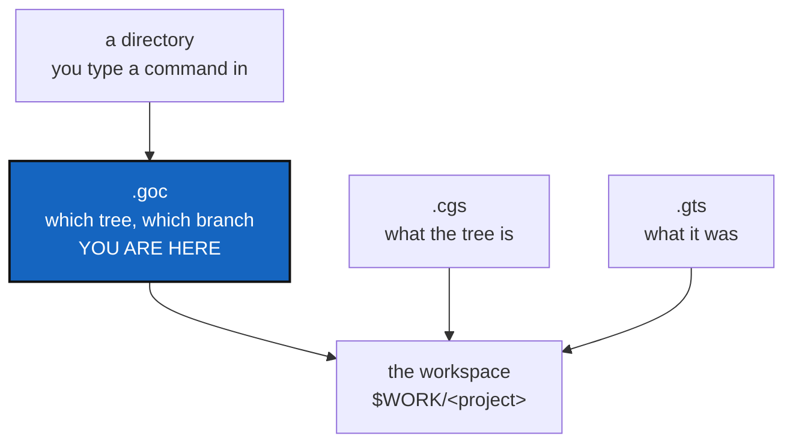

# GitOrchestratorCommand — a `.goc` file that says which tree this directory drives

*Created: 2026-09-05*

## Abstract — read this first

**The one-line version.** Bring back `.goc`, but give it one job the other
files cannot do: say which workspace the current directory drives, and on
which branch, so that `$CGSHOME` stops being an invisible setting.

**What this document is.** A proposal. Nothing has been built. It answers
the question "does this make sense?" with a qualified yes, and says which
parts of the idea belong somewhere else.

**Why it exists.** Three jobs were asked of `.goc`. Two of them belong in
`.cgs` and should ship with the `pinned` work already planned. The third
has no home today and is the reason to add a file: nothing on disk records
which tree a directory belongs to. That is answered by the `$CGSHOME`
environment variable, or by a silent guess two directories up. Running
`cgitsync status` from a second checkout drove the wrong tree and crashed,
and no file anywhere could have told you why.

**What you will find.** §0 what `.goc` was and why it was deleted. §1 the
three jobs, and where each one belongs. §2 the gap the file fills. §3 what
the file looks like. §4 decisions. §5 how this fits with the AgenticMounts
work in flight. §6 risks. §7 acceptance.

**Who it is for.** Whoever picks this up after AgenticMounts step 3, and
the repository owner, who has to answer §4.

**What you need to do with it.** Answer §4. Do not start before step 3 is
merged — §5 says why.



---

## 0. What `.goc` was, and why it was deleted

`.goc` existed. It had a document class (`GocDocument`), a fixed command
vocabulary (`_VALID_GOC_COMMANDS`), a client method (`orchestrate()`),
around 44 passing tests, and full documentation.

It was deleted on 2026-08-27, under D4 of
`AgentSpec/archive/20260826_Deletion_DevPlanTicket.md`. The reason is
recorded there, and it is narrow:

> `.goc` had ~44 passing tests and full docs coverage, just no CLI command.

So the objection was never that the idea was wrong. It was that no user
could reach it. `CLAUDE.md` states the same rule for the whole project: a
client method with no CLI surface is unreachable for users.

Two things follow. Anything brought back must have a CLI command from the
first commit. And it must not be what the old one was — a list of commands
to replay. That flavour is what made it a second, parallel way to drive the
tool, used by nobody. The file proposed here holds **configuration**, not
commands, despite the name it keeps for continuity.

## 1. The three jobs, and where each belongs

The request bundles three things. They do not all need a new file.

| # | Job | Belongs in | Why |
|---|---|---|---|
| 1 | Set a repository's `default_branch` to the project's name, so the same three lines work for every project | `.cgs` | It describes the tree, and the tree's description is shared and committed. A token such as `default_branch = "@project"` resolved at normalization |
| 2 | Set branch-management policy once for the project rather than per entry | `.cgs` | Same reason. A `[project]`-level default that each entry may override, alongside the `pinned` field from AgenticMounts step 3 |
| 3 | Drive ComplexGitSync from the current directory, at each parent repository level | **`.goc`** | It differs per checkout and per machine, so it cannot live in `.cgs` — see §2 |

Jobs 1 and 2 should ship with the `pinned` work in AgenticMounts step 3,
not here. Both are `.cgs` grammar. Shipping all the grammar in one pass
means one round of validation, authoring round-trip tests, documentation
and rebuilt PDFs instead of two.

Job 3 is what this ticket is for.

## 2. The gap `.goc` fills

`.cgs` cannot hold this, and the reason is concrete. `install.cgs` and
`examples/complexgitsync.cgs` are kept byte-identical by
`tests/unit/test_install_cgs.py`. A file under that rule cannot carry
anything that differs between two checkouts on two machines.

Today the question "which workspace does this directory drive?" is answered
by `paths.resolve_cgshome`, in this order:

1. the `--output-path` flag, if given;
2. the `$CGSHOME` environment variable;
3. otherwise `(current directory/../..)/<project name>` — a path guessed
   two levels up.

Options 2 and 3 are invisible. Nothing in the directory records them. That
is not a theory: `cgitsync status`, run from `~/Programmes/ComplexGitSync`,
walked a tree in `~/.cgs/CGS20260905095916/cgitsync` and stopped on a
folder that had been deleted there. The checkout gave no sign of which tree
it was bound to, because no file said so.

A small file in the directory fixes that. It is readable, it is
discoverable by walking up from the current directory, and it can differ
per checkout without touching anything shared.

The "each parent repository level" part matters for nested trees. A parent
repository can carry its own `.goc` saying how its own subtree is driven,
which is what makes the idea useful for the 19-repository build tree in
`tutorials/02_onboarding_a_real_build_tree.md` and for CaWaQS-Viz.

## 3. What the file looks like

A proposal, to be settled in §4:

```toml
# .goc — how this directory drives a ComplexGitSync tree.
# Local to this checkout. Never committed to a shared repository.

tree = "/home/flipoyo/.cgs/CGS20260905095916/ComplexGitSync"
spec = "install.cgs"
project_branch = "main"
```

Three fields, three meanings. `tree` is the workspace this directory
drives. `spec` is the `.cgs` that describes it. `project_branch` is the
branch tree-wide commands work on.

**The division of labour, in one line each.** `.cgs` says what the tree
is: its repositories, their paths, their branches, and which of them are
pinned. `.gts` says what the tree was at a moment in time. `.goc` says
which tree this directory drives, and on which branch. `.goc` never
changes the topology.

**Resolution order**, replacing the current three-step guess:

1. an explicit flag on the command;
2. the nearest `.goc`, found by walking up from the current directory;
3. `$CGSHOME`;
4. the two-levels-up guess — which should say out loud that it is guessing.

## 4. Decisions — your call

### D1. Does `.goc` set branch *policy*, or only the working branch?

Recommended: only the working branch. Whether a repository is pinned is a
property of the tree, so it stays in `.cgs` where every checkout sees the
same answer. `.goc` picks which branch tree-wide commands drive in this
checkout. If `.goc` could also pin, two files could disagree, and the rule
for who wins becomes something a user has to remember.

### D2. Is `.goc` committed, or local to the checkout?

| Option | Result |
|---|---|
| **A (recommended)** | Local and gitignored, like `.claude/settings.local.json`. It holds an absolute path that is true on one machine only. A command writes it, so nobody hand-edits a path |
| B | Committed, with paths relative to the repository root | Shareable, and useful for the tutorial 2 build tree where every developer drives the same layout. But a relative path cannot point at a workspace outside the repository, which is the normal case |
| C | Both: a committed template plus a local override | Most flexible, twice the rules to explain |

A is recommended, with one reservation worth your view: if the point is to
help onboard CaWaQS-Viz and the tutorial 2 tree, a committed file may be
what actually helps a newcomer. That argues for B or C.

### D3. What commands read and write it?

`.goc` died once for lacking a command. It needs at least two:

- one that **writes** it, so no user types an absolute path by hand;
- one that **reports** what resolved and why — which tree this directory
  drives, from which of the four sources in §3. This is the command that
  would have answered the original confusion in one line.

Names to settle. `cgitsync where` reads well for the second.

### D4. Does the name stay `.goc`?

It carries history, and the abbreviation expands to GitOrchestratorCommand,
which describes what it no longer does: it holds configuration, not
commands. Keeping the name is fine if the documentation says plainly what
it now holds. Changing it costs nothing today, since nothing depends on it.

## 5. How this fits with the work in flight

Order matters, and the reason is simple: you cannot automate a protocol you
have not settled, and `.goc` names a branch policy that must exist first.

| Stage | What happens | Ticket |
|---|---|---|
| 1 | Merge AgenticMounts step 2, confirm the build is green, archive the first two tickets | `agenticMountStep2` |
| 2 | Add `pinned` to `.cgs`, **plus job 1 and job 2 from §1**, and prove and document the three-hop protocol | `agenticMountStep3` |
| 3 | Add `.goc` as described here; update tutorial 2 and the CaWaQS-Viz onboarding to use it | this ticket |

Two things move into step 3 because of this ticket: the `@project` token
for `default_branch`, and the project-level branch-policy default. Nothing
moves out of it.

One implementation warning for step 3, from reading `cgs_format.py`: the
`@project` token has to survive being written back out. Normalization fills
`default_branch` in on every entry, and `to_authoring_dict` decides what
gets written to the file. If the token is expanded to a literal name during
normalization and the document is then saved, the file silently gains a
hard-coded branch. The authoring round-trip test has to cover it.

## 6. Risks

| Risk | Handling |
|---|---|
| A fourth file format is a fourth thing to learn, and the last one died unused | Keep it to the three fields in §3, ship the two commands in D3 in the same change, and document the division of labour in one line per file |
| `.goc` and `.cgs` both appear to set a branch, and users guess wrong | D1 keeps policy in `.cgs` and the working branch in `.goc`. The resolution order in §3 is stated once, in the user guide, and the D3 report command prints which source won |
| It becomes a command runner again, and a second way to drive the tool | It holds configuration only. If a "run these steps" feature is ever wanted, that is a separate decision with its own ticket |
| An absolute path in `.goc` goes stale when a workspace is moved | The report command from D3 says the path does not exist, rather than failing somewhere deeper |

## 7. Acceptance

1. A `.goc` in a directory decides which tree a `cgitsync` command drives,
   ahead of `$CGSHOME` and ahead of the two-levels-up guess.
2. One command writes the file; one command reports which tree resolved and
   from which source. Both are in the README command table and the user
   guide, as `CLAUDE.md` requires of every command.
3. Running a tree command from a checkout with no `.goc` and no `$CGSHOME`
   either does nothing or says plainly what it would have driven. It never
   silently drives a tree two directories up.
4. `.cgs` still decides topology and pinning. No `.goc` changes what the
   tree contains.
5. Tutorial 2 uses `.goc` to drive its build tree, and the CaWaQS-Viz
   recipe uses it.
6. `pixi run lint` and `pixi run test` pass, and the documentation and PDFs
   are rebuilt.
