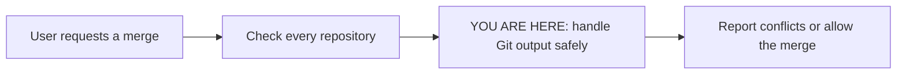

# MergeOutputDecoding — handle non-UTF-8 output during merge checks
*Created: 2026-09-09*

## Abstract — read this first

**What this document is.** An active bug ticket for a crash while checking
whether a branch can be merged.

**Why it exists.** `pixi run cgitsync merge apoub` failed with a Python
decoding exception before any repository was merged.

**What you will find.** The reported failure, the confirmed code path,
work packages, and acceptance criteria.

**Who it is for.** The developer implementing the fix and its reviewer.
Read [CLAUDE.md](../CLAUDE.md) and its referenced specs first.

**What you need to do with it.** Implement and validate the work below.
This ticket records planned work; the fix has not been implemented.



## 1. Evidence and diagnosis

The user reported an aligned tree rooted at `a942471` on `main`, then ran:

```bash
pixi run cgitsync merge apoub
```

The command logged `CGS-MERGE`, `command_end`, `status=error`, and
`tree_lifecycle_state=READY`, with this exception:

```text
'utf-8' codec can't decode byte 0xdb in position 277: invalid continuation byte
```

The traceback reaches `GitRunner.can_merge_cleanly()`'s legacy
`git merge-tree <base> <head> <source>` call, then `GitRunner._query()`.
That wrapper uses `subprocess.run(capture_output=True, text=True)` without
an explicit decoding policy. Python attempts strict text decoding before
the caller can inspect the return code or conflict markers.

The legacy command can include file content in its output. Such content
need not be UTF-8. The traceback establishes a decoding failure, but does
not identify the repository, file, original encoding, or whether the
invalid bytes came from stdout or stderr. It also does not establish why
the modern `merge-tree --write-tree --name-only` check fell back: the code
falls back for errors beyond unsupported Git versions.

`operations.merge_tree()` checks the whole selected scope before entering
its merge loop. This failure therefore occurred before this invocation
merged any repository. `ALIGNED` describes tree alignment; it does not
guarantee a successful conflict check. The evidence does not implicate
`CGSHOME`.

## 2. Work packages

| Work package | Files | Deliverable |
|---|---|---|
| WP1: reproduce | `tests/unit/`, `tests/integration/` | Reproduce invalid bytes in legacy merge output using deterministic local fixtures. Force the fallback so coverage does not depend on the installed Git version. Record modern-check return codes and stderr when investigating the original trigger. |
| WP2: fix the boundary | `src/ComplexGitSync/git_runner.py` | Handle arbitrary output bytes without a decoding crash. Prefer byte handling for this check, or justify an explicit decoding policy after reviewing `_query()` callers. Preserve exit-code handling and conflict detection; do not turn an undecodable response into an assumed clean merge. |
| WP3: verify and land | Existing merge tests and this ticket | Validate the shared client/command behavior and the guarantee that all checks precede all merges. Run the required checks, then archive this ticket in the implementing commit under the lifecycle rules. |

Keep subprocess handling in `GitRunner`. The command interface and client
must continue to share the same implementation. Review fallback behavior,
but keep unrelated merge algorithm changes outside this fix unless the
reproducer shows they are necessary.

## 3. Acceptance criteria

- Legacy output containing invalid UTF-8 bytes, including `0xdb`, does not
  raise `UnicodeDecodeError`; cover both stdout and stderr.
- Clean and conflicting legacy fixtures still produce the correct result.
  Include non-UTF-8 file content with conflict markers to guard against
  accidentally approving a conflicting merge.
- Modern success/conflict behavior, unsupported-modern-command fallback,
  unknown references, and missing merge bases retain their documented
  behavior. Unexpected command failures never count as a clean merge.
- Local integration tests confirm that conflict checks leave `HEAD`, index,
  and worktree unchanged, and that a blocked repository prevents all
  planned merges across the selected tree.
- The client and command report the ordinary outcome or a descriptive
  domain error instead of the reported decoding traceback.
- `pixi run lint` and `pixi run test` pass. Apply the version and
  documentation checklist in `CLAUDE.md` when finishing the implementation.
- In the implementing commit, move this file to
  `AgentSpec/archive/<YYYYMMDD>_MergeOutputDecoding_DevPlanTicket.md`, using
  the implementation date, retaining the creation date, and updating links
  as required by [TICKETLIFECYCLE.md](../.agentSpec/TICKETLIFECYCLE.md).

## 4. Scope and handoff

This ticket does not authorize retrying the user's merge on their live
workspace as a test. Use temporary repositories for reproduction. No
runtime fix, release bump, or archive transition is part of landing this
planning document. The affected real file and reason for fallback remain
open diagnostic questions for implementation.
