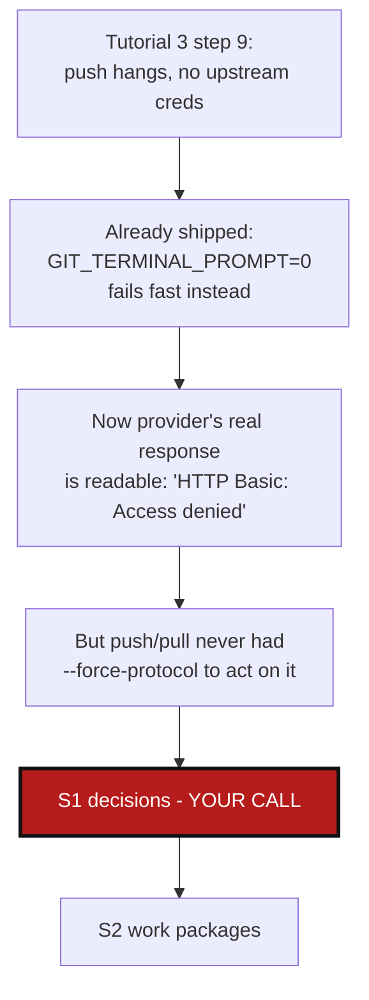

# ProtocolSwitchOnPush — let push/pull switch SSH↔HTTPS the way clone already can

*Created: 2026-09-03*

## Abstract — read this first

**The one-line version.** `--force-protocol` already exists and works —
but only for `initialise`/`bootstrap`/`clean-init`. `push`, `pull`,
`pull-force`, and `freeze-release` never look at a repo's protocol at
all: they push/pull to whatever URL is already configured on the local
`origin` remote, however it got there. Tutorial 3's step 9 hit exactly
this: the root was cloned over plain HTTPS by hand (`initialise` never
touches an adopted root's remote), push had no cached HTTPS credential,
and there was no CLI-level way to switch it to SSH — only `git remote
set-url`, run by hand. This ticket plans adding that switch to `push`/
`pull`/`freeze-release` themselves, reusing the URL-construction
machinery `--force-protocol` already has.

**What this document is.** A planning-only ticket: no code has been
touched. Triggered by real, first-hand evidence from this session — the
`git_runner.py` fix that makes credential failures fail fast instead of
hanging (already shipped, separately) is also what makes this ticket
possible: it's what let a real provider response
(`HTTP Basic: Access denied...`, from GitLab) actually be read instead of
silently hanging forever.

**What you will find.** The full mechanism audit (§0): what
`--force-protocol` actually does today and exactly why it stops at the
clone boundary. Decisions this plan can't make for you (§1): suggest vs.
auto-switch, whether the fix persists (`git remote set-url`) or is
one-shot, and how far to trust the "read what the provider sends back"
detection across providers. A work-package catalog (§2) and acceptance
criteria (§3).

**Who it is for.** Whoever picks this up next, once §1's decisions are
made.

**What you need to do with it.** Read §1, answer its four questions, then
the work packages become actionable.



---

## 0. Audit (research pass, 2026-09-03 — no files edited)

### 0.1 What `--force-protocol` already does

- `AccessProtocol` (`git_repo.py:40-44`) is a two-value enum, `SSH`/`HTTPS`.
- `RepoAddress.to_url(protocol)` (`git_repo.py:285-292`) builds the actual
  URL string for either protocol from a repo's identity fields
  (`gitprovider`, `project_owner_name`/`group_name`, `repo_name`,
  optional `gitprovider_url` for `custom`) — delegates to `to_ssh()`/
  `to_https()`.
- `ComplexGitSyncClient._build_remote_url(entry)` (`orchestre.py:3274-3284`)
  constructs a `RepoAddress` from a `WorkingRepo` entry and calls
  `.to_url(self._forced_access_protocol or entry.access_protocol)` — the
  forced value, set from `--force-protocol`, always wins over the
  per-entry `.cgs` default when present.
- `_forced_access_protocol` is set in exactly four places, all clone-family:
  `initialise_cgs` (`orchestre.py:1618-1619`), `clean_initialise_cgs`
  (via the same path), `clone_cgs` (`orchestre.py:1996-1997`), and
  `bootstrap` (delegates to `clone_cgs`). CLI-wise, `--force-protocol` is
  registered in exactly three places, all in `cli/minimalist.py`:
  `initialise`, `bootstrap`, `clean-init` (lines 96, 124, 157).
- `_build_remote_url` itself is called from exactly two sites:
  `_select_clone_ref` (branch/tag resolution before a clone) and
  `_clone_registry_entry` (the actual `git clone` invocation). Both are
  clone-only.

### 0.2 Why `push`/`pull` never see it

- `push_tree` (`operations.py:390-426`) calls `git_runner.push(repo.
  absolute_path, remote=remote, ref_name=ref_name, set_upstream=...)`
  where `remote = repo.remote_name or "origin"` — a bare **name**, never
  a URL. `git_runner.push()` (`git_runner.py`) runs `git push [-u]
  <remote> [<ref>]`, which resolves `<remote>` through git's own local
  config (`git remote get-url <remote>`) — `_build_remote_url` is never
  called anywhere on this path. Same shape for `pull`/`pull_force`.
- Consequence: the URL a repo actually pushes/pulls to is whatever was
  set on its `origin` remote **once**, however that happened — a
  `cgitsync clone`, in which case it does reflect `access_protocol`/
  `--force-protocol` at that moment — or, critically, a plain `git
  clone` the user ran by hand before ever involving `cgitsync`, in which
  case it reflects nothing cgitsync knows about at all.
- Tutorial 3 is exactly the second case: `initialise` adopts an existing
  root via `_attach_existing_root` (`orchestre.py:3173-3202`), which
  reads the branch and commit SHA but **never touches the remote** — by
  design, since the whole point of adopting in place is not to reclone.
  So even if `--force-protocol` existed on `push`, there is no clone
  event downstream of it to apply the protocol at; the adopted root's
  `origin` stays exactly as the user's manual `git clone
  https://...` step 1 left it, forever, until something explicitly
  rewrites it.

### 0.3 The existing SSH-failure hint, and its narrow scope

- `_SSH_AUTH_FAILURE_MARKERS`/`_looks_like_ssh_auth_failure`
  (`orchestre.py:904-918`) is a flat substring heuristic on git's stderr:
  `"Permission denied (publickey)"`, `"Could not read from remote
  repository"`, `"Host key verification failed"`. Explicitly documented
  as "a missed match just degrades to the plain `GitSyncError` from
  before this hint existed" — a heuristic, not a soundness proof.
- Wired into exactly one place: `_clone_registry_entry`
  (`orchestre.py:3204-3210`), and only fires when
  `effective_protocol == AccessProtocol.SSH` — i.e. only suggests
  switching **away from** SSH, only during clone, and only ever prints a
  hint (`--force-protocol https to 'initialise'/'bootstrap'/
  'clean-init'`) — it never rewrites anything itself.
- There is no equivalent in the other direction (an HTTPS failure
  suggesting SSH), and nothing outside the clone path at all.

### 0.4 Real evidence from this session

- The `git_runner.py` fix shipped this session (every git subprocess now
  runs with `GIT_TERMINAL_PROMPT=0` and a no-op `GIT_ASKPASS`) is a
  prerequisite for this ticket, not a separate concern: without it, a
  credential-requiring push just hangs forever and there is no error
  message to read at all — which is exactly what triggered the original
  bug report. With it, the real provider response comes back in well
  under a second.
- Verified directly against the real `cawaqsviz` GitLab remote this
  session (no push actually completed — auth was rejected before
  anything was sent):
  ```
  remote: HTTP Basic: Access denied. If a password was provided for Git
  authentication, the password was incorrect or you're required to use a
  token instead of a password. If a token was provided, it was either
  incorrect, expired, or improperly scoped. See
  https://gitlab.com/help/topics/git/troubleshooting_git.html
  ```
  This is GitLab-specific wording, and it is a **different string
  entirely** from every existing SSH marker in §0.3 — a new marker set is
  needed for the HTTPS direction, not a reuse of the SSH one.
- `"could not read Username"` / `"terminal prompts disabled"` (seen
  earlier this session against GitHub) is **our own artifact** of the
  `GIT_TERMINAL_PROMPT=0` fix, not a provider response — it fires
  whenever *any* credential would have been needed, regardless of which
  provider or protocol. It's a strong, protocol-agnostic signal that
  "this needed a credential ambient auth didn't have," but on its own it
  doesn't say *which* protocol to switch to — it has to be paired with
  knowing which protocol was actually in use (HTTPS here, so: try SSH).

## 1. Decisions needed before work starts

### 1.1 Suggest, or auto-switch and retry?

Three shapes, needs a decision:

- **Hint only (matches today's clone-time precedent exactly).** On a
  push/pull failure matching a known marker, print an actionable hint
  naming `--force-protocol <other>` — same wording style as the existing
  clone-time hint. Never rewrites anything itself; the user re-runs the
  command with the flag.
- **Auto-retry.** On the same failure, silently rewrite the remote and
  retry once with the other protocol, no flag needed.
- **Hint + explicit flag (recommended).** Both of the above: the flag
  exists so a user who already knows what's wrong can just pass it, and
  the hint teaches a user who doesn't. No silent auto-retry — consistent
  with this project's established "fail loud, no silent action"
  preference (`AppendCloneMode_DevPlanTicket.md` §1.2 made the same call
  for a different mechanism, for the same reason: a protocol switch some
  users may not want happening on their behalf is exactly the kind of
  thing that should require the user to ask for it, especially since a
  wrong guess — e.g. SSH blocked by a corporate firewall, not a genuine
  auth problem — would silently trade one confusing failure for another).

### 1.2 Does the flag persist the switch, or apply it once?

`git push <url> <ref>` can bypass the configured remote entirely for one
invocation, no rewrite needed — but every subsequent `push`/`pull`/
`freeze-release` would hit the exact same failure again, since nothing
was fixed. `git_runner.configure_remote()` (`git_runner.py`) already
does exactly a "read, then `set-url` only if different" update — reusing
it means `--force-protocol` on `push` (or any of these commands) rewrites
`origin` once, and the fix sticks for every command after that, the same
way `bootstrap`'s clone-time protocol choice sticks for everything
downstream of it. **Recommendation: persist it** — needs explicit
confirmation, since rewriting a remote is a real (if easily reversible)
config change, not a fully inert flag.

### 1.3 How far can "read what the provider sends back" be trusted?

Only GitLab's HTTPS-failure wording is verified firsthand (§0.4).
GitHub's and Codeberg's equivalent HTTPS-failure text, and any
provider-specific SSH-failure text beyond the three generic markers
already in `_SSH_AUTH_FAILURE_MARKERS`, are unverified. Ship the
GitLab-verified marker only and mark GitHub/Codeberg explicitly TBD, or
spend a work package deliberately provoking and recording each
provider's real response first? The existing SSH heuristic's own
docstring already accepts "a missed match just degrades to the plain
error" as fine — recommend the same acceptance here rather than blocking
on exhaustive per-provider verification, but call it out explicitly
rather than silently guessing wording that might not match.

### 1.4 Which commands get `--force-protocol`?

`push`, `pull`, `pull-force`, `freeze-release`, `freeze-release-force` at
minimum — this ticket's own trigger, and the commands `push_tree`/
`pull_tree`-shaped code already covers. `checkout` also does a network
lookup (`remote_branch_exists`/`remote_tag_exists`, i.e. `git
ls-remote`) that could equally hang or fail on a bad protocol — arguably
in scope, but it wasn't what broke. Bundle it in now, or defer it to a
follow-up once the push/pull path is proven?

## 2. Work packages

Ordered by dependency — `WP-PROTO1` is the mechanism; nothing else is
buildable before it lands.

| WP | Depends on | Touches | Deliverable |
|---|---|---|---|
| **WP-PROTO1** | §1.1–§1.2 answered | `orchestre.py` (thread `force_access_protocol` through `push()`/`pull()`/`pull_force()`/`freeze_release()` client methods, mirroring the existing `initialise_cgs`/`clone_cgs` pattern), `operations.py` (`push_tree`/`pull_tree`: when a forced protocol is given, call `git_runner.configure_remote(repo.absolute_path, remote, computed_url)` — reusing `_build_remote_url`'s `RepoAddress` construction — once per repo, before the push/pull itself) | A forced protocol, when passed, rewrites each repo's `origin` before the operation runs; omitted, behavior is bit-for-bit unchanged from today. |
| **WP-PROTO2** | `WP-PROTO1` | `cli/expert.py` (`push`, `pull`, `pull-force`), `cli/minimalist.py` (`freeze-release`, `freeze-release-force`) — `--force-protocol` registration, identical flag shape to the existing three | CLI surface for §1.4's chosen command set. |
| **WP-PROTO3** | §1.1, §1.3 answered | `orchestre.py` (new `_HTTPS_AUTH_FAILURE_MARKERS` alongside the existing SSH set; generalize the clone-time hint block into something `push_tree`/`pull_tree`'s exception handling can also call, firing in both directions) | On a push/pull failure matching a known marker, print an actionable `--force-protocol <other>` hint — never a worse error than today's plain `GitSyncError` on a miss. |
| **WP-PROTO4** | `WP-PROTO1`–`WP-PROTO3` | `tests/unit/test_operations.py` or equivalent (forced-protocol rewrite happens, is skipped when the flag is absent), `tests/unit/test_orchestre*.py` (new marker detection, both directions — via a fake git error, not a live provider), `tests/integration/` (a local bare-remote fixture at a *literally different* URL than the configured one, forced-protocol makes the operation succeed where it would otherwise fail — auth-failure *simulation* isn't feasible against a local `file://` remote, so the marker-detection tests stay unit-level with a captured/fabricated stderr string) | Coverage for both the mechanism (WP-PROTO1) and the detection heuristic (WP-PROTO3), with the local-remote testing limitation stated explicitly rather than worked around. |
| **WP-PROTO5** | `WP-PROTO1`–`WP-PROTO4` | `docs/Text/user_guide.tex` (`push`/`pull`/`pull-force`/`freeze-release` subsections: add `[--force-protocol {ssh,https}]` to each usage line and a sentence on what it does), `README.md` (no command-table change — this is a flag, not a new command), `AgentSpec/AdditionalSpecs.md` (only if `operations.py`'s responsibility line needs updating for the new `configure_remote` call) | Docs stay in sync with the new flag; rebuild `docs/*.pdf` per `CLAUDE.md`'s before-committing rule. |
| **WP-PROTO6 (optional, per §1.4)** | `WP-PROTO1`–`WP-PROTO5` | `cli/expert.py` (`checkout`) | Extend the same flag to `checkout`'s remote lookups, if §1.4 decided to bundle rather than defer. |

## 3. Acceptance criteria

- With `--force-protocol` passed to `push`/`pull`/`freeze-release` on a
  repo whose local `origin` is on the *other* protocol, the remote is
  rewritten exactly once (verified via `git remote get-url`, not just
  "the operation succeeded") and the operation completes — tested
  against a local bare remote reachable at a genuinely different URL,
  not by simulating an auth failure.
- Without the flag, behavior is bit-for-bit unchanged: no remote
  rewrite, today's fail-fast `GitSyncError` on a bad credential, exactly
  as already shipped this session.
- A push/pull failure matching a known marker (§0.4's verified GitLab
  string at minimum) prints a hint naming `--force-protocol <other>`,
  in both directions (SSH→HTTPS already existed for clone; this adds
  HTTPS→SSH, and both directions for push/pull); an unmatched failure
  prints the plain `GitSyncError` as before — never a worse error than
  today.
- `docs/Text/user_guide.tex`'s `push`/`pull`/`pull-force`/`freeze-release`
  subsections document the new flag; `docs/*.pdf` rebuilt.
- `pixi run lint && pixi run test` pass.
- No commit, no push — this ticket is executed only after explicit
  go-ahead, per instruction.
