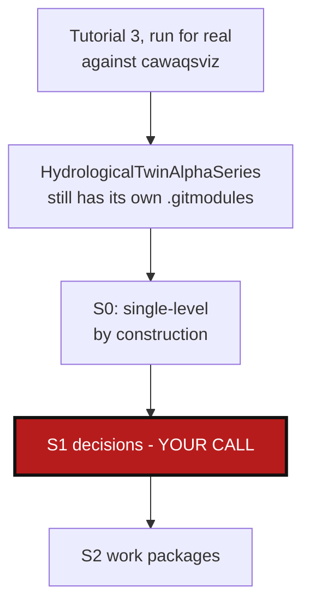

# RecursiveImportSubmodules — `import-submodules` doesn't see nested submodules

*Created: 2026-09-03*

## Abstract — read this first

**The one-line version.** `import-submodules` only ever looks at
`<repo_root>/.gitmodules` — one level. A converted child that itself has
its own git submodule (`HydrologicalTwinAlphaSeries` → `docs/
hydrological_twin`, in `cawaqsviz`) is left completely untouched: its own
`.gitmodules` and gitlink are still there after "converting" the parent.
Reproduced for real against `cawaqsviz` (Tutorial 3), not a synthetic
fixture.

**What this document is.** A planning-only ticket: no code has been
touched. Split out from `Tuto3Blockers_DevPlanTicket.md`, which bundled
this with an unrelated `.gitignore` bug
(`CgitsyncGitignoreLeak_DevPlanTicket.md`) found in the same test run —
the two share no code path, so each now stands alone.

**What you will find.** The audit (§0): exact reproduction, why the
current implementation is single-level by construction rather than by an
overlooked edge case, and what a leaf-first recursive walk actually
requires given `import-submodules` has no tree/registry to walk yet.
Decisions this plan can't make for you (§1), a work-package catalog
(§2), and acceptance criteria (§3).

**Who it is for.** Whoever picks this up next, once §1's decisions are
made.

**What you need to do with it.** Read §1, answer its questions, then the
work packages become actionable.



---

## 0. Audit (research pass, 2026-09-03 — no files edited)

### 0.1 Reproduced

`cawaqsviz` was converted (`import-submodules --apply`) and reached a
committed `READY` tree in this session's Tutorial 3 verification run.
Its child `HydrologicalTwinAlphaSeries`, converted along with everything
else, still has its own real submodule after that conversion:

```
$ cat external/HydrologicalTwinAlphaSeries/.gitmodules
[submodule "docs/hydrological_twin"]
	path = docs/hydrological_twin
	url = https://github.com/flipoyo/hydrological_twin
	branch = main

$ git -C external/HydrologicalTwinAlphaSeries ls-files --stage -- docs/hydrological_twin
160000 7881e5b8727d6728a839086f5b8e7cc26881a2bb 0	docs/hydrological_twin
```

`160000` is a real, live gitlink — nothing about the parent's conversion
touched it, or could have: `import_submodules(repo_root)` never looked at
`HydrologicalTwinAlphaSeries` at all.

### 0.2 Why: single-level by construction

`import_submodules()` (`orchestre.py:1003` onward) reads exactly
`<repo_root>/.gitmodules` (`orchestre.py:1062`) and converts exactly the
stanzas found there. There is no recursion, and — separately from
recursion — no reason there structurally could be one without deliberate
work: the method operates on one `repo_root: Path`, not the
`WorkingGitTree`/registry the rest of the mutation operations
(`push_tree`, `commit_tree`, …) walk with `iter_tree_leaf_first`.
`import-submodules` is invoked directly on a filesystem path
(`repo_root`), commonly before any `.cgs`/registry exists at all — it has
no tree to walk yet, only whatever `.gitmodules` files happen to be
sitting on disk.

### 0.3 What "propagate leaf to parent to root" actually requires

Not a tree walk over a registry (none exists yet, per §0.2) — a
filesystem walk, structurally close to what `discover_repos`'s own
`_walk_git_repositories` (`orchestre.py`) already does, except looking
for `.gitmodules` files instead of `.git` markers, and at each one found,
running today's single-level conversion in that directory. Order matters
for the same reason it does everywhere else mutations run in this
codebase (`CLAUDE.md`'s leaf-first convention, `iter_tree_leaf_first`):
`HydrologicalTwinAlphaSeries`'s own submodule should convert before (or
independently of, since each level's conversion is a strictly local
operation — `git rm --cached` inside that one repo, touching only that
repo's own index/`.gitmodules`/`.gitignore`) the parent's own
conversion runs, so that a still-uninitialized deeper submodule
(`docs/hydrological_twin`, per this ticket's own §0.1 — Tutorial 3
deliberately used `--init` not `--recursive` for exactly this reason) is
discovered and reported rather than silently skipped because nothing
ever looked one level deeper.

### 0.4 A submodule not checked out at all is invisible either way

Per Tutorial 3's own note (`git submodule update --init`, not
`--recursive`, specifically to avoid surfacing `docs/hydrological_twin`):
a submodule whose path is an empty directory (never `git submodule
update --init`'d) has no `.git` to walk into and no way to read its
`.gitmodules` from the parent's checkout alone — recursion can only ever
convert what's actually been checked out, the same ceiling `discover`
already documents for itself (`discover_repos`'s own docstring: "Only
what is checked out at scan time can be found").

## 1. Decisions needed before work starts

### 1.1 Opt-in flag, or always recurse?

**Recommendation: opt-in**, a new `--recursive` flag on `import-submodules`
(mirrors `git submodule update`'s own flag name and meaning exactly, so
no new vocabulary for anyone who already knows git submodules). Today's
single-level behavior is documented, tested, and exactly what Tutorial 3
itself now relies on staying single-level by default — silently changing
what `import-submodules --apply` touches, for every existing caller,
without them asking for it, is the same category of risk this project
already declined for `clone_mode` in `AppendCloneMode_DevPlanTicket.md`
§1.1 ("flipping the default silently changes what existing callers get").

### 1.2 Does the dry-run report show nested submodules before `--apply` needs `--recursive` too?

The dry-run should show what `--recursive --apply` *would* convert (so a
user can review before committing to it), which means the recursive walk
of §0.3 has to run for `--recursive` dry-runs too, not only applies —
straightforward given the walk is already checkout-only I/O either way,
just needs stating so `--recursive` isn't accidentally implemented as
apply-only.

### 1.3 One flat report across every level, or nested by level?

A single combined list (today's report shape, just with more entries,
each carrying which repo it was found in) is simpler and matches
`discover`'s own report shape (flat list with `relative_path` per entry,
regardless of depth) — recommended over inventing a new nested
report shape for this one command.

## 2. Work packages

Ordered by dependency — `WP-RECUR1` is the mechanism; nothing else is
buildable before it lands.

| WP | Depends on | Touches | Deliverable |
|---|---|---|---|
| **WP-RECUR1** | §1.1–§1.3 answered | `orchestre.py` (`import_submodules`: new `recursive: bool = False` parameter; walk logic per §0.3) | `import-submodules --recursive [--apply]` converts every `.gitmodules` found at any depth under `repo_root` that is actually checked out, leaf-first; without the flag, behavior is bit-for-bit unchanged from today. |
| **WP-RECUR2** | `WP-RECUR1` | `cli/expert.py` (`--recursive` registration on `import-submodules`) | CLI surface for §1.1's flag. |
| **WP-RECUR3** | `WP-RECUR1`, `WP-RECUR2` | `tests/unit/test_import_submodules.py`, `tests/integration/test_cgsi_topology.py` | New fixture: a parent repo with a submodule that itself has its own submodule (mirrors `cawaqsviz` → `HydrologicalTwinAlphaSeries` → `hydrological_twin` exactly). Without `--recursive`: only the top level converts, nested gitlink untouched (today's behavior, regression-locked). With `--recursive --apply`: both levels convert, no gitlink remains anywhere in the tree. |
| **WP-RECUR4** | `WP-RECUR1`–`WP-RECUR3` | `docs/Text/user_guide.tex` (`import-submodules` subsection), `tutorials/03_adopting_a_real_project.md` (note that `HydrologicalTwinAlphaSeries`'s own nested submodule, called out in step 2, could be brought in too with `--recursive` — optional aside, not a rewrite of the tutorial's own scope) | Docs stay in sync with the new flag; rebuild `docs/*.pdf`. |

## 3. Acceptance criteria

- `import-submodules /path/to/parent` (no `--recursive`) is bit-for-bit
  unchanged from today: still converts exactly the top-level
  `.gitmodules`, still leaves any nested submodule inside a converted
  child untouched — regression-locked by `WP-RECUR3`.
- `import-submodules --recursive --apply /path/to/parent` converts every
  `.gitmodules`-declared submodule that is actually checked out, at any
  depth, leaf-first — verified against the two-level fixture in
  `WP-RECUR3`, not just the top level.
- `import-submodules --recursive` (dry run) reports every level it would
  convert, not only the top one — verified by the same fixture.
- `docs/Text/user_guide.tex` documents the new flag; `docs/*.pdf`
  rebuilt.
- `pixi run lint && pixi run test` pass.
- No commit, no push — this ticket is executed only after explicit
  go-ahead, per instruction.
