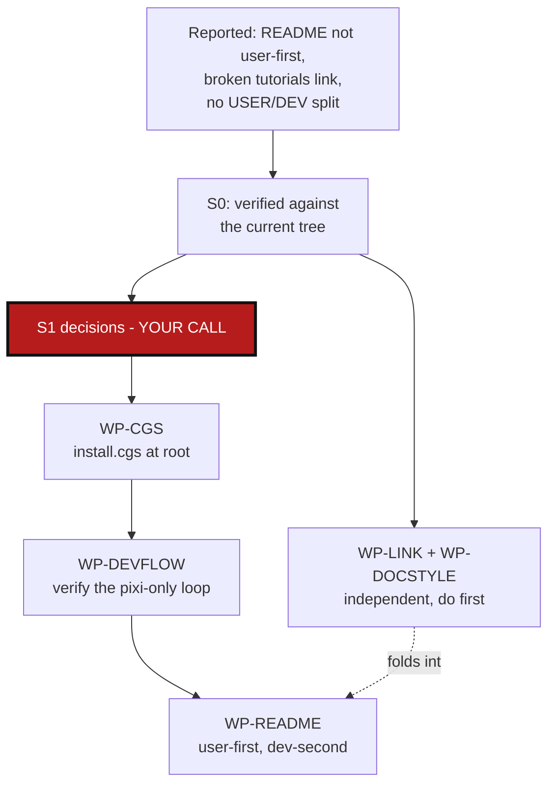

# StandaloneInstallAndReadme — install.cgs, and a README ordered user-first, dev-second

*Created: 2026-09-02*

## Abstract — read this first

**The one-line version.** `README.md` still reads as if every visitor is a
ComplexGitSync developer, and it has a broken link to prove it drifted:
that stopped matching reality once ComplexGitSync became a project managed
by itself (`ComplexGitSync.cgs`, `examples/complexgitsync.cgs`), with
`docs/` and `AgentSpec/DevSpec/` split into their own repos. The fix stays
entirely inside Pixi — no separate installer, no venv, no `pip`: a
root-level `install.cgs` plus the CLI's existing `bootstrap` command are
already the whole install mechanism, `pixi.toml`'s `editable = true`
already makes a bootstrapped checkout live-editable with zero extra step,
and what's missing is only the doc that says so, ordered for a
user-first reader and a dev-second reader.

**What this document is.** A planning-only ticket: no code or docs have
been touched. §0 verifies the reported problems against the current tree —
the broken tutorial link, what "ComplexGitSync manages itself" concretely
means for a fresh clone, that `pixi.toml` already gives free editable
installs, and a DOCSTYLE compliance gap in files this ticket will touch.
§1 lays out the two decisions still open. §2 is the work-package catalog.
§3 is acceptance criteria.

**Why it exists.** Reported directly, with one correction mid-ticket: the
README isn't oriented toward users, especially beginners; it's worse now
that ComplexGitSync manages itself as a multi-repo tree; the tutorials
link is broken and still points at a former location; the README must
read user-first, then dev; and — corrected from this ticket's first
draft — the install path must stay entirely inside Pixi (Pixi is the
project's one deployment and work environment, full stop), with
`pixi run cgitsync bootstrap install.cgs <name>` as the one command that
does the job. No standalone Python installer, no pip/venv path outside
Pixi.

**What you will find.** Verified evidence (§0); two open decisions —
whether `install.cgs` is a symlink, a copy, or no new file at all, and
the exact shape of the two README sections (§1); a dependency-ordered
work-package catalog (§2); acceptance criteria (§3).

**Who it is for.** Whoever picks this up next, once §1's two questions
are answered. WP-LINK and WP-DOCSTYLE need no decision and can be done
first, on their own, immediately.

**What you need to do with it.** Read §1, answer its two questions, then
the rest of the work packages become actionable in the order §2 lists.

---

## 0. Verification (2026-09-02, no files edited)

| Claim | Evidence | Consequence |
|---|---|---|
| Tutorials link is "corrupted... still a former one" | `grep -n "docs/tutorials" README.md` → 6 hits (lines 172-174, 279-283), all pointing at `docs/tutorials/...`. But `ls tutorials/` shows the three tutorial files plus `tutorials/README.md` live at **repo root**, not under `docs/`. Commit `9ef1f23` ("in a folder ComplexGitSync reproduce the .cgs. No append mode. Therefore tutorials have to move directly under ~/") already relocated them; README's links were never updated. `AgentSpec/AppendCloneMode_DevPlanTicket.md` independently documents the same move as the fix for a real incident (a dogfooded clone into `docs/` wiped `docs/tutorials/`). | Every "Further reading" tutorial link and the "Adopting a project" table's two tutorial links in README.md are dead on a fresh clone. Pure bug, no decision needed (WP-LINK). |
| A second, same-shaped broken link | `tutorials/README.md:27` links `../MASTER.pdf` / `../Text/` — relative to `tutorials/`, that resolves to `MASTER.pdf`/`Text/` at repo root. Neither exists at root; both live under `docs/` (`docs/MASTER.pdf`, `docs/Text/`), itself a gitignored nested clone (`.gitignore:242`, `docs`) populated only after `cgitsync initialise`/`bootstrap` runs against `ComplexGitSync.cgs` or `examples/complexgitsync.cgs`. | Same bug, different file — the tutorials move fixed the *content* location but missed this cross-link. Folds into WP-LINK. |
| "ComplexGitSync is itself a multi-repo project" | Root carries `ComplexGitSync.cgs` (nested-mode: this checkout mounts at `.`, `docs` ← `DocComplexGitSync`, `AgentSpec/DevSpec` ← `DevSpec`) and `examples/complexgitsync.cgs` (standalone/bootstrap-mode: same three repos, ComplexGitSync as a plain sibling entry). `docs`, `DevSpec`, `.cgitsync` are all gitignored (`.gitignore:232-243`). CI (`ci.yml`) already runs `pixi run cgitsync initialise examples/complexgitsync.cgs --output-path .. --force-protocol https` before lint/test to reconstitute `docs/` — ComplexGitSync already dogfoods itself in CI, just not in any documented human workflow. | A fresh `git clone` of ComplexGitSync alone is deliberately incomplete (no `docs/`, no `AgentSpec/DevSpec/`) until `cgitsync` itself runs against one of these two `.cgs` files. Quickstart never mentions this. |
| Pixi is the one deployment/work environment, by explicit existing rule — not a gap to work around | `CLAUDE.md`: "This project uses Pixi, not bare `pip`/`venv`." `README.md:35`: "This project is developed with Pixi only; `pip install -e .` is not a supported development workflow." Both predate this ticket. | This ticket's first draft proposed a stdlib `venv`/`pip` installer outside Pixi — that directly contradicted an existing, explicit project rule rather than filling a real gap. Corrected below: no installer script, Pixi stays the only mechanism. |
| Pixi already gives free editable installs — no extra step needed for "pilot the new install from CWD" | `pixi.toml:20`: `complexgitsync = { path = ".", editable = true }` under `[pypi-dependencies]`. | Any checkout with its own `pixi.toml` — including one freshly cloned by `bootstrap` — becomes fully live-editable the moment `pixi install` runs inside it: edit source, `pixi run cgitsync ...` from that same directory picks the change up immediately. Nothing to build for WP-DEVFLOW; only to run once and document. |
| DOCSTYLE compliance gap in files this ticket will touch | `grep -c mermaid CLAUDE.md tutorials/README.md` → both **0**. `AGENT.md` → 0 as well. DOCSTYLE.md §1-2 requires every document in the repo to open with an abstract and a mermaid graph; `CLAUDE.md` itself paraphrases the same rule ("abstract first, mermaid graph, audience separation... applies to every `README.md`, spec, and file under `docs/`"). | This ticket's own file complies (one abstract, one mermaid graph, confirmed by `grep -n mermaid` on this file). But WP-README and WP-DOC will edit `CLAUDE.md` and `tutorials/README.md`, both of which are missing the abstract+mermaid DOCSTYLE already requires of them independent of this ticket's own topic — flagged as WP-DOCSTYLE so it isn't silently skipped while those files are open anyway. |

`DOCSTYLE.md` §3 ("root `README.md` → users... never contains build
internals") is the standard the README half of this ticket works against
— nothing here is a new rule, this is closing a gap between rules that
already exist and a README that drifted from both the file layout and its
own audience.

---

## 1. Decisions needed before work starts

### 1.1 `install.cgs`: new root file, symlink, or no new file at all?

`git ls-files -s | awk '$1==120000'` → zero symlinks tracked anywhere in
this repo today, so a symlink here is a first, not an established
pattern. Three options:
- **No new file:** point `README.md`'s dev-section and the doc directly at
  `examples/complexgitsync.cgs` — zero new files, zero drift risk, and
  it's already what CI uses today.
- **Symlink `install.cgs → examples/complexgitsync.cgs` at root
  (recommended if discoverability matters more than staying pattern-free):**
  gives a fresh clone's root a discoverable, install-flavoured name with a
  single source of truth. Cost: this repo's first tracked symlink —
  `pixi.toml` targets `linux-64`, `win-64`, `osx-arm64`; Git's Windows
  symlink support depends on `core.symlinks` and, on older setups,
  elevated privileges — worth a throwaway check on a Windows runner before
  committing to this over a plain copy.
- **Plain copy at root:** no platform risk, but a second file that can
  silently drift from `examples/complexgitsync.cgs` unless something (a
  test, a lint check) enforces equality.

### 1.2 Exact two-way split of README.md

User-first, dev-second is decided (not open) — the open part is only
where the line falls and what each side actually contains:

- **USER section (first, top of file):** clone ComplexGitSync once,
  `pixi install` once, then `pixi run cgitsync bootstrap <their .cgs>
  <project name>` against a project they authored themselves (by hand,
  `configure`, `create-cgs`, or `discover` — already documented further
  down) — reused across as many of their own projects as they like from
  that one ComplexGitSync clone. Never mentions `AgentSpec/`, `docs/
  DevGuide/`, or anything ComplexGitSync-internal.
- **DEV section (second):** developing ComplexGitSync itself, using the
  *same* `bootstrap` command against `install.cgs`/`examples/complexgitsync.cgs`
  to pull `ComplexGitSync` + `docs` (`DocComplexGitSync`) + `AgentSpec/
  DevSpec` (`DevSpec`) side by side, `pixi install` inside the freshly
  bootstrapped `ComplexGitSync/` checkout, then `pixi run cgitsync ...`
  from that checkout's own directory — points to `CLAUDE.md` for the rest
  (lint/test/bump-version/before-committing checklist).

Everything already correct below both (Command reference, Safety checks,
Expert mode, Architecture boundary) stays in place — this is not a repeat
of `AgentSpec/archive/20260831_DocRewritePlanTicket.md`'s full-length
trim, it's a reordering of the top of the file around one command
(`bootstrap`) plus the link fix.

---

## 2. Work packages

Ordered by dependency. WP-LINK and WP-DOCSTYLE have no dependency on §1
and should not wait for it.

| WP | Depends on | Touches | Deliverable |
|---|---|---|---|
| **WP-LINK** | none | `README.md` (link targets only), `tutorials/README.md` | Fix all six `docs/tutorials/...` links in README.md to `tutorials/...`, and `tutorials/README.md`'s `../MASTER.pdf`/`../Text/` to `../docs/MASTER.pdf`/`../docs/Text/`. No prose changes. |
| **WP-DOCSTYLE** | none | `CLAUDE.md`, `tutorials/README.md` | Add the abstract + mermaid graph DOCSTYLE.md already requires of every document, closing the gap found in §0 — since WP-README/WP-DOC open these files anyway, don't leave it half-done. |
| **WP-CGS** | §1.1 | root (new `install.cgs`, or none) | Whatever §1.1 resolves to — a symlink, a plain copy, or explicitly nothing (closes as "no change, use `examples/complexgitsync.cgs` directly"). |
| **WP-DEVFLOW** | WP-CGS | none (verification pass) | Run the pixi-only Dev loop end to end once, before writing it into any doc: `git clone` ComplexGitSync fresh, `pixi install`, `pixi run cgitsync bootstrap install.cgs ComplexGitSync` (or `examples/complexgitsync.cgs` per §1.1's outcome), confirm the resulting `CGSHOME` has `ComplexGitSync` + `docs` + `AgentSpec/DevSpec` cloned, `cd` into the bootstrapped `ComplexGitSync/` checkout, `pixi install` there, edit one trivial line of source, and confirm `pixi run cgitsync ...` from that checkout picks up the change immediately (per §0's `editable = true` finding — expected to just work, confirm it does). Record the exact command sequence — that's what WP-README documents, not an assumption. |
| **WP-README** | WP-LINK, WP-DEVFLOW, §1.2 | `README.md` | Reorder per §1.2: USER section first (pixi-only, `bootstrap` against the reader's own `.cgs`), DEV section second (the verified WP-DEVFLOW loop against `install.cgs`), everything else unchanged below. |
| **WP-DOC** | WP-CGS | `AgentSpec/AdditionalSpecs.md` (only if `install.cgs`'s presence changes anything worth recording there) | Document `install.cgs` the same way other root-level `.cgs` files already are, if §1.1 adds one. |

---

## 3. Acceptance criteria

- Every tutorial/doc link in `README.md` and `tutorials/README.md`
  resolves on a fresh, un-bootstrapped clone, or is explicitly documented
  as requiring the Dev bootstrap step first — no silently-dead links
  either way.
- `CLAUDE.md` and `tutorials/README.md` each open with an abstract and a
  mermaid graph, per DOCSTYLE.md.
- The Dev self-hosting loop described in WP-DEVFLOW is verified to
  actually work (a source edit in the bootstrapped checkout is live via
  `pixi run cgitsync` with no extra install step) before it is written
  into README.md.
- `README.md` reads user-first: a beginner following only the USER
  section reaches a working `pixi run cgitsync bootstrap ...` for their
  own project without ever being told about `AgentSpec/`, `docs/DevGuide/`,
  or anything ComplexGitSync-internal. The DEV section comes after and is
  clearly marked as being about developing ComplexGitSync itself.
- No installer script, no `pip`/`venv`/`pipx` path exists anywhere in the
  repo or the docs — Pixi remains the one deployment and work environment,
  confirmed by re-reading the finished README and `CLAUDE.md` for any
  reintroduced non-Pixi install path.
- `pixi run lint && pixi run test` pass.
- `pixi run bump-version` run once all of the above lands, per
  `CLAUDE.md`'s before-committing checklist.
- No commit, no push — this ticket is executed only after explicit
  go-ahead and after §1's two questions are answered, per instruction.
