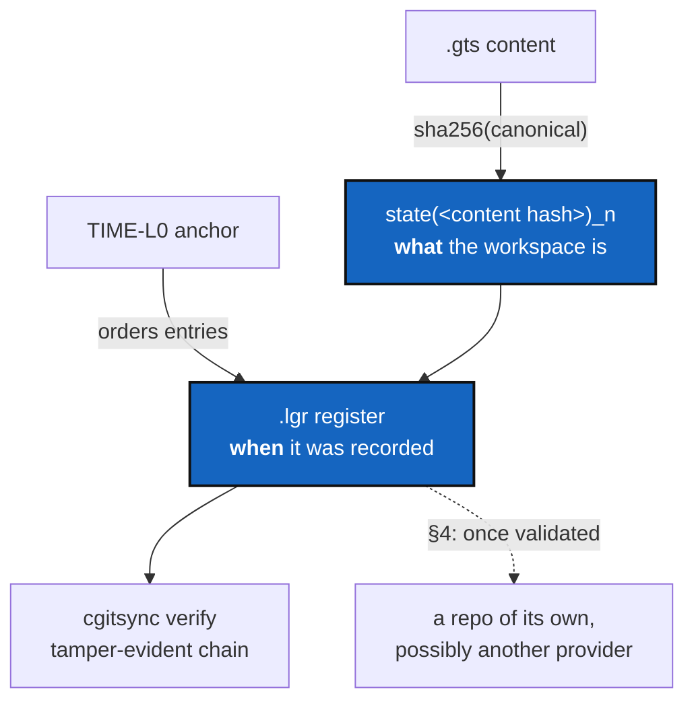

# StateMemory — the State is what it contains, the register is when it happened

*Created: 2026-09-04*

> Finalised from the `DevPlanTicket_T36_memory.md` proto-draft. That draft
> asked, in its Phase 0, that its premise be checked against the source
> before any work started. §0 below is the result of that check: roughly
> half the draft described a repository that does not exist, and the real
> problems are worse than it assumed. The draft's central open question —
> what identifies a State — has since been **answered by the owner** and is
> recorded as settled design in §2. The T-numbers (T32–T36) come from the
> draft's lineage and correspond to nothing in this repository's history;
> they are dropped.

## Abstract — read this first

**The one-line version.** Two hashes, two jobs: a State is named by the
hash of its content, and the register is ordered by the time each State was
recorded. Today those two roles are swapped, and the register that would
prove any of it is never written.

**What this document is.** A plan, and the audit it rests on. Nothing has
changed yet. §0 is evidence with file and line numbers — read it before
disagreeing with anything else here.

**Why it exists.** `.cgitsync/` is the only part of ComplexGitSync that
remembers anything, and three separate attempts at it are in the tree at
once: the live one in `orchestre.py`, a half-wired extraction in
`state_store.py`, and a hash-chained one in `ledger_entry.py` /
`ledger_store.py` / `integrity.py` that only `cgitsync verify` reads — and
that nothing ever writes to. Each was reasonable when written. Together
they mean there is no single true answer to "what is a State, and where is
it recorded".

**What you will find.** §0 the audit. §1 the findings, worst first. §2 the
settled design and the two calls still open. §3 the work. §4 how
`.cgitsync/` graduates from a gitignored scratch directory to a repository
of its own. §5 non-goals. §6 tests. §7 acceptance.

**Who it is for.** Whoever takes this on. §2 is decided; §4's gates are
the part that still needs the owner's signature, and only when they are met.

**What you need to do with it.** Do §3 in order — the phases are not
independent. Treat §4 as a separate, later milestone with its own evidence.



---

## 0. Phase 0 — the premise, checked against the source

### 0.1 What the draft assumed, and what is actually there

| The draft said | Reality |
|---|---|
| `state(<hash>)_<i>` naming is a hypothesis, "no public evidence it exists" | It exists and is *the* layout. `.cgitsync/state(<64 hex>)_<n>/` holding `<name>.gts`, `<name>.log`, `<name>.cgs`, `<project>.lgr`. Grammar in [state_store.py:37-39](src/ComplexGitSync/state_store.py#L37-L39). |
| `.cgitsync/state/<project>.gts` is the live pointer, used by every `--gts` | No such path. `.gts` files live inside state directories only. The one `state/` mention is a legacy fallback in [snapshot_resolver.py:64-66](src/ComplexGitSync/snapshot_resolver.py#L64-L66). |
| `.cgitsync/releases/<label>.gts` holds freeze snapshots | No such path — zero occurrences of `releases/` in `src/`. `freeze` writes an ordinary state directory like every other command. |
| `freeze` has "`++id`" semantics on a label | No counter on labels. `freeze`/`freeze_state` ([orchestre.py:3182](src/ComplexGitSync/orchestre.py#L3182), [:3079](src/ComplexGitSync/orchestre.py#L3079)) tag the tree and call `write_gts_snapshot`. |
| `.gts` identity is `document.snapshot_hash` | The field exists and is canonical, but it identifies nothing — see §0.2. |
| `client.orchestrate(".goc")` must not be regressed | `orchestrate` and `.goc` do not exist anywhere in `src/`. Removed from the non-goals. |
| `client.load/print/pull/initialise/freeze` are the public surface to pin | `load`, `pull`, `initialise`, `freeze` exist. `print` is a document method, not a client method. The client surface is far wider (~50 public methods). |
| `docs/MEMORY.md` must reconcile with `README.md` §1.5/§1.6 | `README.md` has no §1.5 or §1.6, and never mentions `snapshot_hash` or determinism. There is nothing to contradict. |
| `validate_branch_topology`, preflight, Tarjan/SCC, `plan_actions`/`plan_order` exist and are out of scope | Correct on all four. `plan_actions`/`plan_order` are printed at [cli/_shared.py:222-223](src/ComplexGitSync/cli/_shared.py#L222-L223). |

### 0.2 The four Phase 0 questions, answered

**Q1 — does an occurrence counter exist?** Yes, `_n` in
`state(<hash>)_<n>`, allocated by `_next_state_directory_order`
([state_store.py:70](src/ComplexGitSync/state_store.py#L70)) as a
collision-avoiding suffix for a *repeated* state hash. Given Q2 it is dead
code: the live tree holds two state directories, both `_0`.

**Q2 — is `snapshot_hash` computed by one canonical serializer?** The
content hash is: `GtsDocument.compute_snapshot_hash`
([gts_document.py:287](src/ComplexGitSync/gts_document.py#L287)), and
validation refuses a `.gts` whose recorded hash disagrees
([gts_document.py:223](src/ComplexGitSync/gts_document.py#L223)). But it is
not what names the State. `write_gts_snapshot`
([orchestre.py:3460](src/ComplexGitSync/orchestre.py#L3460)) calls
`new_time_l0_anchor(SystemClock())` on every write:

```python
state_anchor = new_time_l0_anchor(SystemClock())
canonical_state_hash = state_anchor.state_hash
```

where the anchor is
`sha256("TIME-L0:<iso>:<time_ns>:<pid>:<random 16 bytes>")`
([ledger_entry.py:76-99](src/ComplexGitSync/ledger_entry.py#L76-L99)). So
the directory called `state(<hash>)` is named after a timestamp, and
`LocalGitRegister`'s docstring says so plainly
([orchestre.py:438](src/ComplexGitSync/orchestre.py#L438)):

> `snapshot_hash` remains the canonical hash of the `.gts` payload, but it
> does not participate in State identity.

**The two hashes are doing each other's jobs.** §2 swaps them back.

**Q3 — does `.lgr` reference the State?** Yes, and by both hashes at once.
A live register carries `current_snapshot_id = "state(e049…)"`,
`current_state_hash = "e049…"` (the time anchor) *and*
`current_snapshot_hash = "b324…"` (the content hash), plus a `[[ledger]]`
event whose `workspace_hash` is the content hash and whose
`gts_snapshot_id` is the anchor id. The two never agree, and nothing says
which one means "the same workspace".

**Q4 — is the freeze counter a rename or a behavioural fix?** Neither: it
does not exist. What exists in its place is F3.

### 0.3 What the draft wanted and the code already does

The draft's Phase 5 (atomic transactions) is substantially delivered.
`write_gts_snapshot` stages into `.tmp-state(<hash>)_<n>/` and publishes
with one `rename`
([orchestre.py:3544](src/ComplexGitSync/orchestre.py#L3544));
`ledger_store.write_entry` and `write_head` do the same per entry
([ledger_store.py:264](src/ComplexGitSync/ledger_store.py#L264),
[:344](src/ComplexGitSync/ledger_store.py#L344)). Do not rebuild this.
Locking is genuinely absent — no `locks/`, no advisory lock anywhere.

---

## 1. Findings

### F1 — `cgitsync verify` verifies an empty directory (severity: high)

`verify` ([orchestre.py:3204](src/ComplexGitSync/orchestre.py#L3204)) reads
`<cgshome>/.cgitsync/lgr/` through `read_all_entries`. Nothing in `src/`
ever calls `ledger_store.write_entry` or `append_entry` — the only callers
are `tests/unit/test_ledger_store.py`. On any real workspace the directory
does not exist, `read_all_entries` returns `[]`, and `verify` reports a
clean chain. A tamper-evidence command that cannot fail is worse than no
command: it answers "yes" to a question it never asked.

The register that *is* written is a plain TOML file, rewritten in full on
every operation, with a sequential `sync_id = "lgr-000001"` and no `prev`,
no `entry_hash`, no chain. It is append-only by convention, and an edit is
undetectable.

### F2 — the two hashes are inverted (severity: high)

Per §0.2/Q2. Every consequence is observable today: every `initialise`,
`pull`, `checkout`, `commit`, `push` and `freeze` allocates a fresh state
directory even when the workspace has not changed by a byte; `_n` can never
fire; and the content hash that would deduplicate is computed, stored, and
explicitly excluded from identity. The `.gts` format promises determinism
and the store built on it discards it.

The TIME-L0 anchor is not the problem — it is a good mechanism pointed at
the wrong object. §2 moves it to the register, where "when" is the whole
point.

### F3 — the register is copied forward into every state directory (severity: medium)

Before writing, `write_gts_snapshot` finds the previous register and copies
it into the new state directory
([orchestre.py:3492-3497](src/ComplexGitSync/orchestre.py#L3492-L3497)).

- **Growth.** Every operation duplicates the whole history. After *n*
  operations `.cgitsync/` holds *n* copies of a register of length *n* —
  quadratic in bytes, for a file that only grows.
- **The parent is chosen by modification time.** `_latest_state_artifact`
  takes `max(..., key=st_mtime)`
  ([state_store.py:144-148](src/ComplexGitSync/state_store.py#L144-L148)).
  Restore a backup, copy a tree with `cp -p`, or run twice inside one
  filesystem timestamp tick, and the new register forks from the wrong
  parent, silently.

`snapshot_resolver` orders the same directories by *name* for `.gts` files
([snapshot_resolver.py:60](src/ComplexGitSync/snapshot_resolver.py#L60))
and by mtime for the register
([:99](src/ComplexGitSync/snapshot_resolver.py#L99)). Two orderings over
one directory set is one too many. Under §2 the ordering question
disappears: the chain's parent is `HEAD`, and `HEAD` is a fact in the
register, not a property of the filesystem.

### F4 — the state-directory grammar exists three times (severity: medium)

`_STATE_DIR_RE` and its helpers live in `state_store.py`, are copied into
`snapshot_resolver.py` (which says so at
[:11-30](src/ComplexGitSync/snapshot_resolver.py#L11-L30)), and are
imported from `state_store` by `orchestre.py`
([:131-138](src/ComplexGitSync/orchestre.py#L131-L138)). The hash
canonicalisation is implemented twice, in `ledger_entry.py` and
`integrity.py`, the latter documenting the duplication as deliberate
([integrity.py:9-15](src/ComplexGitSync/integrity.py#L9-L15)). Each copy
was justified as temporary by a work package that has since landed. The
reconciliation those comments promise is this ticket.

`state_store.py`'s docstring also still claims "this module is not wired in
yet". It has been wired in since — `orchestre.py` imports five names from
it. That sentence is now a lie told to the next reader.

### F5 — ten citations point at a document that does not exist (severity: low)

`AgentSpec/IsolationPlan.md` is cited as the binding design reference by
`ledger_store.py` (§2.3, §2.5, §2.6), `integrity.py` (§2.2),
`ledger_entry.py` (§2.2), `config_document.py` and `status_render.py`.
There is no such file; the document is
`AgentSpec/archive/20260828_Isolation_DevPlanTicket.md`. Every schema in
the hash-chained ledger is declared unchangeable without first updating a
file nobody can open.

---

## 2. The settled design

**A State is named by what it contains. The register records when each
State was seen.** One hash per question, and neither borrows the other's:

| | State — `.gts` | Register — `.lgr` |
|---|---|---|
| Question answered | *what* is this workspace | *when*, in what order, by whom |
| Identity | `sha256(canonical .gts)` — today's `document.snapshot_hash` | TIME-L0 anchor, per recorded entry |
| Naming | `state(<content hash>)_<n>/` | `seq` / `prev` / `entry_hash` chain |
| Determinism | same content ⇒ same name, on any machine | never repeats; time and entropy are the point |
| Mutability | immutable — the name is a checksum of the bytes | append-only, tamper-evident |

Two consequences worth stating outright, because they are what the swap
buys:

1. **`_n` starts earning its keep.** The same content registered twice —
   a rebuild, a revert, a colleague reaching the same tree — now collides
   on purpose. `_n` counts the *occurrences* of one State, and the register
   says when each happened. That is the distinction the current code cannot
   express at all.
2. **`verify` becomes able to fail.** A directory name is a checksum of the
   `.gts` inside it, so `STATE_DIGEST_MISMATCH` is checkable; entries name
   directories, so `MISSING_STATE` and `ORPHAN_STATE` are checkable. All
   three are already named in `verify`'s docstring and implemented nowhere.

**Two smaller calls remain open:**

- **D2 — which register implementation survives?** Recommended: the
  hash-chained one (`ledger_store.py`), with `LocalGitRegister`/`SyncLedger`
  reduced to a reader for the existing single-file format. The alternative
  is deleting `ledger_entry.py`/`ledger_store.py`/`integrity.py` and
  `verify` with them — honest and cheap, but it throws away the only
  tamper-evident design in the tree, and §4 depends on having one.
- **D3 — one register per tree, or one per state directory?**
  Recommended: one, at `<cgshome>/.cgitsync/lgr/`, which is where `verify`
  already looks. That deletes F3's copy-forward outright.

## 3. The work

Ordered. 3.0 depends on nothing and can start today.

### 3.0 Stop the documentation from lying (F5, half of F4)

- Repoint the ten `AgentSpec/IsolationPlan.md` citations. If that
  document's §2.2 schema is still binding, lift those sections into
  `.localSpec/AdditionalSpecs.md` and cite that: an archived ticket is a
  historical record and is never edited, so a live schema must not live in
  one.
- Delete `state_store.py`'s "not wired in yet" paragraph.
- Rewrite `LocalGitRegister`'s docstring to state §2's contract.

### 3.1 Swap the two hashes (F2)

In `write_gts_snapshot`: build the `GtsDocument` first, call
`ensure_snapshot_hash()`, and pass **that digest** as `state_hash` to
`_resolve_memory_state_directory`. The allocator already increments `_n` on
a repeated hash, so it needs no change — it simply starts being reached.

`new_time_l0_anchor` keeps its caller, moved: the anchor is generated when
an entry is appended to the register, not when a directory is named. Under
D2 it becomes part of entry construction in `ledger_entry.py`, alongside
`recorded_at`, where the injectable clock it was written for
([ledger_entry.py:85](src/ComplexGitSync/ledger_entry.py#L85)) finally has
a reason to exist: a fake clock makes register tests deterministic without
making State names non-deterministic.

The register's two near-synonyms collapse: `current_state_hash` (was the
anchor, becomes the content hash) and `current_snapshot_hash` (already the
content hash) are one field. Keep the name that survives in one place and
say what it means.

**Cross-machine determinism is the acceptance test here**, not an
implementation detail: two clones of the same tree, on two machines, at two
times, must produce the same `state(<hash>)` directory name. If they do
not, something machine-specific has leaked into the canonical form, and
that is a `gts_document.py` bug to fix before this phase closes.

### 3.2 One register, hash-chained, in one place (F1, F3, D2, D3)

- Route the live write path through `ledger_store.append_entry` so
  `.cgitsync/lgr/` is actually written, and `verify` has something to
  verify. `record_snapshot`/`record_event` become thin callers.
- Delete the copy-forward at
  [orchestre.py:3492-3497](src/ComplexGitSync/orchestre.py#L3492-L3497) and
  the `_latest_state_artifact` mtime lookup with it. The chain's parent is
  `HEAD`, read from the register.
- Keep reading the old single-file `<project>.lgr` where it exists, so
  workspaces created before this change still resolve. One-way migration;
  old entries are never rewritten.

### 3.3 One implementation of each rule (rest of F4)

`snapshot_resolver.py` imports the state-directory grammar from
`state_store.py` instead of copying it. `ledger_entry.py` and
`integrity.py` share one canonicalisation function. `orchestre.py` keeps no
private copy of either.

### 3.4 Finish `verify`

Implement the three store-level findings the docstring promises and the
`Finding` enum lacks: `MISSING_STATE`, `ORPHAN_STATE`,
`STATE_DIGEST_MISMATCH`. §2 makes all three meaningful; §4 makes them
necessary.

### 3.5 Locking

Out of scope here. Two `cgitsync` processes in one workspace race on the
state directory and the register, and staged-then-`rename` means the loser
silently wins. Its own ticket; record it in `.localSpec/audit.md` now.

## 4. Graduating `.cgitsync/` from scratch directory to register repository

### 4.1 Why it is ignored today, and what that decision actually was

`.gitignore` excludes `.cgitsync/` and the root `<name>.lgr`, written into
every tree root by `sync_gitignore` via `cgitsync_managed_state_paths`
([git_tree.py:1204](src/ComplexGitSync/git_tree.py#L1204)). This came from
`archive/20260903_CgitsyncGitignoreLeak_DevPlanTicket.md`, which reproduced
a real leak: running Tutorial 3 against `cawaqsviz` committed
`.cgitsync/state(366ca0a3…)_0/…` into the project as ordinary content.

That fix was never "the register must not be versioned". It was "the
register must not be committed **into the project repository, as untyped
project content**". Those are different statements, and only the second one
was ever true. While the format was churning, ignoring it was the right
call — a register whose schema changes weekly is scratch, and scratch does
not belong in a project's history.

§2 is what ends the churn. Once a State name is a checksum of its content
and the register is a verifiable chain, the register stops being scratch
and starts being evidence.

### 4.2 The gates — when the protocol is validated

Graduation is not a date, it is a checklist. Every item is objectively
checkable, and all of them must hold on `main` for **two consecutive
released versions** before §4.3 begins:

| # | Gate | How it is checked |
|---|---|---|
| G1 | State names are content-derived | §3.1 landed; `grep` finds no `new_time_l0_anchor` call in the state-naming path |
| G2 | Cross-machine determinism | The same tree, cloned on two machines, yields the same `state(<hash>)` — an integration test, run in CI on two runner images |
| G3 | The chain is real | `cgitsync verify` reports a non-empty chain on a workspace with history, and reports `BAD_ENTRY_HASH` when one entry byte is flipped |
| G4 | Store-level integrity | §3.4's three findings implemented and each provoked by a test |
| G5 | No secrets, no machine identity | The register carries no credential, no OS user name, no absolute path — see §4.4 |
| G6 | Schema pinned with a migration path | The register declares a version; a register written by version *X* is read by *X+1*, proven by a fixture, not by assertion |
| G7 | One register, one implementation | F3 and F4 closed; `.cgitsync/` holds exactly one register file set |

G5 is the one most likely to be underestimated. Today's live register
records `snapshot_path = "$HOME/.cgs/CGS20260904134150/ComplexGitSync/…"`
and `actor = "flipoyo"` — the `$HOME` prefix is substituted
([paths.py:73](src/ComplexGitSync/paths.py#L73), `_path_to_environment_marker`)
but the rest of the path and the user name are verbatim. `ledger_store`
already scrubs credentials from argv and URLs
([ledger_store.py:172](src/ComplexGitSync/ledger_store.py#L172)), while
`LocalGitRegister`/`SyncLedger` scrub nothing at all. Publishing today's
register would publish one developer's home-directory layout and login
name. Paths must become relative to the tree root, and `actor` must become
a deliberate, documented field before anything is pushed anywhere.

### 4.3 What graduation changes

`.cgitsync/` becomes a repository of its own, declared in the `.cgs` and
mounted at `.cgitsync/` exactly like any other nested repository:

```toml
register = { repository = "gitlab:flipoyo/ComplexGitSync-register", relative_path = ".cgitsync" }
```

Note what this does *not* require: the parent's `.gitignore` still lists
`.cgitsync/`, because that is the ordinary rule for every child mount in
the tree — the same line that keeps `docs/` out of ComplexGitSync's own
index. **The line stays; its meaning changes** from "suppressed scratch" to
"a mounted repository, tracked in its own history". Nothing in the
gitignore-leak fix is undone.

Putting the register on a **different provider** from the working tree is
the arrangement to aim for, and the reason is separation of concerns, not
storage: the filesystem tree and the account that can rewrite its history
should not be the same account. A register on `gitlab:` for a tree on
`github:` means compromising the code host does not silently let someone
rewrite the evidence of what was synchronised. The provider registry in
`git_repo.py` already supports this — a register entry is an ordinary repo
entry with its own `gitprovider`, and needs no new transport.

Three design points to settle when §4.3 is actually started, not now:

- **Push cadence.** Every operation, or only on `freeze`? Pushing a
  register entry per `status` call is noise; pushing per `freeze` may lose
  the intermediate history that makes the chain worth having.
- **Who may write.** One register per workspace per person, merged; or one
  shared register with a real merge rule for concurrent chains. The
  hash chain has no merge semantics today, and inventing them is a ticket
  of its own.
- **What happens offline.** The register must keep working with no network.
  Local-first, pushed later, is the only acceptable answer.

### 4.4 What the test suite must do differently, starting now

The user's constraint, stated directly: the tests must not bake in the
assumption that `.cgitsync/` is invisible to Git.

`tests/integration/test_tuto_cgsi1.py:174-198` currently asserts both that
`.cgitsync/` appears in `.gitignore` **and** that `git status --porcelain`
never mentions it. The first assertion is about the leak; the second is
about the ignore mechanism. Under §4.3 the first stays true for a different
reason and the second stays true as well — but for a mounted repository,
not a suppressed directory. Rewrite the test to assert what actually
matters and will remain true across the graduation:

> `.cgitsync/` is never **tracked in the project repository's index**
> (`git ls-files .cgitsync` is empty), whatever mechanism keeps it out.

That is the leak ticket's real invariant, and it survives both regimes.
Then add, as part of §3, a test mode in which `.cgitsync/` **is** a git
repository — `git init` inside it, entries committed — so the register
code is exercised against a versioned register long before §4.3 ships. If
the register cannot be committed and read back in a test, it is not ready
to live in a repository, and G1–G7 will say so.

## 5. Non-goals

Do not touch and do not regress: the cycle-breaking engine (Tarjan SCC,
anchor selection, `is_external_reference`), `topological_sort`,
`validate_branch_topology` / `BranchTopologyReport`, preflight validation,
`.gitignore` sync beyond §4.4's test change, `import-submodules` /
`init-from-submodules`, and the CLI's printed contract (`log_file=`,
`workflow=`, `plan_actions=`, `plan_order=`, the status table). No public
client method signature and no CLI flag changes — `--gts`, `--cgshome` and
friends resolve exactly what they resolve today, whatever happens
underneath.

The draft's `.goc` / `orchestrate` non-goals are dropped: there is nothing
there to protect.

## 6. Tests

| Level | Test |
|---|---|
| unit | Two `write_gts_snapshot` calls over an unchanged workspace produce **one** state hash and two occurrences: `state(<h>)_0` and `state(<h>)_1`, with two register entries whose `prev` chains them. |
| unit | `_next_state_directory_order` returns 1 when `state(<h>)_0` exists — reachable at last. |
| unit | The register's entry anchor differs between two entries for the same State; the State name does not. This is §2 in one assertion. |
| unit | A fake clock makes register entries reproducible while State names stay clock-independent. |
| integration | G2: the same tree materialised twice, in two directories with different absolute paths and different users, yields the same `state(<hash>)`. |
| unit | An `append_entry` from the live path lands in `.cgitsync/lgr/`, and `verify` reports a non-empty clean chain. |
| unit | `verify` reports `BAD_ENTRY_HASH` after one byte is flipped in an entry file — impossible to write today (F1). |
| unit | `verify` reports `STATE_DIGEST_MISMATCH` when a `.gts` is edited inside a state directory whose name no longer matches it. |
| unit | Chain parent comes from `HEAD`, not mtime: two state directories written with identical mtimes still chain correctly. |
| unit | `snapshot_resolver` and `state_store` agree on every directory name, by construction (one imports the other). |
| unit | G5: a written register contains no absolute path outside the tree root, and no OS user name unless explicitly configured. |
| integration | The `.cgitsync`-as-a-git-repository mode of §4.4: entries commit and read back cleanly. |
| integration | A pre-change workspace (single-file `<project>.lgr`, no `.cgitsync/lgr/`) still loads, resolves its default `.gts`, and `verify` explains rather than crashes. |
| integration | Rewritten leak regression: `git ls-files .cgitsync` is empty after `initialise` (§4.4). |

## 7. Acceptance

1. `pixi run lint` and `pixi run test` pass; CI green.
2. `state(<hash>)` is the content hash of the `.gts` it contains, on every
   machine; `_n` distinguishes occurrences and the register dates them.
3. `cgitsync verify` on a workspace with real history reports a real chain,
   and fails when an entry or a stored `.gts` is edited.
4. `.cgitsync/` contains exactly one register. No file is copied forward
   into a state directory.
5. `grep -rn "IsolationPlan" src/` returns nothing, or returns citations of
   a file that exists.
6. The state-directory grammar and the hash canonicalisation each appear
   once in `src/`.
7. `.localSpec/AdditionalSpecs.md` states, in one paragraph, that a State is
   named by its content and the register is ordered by time — and no
   docstring contradicts it.
8. No test asserts that `.cgitsync/` is invisible to Git; the leak
   regression asserts it is not tracked in the project's index.
9. §4.2's gates G1–G7 are written down with their evidence, so that
   graduating `.cgitsync/` to a repository becomes a decision someone can
   take on facts rather than on confidence.
10. No CLI flag, printed line, or public client signature changed.
