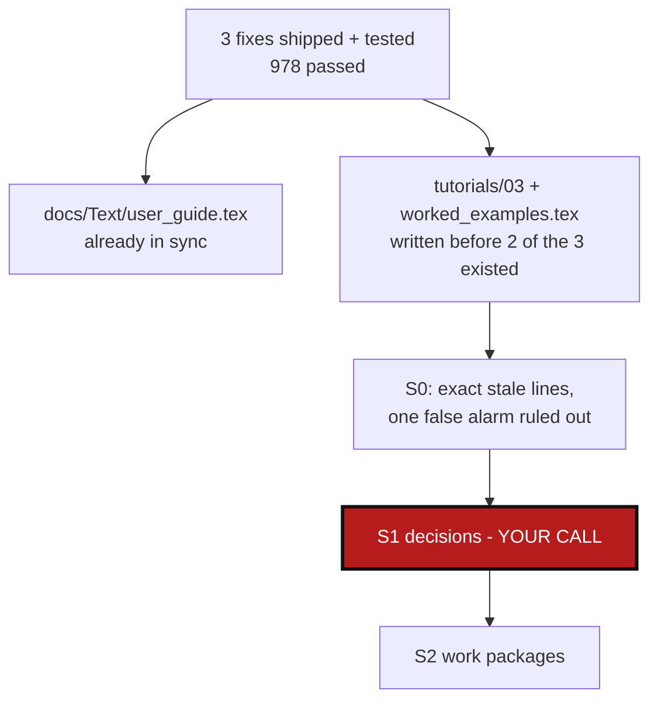

# TutorialsDocsSync — bring tutorials/ and docs/*.tex up to date with the 3 shipped fixes

*Created: 2026-09-03*

## Abstract — read this first

**The one-line version.** `CgitsyncGitignoreLeak`, `RecursiveImportSubmodules`,
and `ProtocolSwitchOnPush` are implemented, tested (978 passed), and
`docs/Text/user_guide.tex` already documents all three flags/behaviors —
but `tutorials/03_adopting_a_real_project.md` and
`docs/Text/worked_examples.tex` were written *before* two of the three
existed, and still show the manual workarounds those fixes replaced. Spotted
directly: `tutorials/03_adopting_a_real_project.md:265` still tells the
reader to run a raw `git remote set-url`, when `push --force-protocol ssh`
now does exactly that, persistently, through the CLI.

**What this document is.** A planning-only ticket: no files have been
touched. Unlike the three tickets it follows up on, the underlying code is
already shipped and already correct — this is purely a documentation-sync
task, so the audit below is shorter and more conclusive than usual: for
each of the three fixes, it states plainly whether the narrative docs are
stale, and quotes the exact stale text where they are.

**What you will find.** A three-part audit (§0), one per fix, each ending
in a clear "stale" or "not stale, checked" verdict — one of the three
turns out to need no edit at all, verified by rereading rather than
assumed. Two small decisions (§1), a work-package table (§2), and
acceptance criteria (§3).

**Who it is for.** Whoever picks this up next, once §1's two questions are
answered — both are about how much to trim, not what to change.

**What you need to do with it.** Read §1, answer both questions, then the
work packages become actionable.



---

## 0. Audit (research pass, 2026-09-03 — no files edited)

### 0.1 `ProtocolSwitchOnPush` — stale, one exact spot

`tutorials/03_adopting_a_real_project.md`, step 9 (lines 257–270), the
troubleshooting callout for a push that fails on missing HTTPS
credentials, currently reads:

```
> ... this is the same ambient-authentication gap as step 2 — same fix,
> applied to the root's `origin` instead of a submodule's:
> ```bash
> git -C "$WORK/cawaqsviz" remote set-url origin git@gitlab.com:cawaqs/gviz/cawaqsviz.git
> ```
```

This predates `ProtocolSwitchOnPush` entirely — at the time this tutorial
was written, the only way to switch a repo's remote was raw `git
remote set-url`, run by hand. `pixi run cgitsync push --force-protocol
ssh` now does exactly this, persistently, through the CLI — already
verified working end-to-end against a real repo in this session (`git
remote get-url origin` confirmed rewritten before the push attempt,
`tests/integration/test_cgsi_topology.py::TestForceProtocolOnPush`).

A second, smaller staleness in the same callout: `push` now prints an
actionable `--force-protocol <other>` hint itself the moment it hits a
matching failure (`_protocol_switch_hint`, wired into `push`/`pull`/
`pull-force`). The callout's own multi-paragraph explanation of *why* this
happens is now something the tool tells the reader directly — worth
trimming, not just correcting the command (see §1.1).

Step 2's own SSH workaround (lines 96–109, `git -c url."git@github.com:
".insteadOf=...`) is **not** stale: it wraps a plain `git submodule
update`, a raw git operation `import-submodules` never touches (it converts
gitlinks, it does not clone submodules) — `--force-protocol` only reaches
cgitsync's own `push`/`pull`/`pull-force`/`freeze-release`, not this step.
No edit needed there.

`docs/Text/worked_examples.tex`'s condensed Level 3 sequence never reaches
a push step at all (it stops at "review and commit... as usual") — no
staleness to fix there for this fix.

### 0.2 `RecursiveImportSubmodules` — stale, both files, same gap

`tutorials/03_adopting_a_real_project.md` step 2 (lines 111–114) and
`docs/Text/worked_examples.tex`'s 3b code comment (lines 176–179) both
correctly explain today's default, non-recursive behavior and why
(`HydrologicalTwinAlphaSeries`'s own nested submodule,
`docs/hydrological_twin`, would otherwise show up as an unwanted fourth
repository) — that explanation is accurate and shipped-code-correct, not
wrong. What's missing from both: neither mentions that
`--recursive` now exists as a working alternative for a reader who *does*
want `hydrological_twin` converted too (`git submodule update --init
--recursive` in step 2, `import-submodules --recursive --apply` in step
4) — the tutorial's own scenario is the textbook case `--recursive` was
built for.

### 0.3 `CgitsyncGitignoreLeak` — checked, genuinely not stale

Step 8 (`## 8. Stage and commit`) asserts: *"Only the root has anything to
commit — step 4's staged `.gitmodules` removal and `.gitignore` update."*
Read literally against the code as it stood when this tutorial was
written, that sentence was **already wrong** — before this fix,
`.cgitsync/` was not gitignored, so `add` would have staged it too,
contradicting "only". The fix (root's `.gitignore` now always covers
`.cgitsync/` and its `.lgr`, verified in
`tests/integration/test_tuto_cgsi1.py::test_initialise_gitignores_its_own_state_directory`)
is what makes this sentence true now. Net effect: no edit needed — the
tutorial's claim and the shipped behavior now agree, verified by rereading
against the actual fix rather than assumed. `docs/Text/worked_examples.tex`
never asserts what gets committed for cawaqsviz at all, so nothing to
check there either.

## 1. Decisions needed before work starts

### 1.1 How far to trim tutorial step 9's callout, now that `push` self-diagnoses?

**Recommendation: trim it substantially.** Today's callout spends four
sentences explaining *why* an HTTPS push without credentials fails before
giving the fix — reasonable when the fix required understanding the
problem to invent the right `git remote set-url` command by hand. Now
that `push` prints `hint: this looks like an HTTPS authentication
failure — pass --force-protocol ssh to 'push' ...` itself on that exact
failure, the tutorial's job shrinks to: show the command, note that the
error message will suggest it directly if you forget. Keep the SSH-key
prerequisite note (`ssh -T git@gitlab.com`) and the PAT fallback — those
still apply either way.

### 1.2 How prominent should the `--recursive` aside be?

**Recommendation: one short callout, not a rewrite of the primary path.**
This tutorial's own stated design (its abstract: "no branching 'modes' to
choose between, one path") argues against making `--recursive` a second
branch to walk through step by step — a two-to-three-line aside after
step 2's existing `--init`-only explanation, plus a one-line pointer back
to it in step 4, keeps the primary path exactly as tested while still
telling the reader the option exists. Mirror the same brief treatment in
`worked_examples.tex`'s 3b comment.

## 2. Work packages

| WP | Depends on | Touches | Deliverable |
|---|---|---|---|
| **WP-SYNC1** | §1.1 answered | `tutorials/03_adopting_a_real_project.md` step 9 | Raw `git remote set-url` replaced with `pixi run cgitsync push --force-protocol ssh`; callout trimmed per §1.1, keeping the SSH-key/PAT prerequisite notes. |
| **WP-SYNC2** | §1.2 answered | `tutorials/03_adopting_a_real_project.md` steps 2 and 4 | Short `--recursive` aside added after step 2's existing explanation, with a one-line pointer from step 4; today's default (non-recursive) command sequence in the main path is unchanged. |
| **WP-SYNC3** | §1.2 answered | `docs/Text/worked_examples.tex`, Level 3b | Same brief `--recursive` mention added to the existing code comment; rebuild `docs/*.pdf` per `CLAUDE.md`'s before-committing rule. |

No work package for §0.3 — verified not stale; nothing to change.

## 3. Acceptance criteria

- `tutorials/03_adopting_a_real_project.md` step 9 contains
  `--force-protocol` and no longer contains a raw `git remote set-url`
  command.
- `tutorials/03_adopting_a_real_project.md` (steps 2/4) and
  `docs/Text/worked_examples.tex` (3b) each mention `--recursive` as an
  available alternative, without changing their existing default command
  sequences.
- `docs/*.pdf` rebuilt after the `.tex` change.
- `pixi run lint && pixi run test` still pass (these are prose-only
  changes; included as a sanity check, not because these files affect
  either).
- No commit, no push — this ticket is executed only after explicit
  go-ahead, per instruction.
