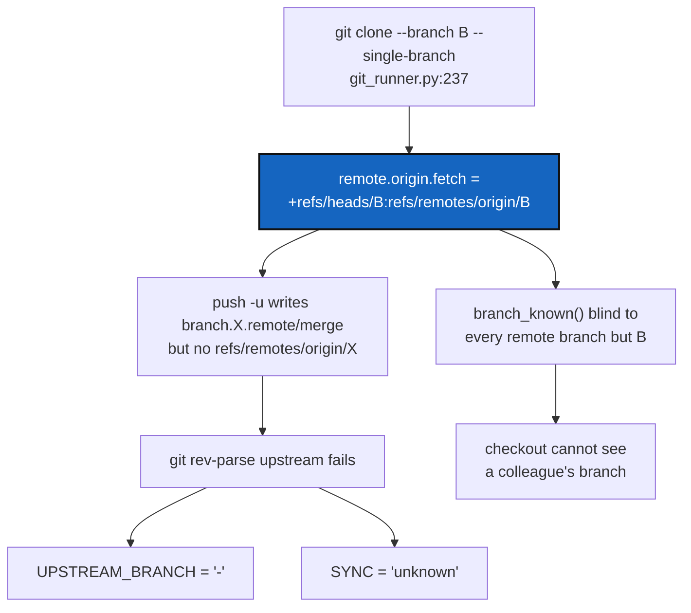

# UpstreamBranchDisplay — a pushed branch must show its upstream

*Created: 2026-09-09*

## Abstract — read this first

**The one-line version.** `cgitsync clone` clones with `--single-branch`,
which narrows `remote.origin.fetch` to the cloned branch forever; every
branch made afterwards can never resolve `@{upstream}`, so `status` prints
`-` and `unknown` even straight after a successful `push -u`.

**What this document is.** A bug ticket with a proven root cause and a
proven fix.

**Why it exists.** The `UPSTREAM_BRANCH` and `SYNC` columns are wrong on
every repository that is not sitting on the branch it was cloned at. That
is the normal state of any feature branch, so the two columns are wrong
most of the time. A status table that says `unknown` when the truth is
`synced` teaches the reader to stop trusting the table.

**What you will find.** The observed failure (§1), the cause chain proved
in a sandbox (§2), the three things it breaks (§3), decisions the owner
must make (§4), work packages (§5), acceptance criteria (§6), and what
this ticket does not cover (§7).

**Who it is for.** Whoever fixes the clone refspec and the status columns
that depend on it.

**What you need to do with it.** Answer §4, then work §5 in order.



---

## 1. What was observed

On branch `apoub`, after `add`, `commit` and a **successful** `push`:

```text
REPOSITORY         PATH          SCOPE          LOCAL_BRANCH          UPSTREAM_BRANCH  LOCAL  SYNC
DocSpec            docs/DocSpec  private/distant main                 origin/main      clean  synced
DocComplexGitSync  docs          project         apoub                -                clean  unknown
.localSpec         .localSpec    private/local   ComplexGitSync_apoub  -               dirty  unknown
.claude            .claude       private/local   ComplexGitSync_apoub  -               dirty  unknown
ComplexGitSync     .             project         apoub                -                clean  unknown
```

The pattern is exact: **every repository still on the branch it was cloned
at shows its upstream; every repository that has moved shows `-`.** The
three `origin/main` rows are the three repositories nobody branched.

This is not a display bug in the renderer. The branch really has no
resolvable upstream, and `git` agrees:

```console
$ git rev-parse --abbrev-ref --symbolic-full-name '@{upstream}'
fatal: upstream branch 'refs/heads/apoub' not stored as a remote-tracking branch
```

Yet the push did set the configuration, and the branch is on the remote:

```console
$ git config --get-regexp '^branch\.apoub\.'
branch.apoub.remote origin
branch.apoub.merge  refs/heads/apoub

$ git ls-remote --heads origin apoub
ceea5a7d…  refs/heads/apoub
```

## 2. The cause, proved

[`git_runner.py:237`](../src/ComplexGitSync/git_runner.py#L237) clones like this:

```python
["clone", "--branch", branch, "--single-branch", remote_url, str(destination_path)]
```

`--single-branch` does not only limit what the first clone downloads. It
**writes a narrowed fetch refspec into the repository and leaves it there**:

```console
$ git config --get remote.origin.fetch
+refs/heads/main:refs/remotes/origin/main
```

Every repository in this workspace carries one, each pinned to its own
declared branch:

| Repository | `remote.origin.fetch` |
|---|---|
| `ComplexGitSync`, `docs`, `.agentSpec` | `+refs/heads/main:refs/remotes/origin/main` |
| `.claude`, `.localSpec` | `+refs/heads/ComplexGitSync:refs/remotes/origin/ComplexGitSync` |

`git push -u origin apoub` then does half its job. It writes
`branch.apoub.remote` and `branch.apoub.merge`, but it can only create
`refs/remotes/origin/apoub` if the fetch refspec maps that branch — and it
does not. `@{upstream}` needs the **remote-tracking ref**, not the config,
so it fails.

Reproduced from scratch, no ComplexGitSync involved:

```console
$ git clone --branch main --single-branch remote.git clone1
$ cd clone1 && git checkout -b feature && git commit -am feat
$ git push -u origin feature
$ git config --get branch.feature.remote      # origin
$ git config --get branch.feature.merge       # refs/heads/feature
$ git rev-parse --verify refs/remotes/origin/feature   # MISSING
$ git rev-parse --abbrev-ref --symbolic-full-name '@{upstream}'
fatal: upstream branch 'refs/heads/feature' not stored as a remote-tracking branch
```

Restoring the standard refspec fixes it, and **no extra fetch is needed** —
`push -u` alone then produces a correct upstream:

```console
$ git config remote.origin.fetch '+refs/heads/*:refs/remotes/origin/*'
$ git checkout -b topicB && git commit -am b && git push -u origin topicB
$ git rev-parse --abbrev-ref --symbolic-full-name '@{upstream}'
origin/topicB
$ git rev-list --left-right --count 'HEAD...@{upstream}'
0	0
```

That is the fix. The clone stays cheap — `--single-branch` still limits
what the *initial* clone downloads; only the stored refspec is widened.

## 3. What this breaks

Three things, in increasing order of seriousness.

**1. `UPSTREAM_BRANCH` prints `-`.**
[`orchestre.py:3607`](../src/ComplexGitSync/orchestre.py#L3607) calls
`upstream_ref()`, which returns `None` on a non-zero exit, and the column
falls back to `-`.

**2. `SYNC` prints `unknown`.** `branch_tracking_counts()` returns early
when `upstream_ref()` is `None`, so `ahead`/`behind` are never counted.
The `summary` line inherits this: it reported `ahead=0 behind=0` for a
tree in which four repositories were simply not measured. `ahead=0` and
"not measured" must not print the same way.

**3. `checkout` cannot see a colleague's branch.** `branch_known()`
([`git_runner.py:256`](../src/ComplexGitSync/git_runner.py#L256)) answers
by reading `refs/remotes/<remote>/<branch>`, which the narrow refspec can
never populate. Confirmed: a branch that demonstrably exists on the
remote is invisible to a fresh clone even after `git fetch origin`.

```console
$ git ls-remote --heads origin feature     # 1 result — it exists
$ git rev-parse --verify refs/remotes/origin/feature   # NO
```

So `cgitsync checkout <branch someone else pushed>` cannot find it. This
is a correctness bug in a command, not a cosmetic one, and it is the
reason to fix the refspec rather than paper over the column.

## 4. Decisions for the owner

| # | Question | Recommendation |
|---|---|---|
| **D1** | Widen the refspec at clone time, or repair it at push time? | **At clone time.** Repairing at push fixes only column 1 and 2 and leaves `branch_known` blind. One `git config` call right after clone fixes all three. |
| **D2** | Drop `--single-branch` entirely instead? | **No.** It is what keeps the initial clone small, and that is worth keeping. Widen the stored refspec, keep the narrow download. |
| **D3** | What repairs the clones that already exist on disk? | A no-op-safe `ensure_fetch_refspec()` called on `pull` and `status`, modelled on `_rewrite_remote_if_forced` ([`operations.py:183`](../src/ComplexGitSync/operations.py#L183)) — it already persists a config fix once, idempotently. Without this, every existing workspace stays broken. |
| **D4** | Should `SYNC` distinguish "no upstream yet" from "cannot measure"? | **Yes.** A private/local repo that was never pushed genuinely has no upstream; that is not the same as a pushed branch whose ref is missing. Recommend `no-upstream` for the first and keeping `unknown` for a real error. |
| **D5** | Should `--private` repos be pushed by plain `push`? | **No — out of scope, and current behaviour is right.** `.claude` and `.localSpec` show `-` partly because plain `push` correctly leaves them alone. They need `push --private`. D4 is what stops that reading as an error. |

## 5. Work packages

| WP | Files | Work |
|---|---|---|
| **WP-1** | `git_runner.py` | After the `clone` subprocess returns, set `remote.<remote>.fetch` to `+refs/heads/*:refs/remotes/origin/*`. Keep `--single-branch` on the clone itself. Add `ensure_fetch_refspec(repo_path, remote="origin")` as the one place that writes it. |
| **WP-2** | `operations.py` | Call `ensure_fetch_refspec` from the pull path, beside `_rewrite_remote_if_forced`, so existing workspaces repair themselves on first use (D3). Idempotent: a clone that already has the wide refspec is untouched. |
| **WP-3** | `git_runner.py`, `orchestre.py` | Split "no upstream configured" from "upstream unresolvable" (D4). `has_upstream()` already asks the first question; `_repo_status_row` must carry the distinction into the `SYNC` column. |
| **WP-4** | `status_render.py` | Render the new state and extend the legend. Pure rendering — no Git calls here. |
| **WP-5** | `orchestre.py` | The `summary` line must not fold unmeasured repositories into `ahead=0 behind=0`. Count them separately. |
| **WP-6** | `tests/unit/`, `tests/integration/` | A clone-then-branch-then-push integration test asserting `UPSTREAM_BRANCH == origin/<branch>` and `SYNC == synced`. A regression test that `branch_known` sees a branch pushed by another clone of the same remote. A unit test that `ensure_fetch_refspec` is a no-op the second time. |
| **WP-7** | `docs/Text/user_guide.tex`, `README.md` | Document what the `SYNC` values mean, including the new one. The `status` legend is the user-facing contract. |

## 6. Acceptance criteria

1. On a fresh `cgitsync clone`, `git config --get remote.origin.fetch`
   returns `+refs/heads/*:refs/remotes/origin/*`.
2. `cgitsync branch X && cgitsync push` then `cgitsync status` shows
   `UPSTREAM_BRANCH = origin/X` and `SYNC = synced` — the case in §1 that
   fails today.
3. Running any command in a workspace cloned *before* the fix repairs its
   refspec once, without a re-clone.
4. `cgitsync checkout X`, where `X` was pushed from a different clone,
   finds `X`.
5. A private/local repository that was never pushed reads as
   "no upstream", not as an error.
6. The `summary` line never reports `ahead=0 behind=0` for a repository it
   could not measure.
7. `pixi run lint` and `pixi run test` pass.

## 7. What this ticket does not cover

* **The `push` scope rule.** `.claude` and `.localSpec` are untouched by
  plain `push` on purpose; that is `--private`'s job and it works. Only
  their *display* is in scope here (D4).
* **The `recorded_mismatch` / `*` marker.** It behaved correctly
  throughout the observed session: `2` before the push, `0` after.
* **The traceback on validation errors.** `cgitsync validate` prints a raw
  Python traceback instead of a clean message for every invalid `.cgs`.
  Real, unrelated, and needs its own ticket.
