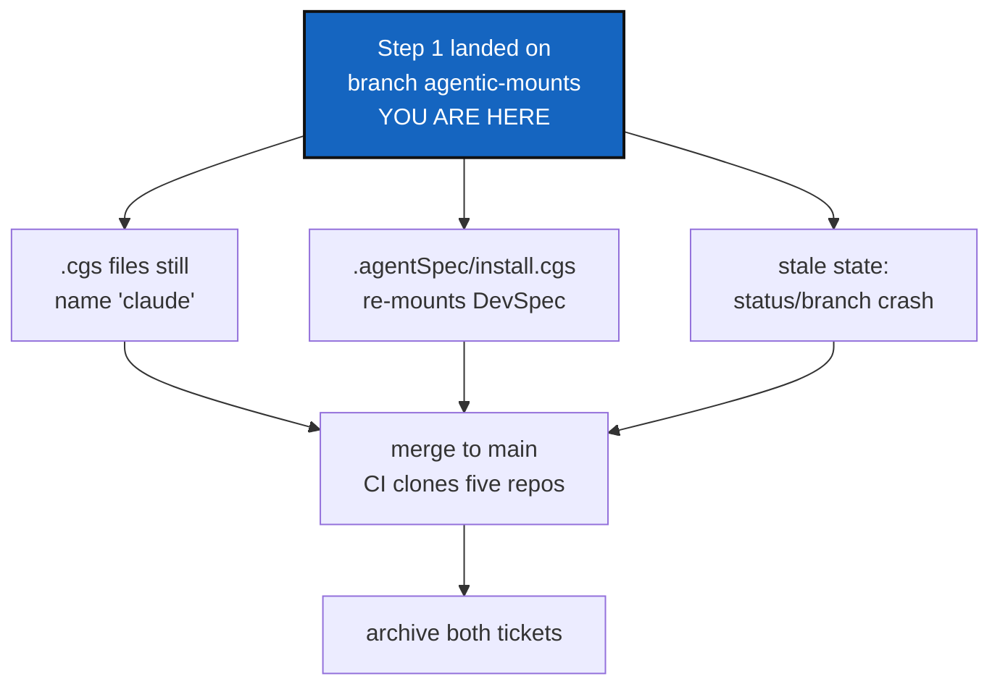

# AgenticMounts Step 2 — wire the mounts to the real repositories

*Created: 2026-09-05*

## Abstract — read this first

**The one-line version.** All three repositories are now live and hold step
1's content; what is left is to correct the repository name the `.cgs` files
still use, give `.agentSpec` its own `install.cgs` so `DevSpec` stays mounted
inside it exactly as it was before, and only then merge to `main`.

**What this document is.** A plan that starts from the state left by
[AgenticMounts_DevPlanTicket.md](AgenticMounts_DevPlanTicket.md), which is
implemented on the branch `agentic-mounts` but not merged. Nothing in step 2
has been done yet.

**Why it exists.** Three facts changed after step 1 was written. The owner
created `flipoyo/.agentSpec`, `flipoyo/.localSpec` and `flipoyo/.claude`,
all public, and pushed step 1's content into them — so the mounts exist,
but the three `.cgs` files still name the third one `claude`, which is not
its name. `DevSpec` is not to be retired after all: it stays a repository of
its own, keeps the three documents it already owned, and is mounted inside
`.agentSpec` the way it was mounted inside `AgentSpec/` before step 1 — which
reverses step 1's decision D3 and is most of this ticket's work. And step 1
deleted the root-level `DevSpec/` directory from the shared workspace while
the recorded runtime state still lists it, so `cgitsync status` and
`cgitsync branch` now die with a raw `FileNotFoundError` traceback.

**What you will find.** §0 the verified state, repository by repository. §1
the three things that are still wrong. §2 the decisions — D1 and D2 are
answered; D4 is the one still open. §3 the work in the order it has to
happen. §4 risks. §5 acceptance.

**Who it is for.** Whoever picks this up next, and the repository owner, who
has to answer D4 and confirm D3.

**What you need to do with it.** Answer D4, confirm D3, then do §3.



---

## 0. Where we are now

Every line below was checked against the live remotes and the working tree,
not assumed.

| Repository | On GitHub | Local checkout | In sync? |
|---|---|---|---|
| `flipoyo/ComplexGitSync` | `main` at `4f0afde` | branch `agentic-mounts` at `e4918c4`, clean, `pixi run lint` and `pixi run test` green (1039 passed) | branch not pushed |
| `flipoyo/.agentSpec` | public, `main` at `9124580` | `.agentSpec/` at `9124580` | yes — owner already pushed it |
| `flipoyo/.localSpec` | public, `main` at `072c361`, `ComplexGitSync` at `c52f8c3` | `.localSpec/` at the same two commits | yes — owner already pushed it |
| `flipoyo/.claude` | public, `main` at `dde391e`, `ComplexGitSync` at `6bce9d6` | `.claude/` at the same two commits, `origin` corrected to `…/.claude.git` | yes — owner already pushed it |
| `flipoyo/claude` | does not exist, and is not meant to | — | — |
| `flipoyo/DevSpec` | public, `main` at `ea5a079` | removed from the working tree in step 1 | — |

Two details that matter later:

- `.agentSpec`'s history **is** `DevSpec`'s history: `9124580` sits directly
  on top of `DevSpec`'s current `main` (`ea5a079`). The two repositories are
  fast-forward compatible, so moving content between them keeps authorship.
- `.agentSpec` therefore carries a full copy of `DevSpecs.md`, `DOCSTYLE.md`
  and the generic `AGENT.md` — the same three files `DevSpec` still holds.

## 1. What is still wrong

### 1.1 The `.cgs` files name a repository that does not exist

`install.cgs`, `examples/complexgitsync.cgs` and `ComplexGitSync.cgs` all
declare:

```toml
{ repository = "github:flipoyo/claude", default_branch = "ComplexGitSync", fallback_branch = "main", relative_path = ".claude" },
```

Two problems. The repository is called `.claude`, not `claude`, so this
entry currently points at nothing; and once the name is right,
`relative_path` becomes redundant, because a repository's default mount
point is its own name — the same reason `.agentSpec` and `.localSpec` carry
no `relative_path`. The entry should read:

```toml
{ repository = "github:flipoyo/.claude", default_branch = "ComplexGitSync", fallback_branch = "main" },
```

This is the only thing that would still fail a CI run outright: CI clones
every repository the `.cgs` lists over unauthenticated HTTPS
(`.github/workflows/ci.yml`, `--force-protocol https`), and `flipoyo/claude`
is not there to clone. Everything else left in this ticket is content work.
The local `.claude/` checkout already points at the right remote and needs
nothing.

### 1.2 `DevSpec` has to come back, mounted inside `.agentSpec`

Step 1's D3 folded `DevSpec` into `.agentSpec` and planned to archive it.
That is reversed: `DevSpec` stays a live repository, and `.agentSpec` gains
an `install.cgs` that mounts it at `.agentSpec/DevSpec/` — the same shape it
had at `AgentSpec/DevSpec/` before step 1.

This is an established pattern in this tree, not a new one. `docs/`
(`DocComplexGitSync`) already carries its own `docs/DocCGS.cgs`, which
mounts `flipoyo/DocSpec` at `docs/DocSpec/`; the `docs` entry in
`install.cgs` says `nested_config = "auto"`, and discovery picks that file
up because it is the only `.cgs` at that repository's root. `.agentSpec`
would work identically, with a single `install.cgs` at its root.

The consequence is the duplication in §0: with `DevSpec` mounted inside it,
`.agentSpec/DevSpecs.md` and `.agentSpec/DevSpec/DevSpecs.md` would both
exist. Step 1's own acceptance rule ("no file exists in two repositories at
once") and `DOCSTYLE.md` §7 both forbid that, so one copy has to go. Which
one is D2.

### 1.3 The workspace's recorded state still lists a `DevSpec/` that step 1 deleted

Step 1 removed the root-level `DevSpec/` checkout from the workspace
`/home/flipoyo/.cgs/CGS20260905095916/cgitsync`, because no `.cgs` declared
it any more. The workspace's *runtime state* was never refreshed, so it
still does. All four of these name `DevSpec` at the workspace root:

```
.cgitsync/.cgs/ComplexGitSync-main.cgs
.cgitsync/state(7cdcb14e…)_0/install.cgs
.cgitsync/state(7cdcb14e…)_0/install.gts
.cgitsync/state(7cdcb14e…)_0/ComplexGitSync.lgr
```

Any command that walks the recorded tree therefore visits a path that is no
longer there. `cgitsync status` and `cgitsync branch ComplexGitSync` both
end in an uncaught `FileNotFoundError: … /cgitsync/DevSpec`, traceback and
all — reported from the owner's own checkout at
`~/Programmes/ComplexGitSync`, which is a *second* clone, still on `main`
and still declaring `DevSpec` at the root, administering that same shared
workspace.

**The crash is a defect in its own right, and a small one to fix.**
`orchestre.py`'s `_repo_status_row` already wraps its Git calls in
`try/except GitSyncError` and degrades to an `"error"` row — that is exactly
the intended behaviour for a repository it cannot inspect. But
`git_runner._run()` passes `cwd=repo_path` straight to `subprocess.run`, and
a missing `cwd` makes Python raise `FileNotFoundError`, which is not a
`GitSyncError`, so the handler never sees it. Translating that one exception
into the module's own typed error at that boundary fixes both commands at
once: `status` prints its `error` row, and `local_branch_exists` returns
`False` through its own `except GitSyncError` (`git_runner.py:229`), so
`branch` degrades instead of dying.

Note that `subprocess.run` raises the same `FileNotFoundError` when the
`git` executable itself is missing, so the translation has to say which of
the two happened rather than blaming the working directory both times.

Two things follow, and they are separable: the workspace needs its state
regenerated (§3), and `git_runner.py` needs the guard (D4).

## 2. Decisions

### D1. The third repository's name — **settled**

It is `flipoyo/.claude`: public, `main` and `ComplexGitSync` both carrying
step 1's content (§0). The name is symmetrical with `.agentSpec` and
`.localSpec`, and it is what makes `relative_path` unnecessary in §1.1.
Nothing is left to decide here; the `.cgs` entries just have to catch up.

### D2. Which repository owns `DevSpecs.md`, `DOCSTYLE.md` and the `AGENT.md` template? — **answered: `github.com:flipoyo/DevSpec`**

Option A below. `DevSpec` keeps all three documents and stays their single
home; `.agentSpec` becomes the shell around it — `install.cgs`,
`README.md`, `TICKETLIFECYCLE.md`, `LICENSE`, `.gitignore` — and mounts
`DevSpec` at `.agentSpec/DevSpec/`. Every reference step 1 wrote as
`.agentSpec/DevSpecs.md` therefore becomes `.agentSpec/DevSpec/DevSpecs.md`,
and likewise for `DOCSTYLE.md` and the template `AGENT.md`.

The options as they were weighed, kept as the record of why:

| Option | `.agentSpec/` holds | `.agentSpec/DevSpec/` holds | Cost |
|---|---|---|---|
| **A — chosen** | `install.cgs`, `README.md`, `TICKETLIFECYCLE.md`, `LICENSE`, `.gitignore` | `DevSpecs.md`, `DOCSTYLE.md`, `AGENT.md` | Move step 1's edits into `DevSpec`, delete the three files from `.agentSpec`, and rewrite `.agentSpec/X.md` → `.agentSpec/DevSpec/X.md` in about six files |
| B | everything, as today | mounted but unused, or emptied to a pointer `README.md` | Almost none — but `DevSpec` stops being "as it was", and any other project that mounts `DevSpec` reads a dead repository |
| C | everything | a full second copy | None now, drift forever. Violates step 1's acceptance and `DOCSTYLE.md` §7 — listed only to be ruled out |

A was chosen because it is what §1.2 actually asked for, and because it
reproduces the `docs/` → `docs/DocSpec/` arrangement exactly: a mounted
repository that itself mounts the shared, project-agnostic spec. `DevSpec`
keeps its identity and its history, other consumers keep working, and
`.agentSpec` becomes what its name says — this owner's agent-facing shell
around a shared spec.

Under A, the migration is small because the histories match (§0): the three
documents' step-1 edits are cherry-picked onto `DevSpec`'s `main`, and
`.agentSpec` keeps only the files that were never DevSpec's
(`TICKETLIFECYCLE.md`, plus a `README.md` rewritten to describe the shell).
`LICENSE` stays in both — a licence file per repository is normal and is the
one deliberate exception to "no file in two repositories".

### D3. What `.agentSpec/install.cgs` should say

Modelled on `docs/DocCGS.cgs`, which is the working precedent:

```toml
# .agentSpec's own topology: the shared agent-facing spec repositories.
# DevSpec has no .cgs of its own, so it resolves as a normal leaf.

project = ".agentSpec"

repos = [
    { repository = "github:flipoyo/.agentSpec", relative_path = ".", fallback_branch = "main" },
    { repository = "github:flipoyo/DevSpec", fallback_branch = "main", nested_config = "disabled" },
]
```

Confirm the project name (`.agentSpec` here) and the filename. You asked for
`install.cgs`; the equivalent file in `docs/` is named `DocCGS.cgs`. Either
works — auto-discovery only requires that it be the single `.cgs` at that
repository's root — but the two trees will read more consistently if they
agree.

### D4. Is the `FileNotFoundError` guard part of this ticket?

§1.3's crash is a defect in `git_runner.py`, not in the mounts work. It was
surfaced by this work and will keep firing while the topology moves, so:

| Option | Meaning |
|---|---|
| **A (recommended)** | Fix it here, as its own commit: translate a missing `cwd` into `GitSyncError` in `git_runner._run`, distinguish it from a missing `git` executable, and add a unit test that a status row for a deleted repository degrades instead of raising. One concern per commit is preserved; the ticket that found the bug is the ticket that closes it |
| B | Open a separate ticket and leave `status` crashing until it is picked up — which also means §3's smoke test has to be read past a traceback |

Whichever is chosen, regenerating the workspace state (§3) is required
either way: the guard stops the crash, but the recorded tree would still
list a repository that is not there.

## 3. The work, in order

Already done, before this ticket starts: all three repositories exist,
public, and hold step 1's content, pushed by the owner (§0). What follows is
what is left.

| # | Step | Where |
|---|---|---|
| 1 | Rewrite the `claude` entry per §1.1 in `install.cgs`, `examples/complexgitsync.cgs` (byte-identical, `tests/unit/test_install_cgs.py`) and `ComplexGitSync.cgs`; add `nested_config = "auto"` to the `.agentSpec` entry | ComplexGitSync |
| 2 | Apply D2: move the three documents to whichever repository wins, and rewrite the references that name them — `.claude/CLAUDE.md`, `.claude/AGENT.md`, `.localSpec/AGENT.md`, `.agentSpec/README.md`, `.agentSpec/TICKETLIFECYCLE.md` | three repositories |
| 3 | Add `install.cgs` per D3; add `/DevSpec/` to `.agentSpec`'s tracked `.gitignore` | `.agentSpec/` |
| 4 | Push `.agentSpec`, `.localSpec` and `.claude` where D2 and step 3 touched them, and `DevSpec` | GitHub |
| 5 | If D4 is A: guard `git_runner._run` against a missing `cwd`, with a unit test, in its own commit | ComplexGitSync |
| 6 | Regenerate the workspace's runtime state so it stops listing a root-level `DevSpec/`: re-run `initialise` against the corrected `install.cgs`, then check which snapshot `status` resolves. A changed `.cgs` hashes to a *new* `state(<hash>)_0` directory, so confirm the stale one is no longer preferred, and remove it if it is | CGSHOME workspace |
| 7 | Smoke-test `cgitsync initialise install.cgs` into a scratch directory: five mounts plus `.agentSpec/DevSpec/`, a resolving `CLAUDE.md` symlink, and the three mount points in the root `.gitignore`. Then `cgitsync status` from both checkouts, clean | local |
| 8 | `pixi run lint`, `pixi run test`, then `pixi run bump-version` and rebuild any `.tex` it touched | ComplexGitSync |
| 9 | Merge `agentic-mounts` to `main`; confirm CI is green, meaning it cloned all five repositories over HTTPS | GitHub |
| 10 | Pull `main` into `~/Programmes/ComplexGitSync` so the owner's own checkout stops declaring a root-level `DevSpec` (§4) | local |
| 11 | Stamp and move both this ticket and `AgenticMounts_DevPlanTicket.md` to `AgentSpec/archive/`, per `TICKETLIFECYCLE.md`, in the merge commit's branch | ComplexGitSync |

On step 7: this stays a manual smoke test rather than a new integration
test. `DevSpecs.md`'s *Testing* section forbids tests that depend on network
access, and cloning five GitHub repositories is exactly that. Step 1 already
covered the offline half — dot-named mounts, per-repository `default_branch`
overrides, and hidden directories staying visible to discovery — with unit
tests.

## 4. Risks

| Risk | Handling |
|---|---|
| The branch merges while a `.cgs` still names `flipoyo/claude`, and CI fails on `main` for everyone | Step 1 of §3 comes first, and §3's step 5 smoke-tests a real `initialise` before the merge |
| A later repository is created private, and CI's unauthenticated HTTPS clone fails | All five are public today; keep them so — CI clones with `--force-protocol https` and no credentials |
| The D2 move lands half-way — the three files are deleted from `.agentSpec` but `DevSpec` never receives step 1's edits to them, losing that work | Push `DevSpec` before deleting anything in `.agentSpec`, and diff the two copies before the delete |
| `.agentSpec` grows a second `.cgs` later, and auto-discovery becomes ambiguous | Keep exactly one `.cgs` at its root — `tests/unit/test_discovery.py` already proves the failure mode (`test_auto_with_multiple_cgs_raises`) |
| Step 1's reference rewrite is redone by D2 option A, and a path is missed | The same grep that closed step 1 closes this one — see §5.3 |
| Two checkouts administer one workspace: `~/Programmes/ComplexGitSync` (on `main`, still declaring a root-level `DevSpec`) and the CGSHOME clone (on `agentic-mounts`). Changing the tree from one breaks the other, which is exactly what §1.3 is | §3's step 10 pulls `main` into the second checkout once the branch merges. Until then, drive the tree from the CGSHOME clone only |
| A future change deletes a mounted directory again and leaves the state stale | D4 option A turns the resulting crash into a readable `error` row, so the next occurrence is diagnosable rather than fatal |

## 5. Acceptance

1. `pixi run lint` and `pixi run test` pass, and CI is green on `main` after
   the merge — meaning it cloned all five repositories.
2. `cgitsync initialise` on a fresh clone produces `ComplexGitSync`, `docs/`,
   `.agentSpec/` (containing `DevSpec/`), `.localSpec/` and `.claude/`, with
   a readable `CLAUDE.md` at the root.
3. `grep -rn "flipoyo/claude"` returns nothing, and no `.cgs` entry carries a
   `relative_path` that merely repeats its repository's name.
4. `grep -rn "\.agentSpec/DevSpecs\.md\|\.agentSpec/DOCSTYLE\.md"` returns
   nothing outside `AgentSpec/archive/`: under D2 those paths now carry the
   `DevSpec/` segment.
5. No file except `LICENSE` exists in two of the five repositories at once.
6. `cgitsync status` runs to completion from both checkouts, and — if D4 is
   A — a repository whose directory has been deleted shows as an `error`
   row instead of raising `FileNotFoundError`.
7. Both this ticket and `AgenticMounts_DevPlanTicket.md` are stamped and
   archived.
