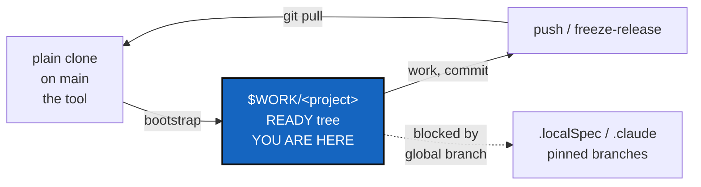

# AgenticMounts Step 3 — one protocol, from a plain clone to a managed tree and back

*Created: 2026-09-05*

## Abstract — read this first

**The one-line version.** Finish what step 2 left behind (two clean-ups,
§1.7), then make one round trip work and document it: clone ComplexGitSync on `main`, run
one command, get a `READY` tree at `$WORK/<project-name>` with every
repository on the branch it should be on, work there, push, and pull the
result back into the plain clone.

**What this document is.** A plan. Step 2 is merged: `main` is at
`8923ee0` and its build passed, which means it cloned all five mounts.
Nothing in step 3 has been started.

**Why it exists.** The mounts work — a `bootstrap` from the real remotes
produces a `READY` seven-repository tree. What does not work is *living*
with it. Three things get in the way. Tree-wide `branch`, `checkout` and
`pull` propagate one branch name across every repository, which would drag
the shared `.localSpec` and `.claude` mounts off the project branch they
are pinned to, and would create a project's feature branches inside
repositories other projects share. `install.cgs` names a project branch,
`autoTest`, that does not exist on the remote, so every bootstrap silently
falls back to `main`. And `$CGSHOME` silently binds whatever directory you
happen to be in to a workspace somewhere else, which is how a `status` run
from a second checkout ended up walking a tree it did not belong to.

**What you will find.** §0 the verified state. §1 what step 2 left open.
§2 the round trip this ticket has to make true, in commands. §3 the one
thing in the code that blocks it. §4 the decisions — D1 is the expensive
one. §5 the work in order. §6 risks. §7 acceptance.

**Who it is for.** Whoever picks this up next, and the repository owner,
who has to answer §4.

**What you need to do with it.** Answer §4, then do §5.



---

## 0. Where we are now

| Repository | Branch | State |
|---|---|---|
| `flipoyo/ComplexGitSync` | `main` at `8923ee0` | Merged, and the build passed on that commit. `agentic-mounts` is fully contained in it |
| `flipoyo/.agentSpec` | `main` at `56d492f` | The shell: `TICKETLIFECYCLE.md`, `README.md`, `install.cgs` |
| `flipoyo/DevSpec` | `main` at `a5d3432` | `DevSpecs.md`, `DOCSTYLE.md`, `AGENT.md` template |
| `flipoyo/.localSpec` | `ComplexGitSync` at `68836a7` | `AdditionalSpecs.md`, `AGENT.md`, `audit.md` |
| `flipoyo/.claude` | `main` + `ComplexGitSync` at `df4221c` | `CLAUDE.md`, `AGENT.md`, `settings.json` |
| `flipoyo/DocComplexGitSync` | `main` at `5f17d6e` | `\cgsversion` 0002.37, PDFs rebuilt |

A `bootstrap` against these remotes was smoke-tested end to end and produced
a `READY` tree of seven repositories with zero errors: `docs/` +
`docs/DocSpec/`, `.agentSpec/` + `.agentSpec/DevSpec/`, `.localSpec/` and
`.claude/` — the last two correctly on their `ComplexGitSync` branch. The
mounts are not in question. The workflow around them is.

## 1. What step 2 left open

| # | Item | Why it is still open |
|---|---|---|
| 1.1 | ~~Merge `agentic-mounts` into `main`~~ — **done**: `main` is at `8923ee0`, and the build for that commit finished with `success`, so it cloned all five repositories over HTTPS | Merged by the owner |
| 1.2 | ~~Archive the first two tickets~~ — **done**, stamped and moved to `AgentSpec/archive/20260905_AgenticMounts_DevPlanTicket.md` and `AgentSpec/archive/20260905_agenticMountStep2-DevPlanTicket.md` | Archived on the owner's instruction, on the branch that carries the work, so the move lands with the merge |
| 1.3 | Regenerate the workspace's runtime state | Still open. Its `.gts` lists a root-level `DevSpec/`, so `status` reports one `error` row. `pull` cannot refresh it (§3). §1.7 step 2 is the exact command |
| 1.4 | Pull `main` into `~/Programmes/ComplexGitSync` | Still open. That checkout still describes the old layout. §1.7 step 1 |
| 1.5 | The audit finding logged in `.localSpec/audit.md` | Now §3 of this ticket: it blocks the protocol rather than merely lurking |

### 1.6 The merge, repository by repository

Six repositories carry step 2's work. Only one of them has anything to
merge.

**The rule for which way a merge flows.** On the shared mounts, `main` is
the baseline every project inherits, and a project branch never merges back
into it. A change that is generic goes to `main` first, then `main` is
merged *forward* into each project branch. A change that is specific to one
project stays on that project's branch. On the root repository, work
happens on a feature branch and merges into `main` in the normal way.

| Repository | Branches | What to do now |
|---|---|---|
| `ComplexGitSync` | `agentic-mounts` → `main` | **The only merge.** Done: `main` at `8923ee0`, build green |
| `.agentSpec` | `main` | Nothing. Pushed at `56d492f` |
| `DevSpec` | `main` | Nothing. Pushed at `a5d3432` |
| `.localSpec` | `main`, `ComplexGitSync` | Nothing. `main` has not changed, so there is nothing to merge forward |
| `.claude` | `main`, `ComplexGitSync` | Nothing. `main` gained a generic ignore rule, and it was merged forward at `18b8a7f` |
| `DocComplexGitSync` | `main` | Nothing. Pushed at `5f17d6e` |

**Check before merging.** The build clones every repository the `.cgs`
names, over HTTPS, with no credentials. So each name must exist and each
declared branch must be present:

```bash
for r in ComplexGitSync .agentSpec .localSpec .claude DocComplexGitSync DevSpec; do
    printf '%-22s ' "$r"
    git ls-remote --heads "git@github.com:flipoyo/$r.git" | awk '{print $2}' | paste -sd' '
done
```

**Then merge the root repository.** Either open a pull request, or:

```bash
cd "$CGSHOME"
git checkout main
git pull --ff-only
git merge --no-ff agentic-mounts
git push origin main          # this is what starts the build
```

### 1.7 The two clean-ups, exactly

Two checkouts need attention afterwards. They share nothing on disk, so the
order between them is free; do the plain clone first only so that commands
run from it use the merged code.

Names used below: **A** is the plain clone, `~/Programmes/ComplexGitSync`.
**B** is the workspace, `/home/flipoyo/.cgs/CGS20260905095916/cgitsync`.

**Step 0 — from the shell you are about to use.** An exported `$CGSHOME`
silently redirects every command below (§2.4):

```bash
echo "${CGSHOME:-<unset>}"        # if it prints a path: unset CGSHOME
```

**Step 1 — from A. Update the plain clone.**

```bash
cd ~/Programmes/ComplexGitSync
git pull --ff-only
pixi install                      # the version moved to 0002.37, so the lock changed
```

`CLAUDE.md` in A becomes a symbolic link into `.claude/`, which A does not
have, so it dangles. That is expected in a plain clone with no mounts, and
is the accepted cost of D1 in the first ticket.

**Step 2 — from B. Refresh the recorded state.**

```bash
cd /home/flipoyo/.cgs/CGS20260905095916/cgitsync
git pull --ff-only
CGSHOME=/home/flipoyo/.cgs/CGS20260905095916/cgitsync \
  pixi run cgitsync initialise /home/flipoyo/.cgs/CGS20260905095916/cgitsync/install.cgs
```

**The `CGSHOME=` prefix is mandatory, and must stay a prefix rather than an
export.** `initialise` does not use the walk-up search that `status` uses.
It resolves the workspace as `--output-path/<project name>`, then
`$CGSHOME` **used verbatim**, then `(current directory/../..)/<project
name>`. B's directory is named `cgitsync` while the project is named
`ComplexGitSync`, so every form that appends the project name points
somewhere else. That mismatch is why an earlier attempt with
`--output-path ..` created a stray
`/home/flipoyo/.cgs/CGS20260905095916/ComplexGitSync/` instead of
refreshing B.

**Step 3 — from B. Verify.**

```bash
cd /home/flipoyo/.cgs/CGS20260905095916/cgitsync
pixi run cgitsync status
```

Expect `repos=7`, `errors=0`, no `DevSpec` row at the top level, and one
`DevSpec` row at `.agentSpec/DevSpec`.

**What step 2 does and does not do**, rehearsed on a throwaway copy built
with the same directory-name mismatch and the same stale state:

- it attaches to the existing tree; it does not re-clone the mounts;
- it does **not** move the root repository's branch;
- it writes a new `state(<hash>)_0` directory. Older ones stay on disk and
  go inert, because `discover_gts_path` consults the most recently modified
  `.lgr` register first and uses the snapshot that register names;
- the phantom row disappears: errors went from 1 to 0.

Leave the older state directories alone. Each holds a hash-chained `.lgr`
register that `cgitsync verify` reads.

## 2. The round trip this ticket has to make true

Three hops. Each one names the branch every repository is on when the hop
ends — that is the part that has to be true, and the part §3 breaks.

### 2.1 Hop one — from a plain clone to a managed tree

```bash
git clone git@github.com:flipoyo/ComplexGitSync.git
cd ComplexGitSync            # on main — this checkout is the *tool*
pixi install

pixi run cgitsync bootstrap install.cgs <project-name> --cgs-path "$WORK"
export CGSHOME="$WORK/<project-name>"
cd "$CGSHOME" && pixi install
```

`bootstrap`'s second argument always forms the final path segment
(`paths.resolve_bootstrap_root`), so the tree lands at
`$WORK/<project-name>` whatever the `.cgs` calls the project. Without
`--cgs-path` it lands in a fresh `$HOME/.cgs/CGS<timestamp>/` instead.

Where each repository should be when this ends:

| Repository | Path | Branch | Why |
|---|---|---|---|
| ComplexGitSync | `.` | the project branch (D2) | `project.default_branch`, falling back to `main` |
| DocComplexGitSync | `docs/` | follows the project branch | no branch of its own declared |
| DocSpec | `docs/DocSpec/` | `main` | nested, shared |
| `.agentSpec` | `.agentSpec/` | `main` | shared by every project |
| DevSpec | `.agentSpec/DevSpec/` | `main` | shared by every project |
| `.localSpec` | `.localSpec/` | `ComplexGitSync` | **pinned** — this project's branch |
| `.claude` | `.claude/` | `ComplexGitSync` | **pinned** — this project's branch |

### 2.2 Hop two — working inside the tree

`$CGSHOME` is live-editable (`pixi.toml`'s editable install), so edits to
`src/ComplexGitSync/` take effect immediately. Tree-wide commands
(`status`, `add`, `commit`, `push`, `freeze-release`) run from there.

The rule this ticket must establish: **the pinned mounts keep their own
branch through every tree-wide command.** A feature branch created for this
project must never appear in `.agentSpec`, `DevSpec`, `DocSpec`, or on
another project's branch of `.localSpec`/`.claude`. That is §3.

### 2.3 Hop three — back to the plain clone

The tree root and the plain clone are two clones of one GitHub repository.
After `cgitsync push` (or `freeze-release`) from the tree:

```bash
cd ~/Programmes/ComplexGitSync
git fetch origin
git checkout <the tree's project branch>   # or merge it into main via a PR
git pull --ff-only
```

**How to handle the branch there — the question to settle in D2 and D4.**
Either the tree works directly on `main`, and the plain clone simply pulls
`main`; or the tree works on a project branch, and the plain clone either
tracks that same branch or takes it through a pull request into `main`.
What must not happen is the two checkouts sitting on different branches
while both believe they manage the same workspace.

### 2.3b The operational split: A is the tool, B is the project

You work in two checkouts. They have different jobs, and the separation
keeps branches intuitive.

| Checkout | Role | Branch | What runs there | Commands |
|---|---|---|---|---|
| A: `~/Programmes/ComplexGitSync` | The tool | `main`, or a feature branch for tool edits | The source code for `cgitsync` itself | Plain `git` work on the root. `bootstrap`, `initialise`, or `clone` when creating a new tree. Read docs |
| B: `/home/flipoyo/.cgs/CGS20260905095916/cgitsync` | The project | Project branch (e.g. `main`); or a feature branch for project work | An editable copy of `cgitsync` from A via `pixi.toml` | Tree-wide commands: `status`, `branch`, `checkout`, `commit`, `push`, `add`, `freeze-release`. Run from inside the tree |

**Separating them prevents confusion.** A holds tool changes. B holds project changes. A checkout lives on one branch at a time, so if you keep them in separate terminal windows, each window's branch is its job, and you never export `$CGSHOME` into the tool window.

**Branch discipline from this split:**

- Edit `src/ComplexGitSync/` in A, on a tool feature branch. Merge to A's `main` when it is tested.
- Push the new tool version from A's `main`.
- In B, work on the project branch. Run `cgitsync` commands there. They use the latest tool from A.
- When you push from B, go back to A and pull `main` to see the changes. A is the "source of truth" for the tool; B reads from it.

**The rule that matters:** Do not export `$CGSHOME` from a shell you also use for A. It overrides the walk-up mechanism that keeps B's commands finding B, and that is what caused the crash.

### 2.4 Which checkout runs the command, and how it finds the tree

Two independent choices are made every time you type a command, and mixing
them up is what caused the crash reported at the start of step 2.

**The directory you launch from decides which code runs.** `pixi run
cgitsync` from the plain clone runs the plain clone's copy of
ComplexGitSync. The same command from inside `$WORK/<project-name>` runs
*that* tree's copy, because `pixi.toml` installs the package as editable.
Editing `src/ComplexGitSync/` inside the tree changes the tool you are
running there, immediately.

**How the tree is found is a separate question, with two answers**,
depending on what the command does.

| Situation | Function | Resolution order |
|---|---|---|
| Creating a tree — `initialise`, `clone`, `bootstrap` | `paths.resolve_cgshome` | `--output-path/<project name>`, then `$CGSHOME`, then `(current directory/../..)/<project name>` |
| Working on a tree that exists — `status`, `branch`, `checkout`, `pull`, `add`, `commit`, `push`, `freeze-release` | `snapshot_resolver.discover_cgshome` | walk up from `--search-dir`, else walk up from `$CGSHOME`, else **walk up from the current directory**, looking for a `.cgitsync/` folder |

That second row is the good mechanism, and it is already there: a command
finds its tree by walking up from where you stand until it sees a
`.cgitsync/` folder. Stand in the tree and it just works. No variable, no
flag.

**What actually went wrong.** `~/Programmes/ComplexGitSync` has no
`.cgitsync/` folder, and neither does any directory above it — checked.
Walking up from there would have stopped with "Unable to locate CGSHOME".
It did not stop, so `$CGSHOME` was exported in that terminal, pointing at
the other tree. `bootstrap` prints that `export` line as its closing
advice, which is how it gets into a shell and then outlives its purpose.

**The discipline this ticket documents:**

1. Work inside the tree. `cd "$WORK/<project-name>"`, then run commands
   there. The walk-up finds the tree, and the tree's own code runs.
2. Do not leave `$CGSHOME` exported in a shell you also use for the plain
   clone. It overrides the walk-up from *any* directory, silently.
3. Use the plain clone for two things only: creating a tree with
   `bootstrap`, and ordinary `git` work on the root repository.
4. When a tree really must be driven from elsewhere, pass `--search-dir`
   on the command rather than exporting a variable. A flag is visible in
   the shell history; a variable is not.

D3 settles whether `bootstrap` should keep advertising `export CGSHOME=`
as its closing advice, given that this is where the trouble starts, and
whether the "two levels up" fallback in the first row should say out loud
that it is guessing.

## 3. What blocks it: one global branch versus pinned mounts

Not a suspicion — it is what the code says it does.
`operations.restart_tree`'s own docstring: *"Reads the current branch from
the root repository, propagates it across all repos, then pulls every
repository (parent-first)."* `checkout_tree` does the same through
`propagate_global_branch` and then `create_global_branch`, which **creates
the branch where it is missing**.

Applied to this topology:

| Command | What it does to `.localSpec` / `.claude` | Verdict |
|---|---|---|
| `cgitsync branch feature-x` | creates `feature-x` in them — and in `.agentSpec`, `DevSpec`, `DocSpec` | pollutes repositories other projects share |
| `cgitsync checkout main` | moves them off `ComplexGitSync` onto `main` | loses the per-project pinning |
| `cgitsync pull` | propagates the root's branch, then pulls it everywhere | same, plus it fails outright when a mount has no such branch |

`initialise` and `bootstrap` are the exception: they honour each entry's
declared `default_branch`, which is why the smoke test came out right. The
pinning is real at clone time and evaporates on the first tree-wide
operation.

## 4. Decisions — your call

### D1. How do pinned mounts survive a tree-wide branch operation?

| Option | Mechanism | Cost | Trade-off |
|---|---|---|---|
| **A (recommended)** | A new `.cgs` entry field — say `branch_policy = "pinned"` (default `"global"`) — that `propagate_global_branch` and `restart_tree` honour by leaving that repository on its declared `default_branch` | A grammar field with validation and authoring round-trip, plus the three operations and their tests; docs for the field | Explicit in the file: a reader sees which mounts follow the tree and which do not. The mechanism is reusable by any project vendoring a shared repository |
| B | Infer it: an entry that *declares* its own `default_branch` is pinned | Looks free, but normalization fills `default_branch` in on every entry, so "declared by the author" has to survive normalization — provenance the document does not currently keep | No new grammar, but the rule is invisible in the normalized document and surprising to anyone reading it |
| C | Drop branch-per-project: keep everything on `main` and carry project differences as directories inside `.localSpec` | No code | Unwinds step 1's D5 and breaks the property the whole split exists for — that `.localSpec/AdditionalSpecs.md` means the same path in every project |

A is recommended. It is the only one that states the intent where the
intent lives, and it leaves `initialise`/`bootstrap` unchanged, since they
already do the right thing.

### D1b. Two more `.cgs` features ship with `pinned` — **settled**

From `GitOrchestratorCommand_DevPlanTicket.md` §1. Both are `.cgs` grammar,
so they ship in the same pass as `pinned`: one round of validation,
authoring round-trip tests, documentation and rebuilt PDFs instead of two.

| Feature | What it does |
|---|---|
| A project-name token, e.g. `default_branch = "@project"` | Resolves to the project's own name, so the three-line recipe in tutorial 3 needs no `<ProjectName>` substituted by hand in two places |
| A project-level branch-policy default | Sets the policy once under `[project]`, with each repository entry free to override it |

**Implementation warning, from reading `cgs_format.py`.** The token has to
survive being written back out. Normalization fills `default_branch` in on
every entry, and `to_authoring_dict` decides what reaches the file. If the
token is expanded to a literal branch name during normalization and the
document is then saved, the file silently gains a hard-coded branch and the
recipe stops being reusable. The authoring round-trip test has to cover it.

### D2. What is the project branch — and does `autoTest` exist?

`install.cgs` and `examples/complexgitsync.cgs` declare
`project.default_branch = "autoTest"`, with `fallback_branch = "main"`.
There is no `autoTest` on the remote (`main`, `alpha-tech`, two `copilot/*`
branches, and `agentic-mounts`), so every bootstrap silently lands on
`main`.

| Option | Result |
|---|---|
| **A (recommended)** | Set the project branch to `main`. Hop three becomes "pull `main`", the plain clone never leaves `main`, and nothing is silent |
| B | Create `autoTest` on the remote and keep it as the tree's working branch. Hop three then needs a pull request into `main` before the plain clone sees anything |
| C | Leave it declared but absent, relying on the fallback | Rejected: a spec that names a branch nobody can see is exactly the stale-by-design content `DOCSTYLE.md` §6 forbids |

### D3. `$CGSHOME` discipline

Confirm the four rules in §2.4. Two follow-on questions, both about code
rather than habit:

- Should `bootstrap` stop printing `export CGSHOME=...` as its closing
  advice, and print `cd` into the tree instead? That variable is what
  silently redirected a command run from another checkout.
- Should the "two levels up" fallback in `paths.resolve_cgshome` say that
  it is guessing, instead of failing later somewhere deeper?

### D4. Does the plain clone track the project branch, or merge through a PR?

Follows from D2. If the project branch is `main` (D2 option A), this
question disappears. State the answer in the documentation either way,
because it is the one step a reader cannot guess.

### D5. Where the protocol is documented

Proposal, to confirm:

| Where | What |
|---|---|
| `README.md` | A new subsection under §2 — the three hops, in commands, next to the existing standalone/nested split |
| `docs/Text/getting_started.tex` | The same round trip as the main worked path, since it is the first thing a new user does |
| `docs/Text/user_guide.tex` | The `$CGSHOME` resolution order and the branch rules per command |
| `tutorials/04_managing_a_project_tree.md` | The full walk-through, with `tutorials/README.md` and README §4's list updated |

A fourth tutorial means the docs PDFs need rebuilding (`latexmk`) and the
`DocComplexGitSync` repository needs its own commit and push, as in step 2.

## 5. The work, in order

| # | Step | Where |
|---|---|---|
| 1 | Merge `agentic-mounts` into `main`; confirm CI cloned all five repositories and is green | GitHub |
| 2 | ~~Archive the first two tickets~~ — done ahead of the merge; they are in `AgentSpec/archive/` with a `20260905_` stamp | ComplexGitSync |
| 3 | `git pull` in `~/Programmes/ComplexGitSync`; re-run `initialise` against the merged `install.cgs` so the workspace state stops listing a root-level `DevSpec/` | both checkouts |
| 4 | Implement D1 and D1b: the `pinned` field, the project-name token, the project-level policy default — each with validation, authoring round-trip tests, and the three branch operations that must honour them | ComplexGitSync |
| 5 | Apply them to `install.cgs`, `examples/complexgitsync.cgs`, `ComplexGitSync.cgs`, and to `.agentSpec/install.cgs`; apply D2's project branch | ComplexGitSync, `.agentSpec` |
| 6 | Prove the round trip on a clean clone: bootstrap, check every branch against §2.1's table, create a feature branch and confirm it appears in *no* shared mount, commit, push, pull it back into the plain clone | local |
| 7 | Write the documentation per D5; rebuild the PDFs; commit and push `DocComplexGitSync` | ComplexGitSync, `docs/` |
| 8 | `pixi run lint`, `pixi run test`, `pixi run bump-version`, rebuild PDFs again if the version moved | ComplexGitSync |
| 9 | Merge, confirm CI, archive this ticket | GitHub |

**What comes after.** `GitOrchestratorCommand_DevPlanTicket.md` adds a
`.goc` file that records which tree a directory drives, replacing the
invisible `$CGSHOME`. It waits for this ticket, because it names a branch
policy that has to exist first, and because it automates the protocol §2
sets down — which has to be settled before it is worth automating.

## 6. Risks

| Risk | Handling |
|---|---|
| D1 lands as option B and the pinning rule becomes invisible in the normalized `.cgs` | Prefer A; whichever wins, `cgitsync validate` must show the effective policy per repository |
| A feature branch reaches `.agentSpec`, `DevSpec` or `DocSpec` before D1 is implemented, polluting repositories other projects share | Until D1 lands, do not run `branch`/`checkout` on a tree carrying pinned mounts — work on the root repository with plain `git` |
| Step 6's proof passes on one machine and the protocol still confuses a reader | The documentation in D5 is written from the transcript of step 6, not from memory |
| The docs repository drifts from the code repository, since they merge separately | Push `DocComplexGitSync` in the same session as the ComplexGitSync merge, as step 2 did |
| `autoTest` is resurrected later and the fallback goes silent again | D2 option A removes the fallback path entirely |

## 7. Acceptance

1. `pixi run lint` and `pixi run test` pass; CI is green on `main` after
   each merge.
2. From a clean clone on `main`, one `bootstrap` produces a `READY` tree at
   `$WORK/<project-name>` whose branches match §2.1's table exactly.
3. `cgitsync branch <name>` on that tree creates the branch in the project's
   own repositories and in **none** of `.agentSpec`, `DevSpec`, `DocSpec`,
   `.localSpec`, `.claude`; `cgitsync checkout` and `cgitsync pull` leave
   the pinned mounts on their declared branch.
4. A change made in the tree, pushed from it, arrives in the plain clone
   with the documented commands and no manual repair.
5. `cgitsync status` is clean from the tree, and from the plain clone with
   no `$CGSHOME` exported it either acts on nothing or says plainly what it
   would act on.
6. The protocol is in `README.md`, `docs/Text/`, and
   `tutorials/04_*.md`; the PDFs are rebuilt and `DocComplexGitSync` is
   pushed.
7. No `.cgs` in the tree names a branch that does not exist on its remote.
8. All three AgenticMounts tickets are stamped and archived.
