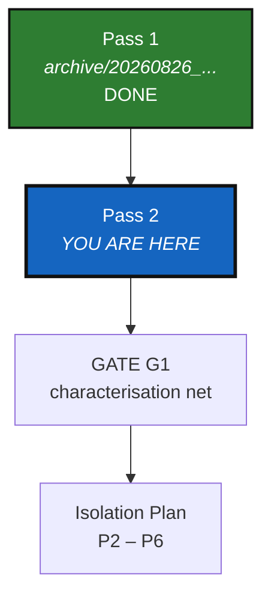

# DevPlanTicket — Deletion & Cleanup, Pass 2

*Created: 2026-08-28*

## Abstract — read this first

**What this document is.** A second deletion pass, proposed but not yet
executed, to run *before* `AgentSpecs/IsolationPlan.md`'s module-splitting
work starts — so isolation begins from a clean, minimal package instead of
one still carrying an unfinished subsystem and a handful of confirmed dead
ends.

**Why it exists.** Two things changed since Pass 1 closed
(`AgentSpecs/archive/20260826_Deletion_DevPlanTicket.md`): the Isolation
Plan's feasibility review surfaced gaps between the planned target state and
the actual package, and the Memory subsystem — kept by Pass 1's D5 decision
on the evidence that it was live and tested — is not production-ready and
must go. This ticket also carries a fresh dead-end sweep against the current
codebase, following the same rule Pass 1 used: verify before proposing,
propose before deleting.

**What you will find.** The same guardrails as Pass 1 (G-1–G-4), seven
steps (D1–D7), each opening with the verification evidence, and a closing
inventory. D1 (Memory) is the large one; D2–D4 are small, independently
verified dead-end deletions; D5–D6 are the doc-simplification and
plan-sync follow-through the deletion enables.

**Who it is for.** Whoever executes this next — human or agent. Same
execution discipline as Pass 1: at least one commit per step, no push.

**What you need to do with it.** Nothing yet. This is a proposal for
sign-off, not an executed ticket — no step below has been run.



---

## Rule of execution

Unchanged from Pass 1: if it is unnecessary, a dead end, or "for later" —
delete it. No frozen tier, no deprecation window, no compatibility shim, no
`# TODO: revisit`. Git history is the archive.

## Guardrails

Identical to Pass 1's G-1–G-4:

- **G-1 — Tag before the sweep**: `git tag pre-cleanup2-$(date +%Y%m%d)`,
  kept local (no push — the operator pushes manually, same as Pass 1).
- **G-2 — Evidence before deletion**: every step opens with the command
  that produced its evidence, run fresh against the current tree, not
  copied from Pass 1 or from this document's own drafting.
- **G-3 — Never delete to make a failing test pass.**
- **G-4 — One step, one commit.** `DELETE` / `MOVE` / `CHANGE` never mixed
  in the same commit — the distinction the Isolation Plan's §3.4 calls out
  explicitly for `AGENT.md`.

Commit message format, unchanged:

```
<delete|move|test|docs>: <what>

Evidence:
  $ <verification command>
  <output>

Recoverable from tag pre-cleanup2-<YYYYMMDD>.
```

---

## D1 — Delete the Memory subsystem (reverses Pass 1 §D5)

**Kind:** `DELETE`. **Size:** the largest step in this pass.

### Why this reopens a closed decision

Pass 1's D5 verified Memory was live, tested, and CLI-wired, and kept it on
that evidence. That evidence hasn't changed — what's changed is the
operator's assessment of *readiness*: Memory is not production-ready. Being
tested is not the same as being finished, and the ticket's own rule of
execution applies here exactly as it did to `.goc`: unfinished, unshippable
surface is a dead end regardless of test coverage.

Removing it now also simplifies what's ahead: the Isolation Plan's §1 Ring
model currently has to carry two Ring-4 adapters (`cli`, `memory`) and its
§7 decision #5 has to scope a dedicated `memory/` module boundary for a
transport nobody is about to ship. Both go away with this step (see D6).

### The naming collision this step must not walk into

"Memory" names two unrelated things in this codebase, and a shallow
grep-and-count pass (which is what this ticket originally ran) cannot tell
them apart:

1. **The external SSH-Git Memory transport** — `remember` / `memorize` /
   `retrieve` / `reload`, `MemoryBinding`, `forge43.io`. This copies the
   local `.cgitsync/` directory *out* to a separate remote git repository.
   **This is what "not ready yet" refers to, and it is what this step
   deletes.**
2. **The local, per-command "Memory State" directory allocator** —
   `MemoryStateDirectory`, `_resolve_memory_state_directory`,
   `_temporary_state_directory_name` — despite the name, this is the
   *general* mechanism `write_gts_snapshot()` uses to allocate every
   `.cgitsync/state(<hash>)_<n>/` directory, for **every** operation
   (`initialise`, `pull`, `checkout`, `push`, `commit`-adjacent flows,
   `branch`, `freeze`, `freeze_release`, `launch_release` — confirmed by
   reading every `write_gts_snapshot(command_origin=...)` call site).
   **This is exactly the "inner memory... saved in `.cgitsync`" that must
   remain committable/pushable in the project's own repo, and this step
   must not touch it.**

Verified 2026-08-28 by tracing every call site (not just counting them) —
`grep -c` alone had already misled this ticket's first draft into listing
#2 as "Memory-exclusive, safe to delete," which would have broken
`write_gts_snapshot` — the snapshot writer every single lifecycle command
depends on. The correction below replaces that draft.

### Verify

```bash
grep -rn "memor\|MEMORY\|forge43\|remember\|retrieve\|reload" \
  src/ tests/ docs/ README.md CLAUDE.md AgentSpecs/ | grep -v "\.lock\|IsolationPlan\.md\|CleanupPass2"
```

then, for every symbol that grep surfaces, trace its actual callers (not
just count them) before adding it to either list below — a low hit count
means "few callers," not "callers are all part of the transport."

### Keep — confirmed core/shared, traced call-by-call (2026-08-28)

| Symbol | Why it stays |
|---|---|
| `MemoryStateDirectory`, `_resolve_memory_state_directory`, `_temporary_state_directory_name` | Sole allocator for `.cgitsync/state(<hash>)_<n>/`; `write_gts_snapshot`'s only caller, itself called by every lifecycle command |
| `_state_directory_name`, `_next_state_directory_order`, `_format_state_id` | Shared with `.lgr`/state-snapshot machinery (3, 3, 5 call sites) — Pass 1's original D5 note, still correct |
| `GitRunner.stage_all`, `.has_staged_changes`, `.rev_parse_head`, `.clone`, `.remote_get_url`, `.remote_branch_exists`, `.remote_tag_exists` | Each has real non-`memory_repo` callers in `operations.py`/`git_tree.py`/`orchestre.py`'s general tree operations — confirmed by reading every call site, not just counting them |

### Delete — confirmed transport-exclusive, every call site traced to `memory_repo`/`binding.*`

- **`cli.py`**: the four `elif command_name == "..."` branches for
  `remember`/`memorize`/`retrieve`/`reload`, their `_handle_*`/`_execute_*`
  pairs, and their four entries in `_PLANNED_COMMANDS`.
- **`orchestre.py` — classes**: `MemoryBinding`, `MemoryRememberResult`,
  `MemoryMemorizeResult`, `MemoryRetrieveResult`, `MemoryReloadResult`,
  `MemoryBindingStore`, `MemoryReloadSelection`.
- **`orchestre.py` — constants/regexes**: `DEFAULT_MEMORY_SERVICE`,
  `DEFAULT_MEMORY_REMOTE_NAME`, `MEMORY_CONFIG_FILENAME`,
  `_MEMORY_NAME_RE`, `_MEMORY_REMOTE_NAME_RE`, `_MEMORY_SERVICE_RE`,
  `_MEMORY_SSH_URL_RE`.
- **`orchestre.py` — module functions** (each verified single-purpose,
  called only from the methods below or from each other):
  `_memory_repository_path`, `_memory_copy_ignore`,
  `_validate_current_memory_path`, `_validate_memory_cgitsync_tree`,
  `_select_latest_memory_state`, `_rebase_path_under_root` (its one caller,
  `_rebase_registry_to_project_root`, is itself transport-exclusive).
- **`orchestre.py` — `ComplexGitSyncClient` methods**: `remember()`,
  `memorize()`, `retrieve()`, `reload()`, `load_memory_binding()`,
  `_rebase_registry_to_project_root()`, `_trigger_memorize_after_success()`.
- **`orchestre.py` — `ComplexGitSyncClient` dataclass fields**:
  `last_memory_result`, `_memory_trigger_suppression_depth`.
- **`orchestre.py` — `GitRunner` methods** (every call site targets
  `memory_repo`/`binding.remote_url`, confirmed none are shared):
  `validate_memory_remote`, `checkout_branch`, `configure_remote`,
  `fetch_branch`, `reset_to_fetch_head`, `init_repository`,
  `is_git_repository`, `remote_head`, `fsck_full`. (Note: `checkout_branch`
  is a distinct method from the general `checkout`, and `init_repository`
  is distinct from the general `clone` — verified both exist separately;
  deleting the transport-only pair does not touch the general ones.)
- **`__init__.py`**: the Memory-result class exports.

### Surgical edits — not deletions — inside three general lifecycle methods

The auto-memorize hook is called from exactly two places
(`_trigger_memorize_after_success(` has exactly two call sites, confirmed),
both inside otherwise-general methods. Remove only the hook lines, keep
everything else in these methods unchanged:

- **`ComplexGitSyncClient.push()`**: remove `self.last_memory_result =
  None`, remove the `memory_result = self._trigger_memorize_after_success(
  ...)` call, remove the `memory_status=...` keyword from the trailing
  `push_end` `_log_event` call.
- **`ComplexGitSyncClient.freeze()`**: the same three removals
  (`self.last_memory_result = None`, the trigger call, and
  `memory_status=...` in the `freeze_release_end` `_log_event` call — note
  this is the low-level `freeze`, not `freeze_release`).
- **`ComplexGitSyncClient.freeze_release()`**: remove the
  `self._memory_trigger_suppression_depth += 1` / `try: self.push() /
  finally: ... -= 1` wrapping around its internal `self.push()` call;
  replace with a plain `self.push()`.

### Tests

- Delete `tests/integration/test_memory_demo.py` outright (426 lines).
- Delete these `test_operations.py` functions (the push/freeze-release ↔
  auto-memorize entanglement tests, traced individually, 2026-08-28):
  `test_client_push_skips_memorize_without_memory_binding`,
  `test_client_push_triggers_memorize_once_after_success`,
  `test_client_push_does_not_memorize_when_project_push_fails`,
  `test_client_push_does_not_memorize_when_memoryfs_write_fails`,
  `test_client_freeze_release_triggers_memorize_once_after_success`,
  `test_client_freeze_release_workflow_memorizes_only_final_state`,
  `test_client_freeze_release_workflow_does_not_memorize_when_push_fails`,
  `test_client_freeze_release_does_not_memorize_when_freeze_fails`,
  `test_client_freeze_release_does_not_memorize_when_memoryfs_write_fails`.
- Delete every `test_registry_client.py` function whose name starts
  `test_client_remember_`, `test_client_memorize_`, `test_client_retrieve_`,
  `test_client_reload_`, plus `test_memory_binding_rejects_unsafe_names_and_unsupported_services`.
- **Do not delete** `test_state_directory_suffix_is_scoped_to_exact_state_hash`,
  `test_client_write_gts_snapshot_records_ledger_event`, or
  `test_sync_ledger_workspace_hash_matches_gts_snapshot_hash` in the same
  file — all three exercise the shared state-directory/ledger mechanism
  (the first calls `_resolve_memory_state_directory` directly) and were
  only flagged by the verify grep because of the shared function's name,
  not because they test the transport.
- Delete `test_remember_command_binds_external_memory`,
  `test_memorize_command_persists_current_memory_path`,
  `test_retrieve_command_recovers_named_memory`,
  `test_reload_command_restores_named_memory_context` from
  `test_cli_smoke.py`.
- **Update, don't delete**, `test_public_api.py::test_package_root_exports_refactor_guard_symbols`
  (or wherever the export list lives) to drop the Memory-result class
  names once `__init__.py`'s exports change.
- `test_documents.py`'s ~17 flagged hits were a false-positive match on
  "in-memory" prose, not the Memory feature — re-run the verify grep after
  this step to confirm zero real hits remain, but expect no test changes
  needed there.

### Docs

Remove the Memory command-table rows and the `remember` / `memorize` /
`retrieve` / `reload` subsections from `README.md` and
`docs/Text/user_guide.tex`; drop "Memory" as a command-group level in the
`Commands` section intro (three levels — Minimalist / Expert /
Configuration — remain, not four).

### Acceptance

- `grep` for every symbol in the Delete list returns zero hits in `src/`,
  `tests/`, `docs/`.
- Every symbol in the Keep table still has all of its pre-existing callers
  (re-run the same call-site trace, not just a existence grep).
- `pixi run cgitsync --help` lists 24 commands, not 28.
- `test_readme_command_reference_lists_only_real_commands` (added in Pass 1
  §D8) still passes unmodified — it already asserts the reverse direction,
  so a stale README row would be caught automatically.
- A fresh `initialise` → `pull` → `add` → `commit` → `push` → `freeze` →
  `launch-release` cycle against a local fixture still produces a normal
  `.cgitsync/state(<hash>)_<n>/` directory with `.gts`/`.lgr` inside it —
  proof that removing the transport didn't touch the inner mechanism it
  was named after.
- Full suite green.

---

## D2 — Delete two dead exception classes; decide on one dead-in-practice class

**Kind:** `DELETE` for the two exceptions; **decision required** for
`RepoNode`.

### Verify

```bash
grep -rn "raise ArchitectureNotLoadedError\|raise FallbackRejectedError" src/
grep -rn "RepoNode(" src/
```

Both return zero hits (2026-08-28). This is not a new finding — it matches
`AgentSpecs/archive/20260519_CorPlan.md` §2, written in May and never acted
on. `ConfigValidationError`, `GitSyncError`, `NestedConfigDiscoveryError`,
and `TreeNotReadyError` were checked against the same pattern and are all
genuinely raised (11, 44, 2, and 1 call sites respectively) — this step
touches only the two confirmed-dead ones, not the whole exception
hierarchy.

### Delete outright

- `ArchitectureNotLoadedError` (`errors.py`) — defined, exported, and
  covered by an `issubclass` existence check in `test_public_api.py`, never
  raised anywhere.
- `FallbackRejectedError` (`errors.py`) — same pattern.
- Their exports in `__init__.py` and the corresponding assertions in
  `test_public_api.py`.

### Decide: `RepoNode`

`RepoNode` (`git_repo.py`) is exported and has a stated purpose ("Immutable
snapshot of a repo's tree position") but is never instantiated anywhere in
`src/` — only checked for existence by name in `test_public_api.py`. Unlike
the two exceptions, this is a real domain-shaped class, not inert
scaffolding, so it gets the same treatment Pass 1 gave `.goc` and Memory:
brought to the operator rather than auto-deleted.

- **Keep** → state what it's for (a public-API convenience for external
  consumers building their own tree representations?) and add a test that
  actually exercises it, closing the "exported but never used" gap instead
  of leaving it open.
- **Delete** → remove the class, its export, and the
  `test_public_api.py` assertion.

---

## D3 — Delete the dead/broken doc trio

**Kind:** `DELETE`.

### Verify

```bash
cd docs && pdflatex -interaction=nonstopmode -halt-on-error main.tex
```

Confirmed broken (2026-08-28): `! LaTeX Error: File 'getting_started.tex'
not found.` — `docs/main.tex` does `\input{getting_started}` /
`\input{user_guide}` / `\input{python_api}` / `\input{architecture}` with no
`Text/` prefix, and no such bare-named files exist except one wrapper
(below). It has no tracked `main.pdf`. `docs/MASTER.tex` is the real,
working, CLAUDE.md-documented build entry point and already covers the same
four chapters correctly.

```bash
grep -rln "docs/architecture\.md" --include="*.md" --include="*.tex" .
```

Returns only `AgentSpecs/archive/*` and `archive/*` — no live document
links to it. Its content (a `GitRepo`/`WorkingRepo`/`GitTree` class diagram)
duplicates `docs/Text/architecture.tex` (398 lines vs. 212, more complete,
the one actually built into `docs/MASTER.pdf`).

### Delete

- `docs/main.tex` — broken, unbuilt, superseded by `docs/MASTER.tex`.
- `docs/user_guide.tex` — the one-line `\input{Text/user_guide}` wrapper,
  referenced only by the dead `main.tex` above; confirm no other referrer
  before deleting.
- `docs/architecture.md` — superseded standalone duplicate of
  `docs/Text/architecture.tex`; skim it first in case it has any detail the
  `.tex` chapter genuinely lacks, and fold that in before deleting rather
  than losing it.

**Do not touch** `docs/c_*.tex` (the standalone per-chapter builds) — those
are real, working, and explicitly part of CLAUDE.md's rebuild instructions.

### Acceptance

- The three files are gone; `grep` for their names returns only
  `archive/`/`AgentSpecs/archive/` hits (historical, left as-is).
- `cd docs && latexmk -pdf MASTER.tex` still builds clean.

---

## D4 — Finish the `archive/` consolidation Pass 1 (D7) started

**Kind:** `MOVE` (not `DELETE` — nothing here is lost, only relocated).

### Why this is unfinished, not new

Pass 1's D7 deliberately kept `archive/` and `AgentSpecs/` as two separate
directories. Since then, two of the eight root `archive/` files were
already moved into `AgentSpecs/archive/<YYYYMMDD>_<name>.md`
(`INITIALAGENT.md`, `InitialDevPlan.md`) as part of establishing the
timestamp-prefix convention this repo now uses for every archived ticket.
The other six were not. Two archive locations for the same kind of document
is exactly the "simplify the docs" gap this pass is asked to close.

### Verify

```bash
grep -rln "archive/@CGS\|archive/CGS\.POC\|archive/DevPlan\.md\|archive/DevPlanTickets\|archive/ExpertSync\|archive/InitialDevPlanTickets\|archive/Refac1Plan" \
  --include="*.md" --include="*.tex" .
```

Zero live references (2026-08-28) — confirmed safe to relocate.

### Move, using each file's own git-history creation date

```bash
git mv archive/@CGS.md                    AgentSpecs/archive/20260707_@CGS.md
git mv archive/CGS.POC.md                 AgentSpecs/archive/20260705_CGS.POC.md
git mv archive/DevPlan.md                 AgentSpecs/archive/20260512_DevPlan.md
git mv "archive/DevPlanTickets@CGS1.md"   AgentSpecs/archive/20260707_DevPlanTickets@CGS1.md
git mv archive/DevPlanTickets.md          AgentSpecs/archive/20260514_DevPlanTickets.md
git mv archive/ExpertSyncDevPlanTickets.md AgentSpecs/archive/20260707_ExpertSyncDevPlanTickets.md
git mv archive/InitialDevPlanTickets.md   AgentSpecs/archive/20260512_InitialDevPlanTickets.md
git mv archive/Refac1Plan.md              AgentSpecs/archive/20260707_Refac1Plan.md
rmdir archive
```

(Dates from `git log --follow --format=%ad --date=short -- <path> | tail -1`,
verified 2026-08-28 — re-run rather than trust these if time has passed.)

### Then

- Update `CLAUDE.md`'s Layout section: it currently lists `archive/` as a
  separate top-level entry alongside `AgentSpecs/` — collapse to one line
  now that there's one location.
- `AgentSpecs/audit.md` already says "kept under `AgentSpecs/` and `archive/`" (fixed
  during the timestamping pass) — update to name `AgentSpecs/archive/`
  alone.

---

## D5 — Simplify the doc surface / ease adoption

**Kind:** `CHANGE`. **Depends on:** D1 (needs Memory actually gone to know
what to trim).

- Command reference tables in `README.md` and `docs/Text/user_guide.tex`
  drop from 28 to 24 rows (D1) — no "Memory (removed)" ghost section;
  `AgentSpecs/DOCSTYLE.md` §5 forbids stale-by-design content, and Pass 1's
  own convention was never to leave "removed in version X" notes behind.
- Re-skim `README.md`'s Quickstart, Standalone-mode, and
  "Adopting a project that has no `.cgs` yet" sections once the command
  surface is smaller — a soft goal, not a mandatory deletion: tightening a
  working README carries a different, lower-evidence risk than deleting
  confirmed-dead code, so treat any cuts here as optional polish, reviewed
  before committing, not batched blindly with D1's mechanical deletions.

---

## D6 — Sync `AgentSpecs/IsolationPlan.md`

**Kind:** `CHANGE`. **Depends on:** D1.

`IsolationPlan.md` was written the same day as this ticket and currently
assumes Memory stays: its §0 table, §1 Ring-4 adapter list, feasibility
table, §4 module map (`memory/` row), and §7 decision #5 all say so. Once
D1 lands:

- §1: Ring 4 goes back to `cli` alone.
- §4: drop the `memory/` module-map row.
- §7: remove decision #5 (no longer applicable).
- Feasibility-review table: add a row noting Memory was subsequently
  deleted by this ticket, dated, so a future reader doesn't have to
  reconcile two plans written days apart that disagree.

This keeps exactly one living document describing the target ring
boundaries, instead of two that quietly drifted apart.

---

## D7 — Closing inventory

| | Before (Pass 1's D9 baseline) | After Pass 2 | 
|---|---|---|
| Public commands | 28 | 24 (D1) |
| `orchestre.py` LOC | 5,379 | 4,518 (D1: -861 lines) |
| `cli.py` LOC | 2,333 | 2,061 (D1: -272 lines) |
| Exported-but-dead classes | 2 confirmed (+1 decision pending) | 0 (D2: ArchitectureNotLoadedError, FallbackRejectedError, RepoNode all deleted) |
| Broken/orphaned `docs/*` files | 3 confirmed | 0 (D3: main.tex, user_guide.tex, architecture.md deleted) |
| Archive locations | 2 (`archive/`, `AgentSpecs/archive/`) | 1 (D4: all archive/ moved to AgentSpecs/archive/) |
| Live docs mentioning Memory | 2 | 0 (D5: Memory references removed from README.md and user_guide.tex) |

Measured 2026-08-28 after all Pass 2 steps completed.

---

## Exit criteria

1. Tag `pre-cleanup2-<YYYYMMDD>` created (local only, per this ticket's own
   guardrails — push deferred to the operator).
2. D2's `RepoNode` decision made and recorded — no deferred state.
3. Every deleted symbol greps to zero hits in `src/`, `tests/`, `docs/`.
4. Full test suite and lint green.
5. `AgentSpecs/IsolationPlan.md` (D6) no longer contradicts this ticket's
   outcome.
6. D7 table filled in with measured, not estimated, numbers.
7. Each commit is a single step, `DELETE`/`MOVE`/`CHANGE` not mixed, and
   independently revertable.

**Then, and only then, does GATE G1 (Isolation Plan) start from a clean
baseline.**
