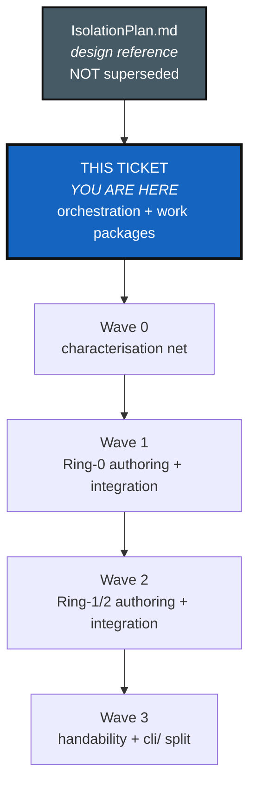
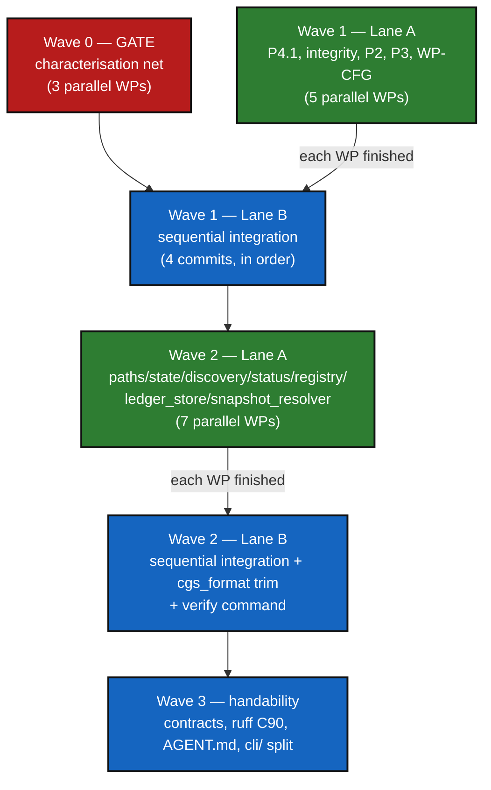

# Isolation & Register-Integrity — DevPlanTicket (orchestrated)

*Created: 2026-08-28*

## Abstract — read this first

**What this document is.** The execution ticket for
`AgentSpecs/IsolationPlan.md` — same ring model, same register-integrity
design, same module map and phases, but re-cut into independent **work
packages (WPs)** that a human or an orchestrating agent can dispatch to
several coding agents *at the same time*, plus the concurrency rules that
keep those agents from clobbering each other on the one file they all want
to edit: `orchestre.py`.

**Why it exists.** `IsolationPlan.md` answers *what* to build and *why*.
It does not answer *who touches which file when* — and every phase in it
extracts code from the same 4,518-line `orchestre.py`, which is exactly the
shared-mutable-state problem an orchestrator has to solve before "run four
agents in parallel" is a safe instruction rather than a guaranteed merge
conflict. This ticket is that solution.

**What you will find.** A verification pass correcting three more assumptions
since `IsolationPlan.md`'s own 2026-08-28 revision (§0), the two-lane
orchestration pattern this whole ticket runs on (§1), the work-package
catalog (§2), the wave dependency graph (§3), a literal orchestrator runbook
— what to type, not just what to do (§4), exit criteria (§5), and the
tooling this ticket ships with, ready to use (§6).

**Who it is for.** Whoever orchestrates P2 onward — most likely a coding
agent (this one, or a fresh session) driving several `Agent` tool calls per
wave. Read `IsolationPlan.md` in full first; it is not superseded or
archived by this document, it is the design reference this document keeps
pointing back to. This ticket does not repeat its threat model, rationale,
or feasibility narrative — only what a work package needs to start.

**What you need to do with it.** Nothing has started. `scripts/`
`check_module_ceilings.py` and its baseline (§6) are the only things this
ticket ships pre-built; everything else in §2 is unclaimed. Start at Wave 0.

---

## 0. Verification pass (2026-08-28, against the post-CleanupPass2 tree)

`IsolationPlan.md`'s own feasibility review already corrected the original
draft once. Re-running its verification method (read the code, don't trust
the draft) against the tree as it stands *after* `CleanupPass2_DevPlanTicket.md`
merged (PR #178) surfaces three more corrections this ticket's work packages
need, that `IsolationPlan.md`'s D6 sync did not have Memory-adjacent reason
to look for:

| Claim (post-cleanup, unverified until now) | Verified today | Consequence |
|---|---|---|
| `orchestre.py` LOC after CleanupPass2 | **4,518** lines (`wc -l`), 3,927 by the ratchet script's blank/comment-stripped count (§6). Down from 5,379, but still 9× the ≤450 target. | Module map targets in `IsolationPlan.md` §4 are unchanged in kind, just start from a smaller number. No plan change needed. |
| `cli.py` LOC after CleanupPass2 | **2,061** lines (1,875 stripped). Down from 2,333. | Same — P6's `cli/` package split is smaller than originally scoped, not different in shape. |
| `git_repo.py` LOC | **335** lines (262 stripped) after `RepoNode` deletion (CleanupPass2 D2b), not the 358 `IsolationPlan.md` §4 cites. | Cosmetic; module map's ~350 target still holds without change. |
| `errors.py` LOC | **21** lines (11 stripped) after the two dead-exception deletion (CleanupPass2 D2a), not 29. | Cosmetic. |
| **`config_document.py` classified Ring 0** | **False.** `ConfigDocument.from_toml`/`to_toml`/`from_json`/`to_json` call `open()` directly (6 call sites, verified by AST scan — see §6's script output). This is the exact "does real I/O, so it cannot be Ring 0" pattern `IsolationPlan.md`'s own feasibility review already applied to `git_tree.py`; it was never applied here. | **New work package, WP-CFG (§2, Wave 1).** The pure parse/normalise/serialise-to-string logic (used by both `CgsDocument` and the future `gts_document.py`) stays Ring 0; the six `open()` calls move to a thin Ring-1 load/save wrapper. Until this lands, `config_document.py` is **not** eligible for the Ring-0 purity check in `scripts/check_module_ceilings.py` — confirmed by running it, see §6. |
| Public commands, Memory rows | **24**, confirmed via `_PLANNED_COMMANDS`; zero Memory references outside historical prose (re-ran `IsolationPlan.md` §0's own grep). | `IsolationPlan.md` §0/§1/§4/§7 already reflect this via CleanupPass2 D6 — no further correction needed, noted here only so this ticket doesn't re-derive it. |

No other claim in `IsolationPlan.md` changed. Its ring model (§1), register
design (§2), ceiling rationale (§3), and phase ordering (§5) are adopted
as-is by this ticket; only the module map's LOC column and the Ring-0 module
set need the corrections above.

---

## 1. The orchestration model

### 1.1 The problem

Nineteen of `IsolationPlan.md`'s ~22 target modules are **extracted from**
`orchestre.py` or `cli.py`. Two agents editing the same 4,518-line file at
the same time — even on disjoint classes — produce a diff neither can review
and a merge neither tool resolves cleanly. Naively parallelising "split the
monolith" is a guarantee of conflict, not a productivity win.

### 1.2 The solution: two lanes

**Lane A — parallel authoring.** An agent is handed a *read-only* line range
in `orchestre.py` (or `cli.py`) and asked to **author a new, finished module**
at a new path — implementation, its own tests, its docstring contract header
(`IsolationPlan.md` §3.2) — without touching the source file at all. Any
number of Lane-A agents can run **at the same time**, each in its own git
worktree (`Agent` tool, `isolation: "worktree"`), because each writes only
to brand-new paths. This is where the expensive, context-heavy work happens,
and it is exactly the work that benefits from running in parallel.

**Lane B — sequential integration.** Once a Lane-A module is finished and
its tests pass in isolation, **one agent at a time** applies it to the
shared file: add the import, delete the now-duplicated block from
`orchestre.py`/`cli.py`, run `pixi run test` and `pixi run check-ceilings`,
commit. This step is mechanical — the hard design work already happened in
Lane A — so serialising it costs little wall-clock time even though it
cannot be parallelised.

**The rule that makes this safe:** within any wave, **at most one Lane-B
integration is in flight against a given shared file at a time.** Lane-A
authoring has no such limit — it is the whole point of running agents
simultaneously.

### 1.3 Work-package card format

Every entry in §2's catalog carries:

- **Lane** — A (parallel, new files only) or B (sequential, edits a shared file).
- **Reads** — files the agent may read for reference; never edited.
- **Writes** — files the agent creates or edits; disjoint from every other
  WP in the same wave for Lane A, exclusive-at-a-time for Lane B.
- **Depends on** — WPs that must be merged (not just started) first.
- **Deliverable** — what "done" means, concretely.
- **Verify** — the exact command(s) that must pass before handing back.
- **Commit** — the one-line commit message template, `DELETE`/`MOVE`/`CHANGE`
  discipline carried over unchanged from `CleanupPass2_DevPlanTicket.md`'s
  guardrails (G-4: one concern per commit).

### 1.4 Concurrency rules (the four that matter)

1. A Lane-A agent never edits `orchestre.py`, `cli.py`, `__init__.py`, or
   any file another in-flight WP in the same wave also writes to.
2. A Lane-B agent runs alone against its target file — no other Lane-B WP
   touching the same file starts until the previous one is committed.
3. Every Lane-B commit runs `pixi run test && pixi run lint && pixi run
   check-ceilings` before it is made — the ceiling ratchet (§6) is the
   mechanical proof that the shared file shrank, not grew.
4. A wave does not close until `GATE`-marked WPs in it are green. Waves are
   barriers: Wave *n+1*'s Lane-A authoring may read the *result* of Wave
   *n*'s integration, so it should not start drafting against stale line
   numbers — but nothing stops an agent from pre-reading `IsolationPlan.md`
   and sketching ahead of the gate.

---

## 2. Work-package catalog

Ring numbers, target LOC, and design detail are `IsolationPlan.md` §1/§4;
this table adds lane, dependency, and file-ownership — the orchestration
layer that document doesn't have.

### Wave 0 — GATE: characterisation net

Existing coverage is already substantial (`tests/integration/test_cgsi_topology.py`,
`test_tuto_cgsi1.py`, `tests/unit/test_cli_smoke.py`) — this wave's job is
**audit for gaps, then fill only the gaps**, not rewrite from scratch. Each
WP starts by confirming what's missing for its command group before writing
anything, the same "verify before proposing" discipline
`CleanupPass2_DevPlanTicket.md` used throughout.

| WP | Lane | Command group | Writes | Deliverable |
|---|---|---|---|---|
| G1-a | A | Lifecycle: `checkout`, `branch`, `pull-force`, `purge`, `validate` | new tests only, `tests/integration/test_golden_lifecycle_gaps.py` | One CLI-level test per command in this group not already covered end-to-end |
| G1-b | A | Release: `freeze-release-force`, `status`, `view-tree` output shape | `tests/integration/test_golden_release_gaps.py` | Golden-output assertions (exact printed fields), so a later refactor that silently changes `status`/`view-tree` formatting is caught |
| G1-c | A | Configuration: `configure`, `create-cgs` end-to-end via CLI (not just Python API) | `tests/integration/test_golden_configuration_gaps.py` | CLI-invocation coverage for both, not just their `ComplexGitSyncClient` methods |

**GATE:** all three land, `pixi run test` green, before any Wave 1
integration (Lane B) commits. Wave 1 Lane-A authoring may start in parallel
with Wave 0 — it doesn't touch shared files either.

### Wave 1 — Ring 0 core + the two already-isolated classes

| WP | Lane | Ring | Writes (new) | Reads | Depends on | Deliverable |
|---|---|---|---|---|---|---|
| P4.1 | A | 0 | `ledger_entry.py`, its tests | `orchestre.py` (`SyncLedger`, `_state_*` helpers — **read-only**), `L0.py` | — | Chain math (`prev`/`entry_hash`, `IsolationPlan.md` §2.2 schema) + `ClockProtocol` absorbing `L0.py`'s anchor generation. Property-tested (add `hypothesis` as a dev dependency as part of this WP — not currently present, confirmed in `IsolationPlan.md`'s feasibility review) |
| P4.1-integrity | A | 0 | `integrity.py`, its tests | `IsolationPlan.md` §2.4 (`Finding` enum, `verify_chain`) | P4.1 authored (not yet integrated — can read its draft) | `Finding` enum (all 8 cases) + `VerificationReport` + `verify_chain()`, pure |
| P2 | A | 0 | `gts_document.py`, its tests | `orchestre.py` (`GtsDocument` class — **read-only**) | — | `GtsDocument` extracted with its one canonical-payload builder intact |
| P3 | A | 2 | `git_runner.py`, `GitRunnerProtocol`, its tests | `orchestre.py` (`GitRunner` class — **read-only**) | — | `GitRunner` extracted; already the sole `subprocess` importer at class level (`IsolationPlan.md` feasibility review), so this is a file move, not a dependency fix |
| WP-CFG | A | 0/1 split | `config_document.py` (pure parse/serialise, trimmed) + a new thin loader (Ring 1 — fold into `paths.py` from Wave 2, or a standalone `config_io.py` if Wave 2 hasn't landed yet) | `config_document.py` (current, read for reference) | — | The six `open()` call sites (§0 finding) removed from the Ring-0 file; behaviour identical, proven by existing `test_documents.py` still passing unmodified |
| P2-integrate | B | — | `orchestre.py` | P2's finished `gts_document.py` | P2, Wave 0 GATE | Import `gts_document`, delete the extracted class body from `orchestre.py`, ratchet check passes |
| P3-integrate | B | — | `orchestre.py` | P3's finished `git_runner.py` | P3, P2-integrate committed | Same pattern, `GitRunner` |
| P4.1-integrate | B | — | `orchestre.py`, `L0.py` | P4.1 + integrity finished | P4.1, P4.1-integrity, P3-integrate committed | Wire `ledger_entry`/`integrity` into `SyncLedger`; `L0.py`'s direct clock/PID reads removed (its one remaining caller becomes `ClockProtocol`) |
| WP-CFG-integrate | B | — | `orchestre.py` (its `GtsDocument`/`CgsDocument` callers, if any adjust) | WP-CFG finished | WP-CFG, P4.1-integrate committed | Confirm no caller regresses; `config_document.py` added to `scripts/ceiling_baseline.json`'s `ring0_modules` |

Lane-B WPs in this wave integrate **in the listed order** — each is a single
commit, each re-runs the full verify command from §1.4 before the next
starts.

### Wave 2 — Ring 1/2 extractions + register store

Gated on Wave 1's four `*-integrate` WPs being committed (so line numbers in
`orchestre.py`/`cli.py` are current, per concurrency rule 4).

| WP | Lane | Ring | Writes (new) | Depends on | Deliverable |
|---|---|---|---|---|---|
| P5-paths | A | 1 | `paths.py`, its tests | Wave 1 closed | Env markers, CGSPATH/CGSHOME resolution extracted |
| P5-state | A | 1 | `state_store.py`, its tests | Wave 1 closed | Content-addressed `state(<hash>)_n/` directory allocation (today's `MemoryStateDirectory`/`_resolve_memory_state_directory` — the general mechanism every lifecycle command uses, unrelated to the deleted Memory transport despite the name; see `CleanupPass2_DevPlanTicket.md` D1's naming-collision note if the history here is confusing) |
| P5-discovery | A | 1 | `discovery.py`, its tests | Wave 1 closed | Nested `.cgs` discovery + `.gitmodules` import logic |
| P5-status | A | 0 | `status_render.py`, its tests | Wave 1 closed | Tree/status text rendering, pure string formatting — no tree mutation |
| P5-registry | A | 2 | `registry.py`, its tests | Wave 1 closed | `build_registry_from_cgs_document`/`build_registry_from_gts_document`/`build_gts_document_from_registry` |
| P4.2-store | A | 1 | `ledger_store.py`, its tests | P4.1 (Wave 1) merged | Per-entry `.cgitsync/lgr/<seq:06d>.toml` files, `O_EXCL` atomicity, secret scrubbing (`IsolationPlan.md` §2.5), `0600`/`0700` perms — fixes the confirmed-unatomic single-file write |
| P4.4-resolver | A | 1 | `snapshot_resolver.py`, its tests | Wave 1 closed | Removes `cli.py`'s two private imports (`_state_order_from_directory_name`, `_state_snapshot_candidates` — confirmed count, not the stale "four" the original draft assumed) |
| P-cgsfmt-trim | B | 0 | `cgs_format.py` (same file, no extraction target — self-contained trim) | Wave 1 closed | 631 (stripped) → ~450 LOC; grammar frozen, no behaviour change, `test_documents.py`/`test_registry_client.py`'s `.cgs`-parsing tests unmodified |
| P5-\*-integrate | B | — | `orchestre.py` | Each P5-\* WP finished, prior `*-integrate` in this wave committed | One commit per module, same pattern as Wave 1's integration WPs |
| P4.3-verify | B | — | `cli.py`, new `_handle_verify`/`_execute_verify` in `cli.py` | P4.1-integrate, P4.1-integrity, P4.2-store merged | The one new command this plan adds (`IsolationPlan.md` §2.7) — `cgitsync verify [--repair]`. Keeps the public-command count flat against surface this and CleanupPass2 removed |

`P-cgsfmt-trim` is Lane B despite creating nothing new, because it is a
same-file edit with no extraction target — no other WP may touch
`cgs_format.py` while it's in flight, same rule as any Lane-B WP.

### Wave 3 — Handability

Gated on Wave 2 closing. Mostly parallel-safe because by this point most
target modules are already separate files.

| WP | Lane | Writes | Deliverable |
|---|---|---|---|
| P6-contracts | A (per-module, N agents) | Each already-extracted module's own docstring (one agent per file — disjoint by construction) | Ring/Contract/Imports header (`IsolationPlan.md` §3.2) added to every Ring 0–2 module; cross-checked by `scripts/check_module_ceilings.py`'s contract parser (§6 — already built) |
| P6-ruff | B | `pyproject.toml` | Add `"C90"` to `[tool.ruff.lint] select`, `[tool.ruff.lint.mccabe] max-complexity = 12` — one-line change, confirmed sufficient by `IsolationPlan.md`'s feasibility review |
| P6-agent-md | B | `AGENT.md` (repo root — confirm current location before editing; do not assume a path this ticket didn't verify) | Rewritten as rules per `IsolationPlan.md` §3.4: ring table, four import rules, ceilings, commit discipline, the `.cgitsync` hand-edit prohibition |
| P6-cli-author | A (per-group, N agents) | `cli/<group>.py` for each command group (minimalist / expert / configuration), each its own new file + tests, referencing current `cli.py` read-only | Package modules authored against the current `cli.py`, ≤400 LOC each |
| P6-cli-integrate | B | Replaces `cli.py` with the `cli/` package | All `cli/*` WPs finished | `cli.py` → `cli/__init__.py` + submodules; `pixi run cgitsync --help` still lists the same 24 (soon 25, with `verify`) commands |

---

## 3. Wave dependency graph

`W1A` may start immediately, in parallel with `W0` — neither touches shared
files. `W1B` (the first integration commit) needs both `W0` green and the
relevant `W1A` WP finished.

---

## 4. Orchestrator runbook

Concrete steps for whoever (human or agent) drives this ticket. Written
assuming the driver is a Claude Code session with the `Agent` tool.

### 4.1 Dispatching a Lane-A wave

1. Confirm the wave's gate condition (§3) is met.
2. Send **one message containing every Lane-A `Agent` call for the wave**,
   each with:
   - `isolation: "worktree"` — gives each agent its own working copy, so
     concurrent writes to *new* files never collide even though they share
     a repo.
   - `run_in_background: true` (the default) — do not block on each other.
   - A self-contained prompt: the WP's row from §2, the exact "Reads" paths,
     the exact "Writes" path, the module's target ring and LOC (from
     `IsolationPlan.md` §4), and an instruction to run its own tests inside
     its worktree before reporting done.
3. Wait for completion notifications (do not poll). Each finished worktree
   has a branch; read the agent's own report for the branch name.

### 4.2 Running a Lane-B integration step

One at a time, **not** backgrounded against the same target file:

1. `cd` to the main worktree (not a Lane-A worktree).
2. Merge or cherry-pick the finished Lane-A module's new file(s) in —
   these are new paths, so this step never conflicts.
3. Edit `orchestre.py`/`cli.py`: add the import, delete the extracted block.
4. `pixi run test && pixi run lint && pixi run check-ceilings`
5. `git checkout -q -- scripts/ceiling_baseline.json` if the ratchet
   check fails only because the module you just *shrank* now needs a new,
   lower baseline recorded — in that case run
   `pixi run python scripts/check_module_ceilings.py --write-baseline`
   instead of discarding the failure, and include the updated baseline file
   in the same commit (it documents the new floor, same spirit as G-4's
   one-concern-per-commit: the baseline update is part of *this* extraction,
   not a separate step).
6. Commit using the WP's commit template (§1.3), `MOVE` for a pure
   extraction, `CHANGE` if behaviour-adjacent code moved with it.
7. Only then does the next Lane-B WP in the wave start.

### 4.3 What never gets backgrounded

Registering a ratchet regression, resolving a merge, and every `git commit`
in Lane B happen in the foreground, sequentially. Backgrounding is a Lane-A
tool, not a Lane-B one — the entire point of Lane B is that it is cheap
*because* the hard part already happened in parallel.

---

## 5. Exit criteria

Unchanged from `IsolationPlan.md` §6 (Isolation / Integrity / Handability),
plus two this ticket adds because they are specific to running it as
independent work packages rather than one continuous session:

- Every Lane-B commit in the history is individually revertable — `git log
  --oneline` over this ticket's span shows one concern per commit, same
  audit trail `CleanupPass2_DevPlanTicket.md` left.
- `pixi run check-ceilings` is green at every commit from Wave 1 onward —
  not just at the end. The ratchet is a continuous gate, not a final exam.

---

## 6. Tooling delivered with this ticket

Built and verified 2026-08-28, so no work package has to re-derive it:

- **`scripts/check_module_ceilings.py`** — walks `src/ComplexGitSync/`,
  reports LOC / public-symbol-count / internal-import-count per module,
  checks Ring-0 modules for I/O-shaped references (AST-based: `subprocess`,
  `open(`, `os.environ`, `time.time`/`sleep`, `datetime.now`/`utcnow`, and
  `Path`-write-method calls), and cross-checks each module's `Imports:`
  docstring-contract line (§3.2 format) against its real imports. `--check`
  fails only on **regression past a recorded baseline** — it does not block
  today's oversized `orchestre.py`/`cli.py`, it blocks them from getting
  *bigger*. `--write-baseline` locks in a new (lower) floor once a module is
  intentionally shrunk. Full design rationale is in the script's own
  docstring — read that, not this paragraph, before extending it.
- **`scripts/ceiling_baseline.json`** — today's recorded floor for every
  module. `errors.py` is the only module currently marked Ring-0-purity
  checked (`config_document.py` is deliberately **not** yet listed — see
  §0's WP-CFG finding; add it to `ring0_modules` only as part of
  WP-CFG-integrate).
- **`pixi run check-ceilings`** — the pixi task wrapping `--check`, wired
  into `pixi.toml` alongside `test`/`lint`/`bump-version`.
- **`tests/unit/test_module_ceilings.py`** — the same check as a pytest
  test, so `pixi run test` fails on a regression too, not just the dedicated
  task. Passes today (532 pre-existing tests + this one, zero regressions,
  confirmed by running the full suite before this ticket was written).

None of the above needed to wait for Wave 3 (`IsolationPlan.md` §3.1 scoped
this work into P6) — it is cheap, self-contained, and useful as a guardrail
from the very first Lane-B commit, so it ships with the ticket instead of
being deferred to the end.
