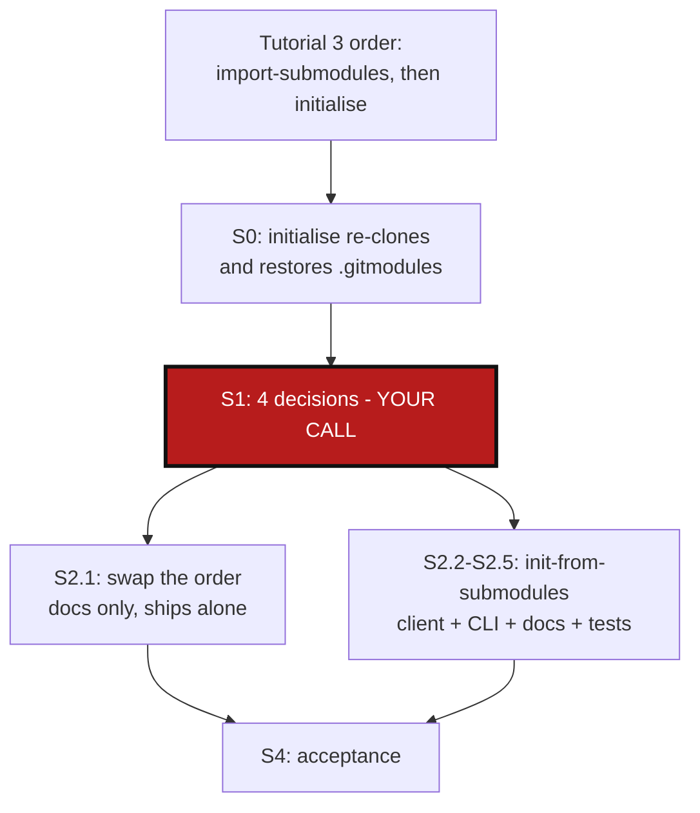

# InitFromSubmodules — `initialise` undoes `import-submodules`, and the fix deserves one command

*Created: 2026-09-03*

## Abstract — read this first

**The one-line version.** Tutorial 3 runs `import-submodules` (step 4)
before `initialise` (step 5). `initialise` re-clones every repository
except the root, straight from its remote — and those remotes still use
submodules. So step 5 puts back the `.gitmodules` file and the gitlink
that step 4 had just removed from `HydrologicalTwinAlphaSeries` (**HTA**
below). The tutorial then commits a conversion that is only half there.

**What this document is.** A plan. No code and no tutorial has been
changed yet.

**Why it exists.** Two facts make the current order unfixable by simply
"running `import-submodules` twice":

1. `initialise` deletes and re-clones every non-root repository
   (`orchestre.py:3418`), so anything `import-submodules` changed in
   those repositories is gone.
2. `import-submodules --recursive` starts its walk at the root's own
   `.gitmodules` (`orchestre.py:1164`, walking via `_gitmodules_levels_root_first`).
   Step 4 deleted that file. A second run therefore prints "nothing to
   import" and never reaches HTA at all.

Reversing the order fixes both. And once the correct order is known, the
whole nine-step sequence is one workflow worth naming: **an expert command
`init-from-submodules`**.

**What you will find.** §0 the bug, from the code. §1 the four decisions
only you can make. §2 the work, in order. §3 the design sketch for the new
command. §4 how to know it is done.

**Who it is for.** Whoever does this work next. Start with §1.

**What you need to do with it.** Answer §1, then run §2 top to bottom.
§2.1 is a documentation-only fix that can ship on its own, before any
code.



---

## 0. What is wrong

### 0.1 `initialise` restores what `import-submodules` removed

`initialise` treats the root and the rest of the tree differently:

| Repository | What `initialise` does | Source |
|---|---|---|
| root (at `CGSHOME`) | adopted in place, never touched | `_attach_existing_root`, `orchestre.py:3382` |
| every other repo | `shutil.rmtree`, then `git clone` from the remote | `_clone_registry_entry`, `orchestre.py:3418`–`3442` |

In Tutorial 3's tree, HTA is "every other repo". Step 4 removed HTA's
`.gitmodules` stanza and dropped the `docs/hydrological_twin` gitlink from
HTA's index. Step 5 deletes that working tree and clones HTA again from
GitHub, where the conversion was never pushed. HTA comes back with its
`.gitmodules` and its gitlink intact.

The tree is then in a state no step of the tutorial expects:

- root: converted (its own `.gitmodules` gone, children untracked).
- HTA: **not** converted — `.gitmodules` present, gitlink tracked — but
  now also carrying the `.gitignore` line `initialise`'s own
  `_sync_gitignore_lifecycle` wrote for `docs/hydrological_twin`. A
  `.gitignore` entry does not untrack an already-tracked gitlink, so the
  two disagree.

### 0.2 The tutorial's own step 8 output is therefore wrong

Step 8 claims:

```
$ git -C "$WORK/cawaqsviz/external/HydrologicalTwinAlphaSeries" status --porcelain
D  .gitmodules
D  docs/hydrological_twin
?? .gitignore
```

After step 5 as written, HTA has no such staged deletions. The commit in
step 8 lands the root's half of the conversion only.

### 0.3 Running `import-submodules` a second time does not rescue it

`_gitmodules_levels_root_first` (`orchestre.py:1176`) returns immediately
when the directory it is given has no `.gitmodules`:

```python
if resolved in visited or not (resolved / ".gitmodules").is_file():
    return []
```

Recursion into HTA happens only *through* the root's `.gitmodules`
stanzas. Step 4 deleted the root's file, so a post-`initialise` re-run
reports `No .gitmodules found ... — nothing to import` and stops. The
half-converted tree stays half-converted.

> This is worth keeping in mind beyond this ticket: `import-submodules
> --recursive` is not "find every `.gitmodules` under this path". It is
> "walk the submodule graph declared by this path's `.gitmodules`". A
> repository whose parent is already converted is unreachable.

### 0.4 The correct order

`initialise` **first**, `import-submodules --recursive --apply` **second**,
pointed at `CGSHOME`:

1. `initialise` adopts the still-unconverted root in place and clones the
   other three repositories fresh. Every repository now has exactly the
   submodule wiring its remote declares — a uniform, known starting point.
2. `import-submodules --recursive --apply` then walks root → HTA through
   the root's `.gitmodules`, which is still there, and converts both
   levels in one pass.

Two checks that this order actually holds up, both from the code:

- **Preflight.** `_import_submodules_one_level` requires each submodule's
  own working tree to be clean. After `initialise` each child is a fresh
  clone, so it is. The *parent's* status is dirty (the re-cloned child
  sits at a different commit than the gitlink), but the preflight never
  looks at the parent — `git rm --cached` only touches the parent's index.
- **`.gitignore` double-write.** `initialise` already appended each child
  path to its parent's `.gitignore`; `import-submodules` appends the same
  line again. `_update_gitignore_file` (`git_tree.py:1260`) skips entries
  already present, so this is a no-op, not a duplicate.

### 0.5 Dependency on the NestedParentDiscovery ticket

Both orders depend on `discover` drawing HTA as a **parent** rather than a
flat sibling — otherwise `.gitignore` and the `.gts` never record that
`hydrological_twin` lives inside HTA. That is
[20260903_NestedParentDiscovery_DevPlanTicket.md](20260903_NestedParentDiscovery_DevPlanTicket.md).
This ticket assumes that one lands first, or at least that the `.cgs`
handed to `initialise` describes the two levels correctly. §2.1 does not
depend on it; §2.2 onwards does.

---

## 1. Decisions — your call

### 1.1 Where does the new command start?

The tutorial's ten steps split into three groups: `git clone` +
`git submodule update` (1–2), the adoption sequence (3–5), and
`branch`/`checkout`/`add`/`commit`/`push` (6–9).

| Option | `init-from-submodules` does | Notes |
|---|---|---|
| **A (recommended)** | steps 3–5: `discover` → write `.cgs` → `initialise` → `import-submodules --recursive --apply` | Takes a path to a checkout the user cloned themselves. Keeps every network write (clone credentials, submodule auth) in the user's own hands at step 1–2, where the tutorial already documents the auth pitfalls. |
| B | steps 1–5, including the clone | One command from a URL. But it must then own submodule authentication, `--force-protocol`, and the "is this directory empty" question `bootstrap` already struggles with. |
| C | steps 3–9, through the commit | Commits on the user's behalf across repositories they may not own — the tutorial explicitly warns about HTA's remote here. |

### 1.2 Does it write a `.cgs`, or take one?

| Option | Behaviour |
|---|---|
| **A (recommended)** | Runs `discover` itself and writes `<root>/<project>.cgs`, unless `--cgs PATH` names an existing one. Matching Tutorial 3's step 3, which most users have no reason to hand-edit. |
| B | Requires `--cgs PATH`; refuses to invent one. Simpler, but leaves the user running two commands again. |

### 1.3 Command group and name

`init-from-submodules` in the **Expert** group, beside
`import-submodules`, is the assumption below. Alternatives worth one
minute: `adopt`, `initialise --from-submodules` (a flag on the minimalist
command instead of a new one). Naming decides where it is registered
(`cli/expert.py` vs `cli/minimalist.py`) and which README table row it
gets.

### 1.4 Does it stop at `READY`, or also branch?

Recommended: stop at a `READY` tree with the conversion staged but not
committed, and print the exact `branch`/`checkout`/`add`/`commit` lines to
run next. Tutorial 3 steps 6–9 then stay as they are.

---

## 2. The work

### 2.1 Fix Tutorial 3's order — documentation only, ships alone

No code change. In `tutorials/03_adopting_a_real_project.md`:

- Swap steps 4 and 5: `initialise` becomes step 4, `import-submodules
  --recursive --apply` becomes step 5, run against `$CGSHOME` (the tree
  `initialise` just produced), not against the pre-`initialise` clone.
- Rewrite the "Why `initialise` and not `bootstrap`" box to also say why
  the conversion must come *after*: `initialise` re-clones every non-root
  repository from its remote, and those remotes still use submodules.
- Add the §0.3 fact as a short warning: once the root's `.gitmodules` is
  gone, `--recursive` has nothing to walk, so the conversion cannot be
  re-applied afterwards. Order is not a preference here.
- Re-verify and replace the step-8 `git status --porcelain` output for
  both repositories against a real run.
- Update the step table in §10.
- The step-1 directory-naming note stays exactly as it is — `initialise`
  still resolves `CGSHOME` from the project name.

This is the whole user-visible bug fix. Everything below is the
ergonomics.

### 2.2 `ComplexGitSyncClient.init_from_submodules()` — `orchestre.py`

New public method carrying every bit of the semantics (see §3). It calls
the existing `discover_repos`, `initialise_cgs`, and `import_submodules`
rather than re-implementing any of them, and returns a report object
carrying the `.cgs` path written, `CGSHOME`, the converted submodule list,
and the resulting `WorkingGitTree`.

Nothing moves between modules, so
`AgentSpec/AdditionalSpecs.md`'s responsibility table needs no change —
confirm that when the method is written, and update it if the
implementation turns out to need a new helper module.

### 2.3 CLI wiring — `cli/expert.py`

The usual thin pair, matching `import-submodules` exactly:
`_register_init_from_submodules` (arguments), `_handle_init_from_submodules`
(collect + `_run_with_logging`), `_execute_init_from_submodules` (call the
one client method, print). Register it in `_PARSER_BUILDERS` and in the
`COMMANDS` dict at the top of the module (whose `register_parsers`
docstring counts the subparsers — bump that count). No Git, no `subprocess`, no
repo-identifier parsing in `cli/`.

### 2.4 Documentation

- README command table: one Expert row (enforced by
  `tests/unit/test_cli_smoke.py::test_readme_documents_every_cli_command`).
- `docs/Text/user_guide.tex`: the command.
- `docs/Text/api_python.tex`: the client method.
- Tutorial 3: replace steps 3–5 with the single command, and keep the
  long-hand three-command form as a short "what it does underneath"
  subsection — the tutorial's job is still to teach the mechanism.
- `cd docs && latexmk -pdf MASTER.tex` after touching any `.tex`.

### 2.5 Tests

| Level | Test |
|---|---|
| unit | `init_from_submodules` on a local fixture tree (root + submodule + nested submodule, all `file://` remotes): ends with no `.gitmodules` anywhere, no gitlink in any index, each parent's `.gitignore` carrying its children. |
| unit | Order regression: the *old* order (convert, then `initialise`) leaves HTA's `.gitmodules` present — assert the new command does not do that. |
| unit | §0.3 regression: `import_submodules(root, recursive=True)` on a root whose `.gitmodules` was already removed returns an empty report, and `init_from_submodules` therefore never relies on a second pass. |
| unit | Re-running `init_from_submodules` on an already-converted tree is safe, or fails with a clear message — pick one in §3 and test it. |
| integration | The full sequence against the fixture tree, ending in a `READY` tree and a written `.gts`. |
| smoke | The README-documents-every-command test picks up the new row. |

---

## 3. Design sketch for `init-from-submodules`

```
pixi run cgitsync init-from-submodules PATH [--output-path CGSPATH]
                                            [--cgs FILE] [--project NAME]
                                            [--max-depth N] [--dry-run]
                                            [--force-protocol {ssh,https}]
```

`PATH` is the checkout the user cloned and `git submodule update
--init --recursive`'d themselves (Tutorial 3 steps 1–2).

Sequence, all inside the one client method:

1. **Discover.** `discover_repos(PATH, max_depth=...)`. Fail early, before
   anything is written, if the walk hit its depth limit or found no root
   remote.
2. **Write the `.cgs`** to `PATH/<project>.cgs`, unless `--cgs` names an
   existing one to use instead.
3. **`initialise`** with `output_path = PATH.parent`, so `CGSHOME`
   resolves to `PATH` itself. Fail with a specific message — naming both
   paths — if the project name and the directory name disagree, since
   that is Tutorial 3's single easiest mistake.
4. **`import_submodules(CGSHOME, apply=True, recursive=True)`.**
5. **Report**: the `.cgs` written, `CGSHOME`, the tree, every converted
   submodule, and the `branch`/`checkout`/`add`/`commit` lines to run next.

`--dry-run` runs steps 1 and 4-as-a-dry-run and prints the plan, writing
nothing and cloning nothing.

Open points to settle while implementing:

- **Re-run behaviour.** On an already-converted tree, step 4 finds no
  `.gitmodules` and converts nothing, while step 3 re-clones every child
  — destroying uncommitted work in them. That is dangerous enough to
  deserve an explicit guard: detect "root has no `.gitmodules`" up front
  and refuse, unless `--force` is passed.
- **Failure between steps 3 and 4.** `initialise` succeeding and
  `import-submodules` failing leaves the tree exactly as §0.1 describes.
  The error must say so, and name the one command that finishes the job.
- Whether `--force-protocol` should also apply to the discovery step.

---

## 4. Acceptance

1. `pixi run lint` and `pixi run test` pass.
2. Tutorial 3, followed literally on the real `cawaqsviz`, ends with **no**
   `.gitmodules` in either the root or HTA, and both repositories showing
   the staged conversion at step 8.
3. `init-from-submodules` reproduces that end state from a fresh
   steps-1–2 checkout in one command.
4. Re-running it on an already-converted tree does not silently destroy
   the children's working trees (§3, re-run guard).
5. README, `user_guide.tex`, `api_python.tex` and the rebuilt PDFs all
   carry the new command.
6. `pixi run bump-version` run before the branch is wrapped up.
