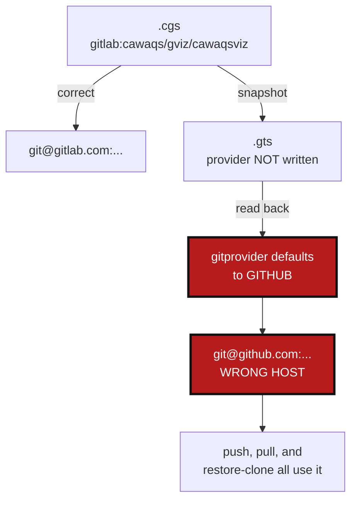

# GtsProviderLoss — a `.gts` snapshot forgets which provider a repository came from

*Created: 2026-09-04*

## Abstract — read this first

**The one-line version.** The `.gts` snapshot never writes down which git
host a repository lives on. Every command that reads one back assumes
GitHub. So a GitLab project gets pushed to `github.com`.

**What this document is.** A plan. Nothing has been changed yet.

**Why it exists.** `cgitsync push --force-protocol ssh` on `cawaqsviz`
failed with this:

```
fatal: remote error:
 cawaqs/gviz/cawaqsviz is not a valid repository name
Visit https://support.github.com/ for help.
```

Read the last line. `cawaqsviz` is a **GitLab** project, and the error
came back from **GitHub**. The path was right; the host was wrong. GitHub
only accepts `owner/repo`, so a three-part GitLab path was refused
outright.

**What you will find.** §0 is the cause, reproduced. §1 is why it is
worse than the one failure that reported it. §2 is what to fix. §3 is the
two decisions only you can make. §4 is the work, §5 how to know it is
done.

**Who it is for.** Whoever picks this up next. §0.3 is the short version
of the whole diagnosis.

**What you need to do with it.** Answer §3, then do §4.



---

## 0. The cause

### 0.1 The snapshot does not store the provider

`build_gts_document_from_registry` (`registry.py:447-465`) writes three
identity fields per repository:

```python
"project_owner_name": entry.project_owner_name,
"project_name":       entry.project_name,
"repo_name":          entry.repo_name,
```

It never writes `gitprovider`, `group_name`, `gitprovider_url`, or
`access_protocol`. Reading back is the mirror image:
`build_registry_from_gts_document` (`registry.py:369-405`) sets no
provider either.

So the provider falls back to the dataclass default. It is declared twice,
once on `GitRepo` (`git_repo.py:164`) and again on `WorkingRepo`
(`git_repo.py:332`, the one the registry actually builds):

```python
gitprovider: GitProvider = GitProvider.GITHUB
```

Every repository restored from a `.gts` is a GitHub repository, whatever
it really was. `group_name` and `gitprovider_url` default to `None` on the
same dataclass, three lines below.

### 0.2 Reproduced

One repository, straight through the round trip:

```
=== from .cgs (correct) ===
  gitprovider       : gitlab
  project_owner_name: cawaqs/gviz
  ssh url           : git@gitlab.com:cawaqs/gviz/cawaqsviz.git

=== what .gts stores for the root ===
  ['absolute_path', 'commit_sha', 'name', 'node_type', 'project_name',
   'project_owner_name', 'ref', 'relative_path', 'repo_lifecycle_state',
   'repo_name', 'source_cgs_path', 'sync_state']
  gitprovider present? False

=== after .gts round-trip (what push uses) ===
  gitprovider       : github
  ssh url           : git@github.com:cawaqs/gviz/cawaqsviz.git
```

That last URL is exactly the one in the bug report.

### 0.3 How that reaches `push`

`push` does not read the `.cgs`. It resolves a `.gts`
(`_handle_push` → `_resolve_gts_path`, `cli/expert.py:571`) and loads the
tree from it — already provider-less by §0.1.

`--force-protocol` then rebuilds the remote URL from the repository's
identity fields and writes it to disk:

`_rewrite_remote_if_forced` (`operations.py:144`) → `repo_remote_url`
(`git_repo.py:343`) → `RepoAddress.to_ssh()` → `git remote set-url`.

`to_ssh()` asks `_resolve_host()` for the host, `_resolve_host()` asks the
provider, and the provider now says GitHub. The rebuilt URL is written
over the correct one that `git clone` had set, and the push goes to the
wrong host.

**Without `--force-protocol` the push works**, because nothing rebuilds
the URL — git uses the `origin` the clone set. That is why this only
showed up when Tutorial 3's step 7 told the user to add the flag.

---

## 1. Why this is worse than the one failure that reported it

### 1.1 A two-part GitLab path fails silently instead of loudly

`cawaqsviz` was lucky. Its path has three parts, and GitHub has no such
thing, so GitHub rejected it. A two-part path is a perfectly valid GitHub
address:

```
LOST gitlab:cawaqs/gviz/cawaqsviz
       .cgs  -> git@gitlab.com:cawaqs/gviz/cawaqsviz.git
       .gts  -> git@github.com:cawaqs/gviz/cawaqsviz.git      <- refused, loudly
LOST gitlab:acme/tools
       .cgs  -> git@gitlab.com:acme/tools.git
       .gts  -> git@github.com:acme/tools.git                 <- valid address!
LOST codeberg:GX4G/GX4G
       .cgs  -> git@codeberg.org:GX4G/GX4G.git
       .gts  -> git@github.com:GX4G/GX4G.git                  <- valid address!
```

If someone else's project happens to live at `github.com/acme/tools`, the
push is aimed at **a stranger's repository**, not at an error message.
Whether that push is accepted then depends only on who has write access
where. This is the part to fix first.

### 1.2 One path needs no flag at all

`pull <snapshot>.gts` on a tree with a repository missing from disk calls
`_restore_gts_snapshot` (`orchestre.py:2675`), which **clones** from
`_build_remote_url(entry)` (`orchestre.py:3133`). Same wrong host, no
`--force-protocol` involved. A restore of a GitLab workspace clones from
GitHub, and by §1.1 it may clone a completely different project into the
directory.

### 1.3 Commands affected

| Command | How it breaks | Flag needed? |
|---|---|---|
| `push` | rewrites `origin` to the wrong host, then pushes | `--force-protocol` |
| `pull`, `pull-force` | same rewrite, then pulls | `--force-protocol` |
| `pull <file>.gts` with a repository missing on disk | clones from the wrong host | **no** |

Anything reading a `.cgs` directly (`initialise`, `bootstrap`,
`clean-init`, `clone`) is fine — the `.cgs` carries the provider, and
those commands never go through a snapshot.

### 1.4 Three more fields are lost with it

`group_name`, `gitprovider_url`, and `access_protocol` are dropped by the
same omission.

- `gitprovider_url` is what a `custom` provider's host comes from. A
  custom-provider tree restored from a snapshot cannot build a URL at all
  — `_resolve_host()` raises `gitprovider_url is required for custom
  provider addresses`.
- `access_protocol` silently becomes SSH. A workspace deliberately cloned
  over HTTPS is switched to SSH the first time anything rebuilds its URL.

### 1.5 Why no test caught it

`tests/integration/test_cgsi_topology.py::TestForceProtocolOnPush` loads a
snapshot and then sets the identity **by hand**:

```python
client.load_gts(snapshot)
root_entry = client.registry.get("root")
root_entry.gitprovider = GitProvider.GITHUB      # <- hard-coded after the load
root_entry.project_owner_name = "flipoyo"
```

The test asserts the remote is rewritten to `https://github.com/flipoyo/demo.git`
— which passes whether the provider survived the load or not, because the
test supplied it. Any new test must read the provider from the snapshot,
never assign it afterwards.

---

## 2. What to fix

Two changes. They fix different halves and neither replaces the other.

### 2.1 Write the identity into the snapshot, and read it back

Add `gitprovider`, `group_name`, `gitprovider_url`, and `access_protocol`
to the repository entries in `build_gts_document_from_registry`, and read
all four in `build_registry_from_gts_document`.

This is the root fix. It is also the only fix for §1.2, where the
repository is not on disk yet: there is no local `origin` to consult, so
the URL has to come from the snapshot.

### 2.2 Make `--force-protocol` switch the protocol instead of rebuilding the URL

This is the suggestion from the bug report, and it is the right shape.
`--force-protocol ssh` means *this exact remote, over SSH*:

```
https://gitlab.com/cawaqs/gviz/cawaqsviz.git  ->  git@gitlab.com:cawaqs/gviz/cawaqsviz.git
```

Read the current URL with `git remote get-url`, swap the scheme, keep the
host and path exactly as they are. Nothing is guessed, so nothing can be
guessed wrong. It also keeps working for a repository whose address the
`.cgs` never described exactly — a custom host, a vanity domain, a path
that does not match the identity fields.

Rebuilding from identity is what turned a missing field into a wrong host.
Deriving the URL should stay for cloning, where there is no existing
remote to read; it should not be how an already-cloned repository's remote
gets rewritten.

---

## 3. Decisions — your call

### 3.1 Do the new fields change the snapshot hash?

`_build_canonical_payload` (`gts_document.py:303-338`) lists the fields
that go into `snapshot_hash`. Adding the identity fields there changes the
hash of every snapshot, so a re-generated snapshot will not match one
frozen earlier.

| Option | Effect |
|---|---|
| **A (recommended)** | Include them. The provider is part of what a snapshot describes — two trees pointing at different hosts are not the same tree, and the hash should say so. Accept that existing frozen hashes change. |
| B | Write the fields but leave them out of the hash. Old hashes stay valid, but the hash then certifies a snapshot while ignoring which host it points at. |

### 3.2 What should an old snapshot do — one written before this fix?

Existing `.gts` files have no provider field. Reading one still gives
GitHub by default, which is the bug.

| Option | Behaviour |
|---|---|
| **A (recommended)** | With §2.2 in place, a missing provider stops mattering for `push`/`pull`: the protocol switch reads the real URL off the disk. For the clone path (§1.2), where nothing can be read, refuse with a message naming the snapshot and telling the user to regenerate it from the `.cgs`. |
| B | Guess from the local `origin` URL when the repository exists on disk, using the existing `_url_to_repo_identifier`, and refuse otherwise. More forgiving, one more inference path to maintain. |
| C | Treat a missing provider as GitHub, as today, and only warn. Keeps §1.1 alive. |

---

## 4. The work

### 4.1 Persist the identity — `registry.py`

Write `gitprovider`, `group_name`, `gitprovider_url`, and
`access_protocol` in `build_gts_document_from_registry`; read them in
`build_registry_from_gts_document`. Both enums serialise by `.value`, the
way every other enum in this file already does.

### 4.2 Snapshot schema and hash — `gts_document.py`

Accept the four fields in validation, and add them to
`_build_canonical_payload` (per §3.1).

### 4.3 Protocol switch — `operations.py`, `git_repo.py`

Add a pure function that converts a remote URL between SSH and HTTPS
forms, keeping the host and path. Put it in `git_repo.py` beside
`RepoAddress`, where URL shapes already live — it is pure string work, no
Git and no network. Then have `_rewrite_remote_if_forced` read the current
remote and convert it, instead of calling `repo_remote_url`.

Leave `_build_remote_url` alone: cloning has no existing remote to read
and must keep deriving the URL from identity.

### 4.4 Old snapshots

Implement the §3.2 answer.

### 4.5 Tests

| Level | Test |
|---|---|
| unit | A GitLab repository survives a `.cgs` → registry → `.gts` → registry round trip with its provider intact; its SSH URL is identical before and after. The failing case of §0.2, as a regression test. |
| unit | The same for `codeberg`, and for `custom` with a `gitprovider_url`. |
| unit | `access_protocol` and `group_name` survive the round trip. |
| unit | The URL converter: `https://host/a/b.git` ↔ `git@host:a/b.git`, for a two-part path, a three-part GitLab path, a custom host, and a URL that is already in the target form (a no-op). |
| integration | `push --force-protocol ssh` on a tree loaded from a snapshot rewrites `origin` to the **same host** it was cloned from. The provider must come from the snapshot — never assigned by the test (§1.5). |
| integration | `pull` restoring a missing repository from a snapshot clones from the recorded host, not from GitHub. |

### 4.6 Documentation

- `docs/Text/architecture.tex` (or wherever the `.gts` schema is
  described): the four new fields.
- The `--force-protocol` description in `docs/Text/user_guide.tex`: it
  switches the protocol of the existing remote, keeping host and path.
- Rebuild the PDFs.

---

## 5. Acceptance

1. `pixi run lint` and `pixi run test` pass.
2. A GitLab repository round-tripped through a `.gts` still builds a
   `gitlab.com` URL.
3. `push --force-protocol ssh` on a GitLab tree loaded from a snapshot
   pushes to `gitlab.com`.
4. No code path can turn a GitLab or Codeberg address into a valid
   GitHub one (§1.1).
5. A custom-provider tree survives a snapshot round trip.
6. The tests in §4.5 never assign `gitprovider` after loading a snapshot.
