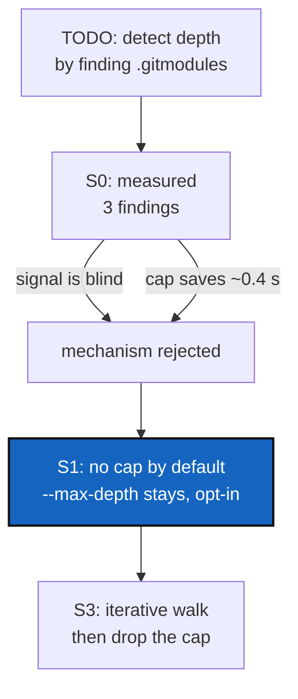

# MaxDepthAutodetect — stop guessing how deep to scan

*Created: 2026-09-04*

## Abstract — read this first

**The one-line version.** `discover` stops looking for repositories five
directories down, and that number is a guess. The fix is not to guess
better. It is to stop guessing: keep looking until there is nothing left
to look at.

**What this document is.** A plan. It evaluates the idea written in
`AgentSpec/TODO/max-depth-autodetect`, rejects the mechanism that idea
proposed, and proposes a simpler one in its place. No code has changed
yet.

**Why it exists.** The TODO note suggested working out the right depth
first — by searching the tree for `.gitmodules` files — and then passing
that number to the commands that need it. The goal is right. The method
does not work, for two reasons measured on real trees (§0). Worse, it
would cost more than it saves.

**What you will find.** §0 is what testing the idea showed, with the
commands and numbers. §1 is the simpler fix. §2 is the one decision left
for you. §3 is the work. §4 is how to know it is done.

**Who it is for.** Whoever picks this up next. Read §0 first — it is short
and it settles the design.

**What you need to do with it.** Answer §2, then do §3.



---

## 0. What testing the idea showed

### 0.1 `.gitmodules` is the wrong thing to look for

ComplexGitSync's whole purpose is to replace git submodules with plain
nested clones. `import-submodules` deletes every `.gitmodules` file it
converts. So in a tree ComplexGitSync has already adopted, there are none
left — but the repositories are still there, and `discover` still has to
find them.

Measured on a three-repository test tree, after converting it:

```
$ find <root> -name .gitmodules | wc -l
0

$ find <root> -name .git | sed 's|/.git$||'      # depth  path
0  .
2  ./external/HTA
4  ./external/HTA/docs/twin
```

No `.gitmodules` anywhere, and a repository four directories down. A
depth detector reading `.gitmodules` would answer "0" and the scan would
find nothing below the root.

The same holds for any project that never used submodules at all — the
CGSil1 tree in Tutorial 1, or any tree built by hand from a `.cgs`.
`discover` looks for `.git`, not `.gitmodules`, and that difference is
the whole point.

### 0.2 Working out the depth costs as much as just scanning

To find the deepest `.gitmodules`, you have to walk the whole tree. That
is the same walk, with no depth limit, that the limit was supposed to
avoid. Then you walk a second time to collect the repositories. The idea
pays the full cost twice to avoid paying it once.

### 0.3 The depth limit saves almost nothing anyway

Timed on `/usr/share`, one of the largest and deepest directory trees on
a Linux machine, with the file cache warm:

| `--max-depth` | time |
|---|---|
| 3 | 1.13 s |
| 5 (today's default) | 2.18 s |
| 8 | 2.62 s |
| unlimited | 2.59 s |

Removing the limit entirely costs about 0.4 seconds more than today's
default — on a tree far larger than any project. On this repository the
whole scan takes 93 milliseconds either way.

The reason is that the cost comes from how *many* directories there are,
not how *deep* they go. Past about eight levels there is almost nothing
left to descend into, so the limit stops paying for itself while still
being able to cut off a correct answer.

### 0.4 One real obstacle: the walk is recursive

`_walk_git_repositories` (`orchestre.py:819`) calls itself once per
directory level. Python allows about 1000 nested calls, then raises
`RecursionError`. Today's limit of 5 hides this. Remove the limit and a
deep tree crashes the command:

```
$ # a 1500-directory-deep tree
RecursionError: maximum recursion depth exceeded while calling a Python object
```

So the walk has to be rewritten to use its own list instead of the call
stack before the limit can go. That is a small change to one function,
and it is the only code change this plan really needs.

---

## 1. What to do instead

Keep `--max-depth`, but stop applying it by default.

| | today | proposed |
|---|---|---|
| default | stop at 5 levels, warn if cut short | keep going until there is nothing left |
| `--max-depth N` | the normal way to run it | still there, for anyone who wants to bound a scan |
| the warning | printed whenever the limit cut the walk short | printed only when the user asked for a limit and it cut the walk short |

This removes the failure mode instead of estimating around it. Nobody has
to know how deep their project is, no second walk is needed, and no
signal has to be inferred from files that may not exist.

The symlink rule already in place keeps this safe: the walk never follows
a symbolic link, so it cannot loop forever. `.git` directories are still
never descended into.

---

## 2. Decision — your call

**Should there be any ceiling left at all?**

| Option | Behaviour |
|---|---|
| **A (recommended)** | No ceiling. The walk runs until it is done. Simple, and §0.3 says the cost is small. |
| B | A high ceiling, say 100, kept only as a guard against a runaway scan on a mounted network drive or a home directory. Costs nothing in practice, but keeps a number nobody can justify. |

Option A is recommended because §0.4's rewrite already removes the crash
risk, and any number chosen for B is the same kind of guess this ticket
exists to delete.

---

## 3. The work

### 3.1 Make the walk iterative — `orchestre.py`

Rewrite `_walk_git_repositories` to keep its own list of directories to
visit instead of calling itself. Behaviour stays identical: same
repositories found, same order (root first), same `.git` and symlink
rules, same `stopped_early` result when a limit is given.

### 3.2 Drop the default limit

`max_depth` becomes optional (`int | None = None`, meaning no limit) on
`_walk_git_repositories`, `discover_repos`, and `init_from_submodules`.
`DEFAULT_DISCOVER_MAX_DEPTH` is deleted along with the two `--max-depth`
defaults that reference it, in `cli/configuration.py` and
`cli/expert.py`. The flag stays; only its default changes.

### 3.3 Update the messages

- The "scan stopped early" warning now only appears when the user passed
  `--max-depth`, since that is the only way the scan can stop early.
- `--max-depth`'s help text says it bounds the scan, and that the scan is
  unbounded without it.
- `"No git repository found under X (max depth N)"` drops the depth when
  no limit was given.

### 3.4 Tests

| Level | Test |
|---|---|
| unit | The iterative walk returns exactly what the recursive one did, on the same fixture trees. |
| unit | A 1500-directory-deep tree is walked without raising `RecursionError` (§0.4). |
| unit | A repository seven levels down is found with no `--max-depth`, and missed with `--max-depth 3`. |
| unit | `stopped_early` is `False` for an unbounded scan, `True` when a given limit cut it short. |
| integration | `discover` and `init-from-submodules` find a repository deeper than five levels with no flag passed. |

### 3.5 Documentation

- `README.md`: the sentence "only down to `--max-depth` (default 5)"
  becomes a description of the flag as an optional bound.
- `docs/Text/user_guide.tex`: same, in the `discover` and
  `init-from-submodules` sections.
- `tutorials/03_adopting_a_real_project.md`: the "do not pass
  `--max-depth 3`" warning stays useful, but the sentence explaining that
  the default is 5 has to go.
- Rebuild the PDFs.

---

## 4. Acceptance

1. `pixi run lint` and `pixi run test` pass.
2. `discover` with no flag finds a repository seven levels down.
3. A 1500-deep directory tree is scanned without crashing.
4. `--max-depth N` still bounds a scan, and still warns when it cut one
   short.
5. No default depth number is left anywhere in the code or the docs.
