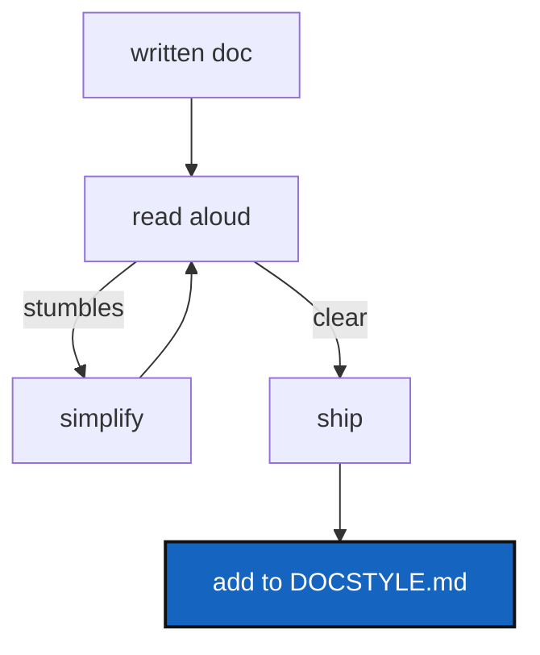

# StraightforwardEnglish — documentation must prioritize clarity over technical precision

*Created: 2026-09-03*

## Abstract — read this first

**The one-line version.** When explaining something to users, prefer simple words over jargon; spell things out over acronyms; break up long sentences. The reader's time is worth more than the author's brevity.

**What this document is.** A standard for how to write user-facing documentation in this repository: tutorials, the README, the docs built from LaTeX, and examples.

**Why it exists.** A sentence like "initialise's own .gitignore sync writes an untracked .gitignore inside each parent, which import-submodules' cleanliness check then rejects — so the one working order deadlocked" requires re-reading. Its meaning is buried under three technical concepts tangled together. A reader who doesn't know all three has to stop and look them up — or give up. The same sentence rewritten straight: "When you run initialise and then import-submodules, it should work. But import-submodules checks that the working tree is clean before converting. Initialise had just written a .gitignore file, so the check saw it as uncommitted work and refused to convert." Same facts, clear the first time.

**What you will find.** Three principles (straightforward language, no acronyms without expansion, short sentences), where they apply most, and how to know you've applied them.

**Who it is for.** The Editing agent (who writes tutorials, docs, README) and the Orchestration agent (who writes specs and architecture, less strictly). Anyone reviewing documentation before it ships.

**What you need to do with it.** Before finishing any user-facing document, read it aloud. If you stumble or backtrack, rewrite that sentence in the simplest words you can find. Then add this ticket's standard to the relevant spec file (DOCSTYLE.md or CLAUDE.md).

---

## 1. The three principles

### 1.1 Straightforward language

Prefer common words to technical ones when they mean the same thing. A reader unfamiliar with the jargon should still follow the main idea.

| Instead of | Write |
|---|---|
| "preflight validation failed; the working tree exhibits uncommitted artefacts" | "the check failed because the directory has uncommitted changes" |
| "the registry's lifecycle state is DECLARED; its repo_lifecycle_state is not READY" | "the repository is not yet cloned" |
| "mutating the submodule's stanza in .gitmodules" | "removing the submodule entry from .gitmodules" |
| "the clone operation is gated on TreeLifecycleState" | "the clone only runs when the tree is in the right state" |

When you *must* use a technical term (because it's the actual name of something), define it the first time: "the *lifecycle state* — whether the repository has been cloned yet — is READY once that's done."

### 1.2 No acronyms without explanation

Expand every acronym the first time it appears. Then you can use it afterwards.

| Instead of | Write |
|---|---|
| "check the CSG before cloning" | "check the ComplexGitSync specification (CSG) before cloning. Then the CSG is ready." |
| "the CWD is usually CGSHOME" | "the current working directory (CWD) is often the workspace root (CGSHOME)" |
| "you'll use the CLI every day" | "you'll use the command-line interface (CLI) every day" |

Avoid made-up acronyms altogether. If you find yourself abbreviating something, that's a signal the name is too long or appears too often. Rewrite to use the short form directly, or break the sentence up.

### 1.3 Short sentences

A sentence that requires a re-read is too long. Break it into two. A sentence longer than three lines on the page is almost always two sentences tangled together.

| Instead of | Write |
|---|---|
| "initialise adopts the root in place but deletes and re-clones every other repository straight from its remote, and those remotes still use submodules, since the conversion is a local, uncommitted change" | "initialise adopts the root in place but deletes and re-clones every other repository from its remote. Those remotes still use submodules, because the conversion is a local, uncommitted change." |
| "the conversion has to come last, and cannot be moved" | "the conversion must come last. You cannot move it earlier." |

---

## 2. Where it applies

### Applies most strictly: user-facing

- `tutorials/` — how-to walkthroughs for people adopting the tool. Every sentence must be clear to someone seeing it for the first time.
- `README.md` — introduction and feature overview. The entry point.
- `docs/Text/user_guide.tex` — reference for people running commands. Assume no background knowledge.
- `docs/Text/api_python.tex` — reference for people writing Python. Same bar.

### Applies moderately: developer-facing specs

- `CLAUDE.md` — instructions for contributors and agents. Can assume software engineering knowledge, but still favour clear over clever.
- `AgentSpec/AdditionalSpecs.md` — architecture and module boundaries. Can use technical terms, but define the first occurrence.
- Example files (`examples/*.cgs`, `examples/*.gts`) — should be readable without needing to open the reference docs.

### Does not apply: internal comments

- Inline code comments can be terse; readers have the code in front of them.
- Commit messages use the vocabulary that fits the change (no simplification needed).
- This repo's own internal specs and planning tickets (like this one) can be dense; they're for the team, not the user.

---

## 3. How to know you've applied it

1. Read the document aloud. Did you stumble anywhere? If yes, rewrite.
2. Ask someone unfamiliar with the tool to read one section. Can they follow it?
3. Count acronyms. Every one should be expanded at least once.
4. Look for sentences longer than three lines on the page. Break them up.
5. Search for technical terms. Is each one defined the first time it's used, or is context enough?

---

## 4. Acceptance

1. DOCSTYLE.md gets a new section: "Plain English" or "Straightforward language" (matching the phrasing used above).
2. CLAUDE.md's "Document conventions" section mentions this standard and links to DOCSTYLE.md §<new section>.
3. When a new tutorial, README section, or user-facing document is written, the author runs the §3 checklist before shipping.
4. Existing tutorials and docs need not be retroactively rewritten, but future edits to them should tighten up sentences that stumble.
