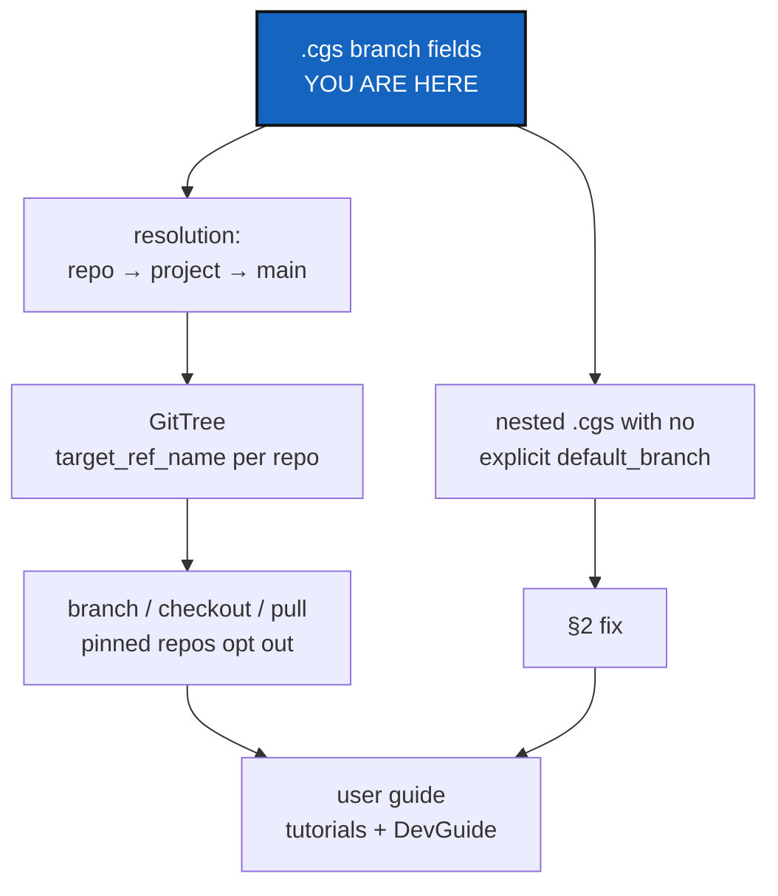

# MultiBranchSync — finish multi-branch sync, and say plainly what a branch field means

*Created: 2026-09-07*

## Abstract — read this first

**The one-line version.** A `.cgs` file has four fields that decide which
branch a repository lands on, three of them fall back to each other, and
none of that is written down for a user — so finish the multi-branch work
by naming the model, giving it one owner in a new Ring-0 `git_branch.py`
instead of the six private copies that exist today, and putting the model
in the user guide, the tutorials and the developer guide.

**What this document is.** The priority plan. Every other ticket is queued
behind it in `AgentSpec/openTickets/`. It replaces guesswork about branch
behaviour with a written model, using ComplexGitSync's own `install.cgs` as
the worked example, because that tree is the one every developer here
already has on disk.

**Why it exists.** Multi-branch sync works in code but is unexplained, and
two of the seven repositories in this tree get their branch from a constant
in the source rather than from any `.cgs`. Neither `.agentSpec/install.cgs`
nor `docs/DocCGS.cgs` declares `project.default_branch`, so `DevSpec` and
`DocSpec` land on `main` because `cgs_format.py` says so, not because a
`.cgs` asked for it. That is a small defect with a large cause: the branch
model was never written down, so no `.cgs` can be checked against it — and,
as §6's D6 shows, six places in the source each invented their own copy of
the rule.

**What you will find.** §1 the model as the code actually implements it,
with line numbers. §2 what is broken, with evidence. §3 what "finished"
means, as behaviour. §4 what each queued ticket contributes. §5 the
documents that must change. §6 the decisions. §7 the work. §8 how to
commit and push it. §9 risks. §10 acceptance.

**Who it is for.** The repository owner, who holds §6, and whoever
implements §7.

**What you need to do with it.** Answer §6, then do §7. The tree's shape
does not change: no mount moves, and `DevSpec` stays where it is.



---

## 1. The branch model, as the code implements it today

Four fields decide a branch. Nothing in `README.md`, `docs/Text/user_guide.tex`
or `tutorials/` states this. Every line below was read in the source.

| Field | Where it lives | Default | What it does |
|---|---|---|---|
| `project.default_branch` | the `[project]` table | `"main"` — the constant `DEFAULT_BRANCH` ([cgs_format.py:50](../src/ComplexGitSync/cgs_format.py#L50)), applied at [:144](../src/ComplexGitSync/cgs_format.py#L144) | The tree's branch. Every repository inherits it unless it says otherwise |
| `repos[].default_branch` | one repository entry | the project's ([:201](../src/ComplexGitSync/cgs_format.py#L201)) | The branch this one repository targets |
| `repos[].fallback_branch` | one repository entry | that repository's own `default_branch` ([:202](../src/ComplexGitSync/cgs_format.py#L202)) | Used when the target branch does not exist on the remote |
| `repos[].pinned` | one repository entry | `false` ([:207](../src/ComplexGitSync/cgs_format.py#L207)) | Opts the repository out of tree-wide **branch** moves |

**The fallback chain is three deep**, and each link is silent:
`fallback_branch` → `default_branch` → `project.default_branch` → `"main"`.
A `.cgs` that names no branch at all still resolves every repository to
`main`, and nothing tells the reader that a decision was made.

**What `pinned` actually means.** Say it as intent first, mechanism second
(D7a):

> A repository is `pinned` when it is **shared with other projects** and
> must stay on its own branch. Branch moves stop at it; tags do not.

The mechanism: in
[operations.py:100](../src/ComplexGitSync/operations.py#L100), a pinned
repository keeps its own `default_branch` when the tree targets a branch;
in [:124](../src/ComplexGitSync/operations.py#L124),
`create_global_branch` skips it. A **tag** still reaches every repository,
pinned or not, so a frozen release stays reproducible. That distinction —
branches stop at a pin, tags do not — is the single most useful sentence in
this ticket and appears in no document.

In practice the shared mounts are usually dot-named (`.agentSpec`,
`.localSpec`, the agent mount), but that is a habit, not the rule: `DocSpec`
at `docs/DocSpec` is pinned and is not hidden at any level. D7 has the
full table.

**At runtime**, [registry.py:206](../src/ComplexGitSync/registry.py#L206)
resolves `branch` or `default_branch` from the entry, then the document's
default, then the literal `"main"`. So there is a *fourth* fallback in a
second module, and it does not read the constant — it repeats the string.

**Two sync entry points**, not one:
[`restart_tree`](../src/ComplexGitSync/operations.py#L222) reads the root
repository's current branch and propagates it;
[`restart_tree_force`](../src/ComplexGitSync/operations.py#L245) is its
destructive counterpart. Both accept `force_access_protocol`, which is a
*protocol* override (`ssh`/`https`) and is not destructive — CI depends on
it. The two meanings of the word "force" in this tool are unrelated, and
that is worth stating wherever either appears.

## 2. What is broken

### 2.1 The root repository is exempt from nested discovery

[`discover_nested_configs`](../src/ComplexGitSync/discovery.py#L48) builds
its work list with `entry.repo_id != ROOT_REPO_ID`. The tree root's own
`.cgs` files are therefore never discovered. A repository can become a
child of the root **only** by being listed in the root `.cgs`'s `repos`
array.

This is deliberate and correct — a root that discovered its own `.cgs`
would recurse. It is recorded here because it is the rule that makes nested
mounts work, and §5's documents have to state it.

**`DevSpec`'s placement is correct and stays as it is.** It is declared in
`.agentSpec/install.cgs` and mounted at `.agentSpec/DevSpec/`, reached
because the `.agentSpec` entry carries `nested_config = "auto"`. A mounted
repository describing its own children is the design, not a fault: that is
the same shape `docs/` uses for `DocSpec`. Nothing in this ticket moves it.

### 2.2 Two repositories take their branch from a constant, not from a `.cgs`

`.agentSpec/install.cgs` declares its project as a bare string:

```toml
project = ".agentSpec"
```

There is no `default_branch`. So `DevSpec` resolves to `main` through
`DEFAULT_BRANCH` in [cgs_format.py:50](../src/ComplexGitSync/cgs_format.py#L50),
by way of the `setdefault` at
[:144](../src/ComplexGitSync/cgs_format.py#L144). The answer happens to be
right, and `cgitsync status` is clean, so nothing fails loudly.

**Both nested `.cgs` files in this tree have the same gap.**
`docs/DocCGS.cgs` declares `project = "docsCGS"`, also a bare string, so
`DocSpec` reaches `main` the same way. Two of the seven repositories get
their branch from the source rather than from a file.

The defect is that no `.cgs` states the intent. Change the constant, or
mount either parent in a project whose branch is not `main`, and both
children follow silently. Every nested `.cgs` should say which branch it
means, exactly as the root `install.cgs` already does with
`project = { name = "ComplexGitSync", default_branch = "main" }`.

### 2.3 A latent trap: ComplexGitSync's own root holds two `.cgs` files

`install.cgs` and `ComplexGitSync.cgs` both sit at this repository's root,
and `DEFAULT_NESTED_CONFIG` is `"auto"`
([cgs_format.py:52](../src/ComplexGitSync/cgs_format.py#L52)). Auto
discovery raises `Ambiguous nested .cgs discovery` on more than one match
([discovery.py:178](../src/ComplexGitSync/discovery.py#L178)).

Today §2.1's root exemption hides this. But `ComplexGitSync.cgs` exists
precisely so ComplexGitSync can be mounted *inside another tree* — where it
is not the root, where `nested_config` defaults to `"auto"`, and where the
ambiguity error fires. Nobody has hit it because nobody has done that yet.

## 3. What "finished" means

Behaviour, not code. The worked example is this repository's own
`install.cgs`, because every developer here already has that tree.

1. Reading the tree's `.cgs` files — the root one plus each nested one it
   reaches — tells you every repository and the branch each will land on.
   No branch is decided by a constant the reader cannot see.
2. `cgitsync view-tree` shows the branch each repository targets. Today it
   shows a fallback only when it differs from `main`
   ([git_tree.py:1041](../src/ComplexGitSync/git_tree.py#L1041)), which
   hides exactly the common case.
3. `cgitsync branch <name>` on this tree creates `<name>` in
   `ComplexGitSync` and `DocComplexGitSync`, and leaves `.agentSpec`,
   `DevSpec`, `.localSpec` and the agent mount on their pinned branches.
   `cgitsync tag <name>` reaches all seven.
4. A user can predict all of the above from the documents in §5 before
   running anything.

## 4. What the queued tickets contribute

Every open ticket now lives in `AgentSpec/openTickets/`. This is what each
one gives to this work, and what stays out of scope.

| Ticket | Contributes | Stays out |
|---|---|---|
| `agenticMountStep3` | The round trip this ticket has to make true: plain clone on `main` → one command → a READY tree with every repository on the branch it should be on. Its §1 statement that tree-wide commands drag pinned mounts is the origin of §1's `pinned` rule | Its `.goc` Orchestrator and the `$CGSHOME` binding work |
| `GitOrchestratorCommand` | The `@project` token — `default_branch = "@project"` resolved at normalization. It belongs in §1's model as a fifth way a branch is chosen, and D3 decides whether it lands here | The `.goc` file itself |
| `AnonymousAgent` | The mount topology it depends on. Its `.agent` mount will inherit whatever §6 D1 decides about where shared specs are declared | The vendor-name rename |
| `ForkObject` | Its D5 warns that `@` already means "variable marker" in the `@project` token while `fork<ID>@<project>` uses it as a separator. Settle that here, since §1 is where the vocabulary is written down | The fork object itself |
| `StateMemory` | A changed `.cgs` hashes to a new `state(<hash>)_n`. Any branch-field change in §7 creates a new state directory and strands the old one | The register rework |
| `AppendCloneMode` | `force_pull` runs `git clean -fd` on every resync, so a branch change that alters a mount point can erase colocated files | The append-mode fix |
| `CliTypoSuggestion` | Nothing | All of it |
| `MdForAdministratedProject` | Nothing — **the file is 0 bytes**. It has no abstract, no mermaid graph and no content, so it fails DOCSTYLE §1 and §2 and records nothing. Write it or delete it | — |

## 5. Documents that must change

The model in §1 is useless until a user can read it. Three places, three
different readers:

| Document | What it gains |
|---|---|
| `docs/Text/user_guide.tex` | A "Branches in a `.cgs`" section: the four fields, the fallback chain, D7a's one-sentence definition of `pinned`, and the branches-stop-at-a-pin/tags-do-not rule. Its `checkout` section already mentions fallback at lines 399–400; this replaces that half-sentence with the model |
| `tutorials/` | The worked example from §3, run against `install.cgs`. Tutorial 3 already tells a reader to copy a `.cgs` snippet with `default_branch` in it and never says what the field does |
| `docs/DevGuide/architecture.md` | How `GitTree` carries the resolved branch — `target_ref_name` per entry, set by `set_global_branch`, read by the operations |

`docs/Text/user_guide.tex` is a LaTeX source. `bump-version` rewrites `.tex`
but does not rebuild PDFs, so §7 has to run `latexmk` explicitly.

## 6. Decisions

### D1. Does every `.cgs` have to state its branch explicitly? — **settled in principle, confirm the scope**

The topology stays as it is: `DevSpec` remains mounted at
`.agentSpec/DevSpec/`, declared by `.agentSpec/install.cgs`. §2.2's fix is
one line — give that file an explicit project branch:

```toml
project = { name = ".agentSpec", default_branch = "main" }
```

What needs confirming is how far the rule reaches:

| Option | Rule |
|---|---|
| **A (recommended)** | Every `.cgs` in this tree states `project.default_branch` explicitly, and a test asserts it for the ones this repository owns. The constant stays as the language default for other people's files |
| B | Fix `.agentSpec/install.cgs` only, and leave the rule unwritten |
| C | Make `project.default_branch` a required key, so a `.cgs` without one fails validation |

C is the strongest but breaks every existing `.cgs` that relies on the
default, including the examples under `examples/`. A gets the same
guarantee for this tree without a breaking change.

### D2. Does the root exemption get documented, or guarded?

§2.3's ambiguity is latent. Either document that a repository which may be
mounted inside another tree must keep exactly one `.cgs` at its root, or
add a check that fails loudly at authoring time. Documenting is free;
guarding needs a test and a clear error.

### D3. Does the `@project` token land here?

`GitOrchestratorCommand`, `agenticMountStep3` and the archived
`BranchPinning` all plan `default_branch = "@project"`, resolved at
normalization. It is a fifth way a branch gets chosen, so §1's model is
incomplete without it — but implementing it is a `cgs_format.py` change with
its own round-trip requirement (a token must survive being written back
out). Recommended: document it in §1 as planned-not-built, and keep the
implementation in its own ticket.

### D4. Does `@` keep two meanings?

`@project` is a variable marker; `fork<ID>@<project>` is a separator. §1 is
where the vocabulary gets written down, so it is where this is settled.
Neither is in the code yet, so changing either is free today.

### D5. Does `view-tree` show the target branch always?

Today it prints a fallback only when it differs from `main`
([git_tree.py:1041](../src/ComplexGitSync/git_tree.py#L1041)), so the
common case is invisible. §3 point 2 wants it always shown. That changes
output every existing reader is used to.

### D6. One owner for branch resolution — a new `git_branch.py`

**The evidence, and it is worse than §1 suggested.** The literal `"main"`
is written into six places across five modules, and **not one of them
reads `DEFAULT_BRANCH`**:

| Where | The line |
|---|---|
| [discovery.py:201](../src/ComplexGitSync/discovery.py#L201) | `branch = document_default_branch or "main"` |
| [discovery.py:292](../src/ComplexGitSync/discovery.py#L292) | `.gitmodules` parsing, `fallback="main"` |
| [registry.py:208](../src/ComplexGitSync/registry.py#L208) | `branch = document_default_branch or "main"` |
| [git_runner.py:334](../src/ComplexGitSync/git_runner.py#L334) | `ref_name or self.current_branch(...) or "main"` |
| [orchestre.py:3699](../src/ComplexGitSync/orchestre.py#L3699) | `current_branch or entry.target_ref_name or entry.default_branch or "main"` |
| [operations.py:191](../src/ComplexGitSync/operations.py#L191) | `root_entry.resolved_ref_name or root_entry.target_ref_name or "main"` |

Each is a private copy of the fallback chain, and each stops at a different
link. Change `DEFAULT_BRANCH` and five of them ignore you.

This has a direct precedent in the project's own rules. `CLAUDE.md` says
`parse_repo_id()` is the *only* repo-identifier parser and forbids a second
one. There is no equivalent rule for branch resolution, and the result is
six. **The owner's proposal is that rule, applied to branches**, and it is
the right call.

**Scope, with two refinements.**

*Do not add a `branch` field to `GitRepo`.* `WorkingRepo` already carries
`current_ref_name`, `target_ref_name`, `resolved_ref_name`,
`default_branch` and `fallback_branch`, plus `fallback_applied` and
`fallback_reason` ([git_repo.py:360-385](../src/ComplexGitSync/git_repo.py#L360)).
The value the owner wants already has two names: `target_ref_name` is what
the tree aims at, `resolved_ref_name` is what it landed on. A sixth name
for the same idea makes the confusion worse, not better. What is missing is
not a field — it is a single owner that computes those fields.

*Keep root and pinned state in `GitTree`.* The proposal says the new module
would "contain its root repos and the pinned information". That is
`git_tree.py`'s existing job, and duplicating it would create a second
tree. Instead `git_branch.py` stays a **pure resolver**: give it the
declared fields and it returns the branch plus the reason it chose it. Then
`operations.py`'s pinned rule asks the resolver instead of re-deriving, and
`fallback_applied`/`fallback_reason` get filled in one place rather than
guessed at several.

**Where it sits.** Ring 0 — pure, offline, no `subprocess`, no `open()`
(`.localSpec/AdditionalSpecs.md` §Rings, rule 3), beside `git_repo.py`. It
must stay under the hard ceilings: 500 LOC, 7 public symbols, 6 internal
imports (`scripts/check_module_ceilings.py`). A resolver fits well inside
all three, and pulling the six copies out should move `orchestre.py`,
`registry.py` and `discovery.py` *down* the ratchet, not up.

**What is still open:** whether `git_runner.py:334` and
`discovery.py:292` join the migration. Both resolve a branch from live Git
or from `.gitmodules` rather than from a `.cgs`, so they are a different
question wearing the same literal. Recommended: migrate the four `.cgs`-side
copies first, and leave those two with a comment saying why they differ.

### D7. What `pinned` means, and whether discovery skips hidden folders

Two proposals from the owner. They are linked in intent but not in code,
and they need separating.

**7a. Give `pinned` a stated meaning — take this.** Today `pinned` is
documented only by its mechanism ("opts out of tree-wide branch moves").
It needs a *meaning*, so an author can decide whether to set it without
reading `operations.py`:

> A repository is `pinned` when it is **shared with other projects** and
> must stay on its own branch. Branch moves stop at it; tags do not.

That sentence is what §5's user-guide section needs, and it settles every
case in this tree at a glance.

The owner proposed the criterion "hidden folders that are user config
files". That is *almost* right, and it is right about the three that
matter — `.agentSpec`, `.localSpec` and the agent mount. But two of the
five pinned entries in this tree are not hidden:

| Pinned entry | Mounted at | Hidden? |
|---|---|---|
| `.agentSpec` | `.agentSpec` | yes |
| `.localSpec` | `.localSpec` | yes |
| `.claude` | `.claude` | yes |
| `DevSpec` (`.agentSpec/install.cgs:8`) | `.agentSpec/DevSpec` | no — hidden parent, plain name |
| `DocSpec` (`docs/DocCGS.cgs:10`) | `docs/DocSpec` | **no, not at any level** |

`DocSpec` is pinned because `DocComplexGitSync` shares it, which is exactly
the "shared with other projects" rule and has nothing to do with hiding.
So state the rule as *shared*, and note that in practice shared config
mounts are usually dot-named. Same guidance, no counterexamples.

**7b. Make the filesystem walk skip dot-named directories — do not take
this as stated.** Three findings, in order of weight:

1. **It would not simplify `pinned` at all.** `pinned` is read from the
   `.cgs` ([registry.py:316](../src/ComplexGitSync/registry.py#L316),
   [discovery.py:154](../src/ComplexGitSync/discovery.py#L154)). It never
   passes through the walk. `_walk_git_repositories`
   ([orchestre.py:816](../src/ComplexGitSync/orchestre.py#L816)) has
   exactly one caller — [orchestre.py:1681](../src/ComplexGitSync/orchestre.py#L1681),
   behind the `discover` command, which drafts a *new* `.cgs` from what is
   on disk. The two are unrelated code paths.
2. **It would cost three repositories.** `discover` run on this tree would
   stop seeing `.agentSpec`, `.localSpec` and the agent mount — three of
   the seven. The self-management example this whole ticket is built on
   (§3) would no longer round-trip.
3. **A test exists specifically to prevent it.**
   `tests/unit/test_walk_git_repositories.py:120`,
   `test_a_hidden_dot_named_directory_is_discovered`, carries the comment
   "Guards the AgenticMounts split (`.agentSpec/`, `.localSpec/`,
   `.claude/`) against a future 'skip hidden directories' change". The
   AgenticMounts work foresaw this and wrote the guard.

**The version worth taking.** The owner's real point is that `discover`
should not draft someone's personal config mounts into a project's
topology as if they were project repositories. That is true, and it is
served without losing them:

| Option | Behaviour |
|---|---|
| **A (recommended)** | `discover` still finds dot-named repositories, but drafts them with `pinned = true` by default. The author sees them, and the default already says "shared, leave it alone" |
| B | `discover` finds them and lists them separately in its report, leaving the author to include them |
| C | `discover` skips them behind an explicit `--include-hidden` flag — closest to the proposal, and the existing test would have to be rewritten rather than deleted, with its comment updated to say why the guard was lifted |

A keeps every existing test passing and makes the hidden/pinned link the
owner is after into a *default*, which is where a convention belongs.

## 7. The work, in order

| # | Step | Where |
|---|---|---|
| 1 | Answer §6, D1 first | owner |
| 2 | Apply D1: give `.agentSpec/install.cgs` an explicit `project.default_branch`, and do the same for every other nested `.cgs` this tree reaches (`docs/DocCGS.cgs`) | `.agentSpec`, `docs/` |
| 3 | Add the test D1-A asks for: every `.cgs` this repository owns states `project.default_branch` explicitly | `tests/unit/` |
| 4 | **D6: write `git_branch.py`** as a Ring-0 pure resolver — declared fields in, resolved branch plus reason out. No I/O, no tree state. Record the baseline first: `pixi run python scripts/check_module_ceilings.py` | `src/ComplexGitSync/` |
| 5 | Migrate the four `.cgs`-side copies of the fallback chain to call it: `discovery.py:201`, `registry.py:208`, `orchestre.py:3699`, `operations.py:191`. Leave `git_runner.py:334` and `discovery.py:292` with a comment saying why they differ | `src/ComplexGitSync/` |
| 6 | Have the resolver fill `fallback_applied` and `fallback_reason` on the entry, so the reason a branch was chosen is recorded rather than recomputed | `git_repo.py`, `git_branch.py` |
| 7 | Add the unit tests that pin the model: a `.cgs` with no branch fields resolves to `main`; a pinned repo keeps its branch under `set_global_branch` but takes a tag; the three-deep fallback chain resolves in order; and `grep -c '"main"'` over `src/` does not grow | `tests/unit/` |
| 8 | D5, if taken: `view-tree` prints the target branch for every entry, with a test | `git_tree.py` |
| 9 | D7b, if option A: `discover` drafts a dot-named repository with `pinned = true` by default, with a test. Leave `test_a_hidden_dot_named_directory_is_discovered` passing — it stays the guard that the repositories are still found | `orchestre.py` |
| 10 | Write §5's three documents. Rebuild the PDFs: `cd docs && latexmk -pdf MASTER.tex`, plus each `c_*.tex` touched | ComplexGitSync, `docs/` |
| 11 | Run the §3 worked example against this tree and paste the real output into the tutorial — not an invented transcript | local |
| 12 | Regenerate the workspace state. A changed `.cgs` hashes to a new `state(<hash>)_0`; the current one is `state(4002e33f…)_0`. Confirm the stale one is no longer preferred and remove it if it is | CGSHOME |
| 13 | `pixi run lint`, `pixi run test`, `pixi run check-ceilings`, `pixi run bump-version` | ComplexGitSync |
| 14 | Update `.localSpec/AdditionalSpecs.md`: add `git_branch.py` to the responsibility table, the ring table and the dependency diagram. `CLAUDE.md`'s module table too — both are required when a module is added | `.localSpec`, `.claude` |
| 15 | Stamp and archive this ticket per `.agentSpec/TICKETLIFECYCLE.md` | ComplexGitSync |

## 8. How to commit and push this work

The work spans five repositories with different pinning, and the tool's
commit path has three traps. This section is the sequence, not a
description of it. Every claim below was checked with `--dry-run` against
this tree.

### 8.1 What the tree-wide commands actually do

| Command | Plan it runs | The trap |
|---|---|---|
| `cgitsync add [PATH…]` | stages; each PATH resolves to the one repo that owns it | none — this is the precise tool |
| `cgitsync commit -m "…"` | `git add --all` → `git commit`, in every repo | **it stages everything first.** Use `--no-stage` after staging deliberately |
| `cgitsync push` | `git push`, or `git push -u origin <branch>` when no upstream | none |
| `cgitsync freeze-release <tag> <msg>` | add, commit, pull, push, freeze | inherits the `add --all` sweep |

All of them run leaf-first:
`DocSpec → DocComplexGitSync → .localSpec → .claude → DevSpec → .agentSpec → ComplexGitSync`.
That order is correct here: the mounts land before the root that declares
them.

Two more things to know before starting.

**One message, every repository.** `commit` applies the same message to
each repo that has staged changes, and skips repos with none. If this
change needs different messages per repository, commit with plain `git` in
each and use `cgitsync` only for `push`.

**A clean `verify` is not evidence.** It reports `status=clean findings=0`,
but [orchestre.py:25](../src/ComplexGitSync/orchestre.py#L25) records that
`ledger_store.py` is "not yet wired into SyncLedger's actual write path".
The chain it verifies is not being written. `StateMemory_DevPlanTicket.md`
covers this; do not read a clean verify as proof anything was recorded.

### 8.2 The pinning asymmetry, which decides the order

Step 2 edits two `.cgs` files that live in repositories with opposite
pinning:

| File | Repository | Pinned? | Where the edit lands |
|---|---|---|---|
| `docs/DocCGS.cgs` | `DocComplexGitSync` | no | rides the feature branch, merges with the pull request |
| `.agentSpec/install.cgs` | `.agentSpec` | **yes**, on `main` | **straight to a shared `main`**, no pull request, no review |

Every other project that mounts `.agentSpec` sees that second edit the
moment it is pushed. **So land the `.agentSpec` half last**, after
ComplexGitSync's pull request has merged — not first, and not in the same
sweep.

**Not every pinned mount is equally risky, and the difference is the branch
it is pinned to.** Step 14 also edits `.localSpec/AdditionalSpecs.md` and
`CLAUDE.md` in the agent mount:

| Mount | Pinned to | Who else reads that branch |
|---|---|---|
| `.localSpec` | `ComplexGitSync` | nobody — the branch is named after this project |
| the agent mount | `ComplexGitSync` | nobody, same reason |
| `.agentSpec` | **`main`** | **every project that mounts it** |
| `DevSpec`, `DocSpec` | `main` | every consumer — but this ticket does not edit them |

So `.localSpec` and the agent mount can be pushed freely alongside the rest:
their pinned branch is this project's own. `.agentSpec` is the one that
needs the pull request to merge first. That is what a project-named pinned
branch buys you, and it is worth saying in §5's user-guide section.

### 8.3 The sequence

1. Clear anything staged that does not belong to this change. `cgitsync status`
   should show only what you mean to ship. `docs` in particular collects
   rebuilt PDFs.
2. `cgitsync branch multibranch-sync`, then
   `cgitsync checkout multibranch-sync`. Pinning does the right thing on its
   own: the branch is created in `ComplexGitSync` and `DocComplexGitSync`
   only, and the five pinned mounts stay where they are
   ([operations.py:124](../src/ComplexGitSync/operations.py#L124)).
3. Do §7 steps 2–13, leaving `.agentSpec/install.cgs` untouched for now.
4. Stage deliberately with `cgitsync add <path>` per file, then
   `cgitsync commit --no-stage -m "…"`, then `cgitsync push`.
5. Open the pull request for ComplexGitSync — `maintainerClearance` requires
   one on the default branch. The mounts carry no ruleset and push straight
   through.
6. After the merge: make the `.agentSpec/install.cgs` edit, commit and push
   it on `.agentSpec`'s own `main`.
7. Regenerate the recorded state. Both `.cgs` edits change the tree's hash,
   so `state(4002e33f…)_0` is stale and a new `state(<hash>)_0` takes over.
   Confirm the old one is no longer preferred, and remove it if it is.

### 8.4 The final check — reload from `install.cgs`

The point of the whole ticket is that a fresh tree built from `install.cgs`
lands every repository on the branch its `.cgs` names. Prove it from a
clean clone, not from this workspace:

```bash
git clone https://github.com/flipoyo/ComplexGitSync.git
cd ComplexGitSync
pixi install
pixi run cgitsync bootstrap install.cgs ComplexGitSync
# bootstrap prints the export line; use it
export CGSHOME=/home/<user>/.cgs/CGS<timestamp>/ComplexGitSync
cd "$CGSHOME"
pixi install          # the bootstrapped clone needs its own environment
pixi run cgitsync status
pixi run cgitsync view-tree
```

`status` must show seven repositories, `ready=true complete=true`,
`errors=0`, and each pinned mount on the branch its `.cgs` names —
`.localSpec` and the agent mount on `ComplexGitSync`, `.agentSpec`,
`DevSpec` and `DocSpec` on `main`. `view-tree` must show the same, per §6
D5.

## 9. Risks

| Risk | Handling |
|---|---|
| A `.cgs` edit lands in a mounted repository but is never pushed, so a fresh clone still reads the old file | Step 2 touches `.agentSpec` and `docs/`, which are separate repositories with their own remotes. Push each one, and check CI on the merge commit |
| The `.cgs` change lands before the mounts can satisfy it, and CI fails on `main` — the way AgenticMounts step 2 failed | Step 2 before step 9, and CI is checked on the merge commit |
| Every existing tree's recorded state still describes the old topology | Step 8, plus a re-run of `initialise` in every other checkout |
| §1's model is written from the code and the code later drifts | Step 4's tests are the guard. A model documented without tests rots in one release |
| D5 changes `view-tree` output and breaks a reader's expectations, or a test | It is optional and separable; take it only if step 5's test is written with it |
| The documentation is written but the PDFs are not rebuilt, so the shipped guide still lacks the model | Step 6 names the command; `bump-version` does not do it |
| This ticket is treated as done when the code is done and the documents slip | §10 point 4 makes the documents an acceptance criterion, not a follow-up |

## 10. Acceptance

1. Every `.cgs` this repository owns states `project.default_branch`
   explicitly, so no repository's branch comes from a constant in the
   source. A test asserts it.
2. `git_branch.py` exists, is Ring 0, and is the only place the `.cgs`
   fallback chain is implemented. The four call sites in §7 step 5 call it;
   the two that remain carry a comment saying why. `check-ceilings` shows
   the modules they came from going down, not up.
3. The user guide defines `pinned` by intent, in D7a's one sentence, before
   describing its mechanism — and `cgitsync discover` on this tree still
   finds all seven repositories, dot-named ones included.
4. `cgitsync status` and `cgitsync view-tree` both run clean on this tree,
   and `view-tree` reports the target branch per §6 D5.
5. `cgitsync branch <name>` creates the branch in exactly the unpinned
   repositories, and `cgitsync tag <name>` reaches all seven — proved by a
   test, not by inspection.
6. `docs/Text/user_guide.tex`, a tutorial, and `docs/DevGuide/architecture.md`
   all describe the §1 model, and the PDFs are rebuilt.
7. `pixi run lint`, `pixi run test` and `pixi run check-ceilings` pass, and
   CI is green.
8. `AgentSpec/` holds only this ticket, `archive/`, `openTickets/` and
   `Tickets/`.
9. This ticket is stamped and archived.

---

## 11. Outcome — what was implemented, 2026-09-07

Recorded at archiving time. The decisions in §6 were answered by the owner
as follows, and every one took the recommended option:

| Decision | Answer |
|---|---|
| D1 | **A** — every `.cgs` this tree reaches states `project.default_branch`, with a test |
| D2 | **Document + better error** — the one-`.cgs`-at-a-root rule is in the user guide, and the ambiguity error now names the files it found and the two ways out |
| D3 | Recommendation stands: `@project` is *not* implemented here. It stays its own ticket (`GitOrchestratorCommand`) |
| D4 | Not settled here. `@` still has two proposed meanings; `ForkObject` owns it, and nothing in this ticket's code uses either |
| D5 | **Always show it** — `view-tree` prints `br=<branch>` on every line |
| D6 | **Taken** — `git_branch.py` written as a Ring-0 pure resolver |
| D7a | **Taken** — `pinned` is defined by intent in the user guide before its mechanism |
| D7b | **A** — `discover` still finds dot-named repositories, and drafts them `pinned = true` |

### What changed

`src/ComplexGitSync/git_branch.py` is new: Ring 0, 263 LOC, 7 public
symbols, importing only `git_repo`. It owns the `.cgs` fallback chain and
the pinning rule, and returns a `BranchResolution` carrying the branch, its
`RefKind`, and the `BranchSource` that answered — so *why* a branch was
chosen is recorded rather than recomputed.

Six private copies of the chain were removed. `cgs_format.py`,
`discovery.py`, `registry.py`, `operations.py`, `git_tree.py` and
`orchestre.py` now call the resolver. Four sites still spell `"main"`, each
a genuinely different decision and each carrying a comment saying so:
`.gitmodules` reading and writing (Git's own default, not ours),
`git_runner.force_pull`'s bare-path last resort, and `gts_document.py`'s
canonical hash builder (a frozen wire-format input).
`tests/unit/test_git_branch.py` counts those literals and fails if a fifth
appears.

`.agentSpec/install.cgs` and `docs/DocCGS.cgs` — the two files §2.2 named —
now state their branch, as does `ComplexGitSync.cgs`.

### Where the ratchet moved

`--write-baseline` was run after the work, and it moved in both directions:

| Module | LOC | Why |
|---|---|---|
| `registry.py` | 447 → 438 | private chain copy deleted |
| `discovery.py` | 229 → 222 | private chain copy deleted |
| `cgs_format.py` | 642 → 641 | `DEFAULT_BRANCH` moved out |
| `git_tree.py` | 1114 → **1116** | D5's resolved branch, plus the import |
| `orchestre.py` | 3394 → **3405** | D7b's `_is_dot_named_mount`, plus the import |

The two increases are inside the owner's standing per-module allowance
(`.localSpec/AdditionalSpecs.md`, *Ceilings*) and are reported here rather
than raised quietly.

### What was deliberately not done

**The workspace state under `.cgitsync/` was not regenerated.** Both `.cgs`
edits change the tree's content hash, so a new `state(<hash>)_0` is due —
but `.cgitsync/` is under the one hard prohibition against hand-editing,
and the workspace was dirty with this ticket's own work while it ran. The
correct order is to let a normal lifecycle command allocate the new state
directory *after* this change is committed, and to remove a stale one only
if the tool then stops preferring it. `cgitsync status` reports
`ready=true complete=true repos=7 errors=0` on the current state, so
nothing is broken in the meantime.
