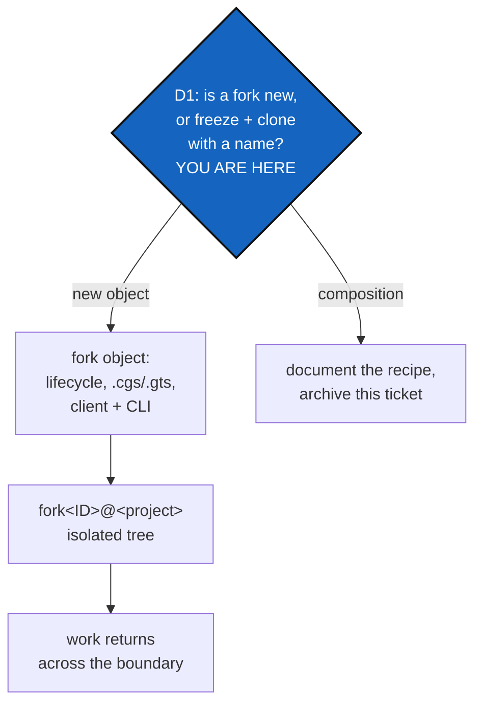

# Fork as a first-class object — `fork<ID>@<project>`

*Created: 2026-09-06*

> **Closed on 2026-09-09 without being built.** D1 — the question §5 says
> to answer before anything else — is answered by the code: the problem this
> object was proposed to solve no longer exists, so what is left is `freeze`
> plus `clone` wearing a name. See §9.

## Abstract — read this first

**The one-line version.** Give ComplexGitSync a `fork` object: a named,
timestamped, isolated copy of a tree's state, taken from a frozen snapshot,
that carries work without ever propagating a branch name into the shared
mounts — and answer first whether that object is genuinely new or is
`freeze` plus `clone` wearing a name.

**What this document is.** A plan for a feature, split out of
[2-5_AnonymousAgent_DevPlanTicket.md](../openTickets/2-5_AnonymousAgent_DevPlanTicket.md) at the
owner's request. That ticket needed a delivery boundary and takes a plain
GitHub fork; this one asks whether the boundary should be a concept the
tool itself understands. Nothing here has been started, and nothing here
blocks the anonymisation work.

**Why it exists.** Branches are the wrong shape for a tree of repositories
that other projects share. Tree-wide `branch`, `checkout` and `pull`
propagate one name across every mount, which drags `.localSpec` and the
agent mount off the branch they are pinned to and creates one project's
feature branches inside repositories other projects read. That is already
recorded in `agenticMountStep3`, unfixed. A fork has no
such failure mode: it is a different kind of object, and the boundary is
visible in its name.

**What you will find.** §1 the problem branches cause. §2 what already
exists and how close it gets — the question that decides whether this
ticket is worth doing. §3 what the object would be. §4 the architecture it
lands in. §5 the decisions. §6 the work. §7 risks. §8 acceptance.

**Who it is for.** The repository owner, who holds every decision in §5,
and whoever implements it afterwards.

**What you need to do with it.** Answer D1 before anything else. If D1
comes back "this is `freeze` plus `clone`", close the ticket and archive it
— that is a legitimate and cheap outcome.



---

## 1. What branches do wrong here

A ComplexGitSync tree is seven repositories, four of which are shared with
other projects (`.agentSpec`, `DevSpec`, `.localSpec`, and the agent
mount). The tree-wide commands treat them all alike:

- `branch <name>` creates `<name>` in every repository of a READY tree.
- `checkout <name>` moves every repository to it.
- `pull` resynchronises every repository.

For a project-local feature that is wrong twice. It leaves that project's
branch name sitting inside repositories other projects clone, and it moves
pinned mounts off the branch they are pinned to. `agenticMountStep3` states
the second half plainly and has not fixed it.

The `pinned = true` flag on the shared entries in `install.cgs` is the
partial answer that exists today. A fork is the other kind of answer:
instead of asking every command to remember which repositories to leave
alone, take the whole tree somewhere else.

## 2. What already exists — answer this before building anything

The tool is not starting from nothing, and the overlap is large enough that
D1 may close this ticket.

| Existing piece | What it already does |
|---|---|
| `freeze <name>` | Emits a versioned `.gts` snapshot of a READY tree and tags it. Its dry-run plan is `git add --all → git commit -m '<name>' → git tag <name> → git push`, applied leaf-first across every repository |
| `launch-release` | Checks out a frozen release tag across a READY tree |
| `clone` / `bootstrap` | Builds a fresh tree from a `.cgs` or a `.gts` into a new directory |
| `paths.py:216` | Already allocates timestamped workspaces: `CGS{%Y%m%d%H%M%S}` under the `.cgs` root. `fork<ID>@<project>` sits in exactly this family |
| `.cgitsync/state(<hash>)_n/` | Already keys recorded state by a content hash, so a changed `.cgs` gets its own state directory rather than overwriting one |

So "a fork of main's state at a timestamp" is reachable today as: `freeze`
that state under a name, then `clone` or `bootstrap` from the resulting
`.gts` into a new workspace. **D1 is whether the object adds anything that
composition does not.** The plausible answers are that it does — a fork
would carry an *origin* (which snapshot it came from), a *lifecycle* (open,
returned, abandoned), and a rule that its ref names never travel back into
the mounts — none of which `freeze` + `clone` records anywhere. But that
case has to be made explicitly rather than assumed, because the cost in §6
is a real feature, not a rename.

Two naming facts, both verified, that the object can rely on:

- `@` is legal in a git reference. `git check-ref-format
  refs/tags/fork20260906213000@ComplexGitSync` and the `refs/heads/`
  equivalent both pass. So the owner's identifier works verbatim as a tag
  or a branch.
- `@` is **not** legal in a GitHub repository name (letters, digits, `-`,
  `_`, `.`). The owner's own `atCGS` and `atOEMS` repositories already
  spell it `at`. So the identifier survives as a ref and as a directory,
  never as a remote repository name.

There is also a vocabulary collision to settle, and it is not in the code
yet, so it is cheap to settle now. Three active tickets —
`GitOrchestratorCommand`, `BranchPinning` and `agenticMountStep3` — plan a
`.cgs` token written `default_branch = "@project"`, where `@` marks a
*variable that normalization resolves*. In `fork<ID>@<project>` the same
character is a *separator*. Two meanings for one symbol in one tool's
vocabulary is the kind of thing that reads fine to whoever wrote it and
confuses everyone else. Either pick a different separator here, or state
the two meanings explicitly wherever both appear. D5 owns this.

## 3. What the object would be

A sketch, to be corrected by §5, not a specification.

```
fork<ID>@<project>/          a workspace directory, ID = %Y%m%d%H%M%S
├── <project>/               the tree, cloned from the origin snapshot
├── …the other mounts…
└── .cgitsync/               its own recorded state, its own ledger
```

Properties that would distinguish it from a plain second workspace:

| Property | Meaning |
|---|---|
| **Origin** | The `.gts` snapshot and tag it was taken from, recorded, not remembered |
| **Isolation** | Tree-wide `branch` and `checkout` inside a fork never touch a pinned mount; the fork *is* the branch |
| **Lifecycle** | Explicit states with validated transitions, per `Manager.md`'s rule that a repository is a graph of explicit objects, states and operations |
| **Return** | One named operation that carries the work back to the origin, rather than an ad-hoc push |

## 4. Where it lands in the architecture

`CLAUDE.md`'s boundary is strict, and this feature touches several rings.
Named here so the implementer does not have to rediscover it:

| Module | Likely change |
|---|---|
| `paths.py` | Allocating the `fork<ID>@<project>` workspace directory, beside the existing `CGS<timestamp>` allocation |
| `state_store.py` | The fork's own state directory and its origin pointer |
| `cgs_format.py` / `gts_document.py` | Only if the fork's origin has to be represented in a document. Both are Ring-0: deterministic, offline, no subprocess |
| `registry.py`, `operations.py` | Isolation — the rule that a fork's tree-wide operations skip pinned mounts |
| `orchestre.py` | The `ComplexGitSyncClient` method carrying all the semantics |
| `cli/expert.py` | A thin `_handle_fork` → `_execute_fork` pair that collects arguments, calls that one method, and prints |

Three project rules bind this work and are easy to trip over:

1. **The CLI mirrors the Python API.** A client method with no CLI surface
   is unreachable; a CLI command with logic of its own breaks the mirror.
2. **Document the new command** in the README command table, in
   `docs/Text/user_guide.tex`, and its client method in
   `docs/Text/api_python.tex`.
   `tests/unit/test_cli_smoke.py::test_readme_documents_every_cli_command`
   enforces the README half.
3. **Update `.localSpec/AdditionalSpecs.md`**'s responsibility table and
   dependency diagram in the same change, since module responsibility moves.

## 5. Decisions

### D1. Is `fork` a new object, or `freeze` + `clone` with a name? — **answer this first**

§2 is the whole argument. If the answer is composition, the right outcome
is a documented recipe in the README and this ticket archived. If the
answer is a new object, D2–D5 follow.

### D2. What does a fork snapshot?

The frozen `.gts` (a named, tagged state, reproducible by anyone) or the
current HEADs (whatever is checked out right now, reproducible by nobody).
The frozen snapshot is the only one consistent with the tool's own
tamper-evident ledger; the HEAD form is what people will actually reach
for. Possibly both, with the frozen form as the default.

### D3. Is a fork local-only, or does it have a remote?

Local-only is simple and matches the workspace family it joins. A remote
counterpart means a GitHub repository, which reintroduces the naming
constraint from §2 and the fact that a fork inherits no ruleset — the
protection that covers a source branch has to be recreated deliberately.

### D4. How does work return?

The whole value of a clean boundary is that crossing it is deliberate.
Options range from "the user pushes and opens a pull request by hand" to a
`return`/`merge-fork` operation that reproduces the fork's commits onto the
origin. The first is honest and free; the second is where the isolation
rule earns its keep, and where it is most likely to go wrong.

### D5. What is the ID, and does `@` keep two meanings?

The ID: `%Y%m%d%H%M%S`, the same stamp `paths.py:216` already produces, so
forks taken the same day sort correctly and the family reads consistently.

The separator: §2 records that three active tickets already plan `@` as a
*variable marker* in `.cgs` (`default_branch = "@project"`), while this
ticket uses it as a *separator*. Decide whether one symbol carries both
meanings. Neither is in the code yet, so changing either is free today and
expensive once written.

## 6. The work, in order

Conditional on D1 answering "new object".

| # | Step |
|---|---|
| 1 | Answer D1. If composition: write the recipe into `README.md`, archive this ticket, stop |
| 2 | Answer D2–D5 |
| 3 | Write the object's lifecycle and invariants into `.localSpec/AdditionalSpecs.md` before writing code — the Architecture role's output, per `Manager.md` |
| 4 | Implement the `ComplexGitSyncClient` method with all the semantics |
| 5 | Wire the thin `_handle_fork` → `_execute_fork` pair in `cli/expert.py` |
| 6 | Unit tests for allocation, origin recording, and the isolation rule; integration test for a fork round trip. No test may need the network (`DevSpecs.md`, *Testing*) |
| 7 | Document: README command table, `docs/Text/user_guide.tex`, `docs/Text/api_python.tex`; rebuild the PDFs |
| 8 | Update `.localSpec/AdditionalSpecs.md`'s responsibility table and dependency diagram |
| 9 | `pixi run lint`, `pixi run test`, `pixi run check-ceilings`, `pixi run bump-version` |
| 10 | Stamp and move this ticket to `AgentSpec/archive/` in the implementing change |

## 7. Risks

| Risk | Handling |
|---|---|
| The feature is built and turns out to be `freeze` + `clone` with extra steps | D1 is step 1, and closing the ticket is an accepted outcome |
| `orchestre.py` absorbs the new coordination and grows past its ceiling | `pixi run check-ceilings` is already a task; run it early, not at the end |
| The isolation rule is implemented in `cli/` where the arguments are collected, breaking the CLI-mirrors-API boundary | §4's rule 1, and `cli/` must never touch subprocess/Git or parse repository identifiers |
| A fork's ledger and the origin's diverge, and `verify` cannot reconcile them | D2: freeze-based origins keep both chains anchored to one tagged state |
| The `@` in the workspace name breaks a shell script, a path handler, or a CI step that does not quote it | It is legal in a path and in a ref (§2) but it is not inert. Quote every use, and add a test with an `@` in the workspace name |
| This ticket and the anonymisation work collide | They are independent by construction: `AnonymousAgent` takes a plain GitHub fork and does not wait for this |

## 8. Acceptance

Conditional on D1 answering "new object".

1. `cgitsync fork --help` exists, and the README command table, the user
   guide and the Python API document both the command and its client
   method.
2. A fork taken from a frozen snapshot records which snapshot it came from,
   and that record survives a reload.
3. Tree-wide `branch` and `checkout` inside a fork leave every pinned mount
   on its pinned branch — proved by a unit test, not by inspection.
4. A workspace whose name contains `@` is created, resolved and torn down
   correctly.
5. `pixi run lint`, `pixi run test` and `pixi run check-ceilings` pass.
6. `.localSpec/AdditionalSpecs.md`'s responsibility table names every
   module whose responsibility moved.
7. This ticket is stamped and archived.

## 9. Why this was closed

**The premise died.** §1 is built on one fault: tree-wide `branch`,
`checkout` and `pull` propagate a single branch name across every mount,
dragging the shared repositories off the branch they belong on. That was
true when this was written. It is not true now.

`git_branch.resolve_propagated_ref` decides each repository's branch
separately, and answers three cases rather than one: a repository this
project owns follows the tree, a *private/distant* one never moves, and a
*private/local* one takes `<its own base>_<the project's branch>`. A
project's feature branch can no longer appear inside a repository another
project shares — which is exactly the failure §1 describes, and the whole
reason a different kind of object was wanted. The rule shipped in
`AgentSpec/archive/20260909_MergeAndPrivateBranch_DevPlanTicket.md`; the
vocabulary it settled on is in `tutorials/04_private_repos.md`.

**So D1 answers itself.** §2 already said a fork is reachable today as
`freeze` a state, then `clone` or `bootstrap` from the resulting `.gts`,
and that the case for a new object rests on three things composition does
not record: an origin, a lifecycle, and *a rule that its ref names never
travel back into the mounts*. The third one is now a property of every
branch operation, for free. The remaining two — origin and lifecycle — are
bookkeeping around a snapshot, not a reason to add an object with its own
grammar, its own commands, and its own place in the architecture.

**What is worth keeping.** Two findings outlive the ticket, and are why it
is archived rather than deleted:

- `@` is legal in a git reference and illegal in a GitHub repository name,
  both verified against the live remotes (§2). Anyone choosing an
  identifier format later needs that pair of facts.
- The vocabulary collision in §2 and D5 is still open: `@` as a *separator*
  in `fork<ID>@<project>` versus `@` as a *variable marker* in
  `default_branch = "@project"`. Only the second one is still planned —
  `GitOrchestratorCommand` job 1 — so whoever builds that
  token now has the symbol to themselves. That is a simplification this
  closure hands them.

**If a fork object is wanted again**, it will be for a reason this ticket
does not contain, and it should be a new ticket that links back here.
