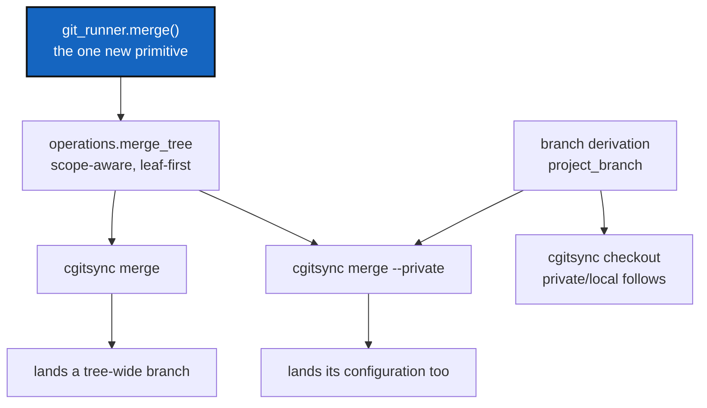

# MergeAndPrivateBranch — one merge command, and private/local branches that follow it

*Created: 2026-09-09*

## Abstract — read this first

**The one-line version.** Give `cgitsync` a `merge` command, derive a
private/local repository's branch from the project's with `_` as the
separator, and the two open branch-model tickets both close — because the
second one is just the first one applied with `--private`.

**What this document is.** One implementation ticket replacing two design
tickets. It carries their substance; they are archived.

**Why it exists.** They looked like two problems and are one. A
private/local repository has no per-branch identity *and* there is no
command to land a branch. Add `merge` to `git_runner.py`, name the
private/local branch `<project>_<branch>`, and `merge --private` becomes
the landing step for configuration repositories using the same code path as
everything else. Nothing new is invented for the private case.

**What you will find.** The branch model (§1), the worked example that is
also the acceptance test (§2), the merge primitive (§3), how the private
half falls out of it (§4), decisions the owner must make (§5), work
packages (§6), acceptance criteria (§7).

**Who it is for.** Whoever implements the second half of the branch
workflow.

**What you need to do with it.** Answer §5, then work §6 in order.



---

## 0. What this replaces, and where it is built

This ticket supersedes two tickets, archived on the same commit that
created this one:

* `AgentSpec/archive/20260909_PrivateBranchFollowsCheckout_DevPlanTicket.md`
* `AgentSpec/archive/20260909_PullRequestAndMerge_DevPlanTicket.md`

They were written as separate designs on 2026-09-09 and merged into this
one the same day, on the owner's instruction, because the second solves the
first. Read them only for history; everything live is here.

**Written on `main`, implemented on `multi-branch`.** This file lives on
`main` so it is visible from a fresh clone. The code belongs on
`multi-branch`, which already has `git_branch.py` and `RepoScope` — the two
things this ticket builds on and which `main` does not have. Do not
implement it on `main`.

Pull requests are **out of scope**. The owner dropped them on 2026-09-09.
This ticket lands branches with Git, not with a provider API. No HTTP
client, no `gh`, no token: `git_runner.py` stays the only module that
shells out, and it keeps shelling out to `git` alone.

## 1. The branch model

A tree checked out on project branch `B`, for a project named `P`:

| Kind | `.cgs` | Branch | This tree, `B = multi-branch` |
|---|---|---|---|
| project (its own) | no `pinned` | `B` | `multi-branch` |
| private/distant | `pinned` | its declared `default_branch`, never moved | `main` |
| private/local | `pinned, writable` | **`P_B`** | `ComplexGitSync_multi-branch` |

**`_` is the separator** between the project name and the project branch.
It was chosen because `-` already appears inside branch names —
`multi-branch` is itself hyphenated, so `ComplexGitSync-multi-branch` is
ambiguous about where the project name stops and
`ComplexGitSync_multi-branch` is not.

**The derived branch is a target, not a demand.** When `P_B` does not exist
locally or on the remote, resolution falls through the chain already in
`git_branch.py`: `P_B` → the entry's `default_branch` → its
`fallback_branch` → `DEFAULT_BRANCH`. So nothing changes for any existing
tree until somebody deliberately creates `P_B` with `cgitsync branch`. That
is what makes this safe to ship: the default path is today's path.

### What the two words mean

Both kinds are **private**: a repository shared between projects rather
than owned by this one. What separates them is **who may commit**, not how
far away anything is.

**private/distant** — the repository is private *to its owner*. This
project reads it and cannot commit to it; only that owner writes there.
Nothing this project does may move it, which is why a branch move stops at
it and why `commit`, `push` and `merge` never reach it. Its branch is
whatever it declares, permanently.

**private/local** — it holds **local settings that configure this
project**, and those settings are a contribution to the project, recordable
on the remote like any other. This project does commit to it. What it needs
is somewhere to record them per project branch, which is what the `P_B`
rule gives it: a branch derived from the project's own branch.

That is the whole asymmetry. A private/distant repository is read; a
private/local repository is written, so it needs the same branch structure
as anything else this project writes.

### What goes wrong without it

Provable today, on `main`: `CLAUDE.md` documents `git_tree.propagate_pinning`
twice, and `main` has no such function — it exists only on `multi-branch`.
`CLAUDE.md` is a symlink into `.claude`, a private/local mount pinned to the
single branch `ComplexGitSync`, which every branch of the project reads. A
reader on `main` is told to use something that is not there. That is the
whole bug: one configuration branch for every branch of the project.

## 2. The worked example, which is also the acceptance test

The workspace this ticket was written in is in exactly the broken state,
because the root was checked out with plain `git` instead of
`cgitsync checkout`:

```text
REPOSITORY         PATH                LOCAL_BRANCH    UPSTREAM        SYNC
DocComplexGitSync  docs                multi-branch    origin/multi..  synced
ComplexGitSync     .                   main            -               unknown
.localSpec         .localSpec          ComplexGitSync  origin/Comple.. synced
.claude            .claude             ComplexGitSync  origin/Comple.. synced
.agentSpec         .agentSpec          main            origin/main     synced
READY ready=true complete=true
```

Two project-owned repositories on two different branches; the root with no
upstream, printed as `-` and `unknown`; and the tree still calling itself
`READY`. Running `cgitsync checkout multi-branch` after WP-M2 must produce:

```text
ComplexGitSync     .                   multi-branch
DocComplexGitSync  docs                multi-branch
.localSpec         .localSpec          ComplexGitSync_multi-branch
.claude            .claude             ComplexGitSync_multi-branch
.agentSpec         .agentSpec          main
DevSpec, DocSpec                       main
```

**A migration wrinkle, named rather than hidden.** `.claude` and
`.localSpec` already carry `multi-branch` work on the `ComplexGitSync`
branch, pushed. Creating `ComplexGitSync_multi-branch` from that point
carries those commits onto the new branch; it does not take them off
`ComplexGitSync`, and it must not try — that history is published.
So the spill this ticket prevents in future has already happened once, and
stays. Say so in the commit; do not rewrite published history to tidy it.

## 3. The merge primitive

`git_runner.py` is the sole `import subprocess` module and has no `merge`.
That is the one genuinely new capability here; everything else is
composition.

**`git_runner.merge(repo_path, ref, *, ff_only=False, no_ff=False)`** —
wraps `git merge`. Added to the `GitRunner` Protocol and its
implementation, both of which live in that file. Alongside it,
whatever conflict-detection reads the work needs (`has_unresolved_merge`
already exists and is reused).

**`operations.merge_tree(tree, git_runner, source_branch, *, scope)`** —
merges `source_branch` into each repository's current branch, across
`scope`, leaf-first like `commit`.

**The preflight runs across the whole scope before the first merge.** This
is the one rule that matters most. A conflict in the last repository must
not leave the first three merged: check every repository can merge cleanly,
then merge. A half-landed tree is the failure this command exists to avoid,
not one it may cause.

## 4. The private half falls out of it

`cgitsync merge <B>` merges the project branch `B` into the current branch
for repositories in `PROJECT` scope.

`cgitsync merge --private <B>` does the same thing for `PRIVATE` scope —
but the branch it merges is not `B`. It is `P_B`, resolved by the **same**
derivation §1 defines. The argument is always the *project* branch; each
repository resolves its own source through one function.

So landing the current work is two commands:

```bash
cgitsync checkout main            # back on the default branch
cgitsync merge multi-branch       # ComplexGitSync + docs
cgitsync merge --private multi-branch   # merges ComplexGitSync_multi-branch
                                        # into ComplexGitSync
```

and the second one is not a special case — it is the first one with a
different scope and the branch name run through the resolver.

`pull --private` gets the same treatment: a private/local repository on
`P_B` pulls its own upstream, and takes updates from `P` by merge, using
the primitive from §3 rather than a second mechanism.

**One function owns the derivation.** `git_branch.resolve_propagated_ref`
already owns the pinning rule and already receives the entry and the
tree-wide branch. It is the only place that learns about `_`. Do not write
a second copy in `operations.py`, `orchestre.py`, or `cli/` — that rule
existed as six private copies once, and `git_branch.py` was created to end
it.

## 5. Decisions for the owner

| # | Question | Recommendation |
|---|---|---|
| **D1** | ~~Rename `private/distant` to `private/remote`?~~ | **Answered by the owner, 2026-09-09: keep `distant`.** The word is not about network distance — it is about who may commit. A distant repository is private to its owner and this project can only read it; a local one carries this project's own settings and is written to. "Remote" would have clashed with `origin`, and would have said the wrong thing anyway. See §1. |
| **D2** | Is the base of `P_B` the project name from the `.cgs`, or the entry's own `default_branch`? | **The entry's `default_branch`.** In every `.cgs` in this tree it already equals the project name, so both readings agree today; basing it on the declared field means nothing breaks if a project is ever renamed, or a private/local entry pinned to a differently-named branch. |
| **D3** | Does `merge` push after merging? | **No, not by default.** `merge` merges; `push` pushes. A `--push` flag can compose them. Keeping them apart means a bad merge is still local. |
| **D4** | Fast-forward only, or a merge commit? | **Allow both, default to Git's own behaviour**, with `--ff-only` for the strict case. `freeze-release` already assumes fast-forward and would keep doing so. |
| **D5** | Should `cgitsync status` report a split tree? | **Yes, and it may be its own ticket.** `misaligned_branch` is computed only in `_run_preflight_checks`, which no read-only command calls — which is why §2's broken tree reports `READY`. Fixing that is small and independent; it is listed as WP-M6 and can be dropped from this ticket without harming the rest. |

## 6. Work packages

| WP | Touches | Deliverable |
|---|---|---|
| **WP-M1** | `git_runner.py` | `merge()` on the `GitRunner` Protocol and its implementation. The only new subprocess call. Unit-tested against real temporary repositories, including a conflicting merge. |
| **WP-M2** | `git_branch.py` | Teach `resolve_propagated_ref` the private/local case: a `pinned, writable` entry under a branch move targets `<base>_<B>` per D2, falling through the existing chain when that branch does not exist. private/distant behaviour is unchanged — that is a regression guard, not a new rule. This is the single site; nothing else learns about `_`. |
| **WP-M3** | `operations.py` | `merge_tree`, scope-aware, leaf-first, with the whole-scope preflight from §3. |
| **WP-M4** | `orchestre.py`, `cli/expert.py` | `ComplexGitSyncClient.merge()` carrying the semantics, plus the thin `_handle_merge`/`_execute_merge` pair. `--private` selects `PRIVATE` scope and resolves the source branch through WP-M2. `cli/` must not touch `subprocess` or parse a repository identifier. |
| **WP-M5** | `orchestre.py`, `cli/` | `pull --private` for private/local repositories, built on WP-M1's primitive, not on a second mechanism. |
| **WP-M6** | `orchestre.py`, `status_render.py` | Per D5: `cgitsync status` reports branch incoherence instead of printing `READY` over it. Droppable — see D5. |
| **WP-M7** | `README.md`, `docs/Text/user_guide.tex`, `docs/Text/api_python.tex`, `tutorials/04_configuration_repos_pinned_branches.md` | `merge` in the README command table (enforced by `tests/unit/test_cli_smoke.py::test_readme_documents_every_cli_command`), the user guide, and its client method in the API doc. **Tutorial 4 needs correcting, not extending:** its worked example shows `.claude` and `.localSpec` on `ComplexGitSync` while the project is on `multi-branch`, which is precisely the state §1 calls a bug. Its table, its `view-tree` output and its `status` output all change. |
| **WP-M8** | `install.cgs`, `examples/*.cgs`, `ComplexGitSync.cgs` | Nothing to change if D2 is taken — `default_branch` already carries the base. Confirm that and say so, rather than assuming it. |

## 7. Acceptance criteria

- `cgitsync checkout <B>` puts every private/local repository on `<base>_<B>`
  when that branch exists, and leaves it where it was when it does not.
- A private/**distant** repository's branch is never changed by a branch
  move. A tag still reaches every repository, pinned or not.
- `cgitsync merge <B>` lands `B` across every project-owned repository in
  one command, leaf-first.
- `cgitsync merge --private <B>` merges `<base>_<B>`, not `<B>` — a test
  asserts the translation happens, because that is the whole design.
- **A conflict in any repository leaves no repository merged.** The
  preflight covers the whole scope before the first merge runs.
- A private/distant repository is never merged, pushed, or modified by
  either command.
- `_` appears in exactly one function. A test counts it, the way
  `tests/unit/test_git_branch.py` already counts literal `"main"`.
- §2's worked example runs: from the split tree recorded there,
  `cgitsync checkout multi-branch` produces the second listing exactly.
- README, user guide and `api_python.tex` document `merge`; tutorial 4's
  worked example matches what the tool now does.
- `pixi run lint`, `pixi run test` and `pixi run check-ceilings` pass.

## 8. Outcome — implemented 2026-09-09

Recorded at implementation time, on `multi-branch` as §0 requires. The
active copy of this ticket is still on `main`, correctly: `main` does not
have this code yet. Delete it there when `multi-branch` lands.

**D1** was answered by the owner: keep `private/distant`, because the word
is about who may commit, not about network distance. **D2–D5** were taken
as recommended — the base is the entry's `default_branch`, `merge` does not
push, fast-forward is Git's default with `--ff-only`/`--no-ff` available,
and WP-M6 was kept rather than dropped.

### What was built

`git_runner.py` gained four methods and one private helper. `merge` and
`fetch` are operations. `can_merge_cleanly` and `branch_known` are
**questions**: they never touch a worktree, an index, or `HEAD`, which is
what lets a preflight ask about every repository before acting on any.
`_query` runs a command for its exit code instead of raising, following the
inline pattern the module's existing query methods already used.

`can_merge_cleanly` has two paths, because the answer depends on the Git in
front of it. `merge-tree --write-tree` (2.38+) is tried first; older Git —
2.34 is what this was developed against — knows only the three-argument
form, which needs an explicit merge base and reports conflicts as markers.
Both are read-only. A trial `git merge` would answer the same question but
could leave a repository mid-merge if the process died between the merge
and the abort, and a preflight must not be able to break what it checks.

`git_branch.resolve_propagated_ref` now answers **three** cases where it
answered two: unpinned follows the move, private/distant never moves,
private/local takes `<base>_<ref_name>` with a new `PRIVATE_LOCAL` source
recorded on the resolution. `private_local_branch` composes the name, and
`PRIVATE_LOCAL_SEPARATOR` never leaves the module — a test fails if either
escapes, the same guard the `"main"` literal already carries.

The fallback that makes this safe to ship lives in
`operations.resolve_existing_propagated_ref`. `git_branch.py` is Ring 0 and
cannot know whether a branch exists, so the caller asks — offline, through
`branch_known`, which reads local heads *and* remote-tracking refs and
never contacts the network. `checkout_tree` and `_restart_tree` both pass
the runner; `_restart_tree` had to, or `pull` would have tried to pull a
branch nobody had created yet.

`operations.merge_tree` merges leaf-first across a scope, checking the
whole scope first. `refresh_private_tree` backs `pull --private`.
`merge_source_ref` is the one translation: the argument is always the
project's branch and each repository resolves its own source, which is why
the private case needed no code of its own.

`status` now warns when the tree is split across branches (WP-M6). Until
this, a root checked out with plain `git` left every other repository
behind and the tree still reported `READY` — the fault that produced §2.

### Where the ratchet moved

`--write-baseline` was run after the work. Every module touched grew, all
well inside the owner's standing per-module allowance
(`.localSpec/AdditionalSpecs.md`, *Ceilings*), reported here rather than
raised quietly. The version moved `0002.42` → `0002.43`.

### What was left undone

**§2's acceptance test has not been run end to end.** The rule, the
fallback, the commands and their tests are in place, but
`ComplexGitSync_multi-branch` does not exist in `.claude` or `.localSpec`,
so no tree has yet been checked out onto a derived branch. Creating it is
`cgitsync branch multi-branch`, a deliberate act — and §2's migration note
applies the moment it happens.

### Two bugs found by the owner on the same day, and fixed

**`branch` never created the derived branch, so the feature was
unreachable.** `create_global_branch` skipped every pinned repository,
private/local included, which was correct before this ticket and wrong
after it: nothing could bring `<base>_<branch>` into existence, so
resolution would have fallen back forever and the rule would have been
invisible. It now creates the derived branch — and only from
`branch_tree`. `checkout_tree` still skips, deliberately: moving a tree
must never quietly create a branch in a repository shared with other
projects. Without that split the feature is either unreachable or
unavoidable.

**`merge <B>` while the tree was on `B` silently did nothing.** Git reports
merging a branch into itself as success, so the command printed a plan, ran,
and reported success having done nothing — which reads as "it worked" when
the tree is simply still on the branch the user meant to merge *from*.
`merge_status` now decides each repository's fate once, for both the dry run
and the merge, so the two cannot disagree; when nothing in scope can merge,
the command refuses and names the fix (`cgitsync checkout <target>` first).

**`pull --private`'s semantics were inferred.** The instruction said it
should be "based on merge and merge --private". It was built as: fetch the
base branch, then merge it into the derived branch the repository is on.
That keeps a settings branch from drifting behind the project's while a
feature branch is open, and it is the gap `merge --private` cannot fill —
that one merges `<base>_<B>`, never the base itself. If a different
behaviour was meant, it is all inside `refresh_private_tree`.

**The `.gts` still drops `writable` when an older build writes it.** Not
this ticket's bug, but it bit twice today: any command run by code that
predates the field silently loses it from the snapshot, and `--private`
then finds no writable repository. Worth its own ticket.

## 9. What this closes

* **The two archived tickets** — both, by the same mechanism.
* **Tutorial 4**, which currently teaches the broken state as correct.
* **The split tree in §2**, which is the acceptance test rather than a
  separate repair.
* **`CLAUDE.md` on `main` describing code that is not there** — once
  `.claude` has a branch per project branch, unmerged documentation stays
  unmerged.
