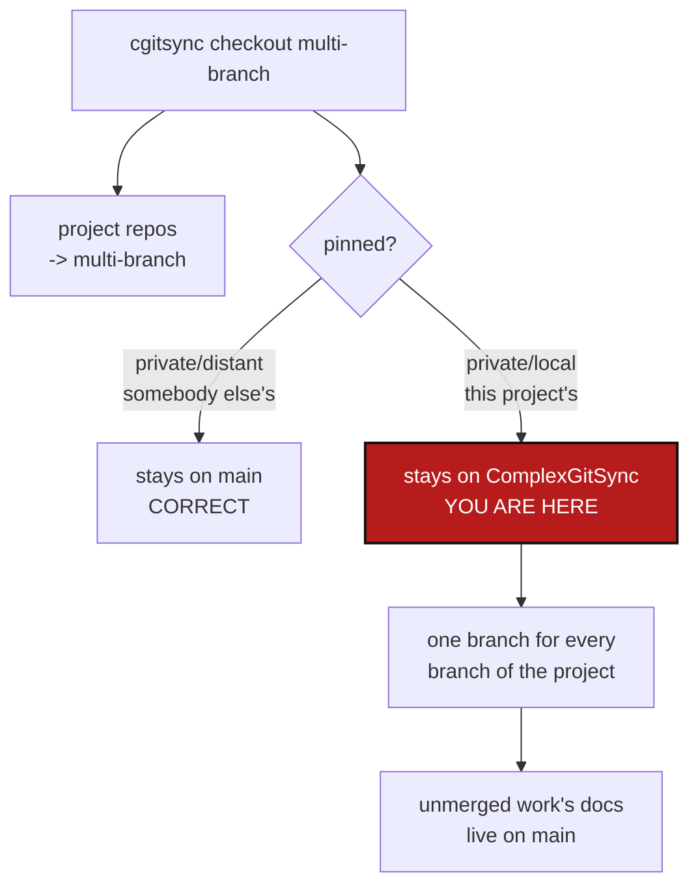

# PrivateBranchFollowsCheckout — a private/local repo has one branch for every branch of the project

*Created: 2026-09-09*

> **Superseded on 2026-09-09 by
> [`AgentSpec/archive/20260909_MergeAndPrivateBranch_DevPlanTicket.md`](20260909_MergeAndPrivateBranch_DevPlanTicket.md).**
> The two tickets turned out to be one problem: implementing `merge` makes
> the private/local branch question fall out of it as `merge --private`.
> This document is a historical record of the separate design and is not
> live work. Everything current is in the ticket above.

## Abstract — read this first

**The one-line version.** `cgitsync checkout <branch>` moves the project's
own repositories and deliberately leaves every pinned one alone — but a
**private/local** repository is not somebody else's, it is this project's
configuration on a project-named branch, and leaving it behind means work
for an unmerged feature branch goes live on every branch at once.

**What this document is.** A design ticket for what should happen to a
private/local repository when the tree checks out a different branch.

**Why it exists.** It is already wrong, provably, right now. On `main`,
`CLAUDE.md` describes `git_tree.propagate_pinning` twice. `main` has no
such function — it exists only on `multi-branch`. `CLAUDE.md` is a symlink
into `.claude`, a private/local mount pinned to the branch
`ComplexGitSync`, and that one branch is what every branch of the project
sees. Documentation for unmerged work is live on the default branch, and
nothing warned anybody.

**What you will find.** What happens today (§1), why the pin is right for
distant repos and wrong for local ones (§2), three options with a
recommendation (§3), work packages (§4), acceptance criteria (§5), and a
related blind spot that may deserve its own ticket (§6).

**Who it is for.** Whoever takes the next piece of branch-model work.

**What you need to do with it.** Read §2, pick an option in §3, then §4.



---

## 1. What happens today

`checkout_tree` (`operations.py:270`) calls `propagate_global_branch`
(`operations.py:84`), which is where the rule lives on this branch:

```python
for repo in tree.values():
    if repo.pinned and ref_kind is RefKind.BRANCH:
        repo.target_ref_name = repo.default_branch or repo.target_ref_name
    else:
        repo.target_ref_name = branch_name
```

One test: `pinned`. A pinned repository keeps its declared
`default_branch` and the checkout passes it by. Tags still reach
everything, which is right — a frozen release has to be reproducible.

The rule predates the read-only/writable split. When it was written,
`pinned` meant one thing: shared, leave it alone. It now means two, and
only one of them wants this behaviour.

## 2. The pin is right for distant, wrong for local

| Kind | `.cgs` | Whose is it | Should a checkout move it? |
|---|---|---|---|
| private/distant | `pinned` | somebody else's; you only read it | **No.** Moving it drags every other project onto your branch. This is the whole point of the pin. |
| private/local | `pinned, writable` | **this project's**, on a branch named after it, that nobody else reads | **Open.** Today: no. That is what this ticket questions. |

A private/local repository is pinned for a filing reason, not an ownership
reason: the files live in a repository shared with other projects, but the
branch is yours and nobody else reads it. `--private` exists precisely
because you commit to it as part of your own work.

So it has exactly one branch, `<ProjectName>`, no matter which branch of
the project you are on. Every consequence follows from that:

* **Documentation goes live before the code does.** The case above:
  `CLAUDE.md` on `main` documents a function that only exists on
  `multi-branch`. A reader on `main` is told to use something that is not
  there.
* **A feature branch cannot carry its own configuration.** If a branch
  needs a different setting in `.claude/settings.json`, there is nowhere
  to put it.
* **Abandoning a feature branch does not abandon its configuration.** The
  code disappears; the notes and settings it wrote stay.
* **Two feature branches collide.** Both write to `ComplexGitSync`, in one
  history, with no branch between them.

## 3. Options

**Option A — derive the branch from the project's, and fall back
(recommended).** On `cgitsync checkout <branch>`, a private/local
repository targets `<ProjectName>-<branch>`; if that branch does not exist
locally or on the remote, it falls back to `<ProjectName>`, the way
`fallback_branch` already works everywhere else in the `.cgs`. Creating it
is then an explicit act — `cgitsync branch` — not something a checkout
does behind your back.

Recommended because it reuses a mechanism that already exists and that
users already understand, it changes nothing until somebody deliberately
creates the derived branch, and the default path stays exactly as it is
today. It is also the only option here that is safe to ship without
deciding the harder policy questions first.

**Option B — a per-entry field.** Add something like
`follow_project_branch = true` to the `.cgs` entry, defaulting to `false`.
Explicit and readable in the file. But it makes every author answer a
question most of them have no basis to answer, and the right answer is
almost always the same, so it is a default wearing a field's clothes.

**Option C — leave it, and warn.** Keep the behaviour, and have
`checkout` say which private/local repositories did not move. Cheapest,
and it does close the specific hole that started this ticket — nobody is
surprised any more. It does not give a feature branch anywhere to put its
own configuration.

A and C compose: ship C's warning whichever option wins, because a silent
branch decision is what caused this.

**The question that has to be answered first, whichever option wins:**
what should happen to a private/local repository's commits when the
feature branch merges? If `.claude` has a `ComplexGitSync-multi-branch`
branch, merging `multi-branch` into `main` must also merge that into
`ComplexGitSync`, or the documentation lands on `main` describing code
that arrived without it. That is a merge-mechanism question and it is
owned by
[`PullRequestAndMerge_DevPlanTicket.md`](20260909_PullRequestAndMerge_DevPlanTicket.md).
**These two tickets have to be designed together; neither works alone.**

## 4. Work packages

| WP | Touches | Deliverable |
|---|---|---|
| **WP-PBC1** | `operations.py` (`propagate_global_branch`) | Split the one `pinned` test into the two cases §2 names. A private/distant repo keeps today's behaviour exactly. A private/local repo follows whichever option §3 wins. On the `multi-branch` branch this rule has moved to `git_branch.resolve_propagated_ref`, which is then the single site to change — check which branch you are on before starting. |
| **WP-PBC2** | `operations.py`, `cli/` | Option C's report, unconditionally: `checkout` prints every private/local repository whose branch it did not change, and the branch it is on. Silence is what made this expensive. |
| **WP-PBC3** | `docs/Text/user_guide.tex`, `tutorials/04_configuration_repos_pinned_branches.md` | Document the chosen rule in the user words — *private*, *local*, *distant*. Tutorial 4 already teaches those three; this is a section in it, not a new document. |
| **WP-PBC4** | `tests/` | See §5. |

## 5. Acceptance criteria

- A private/**distant** repository's branch is unchanged by
  `cgitsync checkout <branch>`, in every case. This is a regression guard,
  not a new behaviour: it is the meaning of the pin.
- A tag still reaches every repository, pinned or not.
- Whatever §3's chosen rule is, a test states it as a sentence and fails if
  it changes.
- `checkout` reports every private/local repository it left behind.
- A test asserts the case that opened this ticket: with the project on one
  branch and a private/local repo carrying work for another, the mismatch
  is visible in `cgitsync status` or refused, rather than silent.
- `pixi run lint`, `pixi run test` and `pixi run check-ceilings` pass.

## 6. Related: the tree can be split without anything noticing

Found while writing this. Checking out a branch in the root repository
with plain `git` — not `cgitsync checkout` — leaves the tree split, and no
command reports it. Observed state:

```text
DocComplexGitSync  docs  multi-branch  origin/multi-branch  clean  synced
ComplexGitSync     .     main          -                    clean  unknown
READY ready=true complete=true
```

Two project-owned repositories on two different branches; the root with no
upstream at all, printed as `-` and `unknown`; and the tree still calling
itself `READY`. The loaded `.gts` describes a tree that no longer exists,
and `cgitsync pull` does not repair it.

`status` has no branch-coherence check — `misaligned_branch` is computed
only in `_run_preflight_checks`, which no read-only command calls. So the
one command a user runs to ask "is my tree all right?" cannot see the most
basic way for it to be wrong.

This is a different fault from §1 and probably wants its own ticket:
`status` should report branch incoherence, and something should be able to
put a split tree back together. It is recorded here because the same
checkout blindness produced both.
