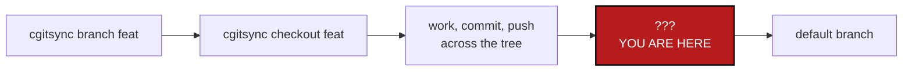

# PullRequestAndMerge — landing a branch that spans a whole tree

*Created: 2026-09-09*

> **Superseded on 2026-09-09 by
> [`AgentSpec/archive/20260909_MergeAndPrivateBranch_DevPlanTicket.md`](20260909_MergeAndPrivateBranch_DevPlanTicket.md).**
> The two tickets turned out to be one problem: implementing `merge` makes
> the private/local branch question fall out of it as `merge --private`.
> This document is a historical record of the separate design and is not
> live work. Everything current is in the ticket above.

## Abstract — read this first

**The one-line version.** ComplexGitSync can put a tree of repositories
onto a feature branch with one command, and has no command at all for
getting that branch back onto the default branch — the whole second half
of the workflow is missing.

**What this document is.** A design ticket for a tree-wide propose-and-land
mechanism: `cgitsync pr` and `cgitsync merge`, or whatever the design
settles on.

**Why it exists.** The `multi-branch` work reached the end of its ticket
and stopped there. Its finishing step read *"open the pull request for
`ComplexGitSync` and for `DocComplexGitSync`"* — two repositories, by
hand, in a browser, with the private/local ones on a third branch that no
pull request covers at all. There is no `cgitsync` command for any of it.
`branch` and `checkout` reach the whole tree; nothing brings it home.

**What you will find.** What is missing (§1), the four things that make
this harder than N pull requests (§2), the architectural decision that has
to be made first (§3), options (§4), work packages (§5), and acceptance
criteria (§6).

**Who it is for.** Whoever designs the second half of the branch workflow.
This is a design ticket before it is an implementation ticket.

**What you need to do with it.** Read §2 and §3. §3 has to be answered by
the owner before any code is written.

---

## 1. What is missing

`cgitsync --help` lists 27 commands. `branch` creates a branch across the
tree, `checkout` moves the tree onto one, `commit` and `push` write it,
`tag` and `freeze-release` freeze it. Nothing proposes it, nothing reviews
it, nothing merges it, and nothing deletes it afterwards.

The gap is not cosmetic. `maintainerClearance` — the ruleset on
`flipoyo/ComplexGitSync`, recorded in
[`2-5_AnonymousAgent_DevPlanTicket.md`](../openTickets/2-5_AnonymousAgent_DevPlanTicket.md) §1.3 —
requires a pull request to reach the default branch. A local
`git merge` and `git push` is refused by the remote. So for this project
the missing mechanism is not a convenience; it is the only legal route.

## 2. Why this is harder than N pull requests

**One. The tree is the unit, and no provider knows that.** A `.gts`
snapshot ties every repository's commit together. Landing three of four
leaves the default branch describing a tree that never existed on anyone's
disk. Providers merge one repository at a time and have no notion of the
other three.

**Two. Nothing can be atomic.** Four merges on a remote host, possibly
across two providers, cannot commit or roll back together. The design has
to state its failure model up front — what a half-landed tree looks like,
how a user sees it, and how they finish or unwind it. A design that
assumes success is not a design.

**Three. Private/local repositories are on a different branch.** They are
pinned to `<ProjectName>`, not to the feature branch, so no pull request on
the feature branch covers them, and their commits are already on the branch
every other branch of the project reads. That is the subject of
[`PrivateBranchFollowsCheckout_DevPlanTicket.md`](20260909_PrivateBranchFollowsCheckout_DevPlanTicket.md),
and the two tickets have to be designed together: if that ticket gives a
private/local repo a per-feature branch, this one has to land it in the
same operation, or documentation reaches the default branch describing code
that arrived without it.

**Four. Read-only repositories must stay untouched.** A private/distant
repository is somebody else's. It is not merged, not proposed, not pushed.
`RepoScope` already encodes exactly this, so the mechanism should use it
rather than invent a second answer.

## 3. The decision to make first: how does this talk to a provider?

Today `cgitsync` shells out to `git` and nothing else. `git_runner.py` is
the sole `import subprocess` module, and there is no HTTP client anywhere
in the package — no `requests`, no `urllib.request`, no provider API code.
Opening a pull request needs one of:

| Route | What it costs |
|---|---|
| **Provider REST APIs** (GitHub, GitLab, Codeberg) | A new HTTP dependency, a new ring for it, three implementations, and token storage. The last is the real cost: this tool has never held a credential, and starting to is a decision, not a detail. |
| **Shell out to `gh` / `glab`** | No HTTP code and no token handling — the CLIs own both. But it adds a second subprocess surface, which the architecture currently confines to `git_runner.py`, and makes those tools a hard prerequisite. Codeberg has no equivalent. |
| **Neither: `merge` only, no `pr`** | `cgitsync merge` merges locally and pushes. No provider code at all. Refused outright by `maintainerClearance`, so it does not solve this project's own case — but it does solve every tree without a protected default branch. |

**This is the owner's call and it should be made before any code.** It
decides whether this ticket is a week or a month, and it is the one part
that cannot be undone cheaply once chosen.

A defensible middle path: ship the third row first. `cgitsync merge` with
no provider code lands trees whose default branch is not protected, and
gives the whole ordering, scope and failure-model design somewhere to live
and be tested. `pr` is then a front end added later, once the route above
is chosen, rather than a prerequisite for anything.

## 4. Options for the command surface

**Option A — `cgitsync merge <branch>` alone (recommended first step).**
Merges the feature branch into the current branch across every repository
in `WRITABLE` scope, leaf-first, and pushes. No provider code. Stops at the
first repository that conflicts and reports the tree's exact half-landed
state.

Recommended as the *first* piece because it needs no §3 answer, it is
testable entirely with local Git, and every hard part — ordering, scope,
partial failure, the private/local question — has to be solved here anyway
and is then solved once.

**Option B — `cgitsync pr <branch>` on top.** Opens one pull request per
repository in scope, cross-links them in each body so a reviewer can see
the tree, and prints the URLs. Needs §3 answered.

**Option C — `cgitsync land <branch>`, one command.** Propose, wait, merge,
delete the branches. The workflow a user actually wants. It should be built
last, out of A and B, not designed first.

## 5. Work packages

Every package below is blocked on §3 except WP-PRM1 and WP-PRM2.

| WP | Touches | Deliverable |
|---|---|---|
| **WP-PRM0** | this document | Answer §3 and record the answer here with its reasoning. Nothing else starts first. |
| **WP-PRM1** | design | The failure model, written down before code: what a half-landed tree looks like, what `cgitsync status` shows for one, and what command finishes or unwinds it. §2's second point is the whole difficulty of this ticket and it deserves its own written answer. |
| **WP-PRM2** | `orchestre.py`, `operations.py`, `cli/` | `cgitsync merge <branch>` per Option A. `WRITABLE` scope, leaf-first, preflight before any repository is touched — not one repository at a time — so a conflict in the last repo does not leave the first three merged. |
| **WP-PRM3** | `orchestre.py`, `cli/`, plus whatever §3 chose | `cgitsync pr <branch>` per Option B. |
| **WP-PRM4** | `orchestre.py`, `cli/` | Branch cleanup after a successful land: delete the feature branch locally and on the remote, across the tree, behind a flag. |
| **WP-PRM5** | `README.md`, `docs/Text/user_guide.tex`, `docs/Text/api_python.tex`, `tutorials/` | Every new command in the README table, the user guide, and its client method in the API doc — the README half is enforced by `tests/unit/test_cli_smoke.py::test_readme_documents_every_cli_command`. The tutorial gains the second half of the workflow it currently stops halfway through. |

Each command is a `ComplexGitSyncClient` method carrying all the semantics
plus a thin `_handle_*`/`_execute_*` pair in `cli/`, per CLAUDE.md's
CLI-mirrors-the-API rule. `cli/` must not touch `subprocess` or Git.

## 6. Acceptance criteria

- `cgitsync merge <branch>` lands a feature branch across every
  project-owned repository in one command, leaf-first.
- A private/**distant** repository is never merged, proposed, pushed, or
  modified. A test asserts this directly.
- Private/**local** repositories are handled per whatever
  `PrivateBranchFollowsCheckout_DevPlanTicket.md` settles. Whichever it is,
  a test states it.
- A conflict in **any** repository leaves **no** repository merged — the
  preflight runs across the whole tree before the first merge.
- A land that fails partway is visible in `cgitsync status`, and the
  message says how to finish or unwind it. WP-PRM1's model, made real.
- After a successful land, the `.gts` snapshot describes the tree as it
  now is, with no stale state directory left preferred.
- Every new command appears in the README table, the user guide, and
  `api_python.tex`.
- `pixi run lint`, `pixi run test` and `pixi run check-ceilings` pass.

## 7. Where this came from

`AgentSpec/archive/20260909_MultiBranchResume_DevPlanTicket.md`
§6 step 5, dropped by the owner on 2026-09-09. Dropping it is what made
the absence obvious: there was never a mechanism to drop, only two manual
pull requests that nobody had written a command for.
