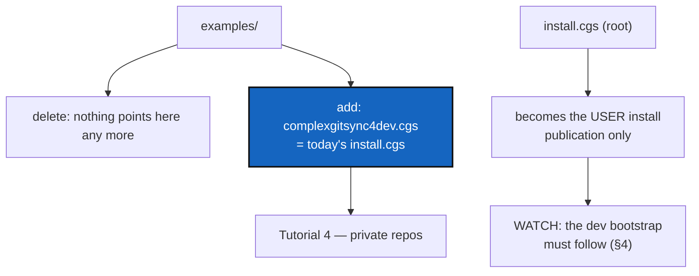

# ExamplesAndInstallSplit — clean up `examples/`, and split `install.cgs` user from dev

*Created: 2026-09-10*

## Abstract — read this first

**What this document is.** A ticket for three linked changes: delete the
examples that no longer exist and everything still pointing at them, add
`examples/complexgitsync4dev.cgs` as Tutorial 4's worked spec, and reduce
the root `install.cgs` to what a **user** installing ComplexGitSync needs.

**Why it exists.** Eight tests fail on `main` today because commits deleted
example files that tests, docs and tutorials still reference. Separately,
`install.cgs` installs a developer's tree — agent specs, house rules — on
anyone who runs it.

**What you will find.** The failing references (§1), what `examples/`
should hold afterwards (§2), the two `install.cgs` files (§3), the
consequences that are easy to miss (§4), work packages and acceptance.

**Who it is for.** The developer implementing this and its reviewer. Read
[CLAUDE.md](../../CLAUDE.md) and its referenced specs first.

**What you need to do with it.** Do §1 and §2 together — the deletions and
the new example are one edit to `examples/`. Do §3 only after reading §4:
the developer bootstrap breaks unless it is updated in the same commit.



---

## 1. Evidence — what is broken now

`36ec2bf CleanUp examples` and `12c2332` deleted five example files. Nothing
updated what referenced them. `pixi run test` on `main`:

| Failing test | Missing file |
|---|---|
| `test_cgsi_topology.py::TestCgsiExampleFiles` (6 tests) | `examples/CGSil2.cgs`, `CGSih1.cgs`, `CGSih2.cgs` |
| `test_documents.py::TestGtsDocumentValid::test_from_toml_parses_example_snapshot` | `examples/cawaqsviz_snapshot.gts` |
| `test_gts_document.py::TestGtsDocumentValid::test_from_toml_parses_example_snapshot` | `examples/cawaqsviz_snapshot.gts` |

Documentation still points at a file deleted in `12c2332`:

| File | Reference |
|---|---|
| `docs/Text/getting_started.tex` | five command examples using `examples/complexgitsync.cgs` (lines 86, 87, 105, 126, 151, 160) |
| `docs/Text/worked_examples.tex` | "ships **four** checked-in `examples/` topologies" — the count is wrong |
| `tests/integration/README.md` | a table describing `CGSil2.cgs`, `CGSih1.cgs`, `CGSih2.cgs` as living in `examples/` |
| `CLAUDE.md` | "`install.cgs` … has no copy under `examples/`: one file, one source of truth" — §3 ends this |

**The CGSi tests do not need those files.** `tests/integration/conftest.py`
already *writes* `CGSil2.cgs`, `CGSih1.cgs` and `CGSih2.cgs` into `tmp_path`
(lines 108-110). Only `TestCgsiExampleFiles` reads them from `examples/`, and
it is the only class failing. The fixtures are self-contained; the class is
the leftover.

`examples/CGSil1.cgs` still exists and still parses, but it is now the last
survivor of a four-file set and declares `CGSil2` and `CGSih1` as repos. It
is the root of a topology whose other members are gone.

## 2. What `examples/` should hold afterwards

The user's instruction: these examples are useless from now on. Delete them
and everything that points at them rather than restoring them.

| Action | File |
|---|---|
| **Delete** | `examples/CGSil1.cgs` — orphan root of the deleted CGSi set |
| **Delete the reader** | `TestCgsiExampleFiles` in `tests/integration/test_cgsi_topology.py`, and the `examples/` table in `tests/integration/README.md` |
| **Delete the reader** | `test_from_toml_parses_example_snapshot` in both `tests/unit/test_documents.py` and `tests/unit/test_gts_document.py`, unless a replacement `.gts` is checked in |
| **Add** | `examples/complexgitsync4dev.cgs` — byte-for-byte today's `install.cgs` (§3) |
| **Keep** | `cawaqs.cgs`, `cawaqsviz.cgs`, `doccomplexgitsync.cgs`, `htas.cgs`, `normalized_template.cgs`, `template.cgs` — all seven remaining files validate today; confirm again after the deletions |

Decide one thing explicitly: the two `.gts` tests are the only checked-in
`.gts` coverage. Either check in a small replacement snapshot or delete both
tests and say in the commit message that `.gts` parsing is covered by
generated snapshots only.

## 3. The two `install.cgs` files

### 3.1 `examples/complexgitsync4dev.cgs` — the developer tree

Today's root `install.cgs`, unchanged, moved into `examples/` under the new
name. It stays the file that clones the full working tree — `docs/`,
`.agentSpec/`, `.localSpec/`, `.claude/` — and it becomes **Tutorial 4's
worked example**, because it is the only checked-in spec that uses every
kind of private entry:

- `.agentSpec` — `private`, read-only (**private/distant**)
- `.localSpec`, `.claude` — `private, writable` (**private/local**)
- `ComplexGitSync`, `DocComplexGitSync` — the project's own

`tutorials/04_private_repos.md` §3 currently quotes this TOML inline and
links to `../install.cgs`. Repoint that link and keep the quote in sync.

### 3.2 `install.cgs` — the user install

A user installing ComplexGitSync wants the tool and its documentation.
Nothing that configures how ComplexGitSync is *developed*. Proposed:

```toml
project = { name = "ComplexGitSync", default_branch = "main" }

repos = [
    { repository = "github:flipoyo/ComplexGitSync", fallback_branch = "main" },
    { repository = "github:flipoyo/DocComplexGitSync", fallback_branch = "main", relative_path = "docs", nested_config = "disabled" },
]
```

**Open decision — `nested_config` on `docs`.** Today it is `"auto"`, which
loads `docs/DocCGS.cgs`, which mounts `github:flipoyo/DocSpec` as a private
read-only repo. `DocSpec` is a documentation-*authoring* convention: it tells
a writer how to write the docs, not how to read them. By the rule the user
gave — *keep publication, drop development* — it belongs in the dev spec, not
the user one, so the proposal above disables nested discovery. If you decide
otherwise, say why in the file's header comment, because a reader will ask.

## 4. Consequences that are easy to miss

1. **The developer bootstrap breaks.** `CLAUDE.md`'s *Bootstrapping a
   working checkout* and `README.md`'s developer guide both run
   `pixi run cgitsync bootstrap install.cgs ComplexGitSync` and then say the
   result contains `docs/`, `.agentSpec/`, `.localSpec/` and `.claude/`.
   After §3 it will not. Both must point at
   `examples/complexgitsync4dev.cgs` **in the same commit**, or the next
   person to follow CLAUDE.md gets a tree missing the file they are reading.
2. **This tree bootstraps itself.** ComplexGitSync manages its own checkout
   from `install.cgs`. Changing that file changes what a re-bootstrap of
   this very repository produces. Verify against a throwaway `CGSHOME`
   before landing, never against a live one.
3. **`CLAUDE.md` §Layout is now wrong twice.** "one file, one source of
   truth" described a rule against duplication. The two files are no longer
   duplicates — they are a user install and a developer install — so replace
   the sentence rather than deleting it, and say which is which.
4. **`docs/` must be rebuilt.** `getting_started.tex` changes are `.tex`
   sources; the tracked PDFs do not regenerate themselves
   (CLAUDE.md, *Before committing*, item 3).
5. **`test_cli_smoke.py::test_readme_documents_every_cli_command`** enforces
   the README command table. Editing README prose is safe; do not disturb
   that table.

## 5. Work packages

| Work package | Files | Deliverable |
|---|---|---|
| WP1: delete the dead references | `tests/integration/test_cgsi_topology.py`, `tests/integration/README.md`, `tests/unit/test_documents.py`, `tests/unit/test_gts_document.py`, `examples/CGSil1.cgs` | The eight failing tests are gone or green. No test reads a file that is not checked in. |
| WP2: the two specs | `install.cgs`, `examples/complexgitsync4dev.cgs` | §3. Both validate (`cgitsync validate`). The user file mounts no private repo. |
| WP3: docs and tutorials | `docs/Text/getting_started.tex`, `docs/Text/worked_examples.tex`, `tutorials/04_private_repos.md`, `README.md`, `CLAUDE.md` | Every reference points at a file that exists. Counts of "checked-in topologies" match reality. Rebuild the tracked PDFs. |
| WP4: the bootstrap path | `CLAUDE.md`, `README.md` | §4.1 — the developer bootstrap command names the dev spec, verified against a throwaway `CGSHOME`. |
| WP5: verify and land | tests, this ticket | `pixi run lint` and `pixi run test` pass; apply CLAUDE.md's before-committing checklist; archive this ticket under [TICKETLIFECYCLE.md](../../.agentSpec/TICKETLIFECYCLE.md). |

## 6. Acceptance criteria

- `pixi run test` passes. No test reads a path under `examples/` that is not
  checked in.
- `grep -rn "examples/" docs/ tutorials/ tests/ README.md CLAUDE.md` names
  only files that exist.
- `cgitsync validate` succeeds on every file in `examples/` and on
  `install.cgs`.
- `cgitsync view-tree install.cgs` shows **only** the project's own
  repositories — no `private` entry in the output, and no `SCOPE` column
  value of `private/local` or `private/distant`.
- `cgitsync view-tree examples/complexgitsync4dev.cgs` shows all five of
  today's entries, with the same privacy flags.
- A bootstrap of `examples/complexgitsync4dev.cgs` into a throwaway
  `CGSHOME` produces the tree CLAUDE.md describes.
- `tutorials/04_private_repos.md` quotes and links the dev spec, and its
  quoted TOML matches the file byte for byte.
- The tracked PDFs under `docs/` are rebuilt if any `.tex` changed.

## 7. Scope and handoff

Out of scope: restoring any deleted example, changing `.cgs` grammar, and
changing what `private`/`writable` mean. This ticket moves files and fixes
what points at them.

Do not run a re-bootstrap against the live `CGSHOME` while validating §3.
Use a throwaway workspace; `bootstrap` clones a whole tree.
