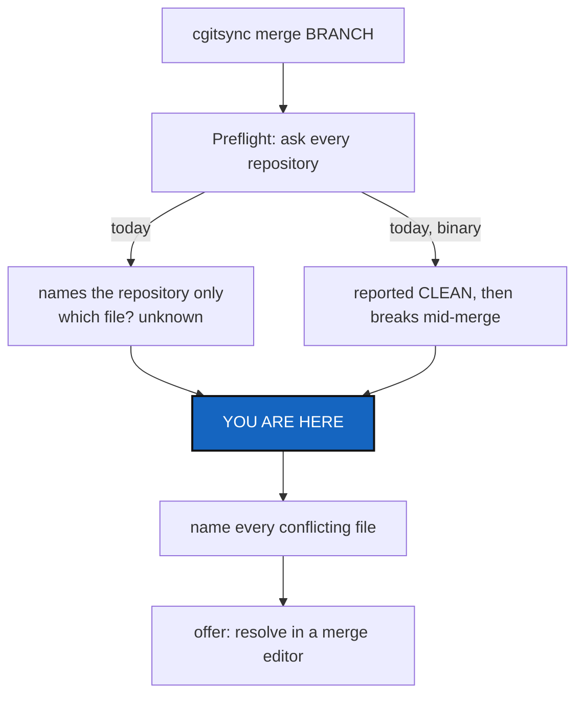

# MergeConflictReporting — name the conflicting files, and offer to resolve them

*Created: 2026-09-10*

## Abstract — read this first

**What this document is.** A ticket for two changes to the merge preflight:
say *which files* block a merge, and offer to open them in a merge editor.

**Why it exists.** `cgitsync merge` says a repository conflicts but never
says where. While closing
[20260910_MergeOutputDecoding](../archive/20260910_MergeOutputDecoding_DevPlanTicket.md)
a second, worse problem turned up: a conflict in a **binary** file is
reported as clean, so the preflight approves a merge that then breaks.

**What you will find.** Evidence for both problems, the design decision the
second half forces, work packages, and acceptance criteria.

**Who it is for.** The developer implementing this and its reviewer. Read
[CLAUDE.md](../../CLAUDE.md) and its referenced specs first.

**What you need to do with it.** Fix §1.2 first — it is a correctness bug,
not a reporting gap. Then build §1.1 and §2.



---

## 1. Evidence

### 1.1 The check already knows the files, and discards them

`GitRunner.can_merge_cleanly()` returns a `bool`. Both of its branches have
the filenames in hand and drop them:

| Form | What it prints | What we keep |
|---|---|---|
| `merge-tree --write-tree --name-only` (Git 2.38+) | tree OID, then one conflicted path per line | only `returncode` |
| `merge-tree <base> <head> <ref>` (legacy) | a section per path, then a diff carrying `<<<<<<<` | only "is the marker anywhere" |

So `operations.merge_tree()` can only say:

```text
merge refused; no repository was merged: ComplexGitSync: merging 'apoub' conflicts
```

When `merge apoub` was refused on 2026-09-10, exactly **one** file blocked
it — `tests/unit/test_documents.py`, one hunk. Nothing in `cgitsync` could
say so; the user had to run `git merge-tree` by hand to find out. (That
merge has since been completed by hand, so reproduce this on a fixture, not
from history.)

### 1.2 A binary conflict is reported as clean — correctness bug

Legacy `merge-tree` emits **no** `<<<<<<<` for a binary file. It warns on
**stderr** and lists the section on stdout:

```text
warning: Cannot merge binary files: f.bin (.our vs. .their)
changed in both
  base   100644 7bcf5f1 f.bin
  our    100644 714caed f.bin
  their  100644 5c5142f f.bin
```

Reproduced on a two-branch repository whose only change is a file with NUL
bytes:

```text
GitRunner().can_merge_cleanly(repo, "feat") -> True
git merge feat                              -> CONFLIT (contenu) : ... f.bin
```

This is not hypothetical here: **`docs/` tracks its built PDFs**, so the
repository most likely to hit it is one this project ships. The preflight's
whole promise — *every repository is checked before any is merged, so a
conflict anywhere leaves nothing merged* — does not hold for binary files.
A tree-wide merge can pass the check, write the leaves, and stop in the
middle, which is the state `merge_tree` exists to prevent.

Note the trap for the fix: `changed in both` on its own is **not** a
conflict. In the same real output, `git_tree.py` and `operations.py` were
`changed in both` and merged cleanly. The rule is *conflict markers in the
section's diff* **or** *a `Cannot merge binary files` warning naming that
path*.

## 2. The design decision this forces

A merge editor needs a real conflicted worktree. `merge_tree()` guarantees
the opposite: it refuses everything and writes nothing. The two cannot both
be the default.

The implementer must choose and record the answer. The recommendation:

- Keep the default exactly as it is. A bare `cgitsync merge` still refuses,
  still writes nothing, and now names the files.
- Add an explicit opt-in (`--resolve`) that merges **one repository at a
  time**, stopping at the first that conflicts, and says plainly which
  repositories it has already merged and which it has not reached. This
  trades the all-or-nothing guarantee for the ability to resolve, and the
  user must be told so in the command's own output, not only in `--help`.

Do not weaken the default to make the editor easier to reach.

## 3. Launching the merge editor

**Prefer `git mergetool` over calling an editor directly.** It already
iterates the conflicted files, keeps backups, stages each resolved file, and
honours whatever the user has configured. It is also still a `git`
subprocess, so it stays inside `git_runner.py`, the sole `import subprocess`
module (CLAUDE.md, *Architecture boundary*).

Verified facts for VS Code, on the reporting machine:

| Fact | Value |
|---|---|
| Git version | 2.34.1 — `git mergetool --tool-help` lists **no** `vscode` tool |
| VS Code | 1.136.2, `code --merge <path1> <path2> <base> <result>` and `--wait` both present |
| Working invocation | `mergetool.vscode.cmd = code --wait --merge $REMOTE $LOCAL $BASE $MERGED` |
| Argument order | `$REMOTE` (theirs) `$LOCAL` (ours) `$BASE` `$MERGED` — confirmed by what the tool receives |

The whole invocation was tried against a real conflicted repository with a
stub tool standing in for the editor. It works, and three details are not
optional:

```bash
git -c mergetool.vscode.cmd='code --wait --merge $REMOTE $LOCAL $BASE $MERGED' \
    -c mergetool.vscode.trustExitCode=true \
    -c mergetool.keepBackup=false \
    -c merge.tool=vscode mergetool --no-prompt
```

- `trustExitCode=true` — without it Git asks "was the merge successful?" on
  the terminal after every file.
- `--no-prompt` — without it Git asks before launching each file.
- `keepBackup=false` — **project-specific and easy to miss.** Git otherwise
  leaves a `<file>.orig` beside every resolved file. Those are untracked, so
  the next `cgitsync status` reports the repository dirty and the next
  `cgitsync add` stages them.

On success Git stages the resolved file itself, so the resolve step must not
stage anything a second time.

Constraints:

- **Never write the user's global Git config.** Pass the tool definition per
  invocation (`git -c mergetool.vscode.cmd=... -c merge.tool=vscode
  mergetool`) or scope it to the repository, and only when the user has not
  configured a tool of their own — an existing `merge.tool` always wins.
- **Degrade, do not fail.** No `code` on `PATH`, no display, or a
  terminal-only session must print the exact command to run by hand rather
  than erroring.
- **VS Code is not special.** It is the default *suggestion* when `code` is
  present; the feature is "open your merge tool", not "open VS Code".

## 4. Work packages

| Work package | Files | Deliverable |
|---|---|---|
| WP1: detect binary conflicts | `git_runner.py`, `tests/unit/test_git_runner.py` | Fix §1.2. Legacy detection must treat a `Cannot merge binary files` warning as a conflict, and `changed in both` alone as nothing. Cover text conflicts, binary conflicts, and clean `changed in both` in one place. Force the legacy branch with the existing `git`-shim helper so coverage does not depend on the installed Git. |
| WP2: report the files | `git_runner.py`, `operations.py` | Return the conflicting paths, not a bool. Both Git forms must produce the same shape. Keep `can_merge_cleanly` as the question `merge_tree` asks, or replace its call sites — do not leave two answers that can disagree. Follow the `RepoOutcome` precedent already in `operations.py`. |
| WP3: surface them | `cli/expert.py`, `README.md`, `docs/Text/user_guide.tex` | The refusal names every repository *and* every file. `merge --dry-run` lists them without merging. Keep `cli/` free of Git and of `.cgs` semantics. |
| WP4: offer resolution | `git_runner.py`, `operations.py`, `orchestre.py`, `cli/expert.py` | `--resolve` per §2 and §3, as a `ComplexGitSyncClient` method with a thin CLI pair (CLAUDE.md, *the CLI mirrors the Python API*). Record the chosen answer to §2 in the client method's docstring. |
| WP5: verify and land | tests, docs, this ticket | Run the checks, apply CLAUDE.md's before-committing checklist, and archive this ticket in the implementing commit under [TICKETLIFECYCLE.md](../../.agentSpec/TICKETLIFECYCLE.md). |

## 5. Acceptance criteria

- A binary file changed on both sides is reported as a conflict, and
  `can_merge_cleanly`'s answer matches what `git merge` actually does. A
  regression test proves it against a real repository.
- `changed in both` without a conflict does **not** report one; a real text
  conflict still does.
- A refused tree-wide merge names every blocked repository and, under each,
  every conflicting path. The reporting case must read as
  `ComplexGitSync: tests/unit/test_documents.py`.
- `merge --dry-run` shows the same file list and merges nothing.
- Both Git forms produce identical file lists for the same repository. Test
  the legacy branch through the shim on every machine.
- The default `merge` still writes nothing when any repository conflicts.
- `--resolve` states what it gives up before it writes, names each
  repository it merged, and stops at the first conflict.
- With no merge tool available, `--resolve` prints the command to run by
  hand and exits without a traceback. An existing `merge.tool` is used
  unchanged, and the user's global Git config is never written.
- After a resolve, `cgitsync status` reports the repository dirty only for
  real changes — no `.orig` backups are left behind.
- `pixi run lint` and `pixi run test` pass. Apply the version and
  documentation checklist in `CLAUDE.md`.

## 6. Scope and handoff

Do not run the reporter's own `merge apoub` as a test; build temporary
repositories. That merge is still open and now genuinely conflicts, which
makes it useful evidence and a bad fixture.

Out of scope: changing the branch fallback chain, the privacy rule, or
`merge_source_ref`'s translation for private/local repositories. This ticket
changes what the merge check *reports* and what the user may then do about
it, not which branch any repository merges.

Related: [20260910_MergeOutputDecoding](../archive/20260910_MergeOutputDecoding_DevPlanTicket.md)
fixed the crash in the same check and left the decoding policy this work
builds on.
