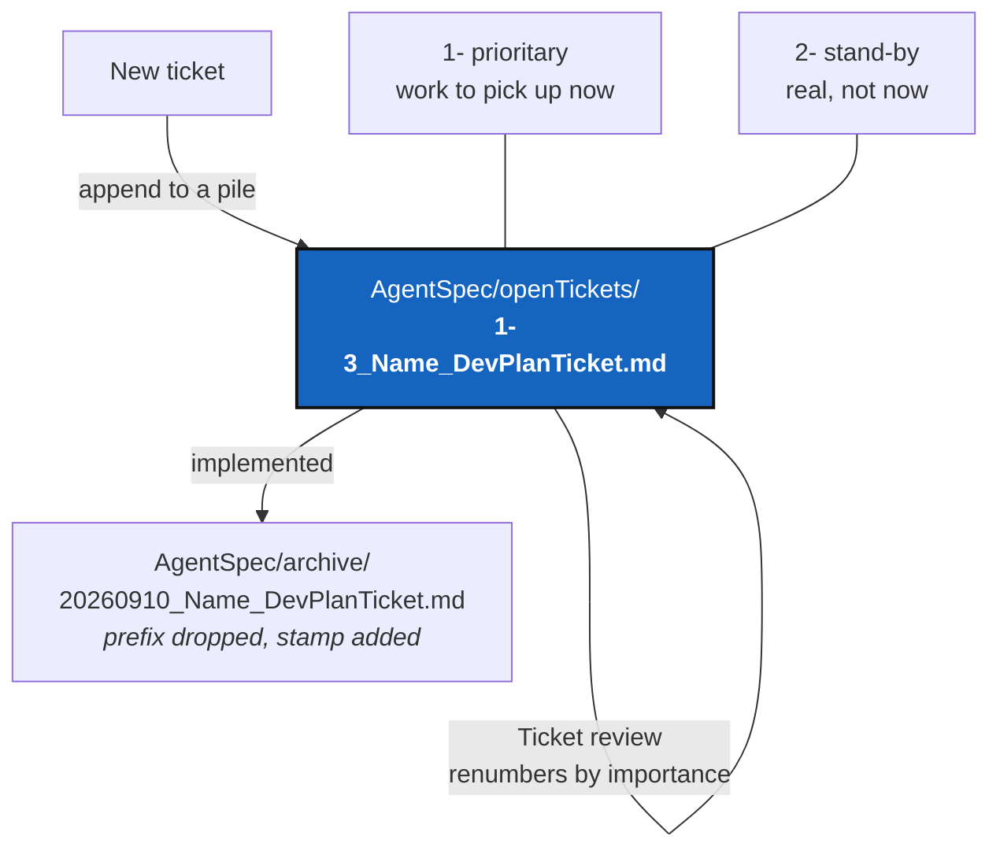

# TicketPriorityIds — every open ticket carries its priority and its place in the pile

*Created: 2026-09-10*

## Abstract — read this first

**The one-line version.** An open ticket's filename gains a
`<priority>-<rank>_` prefix — `1-` for prioritary, `2-` for stand-by, then
its position in that priority's pile — so `ls AgentSpec/openTickets/` shows
what to pick up next. Archiving strips the prefix and puts the existing
`YYYYMMDD_` stamp in its place.

**What this document is.** A ticket for a documentation-and-filing change.
It changes no code. It changes `.agentSpec/TICKETLIFECYCLE.md` (the
authoritative rule), `CLAUDE.md`'s conventions, and the names of the twelve
tickets open today.

**Why it exists.** Twelve tickets are open. Their filenames say what each
one is about and nothing about which matters. Choosing between them means
opening all twelve and re-deriving an order somebody already worked out.
The archive half of the lifecycle has answered "is this done?" from the
filename alone since 2026-09-03; the open half has never answered "is this
next?" the same way.

**What you will find.** The naming rule (§1), what the two priorities mean
and how the pile is renumbered (§2), the reorder performed today with the
reason for each placement (§3), work packages (§4), acceptance criteria
(§5), and what this deliberately does not do (§6).

**Who it is for.** Anyone — human or agent — who opens, ranks, or finishes
a ticket in this repository.

**What you need to do with it.** Read §1 and §2 before creating a ticket.
Read §3 before arguing with the current order — every placement has a
stated reason, and the order is meant to be revised, not obeyed.



---

## 1. The naming rule

An open ticket is named:

```
AgentSpec/openTickets/<priority>-<rank>_<ShortName>_DevPlanTicket.md
```

- `<priority>` is `1` or `2`. Nothing else is a valid priority.
- `<rank>` is the ticket's position in **its own priority's pile**, counted
  from 1. The two piles are numbered independently, so `1-4` and `2-4` both
  exist and neither outranks the other by its rank alone — the priority
  digit decides that first.
- `<ShortName>` and the `_DevPlanTicket.md` tail are unchanged from today.

Counting per pile rather than across both is what keeps the rank short: a
pile has to reach ten tickets before the rank needs two characters, and a
pile that long is itself the problem to fix. When it happens, `1-10` is
correct and needs no new rule — sort order is not the point, the number is.

On archiving, the whole `<priority>-<rank>_` prefix is **dropped** and the
`YYYYMMDD_` stamp takes its place, exactly as
[TICKETLIFECYCLE.md](../../.agentSpec/TICKETLIFECYCLE.md) already
specifies:

```
AgentSpec/archive/<YYYYMMDD>_<ShortName>_DevPlanTicket.md
```

A rank is a position among the tickets that are still open. Once the work
ships, that position is meaningless — it was only ever relative to a pile
that has moved on. Freezing it into the archive would preserve a number
whose comparison set no longer exists.

## 2. What the two priorities mean, and how the pile is renumbered

| Priority | Meaning |
|---|---|
| `1` — **prioritary** | Work to pick up now. A red build, a data-loss path, a wrong answer the user acts on, or something explicitly asked for. |
| `2` — **stand-by** | Real work, correctly analysed, not now. Large designs, speculative proposals, and small polish that nothing is waiting on. |

Two rules govern the numbers:

1. **On creation**, a ticket is appended to the end of its pile: its rank
   is the current length of that pile plus one. No renumbering happens, and
   the author does not have to justify a position.
2. **On a Ticket review**, both piles are re-ranked by priority and
   importance, tickets move between piles, and the ranks are compacted so
   each pile runs 1..N with no gaps. This is the only time a rank changes,
   and it is expected to change often. A rank is a current judgement, not a
   commitment.

A rank is therefore never a promise about order of delivery, and a ticket
being `2-5` is not a statement that it is bad work — `2` says "not now",
which is a scheduling claim, not a quality one.

## 3. The reorder performed on 2026-09-10

Twelve tickets were open. `UpstreamBranchDisplay_DevPlanTicket.md` was
sitting directly under `AgentSpec/` rather than in `openTickets/`; it moves
in as part of this work.

### 3.1 Prioritary

| ID | Ticket | Why here |
|---|---|---|
| `1-1` | ExamplesAndInstallSplit | **The build is red.** `pixi run test` fails 9 tests on `main` today; 8 are the missing-example references this ticket removes. `CLAUDE.md`'s before-committing gate cannot pass until this lands, so it blocks every other ticket. |
| `1-2` | InitialiseDestroysExistingClones | A data-loss path that **has already destroyed work** (2026-09-09). Unrecoverable, no prompt, no warning. |
| `1-3` | AppendCloneMode | The wider question about the same `shutil.rmtree` as `1-2`. Ranked adjacent deliberately: both tickets say the two answers must not contradict, so whoever takes `1-2` must read this one. |
| `1-4` | MergeConflictReporting | A conflict in a binary file is reported **clean**, so the preflight approves a merge that then breaks. That is a wrong answer acted on, not a reporting gap. |
| `1-5` | UpstreamBranchDisplay | `UPSTREAM_BRANCH` and `SYNC` are wrong on any repository not on its cloned branch — the normal state of a feature branch. Root cause and fix are both proven, so the cost is low and the payoff immediate. |
| `1-6` | UnifiedProjectPrivateScope | `--all`. Every write is two commands today. Newest explicit request (commit `857a95a`), additive, and its analysis is already done. |
| `1-7` | GitLocaleIndependence | One test fails for everyone whose shell is not English, and the authentication-recovery hint never fires for them. Small and measured, but it degrades rather than breaks. |

### 3.2 Stand-by

| ID | Ticket | Why here |
|---|---|---|
| `2-1` | StateMemory | F1 is serious — `cgitsync verify` verifies a directory nothing ever writes — but the register is not on any user path yet, and the ticket is a 510-line design. Top of stand-by: it is the first thing to promote. |
| `2-2` | agenticMountStep3 | Half shipped. What remains is the round trip and the `$CGSHOME` discipline complaint — real, but no longer blocking anything. |
| `2-3` | CliTypoSuggestion | The cheapest ticket open, and the least important. Ranked by importance as the rule says, not by cost: pick it up when a prioritary ticket is blocked. |
| `2-4` | GitOrchestratorCommand | A proposal, not a plan. Its two live jobs (`@project`, a project-level branch-policy default) lost the work they were going to ship with and now need a decision before they need code. |
| `2-5` | AnonymousAgent | A large infrastructure move across a fork boundary with no user-visible effect. Correct, analysed, and nothing waits on it. |

## 4. Work packages

**WP-ID1 — the authoritative rule.** In
`.agentSpec/TICKETLIFECYCLE.md`: state the naming rule (§1), the two
priorities and the two renumbering rules (§2), and correct the stale claim
that active tickets live directly under `AgentSpec/` — they live in
`AgentSpec/openTickets/`. Keep the document project-agnostic: it is a mount
of `flipoyo/.agentSpec` on branch `main`, shared with every project that
uses it, so nothing about ComplexGitSync's own pile belongs in it.

**WP-ID2 — the project conventions.** In `.claude/CLAUDE.md` (which
`CLAUDE.md` symlinks to): update the *Document conventions* paragraph on
ticket filenames and the *Layout* entry for `AgentSpec/` so both describe
`openTickets/` and the ID prefix.

**WP-ID3 — the rename.** `git mv` all twelve tickets to their §3 names, and
move `UpstreamBranchDisplay_DevPlanTicket.md` from `AgentSpec/` into
`openTickets/` as it goes.

**WP-ID4 — the links.** Fix every reference to a renamed file:
`grep -rn "_DevPlanTicket" AgentSpec/ .localSpec/ .claude/ src/ tests/`.
References inside `AgentSpec/archive/` are fixed too — an archived ticket is
never rewritten in substance, but a link that now points at nothing is not
substance.

**WP-ID5 — close this ticket.** Its work is done in the same commit, so it
archives with the rest: `20260910_TicketPriorityIds_DevPlanTicket.md`.

## 5. Acceptance criteria

1. `ls AgentSpec/openTickets/` shows twelve files, every one matching
   `^[12]-[0-9]+_.*_DevPlanTicket\.md$`.
2. Each pile runs 1..N with no gaps and no duplicates: `1-1`…`1-7` and
   `2-1`…`2-5`.
3. `AgentSpec/` itself holds only `openTickets/` and `archive/`.
4. `grep -rn "_DevPlanTicket" ` finds no reference to a path that no longer
   exists.
5. `.agentSpec/TICKETLIFECYCLE.md` states the rule and no longer says active
   tickets sit directly under `AgentSpec/`.
6. `pixi run lint` and `pixi run test` are no worse than before this change
   — it touches no code, so the 9 pre-existing failures (ticket `1-1`) must
   be the only ones.

## 6. What this does not do

It does not fix the red build. Ticket `1-1` does that, and this ticket only
gives it its name.

It does not add tooling — no script renumbers the piles, no test enforces
the prefix. A twelve-file directory is checked by reading it. If the piles
ever grow past what `ls` makes obvious, a test in
`tests/unit/test_cli_smoke.py`'s style could assert criteria 1 and 2, but
building it now would be tooling written for a problem nobody has.

It does not rank by cost, size, or how long a ticket has been open. Only
priority and importance, per §2.
