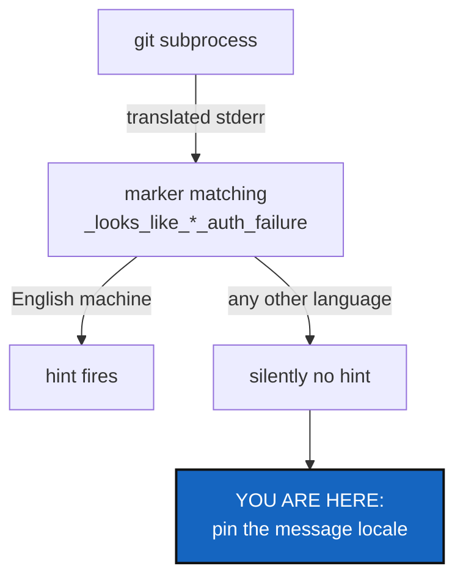

# GitLocaleIndependence — stop reading Git's translated messages

*Created: 2026-09-10*

> **Release review — 2026-09-11. Priority 1-1.** UpstreamBranchDisplay is already closed. This plan was rechecked against the resulting code; no locale fix has been implemented by this review.

## Abstract — read this first

**What this document is.** A ticket for making ComplexGitSync behave the
same whatever language Git speaks on the machine it runs on.

**Why it exists.** Git translates its own messages. ComplexGitSync matches
English words in them. On a French machine the `--force-protocol` hint that
tells a user how to recover from an authentication failure **never fires**,
and one test fails for everyone whose shell is not English.

**What you will find.** Measured evidence (§1), including one fix that looks
right and does not work; the options and a recommendation (§2); work
packages and acceptance (§3-§4).

**Who it is for.** The developer implementing this and its reviewer. Read
[CLAUDE.md](../../CLAUDE.md) and its referenced specs first.

**What you need to do with it.** Read §1.2 before choosing anything — the
obvious candidate `LC_ALL=C.UTF-8` is measured there and does not work.



---

## 1. Evidence

### 1.1 What breaks

`orchestre.py` matches English fragments of Git's stderr to decide whether a
failure was an authentication problem, and only then offers the recovery:

```python
_SSH_AUTH_FAILURE_MARKERS   = ("Permission denied (publickey)", ...)
_HTTPS_AUTH_FAILURE_MARKERS = ("HTTP Basic: Access denied", "could not read Username", ...)
```

Measured on the reporting machine (`LANG=fr_FR.UTF-8`, `LANGUAGE=fr_FR`),
same command, same remote:

```text
fr : fatal: Échec d'authentification pour 'https://github.com/...'
C  : fatal: Authentication failed for 'https://github.com/...'
```

No marker matches the French line, so `_protocol_switch_hint()` returns
`None` and the user gets the bare error with no way forward. The docstring
already says a missed match "just degrades" — but it degrades **always**,
for every non-English user, not occasionally.

Second symptom, already visible:
`tests/integration/test_golden_release_gaps.py::TestFreezeReleaseForceGoldenCoverage::test_plain_freeze_release_fails_on_this_divergence`
fails on this machine and passes under `LC_ALL=C`. It matches
`fast-forward`; Git says `Pas possible d'avancer rapidement`.

Note what is *not* translated: `remote: Invalid username or token …` comes
from GitHub, not from Git, so it survives any locale. That is a hint about
which markers are worth keeping (§2, option C).

### 1.2 Which environment variable actually works

The following settings were measured against the same failing command on the same machine:

| Setting | Result |
|---|---|
| inherited (`LANG=fr_FR.UTF-8`, `LANGUAGE=fr_FR`) | **French** |
| `LC_ALL=C` | English |
| `LC_MESSAGES=C` | English |
| `LANGUAGE= LC_MESSAGES=C` | English |
| `LC_ALL=C.UTF-8` | **French — still** |

`LC_ALL=C.UTF-8` is the setting most people reach for, because it pins the
locale without giving up UTF-8. It does not work: gettext consults
`$LANGUAGE` whenever the locale is anything other than `C`/`POSIX`, and
`C.UTF-8` is not `C`. Anyone "fixing" this with `C.UTF-8` will see it work
on their own machine and fail on a machine where `LANGUAGE` is set.

Also measured, and reassuring: path quoting does **not** change with the
locale. `git status --porcelain` produced the identical escaped output under
the inherited locale, `LC_ALL=C`, and `LC_MESSAGES=C`. Pinning messages
costs nothing in how paths come back.

### 1.3 Five methods that bypass the subprocess wrappers

`git_runner.py` has `_run` and `_query`, which
[20260910_MergeOutputDecoding](../archive/20260910_MergeOutputDecoding_DevPlanTicket.md)
gave a single decoding policy. Five methods call `subprocess.run` directly
with `text=True`, so they get neither that policy nor any environment change
made in the wrappers:

| Method | Reads | Why it matters |
|---|---|---|
| `upstream_ref` | a branch name | branch names may be non-ASCII; strict decoding raises |
| `has_upstream` | exit code only | inconsistent, and will miss the locale pin |
| `has_unresolved_merge` | exit code only | same |
| `tag_exists` | exit code only | same |
| `local_only_commit_count` | a commit count | also uses direct `subprocess.run` with strict `text=True` |

They all already call `_non_interactive_git_env()`, so a fix applied *there*
reaches them — but their strict `text=True` decoding does not. Fold them
into `_query`/`_query_bytes` rather than patching each one.

**Inherited `LC_ALL` must be handled.** Setting `LC_MESSAGES=C` and
clearing `LANGUAGE` is insufficient when a non-English `LC_ALL` is inherited:
`LC_ALL` overrides the category setting. The original measurements did not
cover that case. The implementation must either preserve the effective
non-message categories while removing that override, or deliberately force
`LC_ALL=C` for Git subprocesses and document the broader effect. Do not claim
encoding and collation are preserved without testing that property. Only the
child environment changes; the parent environment must remain untouched.

## 2. Options

| Option | What it is | Verdict |
|---|---|---|
| **A. Pin the message locale** | `_non_interactive_git_env()` pins English messages and explicitly handles inherited `LC_ALL` (§1.3) | **Recommended with the precedence correction.** Document whether the chosen approach preserves other locale categories or deliberately overrides them. |
| **B. Stop reading prose** | use exit codes and plumbing only | Right in principle, impossible here: no Git exit code distinguishes an authentication failure from any other fetch failure. Use it where it *does* apply. |
| **C. Match only untranslated fragments** | keep `remote: …` (server-sent) and drop Git's own wording | A useful supplement to A, not a replacement — GitHub's and GitLab's wording is theirs to change. |

Recommendation: **A, plus C as a follow-through.** A makes the existing
markers work everywhere. C reduces how much translated prose we depend on at
all, which is the part that keeps rotting.

**The trade-off A makes, and it is real:** a French user's Git errors, which
ComplexGitSync echoes inside `GitSyncError`, become English. Decide it
deliberately and write the decision into the function's docstring.
ComplexGitSync's own messages are English already, so a French sentence
quoted inside an English one is not obviously the better outcome — but it is
the user's Git, and this ticket is where that call gets made, not somewhere
in a later diff.

## 3. Work packages

| Work package | Files | Deliverable |
|---|---|---|
| WP1: pin the locale | `git_runner.py` | §2 option A in `_non_interactive_git_env()`, with the §1.2 measurement recorded in the docstring — especially why `C.UTF-8` is wrong, so nobody "simplifies" it later. |
| WP2: one boundary | `git_runner.py` | Fold `upstream_ref`, `has_upstream`, `has_unresolved_merge`, `tag_exists`, `local_only_commit_count` into `_query`/`_query_bytes` (§1.3). No `subprocess.run` outside the wrappers. |
| WP3: prove it | `tests/unit/test_git_runner.py` | Regression cases with non-English `LANG`/`LANGUAGE`, with and without inherited non-English `LC_ALL`, run a failing Git command and assert the marker still matches. They must fail if WP1 is reverted. Test child-environment isolation and the documented category behavior. |
| WP4: the golden test | `tests/integration/test_golden_release_gaps.py` | Passes on a non-English machine without a locale override in the test itself — the product pins the locale, the test does not have to. |
| WP5: trim the prose matching | `orchestre.py` | §2 option C. Keep markers whose source is the server; mark each remaining Git-worded marker with what it was verified against, as the existing comments already do. |
| WP6: verify and land | tests, this ticket | `pixi run lint` and `pixi run test` pass **under a non-English locale**; apply CLAUDE.md's before-committing checklist; archive under [TICKETLIFECYCLE.md](../../.agentSpec/TICKETLIFECYCLE.md). |

## 4. Acceptance criteria

- `LANG=fr_FR.UTF-8 LANGUAGE=fr_FR pixi run test` passes, with no locale
  override that forces English inside a test. Also run with inherited
  `LC_ALL=fr_FR.UTF-8`; regression tests explicitly supply non-English environments.
- An HTTPS authentication failure produces the `--force-protocol` hint under
  a non-English locale. A test proves it and fails if WP1 is reverted.
- `grep -n "subprocess.run" src/ComplexGitSync/git_runner.py` shows calls
  only inside `_run`, `_query_bytes`.
- Both inherited-locale cases produce the recovery hint without changing the parent environment.
- No `text=True` remains in `git_runner.py`; every stream goes through the
  module's decoding policy.
- `_non_interactive_git_env()`'s docstring states the choice, the
  measurement, and the `C.UTF-8` trap.
- The user-visible consequence — Git's own errors now read in English — is
  stated in `README.md` or the docstring, whichever the implementer judges
  the right audience, and not left for a user to discover.

## 5. Scope and handoff

Out of scope: translating ComplexGitSync's own output, and any change to
what the `--force-protocol` hint says once it fires.

**Related observation, deliberately not fixed here.** `git status
--porcelain` escapes non-ASCII paths by default (`core.quotePath`), so a
file named `café.txt` comes back as `"caf\303\251.txt"`.
`status_render._status_line_path()` strips the quotes but does not unescape,
so the path it returns is wrong. That is a real bug in the same family —
Git output that is not machine-readable by default — and its fix is probably
`-c core.quotePath=false`. It deserves its own ticket rather than riding
along with this one; measured, not speculated, while testing §1.2.

---

## 6. Closing note — what landed

**All six work packages.** Every measurement in §1.2 was reproduced on this
machine before anything was written, and each one came out exactly as the
ticket recorded — including the `C.UTF-8` trap.

**WP1.** `_english_message_locale()` in `git_runner.py`. It removes an
inherited `LC_ALL` *after* copying its value into `LC_CTYPE`, `LC_COLLATE`,
`LC_NUMERIC`, `LC_TIME` and `LC_MONETARY`, then clears `LANGUAGE` and sets
`LC_MESSAGES=C`. That is §2 option A with the precedence correction: only
the language of the prose changes, and the child's encoding and collation
are left as they were — verified, `LC_CTYPE` still reports `fr_FR.UTF-8`
inside the child. `os.environ` is never written.

**WP2.** `upstream_ref`, `has_upstream`, `has_unresolved_merge`,
`tag_exists` and `local_only_commit_count` now go through `_query`.
`subprocess.run` appears only inside `_query_bytes` and `_run`, and no
`text=True` remains anywhere in the module.

**WP3/WP4.** Six tests in `tests/unit/test_git_runner.py`, three of them
parametrised over both ways a machine speaks French — `LANG`/`LANGUAGE`,
and the same plus an inherited `LC_ALL`. They cover the pinned child
environment, the preserved categories, parent isolation, and a real failing
`git merge --ff-only` read back in English. Reverting WP1 fails five of
them. `test_plain_freeze_release_fails_on_this_divergence` now passes with
no locale override of its own.

**WP5, and a bug it exposed.** Every marker now records who writes it,
because that is what decides whether it survives a non-English machine.
OpenSSH ships no translations, so `Permission denied (publickey)` and
`Host key verification failed` are locale-proof; `Could not read from
remote repository` is Git's own and matches only because of WP1 — French
renders it `Impossible de lire le dépôt distant.`

Measuring a real GitHub HTTPS failure turned up something §1.1 implies but
does not state: **no marker matched it in any language.** GitHub sends
`remote: Invalid username or token…` and Git adds `fatal: Authentication
failed for '…'`, and neither was in the list. Both are now, with the
server-sent one preferred exactly as §2 option C recommends — GitHub writes
it in English on every machine, while Git's line depends on WP1.

**Two things the ticket did not list.** `git_runner.py` and `orchestre.py`
are both on the LOC ratchet, so the new code was paid for rather than
added: `tag_exists` and `has_unresolved_merge` now share one `_ref_query`
helper, `has_upstream` is `upstream_ref(...) is not None` (the same command
run twice before), and duplicated caveat prose came out of two docstrings.
Both modules end exactly at their recorded baselines, 777 and 3719.

**The user-visible consequence** is stated in `README.md` under *Git speaks
English here*, in §3's "options that recur" — the audience for it is a user
wondering why one message is not in their language, not a developer reading
a docstring. The docstring carries the engineering half: the decision, the
measurement table, and why `C.UTF-8` is the wrong fix.

**Verified under three locales**, whole suite, no override inside any test:
inherited `fr_FR.UTF-8`/`LANGUAGE=fr_FR` (1266 passed), inherited
`LC_ALL=fr_FR.UTF-8` (1266 passed), and `LC_ALL=C` (1265 passed, 1 extra
skip — the guard that refuses to claim it proved the pin on a machine where
Git cannot speak French).

**Left for its own ticket, as §5 asked:** `core.quotePath` mangling
non-ASCII paths in `status_render._status_line_path()`. Not touched here.
