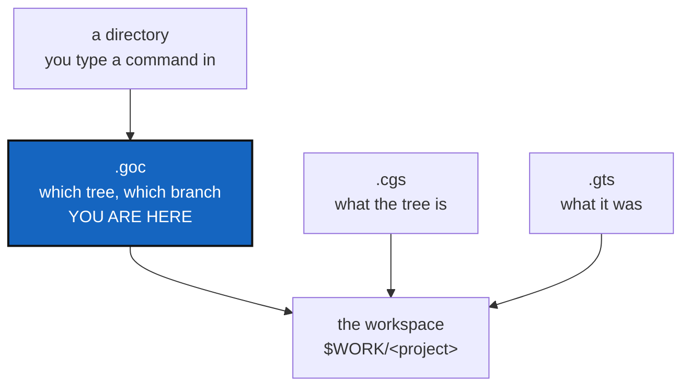

# GitOrchestratorCommand — a `.goc` file that says which tree this directory drives

*Created: 2026-09-05*

> **Closed on 2026-09-11 without implementation.** Previously 2-3.
> Not planned for the first release. The proposal combines workspace selection, configuration defaults, and project creation into an unsettled additional format. Preserve the requirement that users understand which workspace a command affects; concrete remaining failures may be handled separately. Its old requirement that every private repository remain on its declared branch conflicts with the current behavior of writable private repositories. Reassess that requirement before reusing this historical proposal.
> The proposal below is preserved as historical context, not an execution instruction.
> No proposed migration, remote operation, freeze, fork, branch change, or project-creation workflow was performed.
> See the [release backlog](../shortTickets/ticketPriorityUpdate.md) for the active plan.

> **Reassessed on 2026-09-10. AgenticMounts step 3 was archived, and what
> was left of it came here.** This ticket now carries four things, not two.
>
> Jobs 1 and 2 — the `@project` token and a project-level branch-policy
> default — were handed to step 3 to ship alongside the `pinned` grammar.
> That grammar shipped on 2026-09-09 (renamed `private`, with `writable`)
> and **neither job went with it**. Nothing in the code resolves
> `@project`, and there is no project-level branch-policy default. They
> come back here as ordinary work, with nothing bundling them.
>
> The **three-hop round trip** arrived at the same time, as §2c. Step 3
> existed to prove and document it and never did. It is the protocol
> `.goc` automates, so holding it here removes the dependency instead of
> orphaning it. Step 3 is
> `AgentSpec/archive/20260910_agenticMountStep3_DevPlanTicket.md`; its
> closure note lists what died with it.
>
> Jobs 3 and 4 — `.goc` itself — are untouched and unbuilt.
>
> Two further changes since this was written. `@` is now free as a variable
> marker: the competing use, `fork<ID>@<project>`, was closed unbuilt in
> `AgentSpec/archive/20260909_ForkObject_DevPlanTicket.md`, so job 1 no
> longer has a collision to settle. And the `pinned` this document names is
> spelled `private` in the grammar today; `pinned` is still read, so the
> text below is old wording rather than wrong wording.

## Abstract — read this first

**The one-line version.** Bring back `.goc` as configuration, not
commands, with two jobs the other files cannot do: say which workspace the
current directory drives, and interpret a request that creates a project's
spec on its own branch.

**What this document is.** A proposal. Nothing has been built. It answers
the question "does this make sense?" with a qualified yes, and says which
parts of the idea belong somewhere else.

**Why it exists.** Four jobs were asked of `.goc`. Two belong in `.cgs` and
should ship with the `pinned` work already planned. The other two have no
home today. Nothing on disk records which tree a directory belongs to: that
is answered by the `$CGSHOME` environment variable, or by a silent guess two
directories up, and running `cgitsync status` from a second checkout drove
the wrong tree and crashed with no file anywhere able to say why. And
nothing turns a request for a new project into that project's spec on its
own branch, which is the Operation step 3 §2.0 specifies.

**What you will find.** §0 what `.goc` was and why it was deleted. §1 the
four jobs, and where each one belongs, with §1b on the Orchestrator and the
line it must not cross. §2 the gap the file fills, §2b the discipline it
makes visible, and §2c the round trip that discipline serves — inherited
from step 3, unproven and undocumented. §3 what the file looks like. §4
decisions. §5 the work in order. §6 risks. §7 acceptance.

**Who it is for.** Whoever picks this up next, and the repository owner,
who has to answer §4.

**What you need to do with it.** Answer §4, then work §5 in order. §2c
comes before `.goc`: you cannot automate a protocol nobody has run.



---

## 0. What `.goc` was, and why it was deleted

`.goc` existed. It had a document class (`GocDocument`), a fixed command
vocabulary (`_VALID_GOC_COMMANDS`), a client method (`orchestrate()`),
around 44 passing tests, and full documentation.

It was deleted on 2026-08-27, under D4 of
`AgentSpec/archive/20260826_Deletion_DevPlanTicket.md`. The reason is
recorded there, and it is narrow:

> `.goc` had ~44 passing tests and full docs coverage, just no CLI command.

So the objection was never that the idea was wrong. It was that no user
could reach it. `CLAUDE.md` states the same rule for the whole project: a
client method with no CLI surface is unreachable for users.

Two things follow. Anything brought back must have a CLI command from the
first commit. And it must not be what the old one was — a list of commands
to replay. That flavour is what made it a second, parallel way to drive the
tool, used by nobody. The file proposed here holds **configuration**, not
commands, despite the name it keeps for continuity.

## 1. The four jobs, and where each belongs

The request bundles several things. They do not all need a new file.

| # | Job | Belongs in | Why |
|---|---|---|---|
| 1 | Set a repository's `default_branch` to the project's name, so the same three lines work for every project | `.cgs`, **built here** | It describes the tree, and the tree's description is shared and committed. A token such as `default_branch = "@project"` resolved at normalization |
| 2 | Set branch-management policy once for the project rather than per entry | `.cgs`, **built here** | Same reason. A `[project]`-level default that each entry may override, alongside the `private`/`writable` fields already in the grammar |
| 3 | Drive ComplexGitSync from the current directory, at each parent repository level | **`.goc`** | It differs per checkout and per machine, so it cannot live in `.cgs` — see §2 |
| 4 | **Interpret a request and produce a project's `.cgs` on its own branch** — the Operation specified in step 3 §2.0 | **`.goc`**, as the Orchestrator | The request document is exactly what a `.goc` interpreter reads. See §1b |

**All four jobs are this ticket's now.** Jobs 1 and 2 were sent to
AgenticMounts step 3 to ride along with the `pinned` grammar and save a
second round of validation, round-trip tests, documentation and PDF
rebuilds. That round was spent on the privacy grammar without them, so the
saving is gone and step 3 is archived. They are ordinary separate work,
and this is the only document still asking for them.

They still come first. Jobs 1 and 2 are `.cgs` grammar that §2c's round
trip and job 4's Operation both name, so build them before either.

### 1b. Job 4 — the Orchestrator, and what it must not become

Step 3 §2.0 specifies a chain: `GOC.toml` is read by an Orchestrator, which
asks ComplexGitSync for a validated `<project-name>.cgs`, which is committed
on `goc-sync@<project-name>` and merged into the `<project-name>` deployment
branch of `flipoyo/ComplexGitSync`.

That Orchestrator is this ticket's file, given a second job: not only "which
tree does this directory drive" (job 3) but "make me a project" (job 4).
Both are configuration read by an interpreter, which is why they belong
together.

**The line that must not be crossed.** The deleted `.goc` was a list of
commands to replay, and that is what made it a parallel way to drive the
tool that nobody used (§0). Job 4 brings back something that *looks* like
that — a request that causes work to happen — so the distinction has to be
sharp:

| Allowed | Not allowed |
|---|---|
| A request that names a project, its repositories, and its policy | A list of `cgitsync` commands to run in order |
| The Orchestrator calling `configure`, `create-cgs` or `discover` to author the spec | The Orchestrator authoring `.cgs` text itself, becoming a fourth author |
| One CLI command that runs the Operation, from the first commit | A Python-only entry point, which is why the last one was deleted |

The request describes *what is wanted*. It never describes *how to do it*.
If a field would ever hold a command name, the design has gone wrong.

**Open, and inherited from step 3 §2.0:** the `A@B` naming rule reads two
ways in the request, and `_release_snapshot_slug` rewrites `@` to `-` when
caching a spec under `.cgitsync/.cgs/`, so two branches differing only in
that character collide. Both are listed as decisions there.

## 2. The gap `.goc` fills

`.cgs` cannot hold this, and the reason is concrete. `install.cgs` and
`examples/complexgitsync.cgs` are kept byte-identical by
`tests/unit/test_install_cgs.py`. A file under that rule cannot carry
anything that differs between two checkouts on two machines.

Today the question "which workspace does this directory drive?" is answered
by `paths.resolve_cgshome`, in this order:

1. the `--output-path` flag, if given;
2. the `$CGSHOME` environment variable;
3. otherwise `(current directory/../..)/<project name>` — a path guessed
   two levels up.

Options 2 and 3 are invisible. Nothing in the directory records them. That
is not a theory: `cgitsync status`, run from `~/Programmes/ComplexGitSync`,
walked a tree in `~/.cgs/CGS20260905095916/cgitsync` and stopped on a
folder that had been deleted there. The checkout gave no sign of which tree
it was bound to, because no file said so.

A small file in the directory fixes that. It is readable, it is
discoverable by walking up from the current directory, and it can differ
per checkout without touching anything shared.

The "each parent repository level" part matters for nested trees. A parent
repository can carry its own `.goc` saying how its own subtree is driven,
which is what makes the idea useful for the 19-repository build tree in
`tutorials/02_onboarding_a_real_build_tree.md` and for CaWaQS-Viz.

## 2b. The operational discipline `.goc` makes possible

Step 3 establishes the rule: work in two separate checkouts, A (the tool)
and B (the project). A holds `cgitsync` source code. B is a tree you manage
with the tool. Separating them avoids the `export CGSHOME` trap.

`.goc` makes this separation *visible* and *discoverable*.

Without `.goc`, B is only known through the walk-up for `.cgitsync/`. That
works, but a teammate (or a future you on a different machine) cannot know
what B you are in without asking, asking a shell variable, or assuming from
the directory name. With `.goc` in B, the file **declares** which tree it is
and what it is for, readable and portable.

The ideal discipline after step 3:

1. **From A (tool),** edit source, commit, push to A's branch, pull `main`.
   Never export `$CGSHOME` here.
2. **From B (project),** run tree-wide commands. The walk-up finds
   `.cgitsync/` because you are in B. Commands use the latest tool from A.
   `.goc` (when built) records what B is, so `cat .goc` tells the story.
3. **At a terminal prompt you move between.** No `$CGSHOME` exported, so
   each directory's location discipline (walk-up for B, plain git for A)
   just works.

When `.goc` exists, the resolution order (§3) puts it second, ahead of the
environment variable. A command can find B by reading `.goc` before checking
`$CGSHOME`, so the old trap is behind the new file. That is why it is
worth building.

## 2c. The round trip `.goc` automates — inherited, still unproven

From AgenticMounts step 3 §2.1 to §2.3, archived on 2026-09-10. **Nothing
here has been run end to end or written down.** It is the protocol job 3
replaces `$CGSHOME` for, so it has to be settled before `.goc` is worth
building.

Three hops. Hop zero — the Operation that creates a project — is §1b's
job 4, and comes after these.

### Hop one — from a plain clone to a managed tree

```bash
git clone git@github.com:flipoyo/ComplexGitSync.git
cd ComplexGitSync            # on main — this checkout is the *tool*
pixi install

pixi run cgitsync bootstrap examples/complexgitsync4dev.cgs <project-name> --cgs-path "$WORK"
export CGSHOME="$WORK/<project-name>"
cd "$CGSHOME" && pixi install
```

`bootstrap`'s second argument always forms the final path segment
(`paths.resolve_bootstrap_root`), so the tree lands at
`$WORK/<project-name>` whatever the `.cgs` calls the project. Without
`--cgs-path` it lands in a fresh `$HOME/.cgs/CGS<timestamp>/` instead.

Which spec to hand it decides what you get. `install.cgs` is the user
install — the tool and its documentation, no private repository. The tree
below is `examples/complexgitsync4dev.cgs`, the developer install, which is the only
checked-in spec mounting every kind of private entry.

| Repository | Path | Branch | Why |
|---|---|---|---|
| ComplexGitSync | `.` | the project branch | `project.default_branch`, falling back to `main` |
| DocComplexGitSync | `docs/` | follows the project branch | no branch of its own declared |
| `.agentSpec` | `.agentSpec/` | `main` | **private/distant** — shared by every project, read-only |
| DevSpec | `.agentSpec/DevSpec/` | `main` | nested under `.agentSpec`, inherits its privacy |
| `.localSpec` | `.localSpec/` | `ComplexGitSync` | **private/local** — this project's branch |
| `.claude` | `.claude/` | `ComplexGitSync` | **private/local** — this project's branch |

### Hop two — working inside the tree

`$CGSHOME` is live-editable (`pixi.toml`'s editable install), so edits to
`src/ComplexGitSync/` take effect immediately. Tree-wide commands run from
there.

The rule this hop rests on now holds in the code:
`git_branch.resolve_propagated_ref` decides each repository's branch on its
own, and `checkout_tree` refuses to create a branch inside a shared
repository at all. What is missing is the proof — a feature branch created
for this project, then checked for in every private mount — and the
write-up.

### Hop three — back to the plain clone

The tree root and the plain clone are two clones of one GitHub repository.
After `cgitsync push` or `freeze-release` from the tree:

```bash
cd ~/Programmes/ComplexGitSync
git fetch origin
git checkout <the tree's project branch>
git pull --ff-only
```

**Which branch the plain clone sits on** — step 3's D4, answered there and
never documented: both, for different things. The plain clone tracks the
project branch when it is managing that project. Tool changes — anything
under `src/`, `tests/`, `docs/` — go to `main` through a pull request, and
each project branch merges `main` forward when it wants them. Generic to
`main` first, then forward into each project branch, the same direction the
private mounts already use.

Still unstated anywhere a reader would find it: which branch a fresh
`bootstrap` checks out when someone clones the tool and has not chosen a
project yet.

### Where this gets documented — step 3's D5, renumbered

| Where | What |
|---|---|
| `README.md` | A subsection under §2 — the three hops, in commands, beside the existing standalone/nested split |
| `docs/Text/user_guide.tex` | The `$CGSHOME` resolution order and the branch rules per command |
| `tutorials/05_managing_a_project_tree.md` | The full walk-through, written from the transcript of the proof run, not from memory |

**The number moved.** D5 proposed `tutorials/04_*`; `04_private_repos.md`
holds that slot, so it becomes `05_`. `tutorials/README.md` and README §4's
list both name every tutorial and need the new row.

A fifth tutorial means the PDFs need rebuilding with `latexmk` and
`DocComplexGitSync` needs its own commit and push.

## 3. What the file looks like

A proposal, to be settled in §4:

```toml
# .goc — how this directory drives a ComplexGitSync tree.
# Local to this checkout. Never committed to a shared repository.

tree = "/home/flipoyo/.cgs/CGS20260905095916/ComplexGitSync"
spec = "install.cgs"
project_branch = "main"
```

Three fields, three meanings. `tree` is the workspace this directory
drives. `spec` is the `.cgs` that describes it. `project_branch` is the
branch tree-wide commands work on.

**The division of labour, in one line each.** `.cgs` says what the tree
is: its repositories, their paths, their branches, and which of them are
pinned. `.gts` says what the tree was at a moment in time. `.goc` says
which tree this directory drives, and on which branch. `.goc` never
changes the topology.

**Resolution order**, replacing the current three-step guess:

1. an explicit flag on the command;
2. the nearest `.goc`, found by walking up from the current directory;
3. `$CGSHOME`;
4. the two-levels-up guess — which should say out loud that it is guessing.

## 4. Decisions — your call

### D1. Does `.goc` set branch *policy*, or only the working branch?

Recommended: only the working branch. Whether a repository is pinned is a
property of the tree, so it stays in `.cgs` where every checkout sees the
same answer. `.goc` picks which branch tree-wide commands drive in this
checkout. If `.goc` could also pin, two files could disagree, and the rule
for who wins becomes something a user has to remember.

### D2. Is `.goc` committed, or local to the checkout?

| Option | Result |
|---|---|
| **A (recommended)** | Local and gitignored, like `.claude/settings.local.json`. It holds an absolute path that is true on one machine only. A command writes it, so nobody hand-edits a path |
| B | Committed, with paths relative to the repository root | Shareable, and useful for the tutorial 2 build tree where every developer drives the same layout. But a relative path cannot point at a workspace outside the repository, which is the normal case |
| C | Both: a committed template plus a local override | Most flexible, twice the rules to explain |

A is recommended, with one reservation worth your view: if the point is to
help onboard CaWaQS-Viz and the tutorial 2 tree, a committed file may be
what actually helps a newcomer. That argues for B or C.

### D3. What commands read and write it?

`.goc` died once for lacking a command. It needs at least two:

- one that **writes** it, so no user types an absolute path by hand;
- one that **reports** what resolved and why — which tree this directory
  drives, from which of the four sources in §3. This is the command that
  would have answered the original confusion in one line.

Names to settle. `cgitsync where` reads well for the second.

### D4. Does the name stay `.goc`?

It carries history, and the abbreviation expands to GitOrchestratorCommand,
which describes what it no longer does: it holds configuration, not
commands. Keeping the name is fine if the documentation says plainly what
it now holds. Changing it costs nothing today, since nothing depends on it.

## 5. The work, in order

Order matters, and the reason is simple: you cannot automate a protocol
nobody has run, and `.goc` names a branch policy that must exist first.

| # | Step | Job | Where |
|---|---|---|---|
| 1 | Build the `@project` token and the `[project]`-level branch-policy default: grammar, validation, authoring round-trip tests, docs | 1 and 2 | `cgs_format.py` |
| 2 | Apply them to `install.cgs`, `examples/complexgitsync4dev.cgs` and `.agentSpec/install.cgs` | 1 and 2 | those specs |
| 3 | Prove §2c's round trip on a clean clone: bootstrap, check every branch against §2c's table, create a feature branch and confirm it reaches **no** private mount, commit, push, pull it back into the plain clone. Keep the transcript | — | local |
| 4 | Write §2c up from that transcript: `README.md`, `docs/Text/user_guide.tex`, `tutorials/05_managing_a_project_tree.md`. Rebuild the PDFs; commit and push `DocComplexGitSync` | — | ComplexGitSync, `docs/` |
| 5 | Add `.goc` as described here; update tutorial 2 and the CaWaQS-Viz onboarding to use it | 3 | ComplexGitSync |
| 6 | Build the Orchestrator per §1b | 4 | ComplexGitSync |
| 7 | `pixi run lint`, `pixi run test`, `pixi run bump-version`, rebuild the PDFs if the version moved | — | ComplexGitSync |

**Steps 5 and 6 stay last.** `.goc` names a branch policy that step 1
creates, and job 4's Operation produces a project's spec on its own branch
— both need §2c settled, and §2c has never been run.

**Steps 3 and 4 arrived from AgenticMounts step 3**, archived on
2026-09-10 as
`AgentSpec/archive/20260910_agenticMountStep3_DevPlanTicket.md`. That
ticket existed to do them and did not.

One implementation warning for step 1, from reading `cgs_format.py`: the
`@project` token has to survive being written back out. Normalization fills
`default_branch` in on every entry, and `to_authoring_dict` decides what
gets written to the file. If the token is expanded to a literal name during
normalization and the document is then saved, the file silently gains a
hard-coded branch. The authoring round-trip test has to cover it.

## 6. Risks

| Risk | Handling |
|---|---|
| A fourth file format is a fourth thing to learn, and the last one died unused | Keep it to the three fields in §3, ship the two commands in D3 in the same change, and document the division of labour in one line per file |
| `.goc` and `.cgs` both appear to set a branch, and users guess wrong | D1 keeps policy in `.cgs` and the working branch in `.goc`. The resolution order in §3 is stated once, in the user guide, and the D3 report command prints which source won |
| It becomes a command runner again, and a second way to drive the tool | It holds configuration only. If a "run these steps" feature is ever wanted, that is a separate decision with its own ticket |
| An absolute path in `.goc` goes stale when a workspace is moved | The report command from D3 says the path does not exist, rather than failing somewhere deeper |

## 7. Acceptance

**Jobs 1 and 2 — the grammar.**

1. `default_branch = "@project"` resolves to the project's own name, and
   survives an authoring round trip: a document read and written back still
   holds the token, not the name it resolved to.
2. A `[project]`-level branch-policy default applies to every entry that
   does not override it, and `cgitsync validate` shows the effective policy
   per repository.
3. No `.cgs` in the tree names a branch that does not exist on its remote.

**§2c — the round trip.**

4. From a clean clone on `main`, one `bootstrap examples/complexgitsync4dev.cgs`
   produces a `READY` tree whose branches match §2c's table exactly.
5. `cgitsync branch <name>` on that tree creates the branch in the
   project's own repositories and in **none** of `.agentSpec`, `DevSpec`,
   `.localSpec`, `.claude`; `checkout` and `pull` leave every private mount
   on its declared branch.
6. A change made in the tree, pushed from it, reaches the plain clone with
   the documented commands and no manual repair.
7. The protocol is in `README.md`, `docs/Text/user_guide.tex` and
   `tutorials/05_managing_a_project_tree.md`, written from the transcript
   of criterion 4's run. `tutorials/README.md` and README §4 list it. The
   PDFs are rebuilt and `DocComplexGitSync` is pushed.

**Jobs 3 and 4 — `.goc`.**

8. A `.goc` in a directory decides which tree a `cgitsync` command drives,
   ahead of `$CGSHOME` and ahead of the two-levels-up guess.
9. One command writes the file; one command reports which tree resolved and
   from which source. Both are in the README command table and the user
   guide, as `CLAUDE.md` requires of every command.
10. Running a tree command from a checkout with no `.goc` and no `$CGSHOME`
   either does nothing or says plainly what it would have driven. It never
   silently drives a tree two directories up.
11. `.cgs` still decides topology and pinning. No `.goc` changes what the
   tree contains.
12. Tutorial 2 uses `.goc` to drive its build tree, and the CaWaQS-Viz
   recipe uses it.
13. `pixi run lint` and `pixi run test` pass, and the documentation and PDFs
   are rebuilt.
