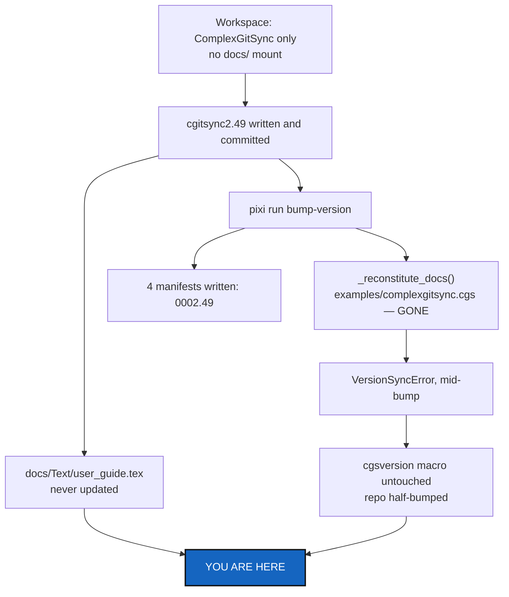

# ReleaseDocsDebt — 2.49 shipped without its documentation half, and the bump that would have caught it cannot run

*Created: 2026-09-11*

## Abstract — read this first

**The one-line version.** `cgitsync2.49` was written from a workspace holding
only `ComplexGitSync` — no `docs/` mount — so `docs/Text/user_guide.tex`
never learned what the release changed, the `\cgsversion` macro is still a
release behind, and `pixi run bump-version` cannot repair either of those from any
workspace, because the `.cgs` it reaches for was renamed out from under it.

**What this document is.** A catch-up ticket: one documentation debt with a
known content list, and two small script bugs that let the debt go unnoticed.
It changes `docs/` (another repository), one line of
`scripts/bump_version.py`, the order of four writes in the same file, and one
test.

**Why it exists.** A release's documentation is not optional work that
follows it — it is part of the release. `2.49` changed what `cgitsync status`
prints and what `cgitsync checkout` *does*, and a user reading `MASTER.pdf`
today is told neither. The bump script exists to make that impossible to
forget; it failed silently in the direction that hides the problem, leaving
four manifests at `0002.49` and the documentation still on the release
before it.

**What you will find.** The evidence (§1), what `2.49` owes the
documentation (§2), the two bugs in `bump_version.py` (§3), decisions for the
owner (§4), work packages (§5), acceptance criteria (§6), and what this does
not cover (§7).

**Who it is for.** Whoever picks this up **from a full developer workspace** —
`pixi run cgitsync bootstrap examples/complexgitsync4dev.cgs ComplexGitSync`,
or any checkout where `docs/` is really mounted. Confirm `ls docs/Text/`
answers before reading §5; nothing in §2 can be done without it.

**What you need to do with it.** Fix §3 first — it is three lines and it is
what makes §2 verifiable — then write §2 and rebuild the PDFs.



---

## 1. What was observed

`cgitsync2.49` — commit `bbdbdae`, closing
[20260911_UpstreamBranchDisplay](../archive/20260911_UpstreamBranchDisplay_DevPlanTicket.md)
— was implemented in a checkout of `ComplexGitSync` alone. The developer tree
declares five repositories:

```text
ComplexGitSync, docs          project          examples/complexgitsync4dev.cgs
.agentSpec                    private/distant
.localSpec, .claude           private/local
```

None of the other four were present. Two consequences are visible in the
repository as it stands:

**1. `AGENT.md` and `CLAUDE.md` are dangling symlinks.** They point into
`.claude/`, which is not mounted. Every convention they carry — including the
version-and-documentation checklist a release is supposed to apply — was
unreadable for the whole session.

**2. The version is split across two repositories.** `pyproject.toml`,
`pixi.toml`, `src/ComplexGitSync/__init__.py` and `README.md` say `0002.49`.
`docs/Setup/Shortcuts.tex` and `docs/preamble.tex` — the only two files that
define `\cgsversion` — were never reached, so every built PDF still puts an
earlier version on its title page (`0002.48` if the previous release bumped
cleanly, older if it did not; §2.5 is how you find out).

The bump did not fail quietly by accident; see §3.

## 2. What `2.49` owes the documentation

`README.md` carries all of this already — its "What `status` tells you"
section and the `checkout` row of the command table. What follows is the same material owed
to the LaTeX sources, which are the reference documentation rather than the
landing page. Content, not wording — say it the way the surrounding sections
say things.

### 2.1 `docs/Text/user_guide.tex` — the `status` legend

This is WP-7 of the archived ticket, and the user-facing contract for the
column. The `SYNC` column now has **six** values, two of which are new or
changed:

| Value | Meaning |
|---|---|
| `synced` | Level with the upstream. |
| `ahead(+N)` / `behind(-N)` / `diverged(+N/-M)` | Measured against the upstream. |
| `no-upstream` | **New.** The branch was never pushed, so there is nothing to compare against. Normal for a branch just created, and for a private/local repository that only `push --private` ever sends. |
| `unknown` | **Narrowed.** Now means only "names an upstream that does not resolve" — a fault, repaired by `pull` or `push`. It used to mean both this and the line above, which is why the column stopped being worth reading. |

The `summary` line also gained a field: `unmeasured=N` counts the
`no-upstream` and `unknown` rows, which were previously folded into
`ahead=0 behind=0` — a measurement nobody had taken. If the guide prints a
sample `summary` line anywhere, it is now wrong by one field.

### 2.2 `docs/Text/user_guide.tex` — what `checkout` does with a branch it has seen

Behaviour change, not a display change, and the one most worth writing down:

- `cgitsync checkout <branch>` now **joins** a branch this workspace already
  holds a remote-tracking ref for — it creates the local branch from that ref
  with tracking set. It used to create a new branch at the current `HEAD` and
  report `READY`/`ALIGNED`, so a colleague's branch name could resolve to
  commits that had nothing to do with theirs.
- `cgitsync pull` now fetches every branch of each remote before pulling your
  own. That is what puts those refs on disk; `checkout` itself still never
  touches the network and still works offline.
- The sequence worth stating plainly: **`pull`, then `checkout <their
  branch>`**.

### 2.3 `docs/Text/user_guide.tex` — `clone` and the fetch refspec

One paragraph, if the guide describes what `clone` leaves behind: a clone
still downloads a single branch, but no longer *remembers* a single-branch
fetch refspec. An older workspace repairs itself on the first `pull` or
`push` — no re-clone, and `status` is deliberately left read-only, so it
never rewrites `.git/config`.

### 2.4 `docs/Text/api_python.tex` — if it enumerates `GitRunner`

Three new methods on the runner, all public API by that file's standard:
`ensure_fetch_refspec`, `upstream_configured`, and
`remote_tracking_branch_exists`. `create_branch` gained a `start_point`
keyword. Check whether that file actually enumerates them before adding
anything — if it documents the client rather than the runner, this section is
a no-op and should be struck rather than padded.

### 2.5 The audit nobody has done

`2.49` is the release we know shipped from the wrong workspace. Whether
`2.47` and `2.48` did too is unknown from inside this repository, because the
evidence lives in `DocComplexGitSync`'s history. From a full workspace, read
`git log` in `docs/` against this repository's release commits and say, in the
closing note of this ticket, which releases are actually documented. If more
than one is missing, this ticket has found a process failure rather than an
accident, and the owner should know that before deciding §4/D2.

## 3. Why the bump could not repair any of this

Two independent bugs in `scripts/bump_version.py`, both live today, neither
caused by the wrong workspace — only exposed by it.

### 3.1 The reconstitution path names a file that no longer exists

[`bump_version.py:54`](../../scripts/bump_version.py#L54):

```python
BOOTSTRAP_CGS_PATH = REPO_ROOT / "examples" / "complexgitsync.cgs"
```

There is no such file. Commit `f3878dc` moved the developer spec to
`examples/complexgitsync4dev.cgs` and fixed the CI reference to it; this one
was missed. So `_reconstitute_docs()` — the fallback whose whole purpose is
"clone `docs/` when it is missing" — can never succeed, in any workspace:

```console
$ pixi run cgitsync initialise examples/complexgitsync.cgs --output-path ..
FileNotFoundError: .../examples/complexgitsync.cgs
$ pixi run bump-version
VersionSyncError: failed to reconstitute docs/ via 'cgitsync initialise' (exit 1).
```

### 3.2 A failed bump leaves the repository half-bumped

[`apply_version`](../../scripts/bump_version.py#L134) writes the four
manifests **before** it discovers that the docs sources are missing:

```python
_substitute_version(pyproject_path, ...)   # 0002.49 — written
_substitute_version(pixi_toml_path, ...)   # 0002.49 — written
_substitute_version(init_path, ...)        # 0002.49 — written
_substitute_version(readme_path, ...)      # 0002.49 — written
if any(not docs_path.exists() for docs_path in docs_tex_paths):
    _reconstitute_docs()                   # raises here
for docs_path in docs_tex_paths:
    _substitute_version(docs_path, ...)    # never reached
```

A bump is a single fact recorded in six places. Failing after four of them
produces exactly the state this ticket exists to clean up, and it does it
silently enough that the release still looks finished.

### 3.3 Nothing checks that the two versions agree

[`test_real_docs_tex_files_have_a_matchable_cgsversion_macro`](../../tests/unit/test_bump_version.py#L137)
asserts only that a `\cgsversion` macro is *matchable* by the script's regex.
It never compares its value to `pyproject.toml`. A macro stuck a release
behind therefore passes. In this workspace both parametrisations fail, but
only with `FileNotFoundError` — "the docs are not here", which is true of
every standalone checkout and says nothing about whether they are current.

## 4. Decisions for the owner

| # | Question | Recommendation |
|---|---|---|
| **D1** | Point `BOOTSTRAP_CGS_PATH` at `complexgitsync4dev.cgs`, or drop the reconstitution and fail with a clear message? | **Repoint it.** The dogfooding is the point — the release script uses the tool on the tool. One line. Keep the existing `VersionSyncError` for when the clone genuinely fails. |
| **D2** | Should `bump-version` refuse to run at all when `docs/` is absent? | **Yes, and first.** Check every target is present and writable *before* writing any of them, so a bump is all-or-nothing. That is §3.2's real fix; reconstitution then becomes an attempt made before the first write, not a rescue after four. |
| **D3** | Should a test assert that `\cgsversion` equals `pyproject.toml`'s version? | **Yes**, and it must skip — not fail — when `docs/` is absent. A standalone checkout is a legitimate way to work on this repository; what it cannot do is *release* from there. `pytest.mark.skipif(not path.exists())` with a reason naming this ticket. |
| **D4** | Re-bump to `0002.50` when the docs catch up, or write `0002.49` into the `.tex` files? | **Write `0002.49`.** The released code is `0002.49`; documenting it under a later number would misname what the PDFs describe. Run the missing half of the bump, not a new one. |
| **D5** | Rebuild and commit the PDFs in the same change? | **Yes.** They are tracked, they embed the version on their title pages, and leaving them stale reproduces this ticket in a smaller form. |

## 5. Work packages

| WP | Where | Work |
|---|---|---|
| **WP-D1** | `scripts/bump_version.py` | Repoint `BOOTSTRAP_CGS_PATH` to `examples/complexgitsync4dev.cgs` (D1). Update the module docstring, which names the old path twice. |
| **WP-D2** | `scripts/bump_version.py` | Make `apply_version` all-or-nothing (D2): resolve and check every target — reconstituting `docs/` if needed — before the first write. |
| **WP-D3** | `tests/unit/test_bump_version.py` | Assert the `\cgsversion` macros equal `read_current_version()`, skipped when `docs/` is absent (D3). Keep the existing matchability test. |
| **WP-D4** | `docs/Setup/Shortcuts.tex`, `docs/preamble.tex` | Land `0002.49` in both macros — by running `pixi run bump-version`'s repaired path from a full workspace, not by hand, so the repair is proven by use (D4). |
| **WP-D5** | `docs/Text/user_guide.tex` | §2.1, §2.2 and §2.3. The `checkout` change is a behaviour change and deserves its own paragraph, not a bullet in a list of flags. |
| **WP-D6** | `docs/Text/api_python.tex` | §2.4, only if that file enumerates `GitRunner` methods. |
| **WP-D7** | `docs/` | Rebuild the tracked PDFs: `cd docs && latexmk -pdf MASTER.tex`, plus each `c_*.tex` whose chapter was touched (D5). Commit and push `DocComplexGitSync`. |
| **WP-D8** | this ticket | §2.5's audit. Record the answer in the commit message; if `2.47`/`2.48` are also undocumented, say so rather than quietly fixing only `2.49`. |

## 6. Acceptance criteria

1. `pixi run bump-version --dry-run` works in a standalone checkout, and
   `pixi run bump-version` in a full workspace updates all six places or
   none.
2. `grep -c "0002.49" docs/Setup/Shortcuts.tex docs/preamble.tex` finds the
   macro in both, and `MASTER.pdf`'s title page reads `v0002.49`.
3. A user reading `MASTER.pdf` can find what `no-upstream` means, what
   `unmeasured` counts, and that `pull` then `checkout` is how to join
   somebody else's branch.
4. `tests/unit/test_bump_version.py` passes in a full workspace and skips —
   not fails — the docs tests in a standalone one.
5. `pixi run lint` and `pixi run test` pass. In a standalone checkout the
   only failures are the ones this ticket does not own (see §7).
6. `DocComplexGitSync` is pushed. A documentation change that only exists
   locally is the same debt in a different place.

## 7. What this ticket does not cover

* **The French-locale test failure.** `test_plain_freeze_release_fails_on_this_divergence`
  matches English git output. That is ticket
  [`1-1 GitLocaleIndependence`](1-1_GitLocaleIndependence_DevPlanTicket.md).
* **The raw traceback on a missing or invalid `.cgs`.**
  `cgitsync initialise examples/nonexistent.cgs` prints a bare
  `FileNotFoundError` traceback instead of a message. Real, and already
  flagged for its own ticket by
  [`20260911_UpstreamBranchDisplay`](../archive/20260911_UpstreamBranchDisplay_DevPlanTicket.md) §7,
  which saw the same thing in `validate`. Fixing `bump_version.py`'s path
  (WP-D1) removes one way to hit it, not the bug.
* **Any code change from `2.49` itself.** It is implemented, tested and
  archived. This ticket documents it; it does not revisit it.
* **The dangling `AGENT.md` / `CLAUDE.md` symlinks.** They resolve correctly
  in a full workspace. Nothing is broken except working from the wrong one,
  which is what §1 is a record of rather than a bug to fix.

---

## 8. Closing note — the §2.5 audit, and what was done

**The audit (WP-D8). `2.49` was an accident, not a process failure.**
`2.46`, `2.47` and `2.48` each have their own documentation commit in
`DocComplexGitSync`, and each of those commits bumped both `\cgsversion`
macros along with the prose:

| Release | This repository | `DocComplexGitSync` |
|---|---|---|
| `2.46` | `6b94646` | `d7ad3eb` — `getting_started`, `user_guide`, `worked_examples` |
| `2.47` | `854029a` | `f85f1e3` — `user_guide` |
| `2.48` | `d11971d` | `014135f` — `user_guide`, `api_python` |
| `2.49` | `55171ac` | **missing — this ticket** |

So the three releases before this one were documented in step, and §4/D2's
"refuse to run when `docs/` is absent" is a guard against a one-off, not a
repair of a habit.

**What landed.** WP-D1 through WP-D7, plus two things the work turned up.

* `scripts/bump_version.py` points at `examples/complexgitsync4dev.cgs`, and
  `apply_version()` is all-or-nothing: it reconstitutes `docs/` first if
  needed, then reads and rewrites all six targets in memory, and writes only
  a complete set.
* `tests/unit/test_bump_version.py` asserts each `\cgsversion` equals
  `pyproject.toml`'s version, and that a failed bump writes nothing. Both
  docs tests skip — naming this file — when `docs/` is not mounted.
* `0002.49` reached both `.tex` macros by calling the repaired
  `apply_version()` at the released version, so the fix is proven by use
  rather than by hand-editing (D4).
* `docs/Text/user_guide.tex` gained the six-value `SYNC` legend and the
  `unmeasured` summary field (§2.1), the `checkout`-joins-a-known-branch
  paragraph and `pull`'s fetch-every-branch sentence (§2.2), and the
  fetch-refspec paragraph under `clone` (§2.3). All five tracked PDFs are
  rebuilt; `MASTER.pdf`'s title page reads `0002.49`.

**Two deviations from the work packages, both deliberate.**

* **WP-D6 is struck, as §2.4 allowed.** `docs/Text/api_python.tex`
  documents `ComplexGitSyncClient`, not `GitRunner` — its only mention of
  the runner is one aside about `rm_cached`. The three new runner methods
  therefore have no home there. What did go in is a three-line comment on
  the `client.checkout(...)` call in that file's worked example, because the
  joins-a-known-branch change is a client-level semantic a Python caller
  needs.
* **Two things outside the WPs were fixed, both the same rename miss as
  WP-D1.** `tests/unit/test_git_branch.py`'s `_tree_cgs_paths()` still
  listed `examples/complexgitsync.cgs`; because that list is filtered by
  `is_file()`, the dead name silently dropped the developer spec from the
  branch-explicitness check rather than failing. And
  `.localSpec/AdditionalSpecs.md`'s *Versioning* section described
  `bump-version` as syncing four files, never mentioning the two `.tex`
  macros at all — the same documentation gap this ticket exists to close,
  in the spec for the very script it changed.

**Still open, and not this ticket's:** the French-locale failure in
`tests/integration/test_golden_release_gaps.py`
(`1-1_GitLocaleIndependence`), and the bare traceback on a missing `.cgs`
(§7).
