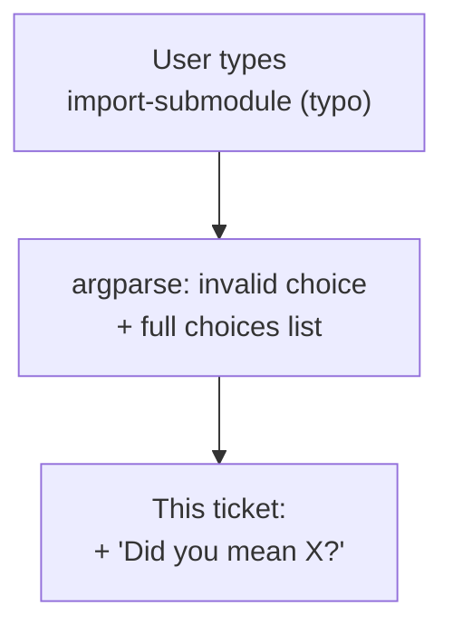

# CliTypoSuggestion — "did you mean...?" for a mistyped command

*Created: 2026-08-31*

> **Implemented — 2026-09-12.** The hint lives in its own module,
> `src/ComplexGitSync/cli/suggest.py`, with `cli/__init__.py` calling it in
> place of `parser.parse_args`. **Hook point chosen (WP-TYPO1 asked for the
> choice and the reason):** neither of the two options the ticket lists, but
> the third that falls out of them — `parse_args_with_hint` lets argparse
> parse untouched and reacts to the `SystemExit(2)` it raises, then re-raises
> it. A pre-check before `parse_args` would have printed the hint *above*
> argparse's usage block, where the reader has already stopped looking;
> subclassing `ArgumentParser.error` would have tied the project to
> argparse's private wording, since spotting an invalid choice means matching
> the text argparse happens to produce. Reacting to the exit code needs
> neither, leaves argparse's output byte-for-byte as it was, and keeps exit
> code `2`. Tests: `tests/unit/test_cli_suggest.py`.

> **Release review — 2026-09-11. Priority 2-1.** Optional polish, independent of the first-release requirements. No implementation was performed during reordering.

> **Reassessed on 2026-09-09. Live, unchanged, and still the cheapest
> ticket here.** Re-checked today: nothing in `src/` imports `difflib` or
> prints "Did you mean", `_PLANNED_COMMANDS` is still where WP-TYPO1 says
> it is (`cli/__init__.py:37`), and `import-submodules` is still spelled
> with the "s" that caused the original typo. Nothing else has to happen
> before this can be picked up.

## Abstract — read this first

**The one-line version.** Not a bug fix — `import-submodules` already works
correctly; a user typed `import-submodule` (missing the "s") four times in a
row and only found the real name by reading argparse's `(choose from ...)`
list. This ticket adds a `git`-style "did you mean 'X'?" hint for that case.

**What this document is.** A small, self-contained UX ticket. Verified
first: `pixi run cgitsync import-submodules /home/flipoyo/.cgs/
CGS20260831170744/cwv/` (dry run, against the user's real directory) reports
both submodules correctly — the CLI and README (lines 140, 154-158, 256)
are consistent and correct; nothing there needs fixing.

**What you will find.** The one work package (§1) and acceptance criteria
(§2). No §0 audit section — the scope is small enough not to need one.

**Who it is for.** Whoever picks up small CLI ergonomics work.

**What you need to do with it.** Nothing yet — planning only, no code
touched, no commit, no push (per instruction).

---

## 1. Work package

| WP | Touches | Deliverable |
|---|---|---|
| **WP-TYPO1** | `src/ComplexGitSync/cli/__init__.py` | When the top-level `command` positional gets a value not in `_PLANNED_COMMANDS`, use `difflib.get_close_matches(value, _PLANNED_COMMANDS.keys(), n=1, cutoff=0.6)` and, if there's a match, print `Did you mean '<match>'?` to stderr alongside argparse's normal error — without swallowing or reformatting argparse's own usage/choices output. Investigate the cleanest hook point before writing code: a small pre-check in `main()` before `parser.parse_args(argv)` (simplest, stays in Ring 4, no argparse internals touched) vs. subclassing `ArgumentParser.error()` (more "native" but couples to argparse's private error-formatting behavior) — state the choice made and why. |

Identify the command using the CLI argument structure, not a blind scan for
unknown tokens: option names, option values, and command operands are not
candidate commands. Never execute or auto-correct to the suggested command.
Keep the parser's invalid-command exit code (`2`), consistent with
[1-2 CliContract](../openTickets/2-1_CliContract_DevPlanTicket.md).

## 2. Acceptance criteria

- `pixi run cgitsync import-submodule ...` (typo) now additionally prints
  `Did you mean 'import-submodules'?` — argparse's own usage/error output is
  unchanged otherwise.
- A clearly unrelated typo (e.g. `pixi run cgitsync zzzzz`) prints no
  suggestion — `cutoff=0.6` (or whatever value is chosen) must not produce
  noisy false-positive suggestions; a unit test should cover both the
  close-match and no-match cases.
- Suggestions appear only on stderr; the invalid-command exit code remains `2`.
- Suggested commands are never executed automatically. Tests cover option
  names/values and operands that resemble misspelled commands.
- `pixi run lint && pixi run test` pass.
- No commit, no push — executed only after explicit go-ahead.
